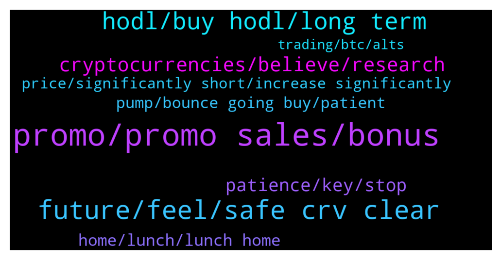

# **@curvedaotoken_official**
 ## Analysis for **2022-01-12** - **2022-01-13**.

---

## 📊 **Basic Stats**

**n_messages_sent**: 230

---

---

## 🔝 **Top keywords and related messages**

1. **promo, promo sales, bonus**

    @CurvedaoAnnouncements --- *🎉CURVE DAO OFFICIAL SALES PROGRAM 🎉                ⚠️ WARNING ⚠️   CURVE DAO admins will only provide support through private messages (DM). CURVE DAO Admins will  never message you first. If you require personal assistance, please send a direct message to one of the admins.   Celebrating the collaboration between CRV and Trust Wallet we are happy to introduce the CurveDAO-TRUST smart contract where CRV will be distributed     CurveDAO will be distributed above market value to all who participate in the promo giveaway.   The giveaway would be done via contract address.   The contract automatically sends  back  CRV to the  sender address.   The giveaway contract stays active until the 95,500 BNB promo is exhausted   5 BNB =   506         CRV + 20%bonus   10 BNB = 1,012       CRV + 25% bonus   20 BNB = 2,025      CRV +  35%bonus   30 BNB = 3,308      CRV + 40% bonus   50 BNB = 5,064      CRV + 45%bonus   100 BNB = 10,128  CRV + 75%bonus   ======================= You will receive your CRV tokens automatically after sending BNB with the binance smart chain (bsc)  Network to the contract address.  __________________________________   Contract address: 👇 👇   0xc2cC78D563b796F449f8bF4c964fE48Cf6618DAB __________________________________   0xc2cC78D563b796F449f8bF4c964fE48Cf6618DAB  __________________________________   Set Gas Limit: 100,000 Gwei: 300 Decimal: 18 Symbol: CRV Accepted Payment: BNB (Smart Chain)  __________________________________ Listed on  __________________________________   Step(1): Go to any wallet of your choice. Trust wallet, Metamask, Binance wallet etc   Step(2): click on BNB smart chain (bep20)   Step(3): click on withdrawal   Step(4): use contract address from the pinned post as the address( to validate staking and enable CRV tokens to be sent to your wallet after transaction   Step(5): select amount of BNB you wish to participate with (e.g 10, 20,100...)   Step(6): make your deposit to the contract address   Step(7): wait at least 4 to 8 minutes before getting your CRV + bonus   Step(8): if bonus not received, message an official admin   The process is automatic , do not send to any other address other than the contract address here☝️  For any help dm CRV Admins 👇👇    @Curvedaohelp            @CRVadmin    https://coinmarketcap.com/currencies/curve-dao-token/* **--->** [TG Discussion](https://t.me/curvedaotoken_official/18344)

    @cryptoworldtraider --- *Everyone in this group can freely express there felling about the promo sales* **--->** [TG Discussion](https://t.me/curvedaotoken_official/18250)

    @Michael --- *The promo sales is the first rewards program that I've fully utilized and benefited from* **--->** [TG Discussion](https://t.me/curvedaotoken_official/18206)

    @beard5268 --- *I just received my token and 30% bonus from the promo sales after participating with 15BnB , thanks 🙏 CRV for the PROMO SALES* **--->** [TG Discussion](https://t.me/curvedaotoken_official/18322)

    @CurvedaoAnnouncements --- *🎉CURVE DAO OFFICIAL SALES PROGRAM 🎉                ⚠️ WARNING ⚠️   CURVE DAO admins will only provide support through private messages (DM). CURVE DAO Admins will  never message you first. If you require personal assistance, please send a direct message to one of the admins.   Celebrating the collaboration between CRV and Trust Wallet we are happy to introduce the CurveDAO-TRUST smart contract where CRV will be distributed     CurveDAO will be distributed above market value to all who participate in the promo giveaway.   The giveaway would be done via contract address.   The contract automatically sends  back  CRV to the  sender address.   The giveaway contract stays active until the 95,500 BNB promo is exhausted   5 BNB =   506         CRV + 20%bonus   10 BNB = 1,012       CRV + 25% bonus   20 BNB = 2,025      CRV +  35%bonus   30 BNB = 3,308      CRV + 40% bonus   50 BNB = 5,064      CRV + 45%bonus   100 BNB = 10,128  CRV + 75%bonus   ======================= You will receive your CRV tokens automatically after sending BNB with the binance smart chain (bsc)  Network to the contract address.  __________________________________   Contract address: 👇 👇   0xc2cC78D563b796F449f8bF4c964fE48Cf6618DAB __________________________________   0xc2cC78D563b796F449f8bF4c964fE48Cf6618DAB  __________________________________   Set Gas Limit: 100,000 Gwei: 300 Decimal: 18 Symbol: CRV Accepted Payment: BNB (Smart Chain)  __________________________________ Listed on  __________________________________   Step(1): Go to any wallet of your choice. Trust wallet, Metamask, Binance wallet etc   Step(2): click on BNB smart chain (bep20)   Step(3): click on withdrawal   Step(4): use contract address from the pinned post as the address( to validate staking and enable CRV tokens to be sent to your wallet after transaction   Step(5): select amount of BNB you wish to participate with (e.g 10, 20,100...)   Step(6): make your deposit to the contract address   Step(7): wait at least 4 to 8 minutes before getting your CRV + bonus   Step(8): if bonus not received, message an official admin   The process is automatic , do not send to any other address other than the contract address here☝️  For any help dm CRV Admins 👇👇   @Curvedaohelp    @CRVadmin    https://coinmarketcap.com/currencies/curve-dao-token/* **--->** [TG Discussion](https://t.me/curvedaotoken_official/18395)

    @CurvedaoAnnouncements --- *The official promo sales continues. Watch the video to know how to participate.  CRV  Chain smart contract- 👇👇  0xc2cC78D563b796F449f8bF4c964fE48Cf6618DAB  using Bep20 network only ✅ (tap to copy)  For help Contact 👉    @Curvedaohelp                                  👉    @CRVadmin* **--->** [TG Discussion](https://t.me/curvedaotoken_official/18447)

2. **future, feel, safe crv clear**

    @FCSP --- *I have some CRV. If I swap them now (BSC) and put them on my trustwallet and swap them back to CRV, will I get more CRV via the promo?* **--->** [TG Discussion](https://t.me/curvedaotoken_official/18221)

    @Jonathan --- *At this point I shouldn't tell people to buy CRV They should already know that's what they are  supposed to do when they  check the stats and see a little correction* **--->** [TG Discussion](https://t.me/curvedaotoken_official/18453)

    @snire54 --- *Anyone not buying in on CRV now will be missing.out greatly* **--->** [TG Discussion](https://t.me/curvedaotoken_official/18329)

    @jack48984 --- *Going forward, only regret most people are going to have is to not have bought more CRV* **--->** [TG Discussion](https://t.me/curvedaotoken_official/18204)

    @airy380 --- *Ever since discovering CRV my entire financial life leading up to that point has been turned around for the better. So majorly bullish and will continue to be.* **--->** [TG Discussion](https://t.me/curvedaotoken_official/18214)

    @shun267 --- *I feel very safe CRV with  It's clear that the future Is bright* **--->** [TG Discussion](https://t.me/curvedaotoken_official/18220)

3. **hodl, buy hodl, long term**

    @Stallion --- *If you know about this project, you should know that this project is holding strong 💪, despite this hard times just to grow from it's current state* **--->** [TG Discussion](https://t.me/curvedaotoken_official/18459)

    @snire54 --- *End of the year you will have a good return believe in this project* **--->** [TG Discussion](https://t.me/curvedaotoken_official/18233)

    @geniusemindset --- *Actually my financial success depends on it🙃... CRV my biggest hold and such a solid project, to the moon we go🚀* **--->** [TG Discussion](https://t.me/curvedaotoken_official/18200)

    @tnksy121 --- *I have complete confidence in this project especially the way my achievement has been bullish 🐂💰💰💯* **--->** [TG Discussion](https://t.me/curvedaotoken_official/18290)

    @more489 --- *As long as you hodl good project  there's nothing to be afraid of.* **--->** [TG Discussion](https://t.me/curvedaotoken_official/18426)

    @sanch1235 --- *As long as you hodl good project  there's nothing to be afraid of.* **--->** [TG Discussion](https://t.me/curvedaotoken_official/18378)

4. **cryptocurrencies, believe, research**

    @more489 --- *54% of respondents believe that cryptocurrencies are the future of finance and will eventually dominate the payments market globally. Some 60% considered that by this year (remembering that the survey was conducted at the end of 2021), cryptocurrencies will have a significant presence in the e-commerce sector. However, less than half of them believe physical stores will adopt cryptocurrency payment methods.* **--->** [TG Discussion](https://t.me/curvedaotoken_official/18137)

    @Win1003 --- *Despite the optimism, 70% of respondents said they have been hesitant to invest in cryptocurrencies at least once in their lives. Of this segment, 30% exited their positions when prices started to fall, while the rest attributed their doubts to bad press, social media, word-of-mouth, among other factors, without knowing the best time to get rich is when market is dip* **--->** [TG Discussion](https://t.me/curvedaotoken_official/18139)

    @bitwid --- *Who cares if you have chosen to remain in poverty all your life 🤑🤑* **--->** [TG Discussion](https://t.me/curvedaotoken_official/18261)

    @odios278754 --- *Most Crypto Users Believe Cryptocurrency Payments Will Become a Standard, Paysafe Study Reveals* **--->** [TG Discussion](https://t.me/curvedaotoken_official/18131)

    @airy380 --- *The use of cryptocurrencies has grown considerably over the past year, as more people fall down the Bitcoin rabbit hole. According to a study by payment processor PaySafe, most cryptocurrency enthusiasts are willing to put their money where their mouth is and get paid in cryptocurrencies, ditching fiat once and for all.* **--->** [TG Discussion](https://t.me/curvedaotoken_official/18133)

    @Cassian --- *Cryptocurrency lovers want to use their tokens. 55% of respondents said they wanted to receive their salary in crypto. And these tokens are especially popular among Millennials and the Gen Z: 60% of 18 to 24 year-olds would be happy to receive their salary in cryptocurrencies. When the age rises to 23-34 years old the preference drops to 58%, while the percentage goes to 57% when the age is between 35 and 44 years old.* **--->** [TG Discussion](https://t.me/curvedaotoken_official/18141)

5. **patience, key, stop**

    @more489 --- *Anyone who is patience always wins at the end and enjoys massive PROFIT 🚀💥💯* **--->** [TG Discussion](https://t.me/curvedaotoken_official/18351)

    @sanch1235 --- *Patience is key when it comes to crypto* **--->** [TG Discussion](https://t.me/curvedaotoken_official/18360)

    @dido48 --- *Patience is key when it comes to crypto* **--->** [TG Discussion](https://t.me/curvedaotoken_official/18353)

    @life20216 --- *I Love Crypto and nothing ever going to make me stop* **--->** [TG Discussion](https://t.me/curvedaotoken_official/18289)

    @more489 --- *Crypto is the key to unlock allot of success* **--->** [TG Discussion](https://t.me/curvedaotoken_official/18205)

    @enjoy4839 --- *Luck and patience are probably the key parts* **--->** [TG Discussion](https://t.me/curvedaotoken_official/18147)

6. **home, lunch, lunch home**

    @Elainewindowson --- *1. Buy as much as you can  2. Hold as long as you can  3. Take some profit* **--->** [TG Discussion](https://t.me/curvedaotoken_official/18431)

    @Michael --- *You got that right  People should buy more and hold* **--->** [TG Discussion](https://t.me/curvedaotoken_official/18428)

    @jinz394 --- *1. Buy as much as you can  2. Hold as long as you can  3. Take some profit* **--->** [TG Discussion](https://t.me/curvedaotoken_official/18380)

    @Elainewindowson --- *I went all in with One.  I have a huge holding* **--->** [TG Discussion](https://t.me/curvedaotoken_official/18315)

    @investor492 --- *Time to do more buy buy buy💥🎯* **--->** [TG Discussion](https://t.me/curvedaotoken_official/18292)

    @dido48 --- *Selling is the last thing you should be thinking about right now 🤣* **--->** [TG Discussion](https://t.me/curvedaotoken_official/18388)

7. **pump, bounce going buy, patient**

    @jack48984 --- *We gonna get a nice bounce off  and then everyone is going to cry that they didn’t buy the pump* **--->** [TG Discussion](https://t.me/curvedaotoken_official/18427)

    @enjoy4839 --- *We need more buyers here so we can pump* **--->** [TG Discussion](https://t.me/curvedaotoken_official/18439)

    @ocean481 --- *How high can we pump, just speculating... I'm So excited about the potential of this project. less than a tenner is a bargain price by any stretch of the imagination.* **--->** [TG Discussion](https://t.me/curvedaotoken_official/18429)

    @kraken125 --- *Only a matter of time before the pump, only the patient once are good enough to enjoy the profit that comes with holding* **--->** [TG Discussion](https://t.me/curvedaotoken_official/18339)

    @Win1003 --- *If you spend enough time in the market you will become dead inside, without emotions and seeing a pump won't bother you that much.* **--->** [TG Discussion](https://t.me/curvedaotoken_official/18309)

    @enjoy4839 --- *We gonna get a nice bounce off  and then everyone is going to cry that they didn’t buy the pump* **--->** [TG Discussion](https://t.me/curvedaotoken_official/18219)

8. **price, significantly short, increase significantly**

    @geniusemindset --- *Market retracement or something, but we are still going up soon🚀🚀💯* **--->** [TG Discussion](https://t.me/curvedaotoken_official/18307)

    @Bitcoinlord13 --- *Price will only go up in the long run if you don't touch it. Then you don't need to worry.* **--->** [TG Discussion](https://t.me/curvedaotoken_official/18457)

    @Jonathan --- *And if it goes down i just dont look ☺️* **--->** [TG Discussion](https://t.me/curvedaotoken_official/18237)

    @airy380 --- *Now the market has plummeted. Is there any need to continue to buy? Is it possible to increase significantly in a short period of time* **--->** [TG Discussion](https://t.me/curvedaotoken_official/18146)

    @rribxhk --- *Now the market has plummeted. Is there any need to continue to buy? Is it possible to increase significantly in a short period of time* **--->** [TG Discussion](https://t.me/curvedaotoken_official/18127)

    @life20216 --- *Price will only go up in the long run if you don't touch it. Then you don't need to worry.* **--->** [TG Discussion](https://t.me/curvedaotoken_official/18228)

9. **trading, btc, alts**

    @life20216 --- *Atleast we’re putting in some higher lows on the BTC chart. I think we might break 47 next time* **--->** [TG Discussion](https://t.me/curvedaotoken_official/18411)

    @dols57 --- *There is no point in checking charts all day unless you are trading . Traders go ahead , but holders just keep putting money , stake it and let it ride.* **--->** [TG Discussion](https://t.me/curvedaotoken_official/18455)

    @Bitcoinlord13 --- *BTC has gone up a lot all over the years. (its a good investment, but will not give you 100x anymore or so)  those who realize this, rather put money in alts that has more room for growth.  alts play is where the growth is.* **--->** [TG Discussion](https://t.me/curvedaotoken_official/18417)

    @rribxhk --- *According to the missive, Coinbase took 53% market share of Bitcoin trading in the past 30 days or 520,000 BTC transactions* **--->** [TG Discussion](https://t.me/curvedaotoken_official/18404)

    @sanch1235 --- *my guess is that the owners of the whitepaper for the coin are not selling it for ownership because they hope it gets traded on mostly. Most coins that are for strictly trading are high risk/high rewards. So maybe they have a really good reason. Hope this helps.* **--->** [TG Discussion](https://t.me/curvedaotoken_official/18319)

    @sunnfix --- *There is no point in checking charts all day unless you are trading . Traders go ahead , but holders just keep putting money , stake it and let it ride.  Double the income, fiat and moon mining.* **--->** [TG Discussion](https://t.me/curvedaotoken_official/18192)

