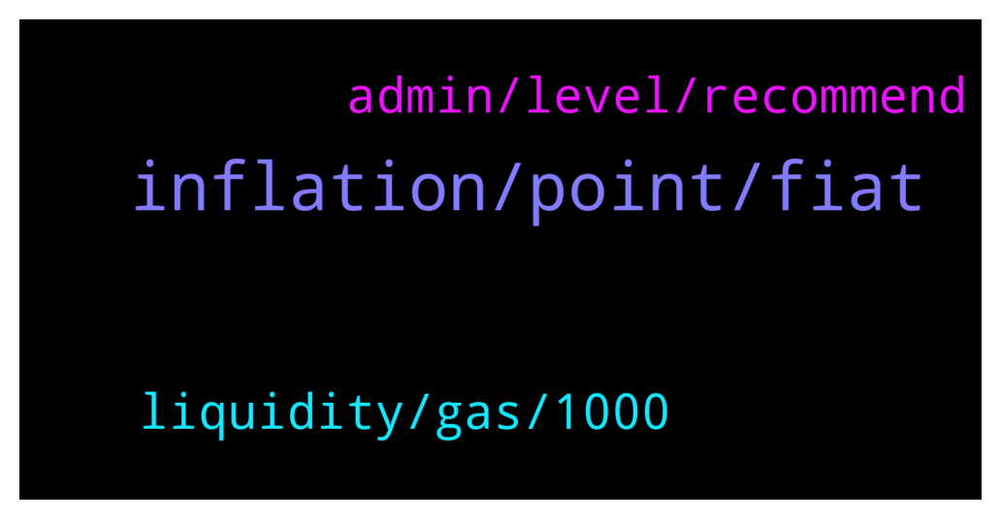

# **@de_fi**
 ## Analysis for **2022-01-12** - **2022-01-13**.

---

## 📊 **Basic Stats**

**n_messages_sent**: 37

---

---

## 🔝 **Top keywords and related messages**

1. **inflation, point, fiat**

    @xnatasx --- *Btc is the most decentralized. Had the fairest launch. Is the most secure. Is basically free to send over lightning. Has a fixed supply with reducing inflation...* **--->** [TG Discussion](https://t.me/de_fi/233948)

    @Mark --- *Buy BTC and wait for 100KUSD this year😂* **--->** [TG Discussion](https://t.me/de_fi/233938)

    @Mark --- *Hype is the fastest money to come, as long as in the wind, everything is profitable.* **--->** [TG Discussion](https://t.me/de_fi/233871)

    @xnatasx --- *To be part of an alternative economy. Own censorship resistant, immutable digital assets...?* **--->** [TG Discussion](https://t.me/de_fi/233946)

    @Nader --- *SHO —  Fantom Maker   Fantom Maker is designed to be the strongest yield product on #Fantom blockchain.  Research Page👇 https://t.co/ac946DAEkc  Merit Round👇  Start: 13th of January 12:00 UTC Finish: 14th of January 12:00 UTC Platform Raise: $95,000  Individual Allocation: $200 https://t.co/S8FnWBHmfU* **--->** [TG Discussion](https://t.me/de_fi/233908)

    @PeterDelfers --- *Monument conservation is a booming market. Help restoring the Notre Dame buy investing in MonumensToken* **--->** [TG Discussion](https://t.me/de_fi/234088)

2. **liquidity, gas, 1000**

    @xnatasx --- *Yeah, don't think it has to do with gas, but liquidity.* **--->** [TG Discussion](https://t.me/de_fi/233962)

    @xnatasx --- *Oh, no. I talked about how Strike utilize usdt  https://twitter.com/jackmallers/status/1480964599768059905* **--->** [TG Discussion](https://t.me/de_fi/233968)

    @xnatasx --- *Why? Gas optimization? I don't think send erc20 though* **--->** [TG Discussion](https://t.me/de_fi/233959)

    @rocket_fuel --- *let's change the world, by pivoting to ERC20 in argentina* **--->** [TG Discussion](https://t.me/de_fi/233952)

    @dereksilva --- *What would liquidity have to do with me sending 1000 USDC or DAI or USDT from my wallet to yours?* **--->** [TG Discussion](https://t.me/de_fi/233963)

3. **admin, level, recommend**

    @never_sold_a_decimal --- *Hey guys is it ok to share a project I’ve come across* **--->** [TG Discussion](https://t.me/de_fi/233991)

    @xnatasx --- *We don't do them, if mean for this group. But there might be admin here from projects that do.* **--->** [TG Discussion](https://t.me/de_fi/233944)

    @RicchCrypto --- *Is there an admin to contact for AMA sessions* **--->** [TG Discussion](https://t.me/de_fi/233942)

    @valerian12138 --- *Hello, I want to ask who is responsible for community cooperation, you can @ me* **--->** [TG Discussion](https://t.me/de_fi/233918)

    @honsetkto --- *If someone looking for a decentralized ecosystem that can provide you with a high level of privacy – I know what to recommend to you guys. NutGain* **--->** [TG Discussion](https://t.me/de_fi/233907)

