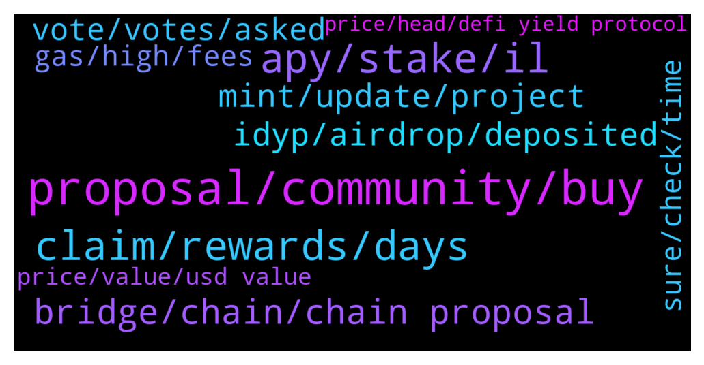

# **@dypfinance**
 ## Analysis for **2022-01-12** - **2022-01-13**.

---

## 📊 **Basic Stats**

**n_messages_sent**: 235

---

---

## 🔝 **Top keywords and related messages**

1. **proposal, community, buy**

    @WatermelonNoia --- *I think there should be a gDYP token that has no monetary value but is linked to any DYP held anywhere (wallet, contract etc) by an individual.  This enables your community to fully utilise DYP for its purpose of generating wealth in the ecosystem and having access to governance token for DAO actions.  I for one have all my DYP locked in contracts. I want to vote, and yes could buy more DYP or claim some (taxable event) but this would be insignificant compared to what i currently hold if available as a gDYP as suggested.  Community - would we vote on this if this was made into a proposal?   What is the communities view on this?  @timdyp* **--->** [TG Discussion](https://t.me/dypfinance/238917)

    @WatermelonNoia --- *Hey DYP, is a DYP credit card still on the horizon?  I saw this and thought id share:  https://twitter.com/HathorNetwork/status/1480839575190880256?t=Atq8SXuux0NrguIR_9SGHg&s=19* **--->** [TG Discussion](https://t.me/dypfinance/239313)

    @infk84 --- *Hi DYP team 😉, for the CATs collection it would have been nice to make a promotional offer for DYP owners.😗* **--->** [TG Discussion](https://t.me/dypfinance/238877)

    @Nji_jalen --- *Would be happy if soon DYP have feature lending and borrowing* **--->** [TG Discussion](https://t.me/dypfinance/238910)

    @herbie1996 --- *Mate this is a brilliant idea! As I have loads locked up. More than I could afford to buy right now from my bank to vote on major dyp moves. This is something I’d get behind! 👍🏼✅* **--->** [TG Discussion](https://t.me/dypfinance/238943)

    @Ana_ahmedsa --- *I Have a business proposal about creating an Arabic telegram community for $DeFi* **--->** [TG Discussion](https://t.me/dypfinance/239181)

2. **apy, stake, il**

    @Disguy125 --- *I'm curious what the apy is adjust to?   Would the team be will to airdrop locked LP wallets compensation to help minaret the 85%IL in iDYP.* **--->** [TG Discussion](https://t.me/dypfinance/239123)

    @Stkim87 --- *But as you mentioned, iDYP price will impact the staking pool APY also.* **--->** [TG Discussion](https://t.me/dypfinance/239294)

    @Stkim87 --- *Actually I would want to know what factors impact to APY for STAKE.* **--->** [TG Discussion](https://t.me/dypfinance/239283)

    @Disguy125 --- *Imagine the apy went up to 5000% or something lol* **--->** [TG Discussion](https://t.me/dypfinance/239129)

    @Stkim87 --- *Is there any doc or white paper regarding how to calculate STAKE APY %?* **--->** [TG Discussion](https://t.me/dypfinance/239281)

    @captain_protein --- *An increase in APY may help to offset that, of course, but is the answer just to wait and see?* **--->** [TG Discussion](https://t.me/dypfinance/239110)

3. **claim, rewards, days**

    @ringLeader96 --- *Where can we see the last trigger claim for a pool? I feel like I haven’t gotten rewards for both the ETH 30, and AVAX 30* **--->** [TG Discussion](https://t.me/dypfinance/238965)

    @shinigamikami --- *Yeah I just saw it few minutes ago, notify me once you get feedback on the 90 days pool thanks* **--->** [TG Discussion](https://t.me/dypfinance/239026)

    @DhoniMSD516 --- *Hey the WBNB rewards will be shown when claim trigger happened so just hover on Claim and see time for next rewards and if it says feel free to claim trigger the claim* **--->** [TG Discussion](https://t.me/dypfinance/239062)

    @shinigamikami --- *@DhoniMSD516 can you check the eth farm 90 days, have observed something twice but wanted to be sure. The previous to the last claim was over 2 days ago yet when the last claim happened only one day reward was paid, I’m certain the claim happened more than 48hrs before this last one* **--->** [TG Discussion](https://t.me/dypfinance/239012)

    @cryptocade --- *I hovered over the claim and it said feel free to claim.* **--->** [TG Discussion](https://t.me/dypfinance/239065)

    @DhoniMSD516 --- *Hey The last claim trigger was 6 days ago, you can execute the claim now you get all 6 days rewards else you can wait if not in hurry, as ETH fees are high no one triggered claim* **--->** [TG Discussion](https://t.me/dypfinance/238937)

4. **bridge, chain, chain proposal**

    @tamtamkanto --- *What are the plans for the bridge if the vote is approved? Will the bridge be available immediately?* **--->** [TG Discussion](https://t.me/dypfinance/238881)

    @timdyp --- *We love to listen to our community so the Governance proposal for the launch of the iDYP Bridge is now available multi-chain for all the users.  Binance Smart Chain Proposal https://gov-bsc.dyp.finance/proposals/7  Ethereum Chain Proposal https://gov.dyp.finance/proposals/15  Avalanche Chain Proposal https://gov-avax.dyp.finance/proposals/3  At the end of the vote, we will sum up all the votes across all the chains. Don't forget, that we need your vote regarding the #iDYP Bridge Launch!* **--->** [TG Discussion](https://t.me/dypfinance/238889)

    @shinigamikami --- *I thought about this hard with few friends today, we couldn’t come up with a better solution honestly. I feel like even if NO votes passed, the community will still request for the bridge so we may just brace ourselves and launch the bridge then hopes everything works out in the end which I believe it will* **--->** [TG Discussion](https://t.me/dypfinance/239131)

    @timdyp --- *Unfortunately, I am not able to know for sure the answer for what is going to happen after we launch the bridge. Also, that's why the team made a proposal and let the community to decide.* **--->** [TG Discussion](https://t.me/dypfinance/239111)

    @timdyp --- *Yeah, the bridge will be launched in the same day.* **--->** [TG Discussion](https://t.me/dypfinance/238891)

    @hemanrock --- *if the vote is approved, it will be announced when the bridge will be live.* **--->** [TG Discussion](https://t.me/dypfinance/238883)

5. **idyp, airdrop, deposited**

    @shinigamikami --- *Yeah it’s locked up by smart contract* **--->** [TG Discussion](https://t.me/dypfinance/239121)

    @Tom --- *If I withdraw LP after my lock period, will I be able to cash out the iDyp deposited? Or is it vested for 1 year?* **--->** [TG Discussion](https://t.me/dypfinance/239410)

    @nguyenngocthai --- *Hello, i can not check  and claim my iDYP by using metamask now . How can i fix that ?* **--->** [TG Discussion](https://t.me/dypfinance/239331)

    @timdyp --- *Hi @Disguy125, unfortunately this is not possible. I am sure that you already know that the team does not have access to the funds deposited into the smart contracts.* **--->** [TG Discussion](https://t.me/dypfinance/239119)

    @denileema --- *Dear Administrator When will CMC airdrop results be announced?* **--->** [TG Discussion](https://t.me/dypfinance/238901)

    @DhoniMSD516 --- *Hey did you connect to same address where you have iDYP allocation and airdrop? https://dyp.finance/idyp/airdrop https://dyp.finance/idyp/claim These are the links for those* **--->** [TG Discussion](https://t.me/dypfinance/239333)

6. **mint, update, project**

    @iamJubi --- *Hello. ICO was already done back in 2020. If you are referring to the NFT, there is no exact minting date yet.* **--->** [TG Discussion](https://t.me/dypfinance/239257)

    @DhoniMSD516 --- *If you are whitelisted you get guaranteed mint, else you need to do in public in fcfs* **--->** [TG Discussion](https://t.me/dypfinance/238979)

    @Hello --- *Mr Dhoni sorry for asking again. Although I am asking only once a week. What is the status on listing* **--->** [TG Discussion](https://t.me/dypfinance/238920)

    @Richcal --- *can we mint more than 1?* **--->** [TG Discussion](https://t.me/dypfinance/238982)

    @Ame --- *Hello, When is the first launchpad project expected ? Or when can we get any updates or teasers about the first project to be launched on DYP platform ?* **--->** [TG Discussion](https://t.me/dypfinance/239417)

    @Richcal --- *So what's the point of a whitelist?* **--->** [TG Discussion](https://t.me/dypfinance/238978)

7. **vote, votes, asked**

    @DhoniMSD516 --- *Hey for this reason we asked community to vote.* **--->** [TG Discussion](https://t.me/dypfinance/239087)

    @BeachLifeX --- *I never vote bc I rather stake* **--->** [TG Discussion](https://t.me/dypfinance/238944)

    @hemanrock --- *An individual can vote with 1 $DYP which equals to 1 Vote* **--->** [TG Discussion](https://t.me/dypfinance/238894)

    @captain_protein --- *And sometimes turkeys vote for Christmas* **--->** [TG Discussion](https://t.me/dypfinance/239093)

    @timdyp --- *Don't forget to cast your vote!  YES Votes: 106,195.22 NO Votes: 0.00* **--->** [TG Discussion](https://t.me/dypfinance/239074)

    @fightinamish --- *Question - if all my DYP is staked, does that mean I can not vote on the bridge?  I went to protocol & it says I have zero dyp to vote with* **--->** [TG Discussion](https://t.me/dypfinance/238892)

8. **sure, check, time**

    @DhoniMSD516 --- *Yes for this I explained please read here https://t.me/dypfinance/231546* **--->** [TG Discussion](https://t.me/dypfinance/238957)

    @shinigamikami --- *Alright but kindly check to be certain, have noticed it for awhile but I never timed it perfectly till yesterday* **--->** [TG Discussion](https://t.me/dypfinance/239015)

    @Stkim87 --- *Okay let’s see that.  Thank you.* **--->** [TG Discussion](https://t.me/dypfinance/239300)

    @hemanrock --- *Please make sure your connection is well.* **--->** [TG Discussion](https://t.me/dypfinance/239171)

    @DhoniMSD516 --- *Sure I will once ask our devs to check* **--->** [TG Discussion](https://t.me/dypfinance/239017)

    @Alliveall --- *ok thanks,  when you sleep @DhoniMSD516 haha* **--->** [TG Discussion](https://t.me/dypfinance/238855)

9. **gas, high, fees**

    @Twittsbets --- *Now the gas is 3 times more that my reward 😁😁😁* **--->** [TG Discussion](https://t.me/dypfinance/239437)

    @Twittsbets --- *my claim is only $200 and the gas is $1000 geez!* **--->** [TG Discussion](https://t.me/dypfinance/239432)

    @Twittsbets --- *Why is it caliming the reward in ETH the gas is ridiculously insanely high?  I know Eth gas fees is high but like 3 times high here.* **--->** [TG Discussion](https://t.me/dypfinance/239428)

    @shinigamikami --- *Click and check the estimated gas* **--->** [TG Discussion](https://t.me/dypfinance/239443)

    @Twittsbets --- *i started last 30 days ago it seems didn't accumulate well to cover the gas* **--->** [TG Discussion](https://t.me/dypfinance/239439)

    @DhoniMSD516 --- *Hey the ETH fees metamask shows is max estimation, the actual fees after transaction will be less, but just checked the ETH network is so busy GWEI ranging upto 250 so gas will be pretty high now* **--->** [TG Discussion](https://t.me/dypfinance/239430)

10. **price, value, usd value**

    @ThunderChaos --- *Why "Reinvest" fee for Dyp is again 0.006 BNB when it was halved for a period of time? Fee is too high!* **--->** [TG Discussion](https://t.me/dypfinance/239318)

    @DhoniMSD516 --- *Hey this might be because anti manipulation feature come into place and if price impact is more that -2.5% only some part of actual allotted iDYP will be swapped and rest sent to To be Burned/Dibursed* **--->** [TG Discussion](https://t.me/dypfinance/239014)

    @v1ruzz --- *If everyday it's being converted 'to DYP' why should it decrease when price is stable. That's where I'm confused* **--->** [TG Discussion](https://t.me/dypfinance/238953)

    @v1ruzz --- *I've seen variance of about 20-30 % everyday whereas price is kinda stable at 0.55 nowadays* **--->** [TG Discussion](https://t.me/dypfinance/238950)

    @DhoniMSD516 --- *It converts to DYP when you click claim, else it shows in USD value of iDYP and USD value of DYP* **--->** [TG Discussion](https://t.me/dypfinance/238954)

    @captain_protein --- *A correction in the price of eth dyp from 3 dollars to 50c would be around an 85% reduction?* **--->** [TG Discussion](https://t.me/dypfinance/239086)

