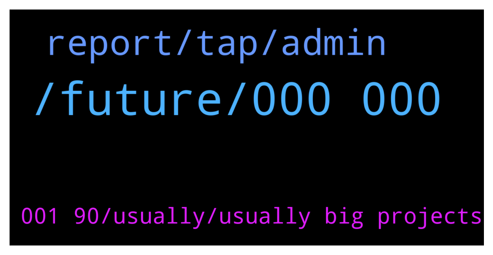

# **@iotatangle**
 ## Analysis for **2022-01-12** - **2022-01-13**.

---

## 📊 **Basic Stats**

**n_messages_sent**: 48

---

---

## 🔝 **Top keywords and related messages**

1. **, future, 000 000**

    @papygus --- *Hello, do you know some projects who are developing on Iota ? Especially in DeFi ?* **--->** [TG Discussion](https://t.me/iotatangle/306707)

    @Basti --- *Altcoin Gordon (@AltcoinGordon) Tweeted: Some of the OG coins are making a comeback this year 👀 $IOTA https://twitter.com/AltcoinGordon/status/1481220089613635587?s=20* **--->** [TG Discussion](https://t.me/iotatangle/306629)

    @Serhat --- *Hey everyone, I've just joined the group and I'm new for İota, what do you think of the future of IOTA* **--->** [TG Discussion](https://t.me/iotatangle/306609)

    @N1ghtBl00d --- *All i will pump to IOTA* **--->** [TG Discussion](https://t.me/iotatangle/306668)

    @tomastd --- *This is not the channel for that, please, go to Iota Cafe for that topic* **--->** [TG Discussion](https://t.me/iotatangle/306589)

    @Tahmis --- *IOTA will be widely adopted in the future I believe* **--->** [TG Discussion](https://t.me/iotatangle/306610)

2. **report, tap, admin**

    @cryptopioneer678 --- *Hi admin.  Where can i find info over decensored social media?* **--->** [TG Discussion](https://t.me/iotatangle/306632)

    @Tahmis --- *Probably at their website or discord: https://discord.com/invite/NzCQJ53q* **--->** [TG Discussion](https://t.me/iotatangle/306633)

    @Tahmis --- *Maybe send a message to the list maker: https://twitter.com/Odd_Kesson/status/1478133195254161413?s=20* **--->** [TG Discussion](https://t.me/iotatangle/306718)

    @itsmedev --- *Did you even read this message* **--->** [TG Discussion](https://t.me/iotatangle/306671)

    @ash1taka1997 --- *1. Tap on the group title 2. Lower right of the big logo, tap “…more” 3. Tap “Report”* **--->** [TG Discussion](https://t.me/iotatangle/306585)

    @Tahmis --- *Please everyone! Report this telegram account @tahmiis at @notoscam* **--->** [TG Discussion](https://t.me/iotatangle/306583)

3. **001 90, usually, usually big projects**

    @tristanc --- *It would be nice to know which network these projects are going to be on, Shimmer or Assembly.* **--->** [TG Discussion](https://t.me/iotatangle/306717)

    @N1ghtBl00d --- *usually i know that big projects with ecosystem run btween 0.001 to 0.90* **--->** [TG Discussion](https://t.me/iotatangle/306647)

    @Tahmis --- *Might be missing some projects but there are many* **--->** [TG Discussion](https://t.me/iotatangle/306710)

    @Pantra86 --- *I know , i am talking about prediction after launching.* **--->** [TG Discussion](https://t.me/iotatangle/306646)

    @Tahmis --- *I want to make sure always. As it hasn't been the case everytime* **--->** [TG Discussion](https://t.me/iotatangle/306608)

