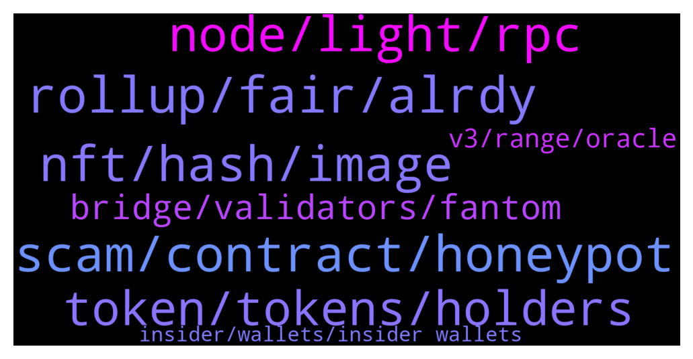

# **@lobsters_chat**
 ## Analysis for **2022-01-12** - **2022-01-13**.

---

## 📊 **Basic Stats**

**n_messages_sent**: 411

---

---

## 🔝 **Top keywords and related messages**

1. **scam, contract, honeypot**

    @PmRiviere --- *there si a 0.01 ETH payment to "unlock", forgot to mention, probably an oversight* **--->** [TG Discussion](https://t.me/lobsters_chat/315166)

    @ivangbi --- *Like actually in the territory of a scam honeypot* **--->** [TG Discussion](https://t.me/lobsters_chat/315165)

    @Joel_john --- *you are just mad they didnt give u money* **--->** [TG Discussion](https://t.me/lobsters_chat/315188)

    @Walkadbout --- *Contract is verified and open for reviews but people calling it a scam already.. please* **--->** [TG Discussion](https://t.me/lobsters_chat/315168)

    @Walkadbout --- *How is that a scam honeypot? They decided the tokenomics of their token, that's an arbitrary decision you can pinpoint but calling it straight a "honeypot scam" is misleading at least* **--->** [TG Discussion](https://t.me/lobsters_chat/315177)

    @Monkeyontheloose --- *If I clear data from a contract in a txn can I write data back for free? Is there such a thing?* **--->** [TG Discussion](https://t.me/lobsters_chat/314930)

2. **rollup, fair, alrdy**

    @ivangbi --- *Thanks gotcha, seems fair and clean then to me* **--->** [TG Discussion](https://t.me/lobsters_chat/314898)

    @substreight --- *dont think it's worked out yet* **--->** [TG Discussion](https://t.me/lobsters_chat/314862)

    @Joel_john --- *it used to be that way earlier* **--->** [TG Discussion](https://t.me/lobsters_chat/315149)

    @statelayer --- *yeah i think we agree on same thing, just mispoke* **--->** [TG Discussion](https://t.me/lobsters_chat/314830)

    @anisopteran --- *oh, that's fair. i guess i didn't know that was actually working properly* **--->** [TG Discussion](https://t.me/lobsters_chat/314746)

    @anisopteran --- *Yeah I know, I was just speaking to present day* **--->** [TG Discussion](https://t.me/lobsters_chat/314755)

3. **nft, hash, image**

    @anishagnihotri --- *His concern was:  - You have some NFT with some metadata that says (name: Lobster Dao NFT, description: Some description) - This NFT is often stored at a centralized endpoint like lobsterdaowebsite.xyz/nft/1.json - There is no hash of what is stored at lobsterdaowebsite.xyz/nft/1.json  This means, you (1) lose your NFT if lobsterdaowebsite.xyz goes down, and (2) if in the future, someone else buys lobsterdaowebsite.xyz (say when the domain expires), they can freely change the metadata to whatever they want. In which case, your NFT might then return (name: Other NFT Name, description: ...).  Alternatively, if you hash the metadata+image, users can verify that the content returned from lobsterdaowebsite.xyz/nft/1.json is, in fact, what was intended. This solves problem (2).* **--->** [TG Discussion](https://t.me/lobsters_chat/314714)

    @obaidoteth --- *A hash of an image/data is fixed-length and inexpensive to store on an NFT* **--->** [TG Discussion](https://t.me/lobsters_chat/314749)

    @anishagnihotri --- *As an example, see imageHash in punks contract: https://etherscan.io/token/0xb47e3cd837ddf8e4c57f05d70ab865de6e193bbb#readContract* **--->** [TG Discussion](https://t.me/lobsters_chat/314711)

    @obaidoteth --- *Can anyone explain what he means by hash commitment please? Thanks.* **--->** [TG Discussion](https://t.me/lobsters_chat/314705)

    @anishagnihotri --- *Hash the image content or metadata, store the hash. Now you can verify that the data returned from the tokenURI is correct because the hashes match.* **--->** [TG Discussion](https://t.me/lobsters_chat/314710)

    @sambacha --- *also, you can add requireCanonical  to  eth_call as an example and get a hash -- see https://eips.ethereum.org/EIPS/eip-1898#specification* **--->** [TG Discussion](https://t.me/lobsters_chat/314840)

4. **node, light, rpc**

    @anisopteran --- *and light clients are inherently not trustless* **--->** [TG Discussion](https://t.me/lobsters_chat/314722)

    @anisopteran --- *if that's the case, then the argument "you can't run this on a mobile client" seems pretty uninformed* **--->** [TG Discussion](https://t.me/lobsters_chat/314747)

    @zhongfu --- *seems weird to refer to metamask as a light client imo* **--->** [TG Discussion](https://t.me/lobsters_chat/314745)

    @zhongfu --- *ah I thought you meant something like geth in light client mode* **--->** [TG Discussion](https://t.me/lobsters_chat/314744)

    @anisopteran --- *i was just talking about in their current implementation. metamask is essentially a light client* **--->** [TG Discussion](https://t.me/lobsters_chat/314743)

    @obaidoteth --- *Only way is through light clients on the user's side ig* **--->** [TG Discussion](https://t.me/lobsters_chat/314721)

5. **token, tokens, holders**

    @manilp --- *yep, someone put it well in the discord: Rebranding and new token as cover for dilution. Like a sketchy reverse merger* **--->** [TG Discussion](https://t.me/lobsters_chat/315199)

    @Snowsledge --- *This is more of an index fund than a project token. Supply is uncapped for future bonding.* **--->** [TG Discussion](https://t.me/lobsters_chat/315058)

    @WBYmen --- *And I have yet to see their actual use case for the token, they said they are going to develop a dashboard for something. But giving the history of fees.wtf, it doesn't seem very required.* **--->** [TG Discussion](https://t.me/lobsters_chat/315282)

    @CakeHodler --- *Hey, how can I calculate inflation of a token/coin?* **--->** [TG Discussion](https://t.me/lobsters_chat/314664)

    @manilp --- *They are holding $10mm Ycrv rescued by yearn after the recent exploit, as well as $50-60mm in staked eth (which used to back CRETH2 - not sure of the exact number). These tokens should obviously be redistributed to users rekt in the exploit but there has been no communication and the community is worried the team plans to just hope everyone forgets about them* **--->** [TG Discussion](https://t.me/lobsters_chat/315203)

    @Snowsledge --- *Every token except those allocated to founders and ops team is backed by cards behind it.* **--->** [TG Discussion](https://t.me/lobsters_chat/315059)

6. **bridge, validators, fantom**

    @fiskantes --- *I am not looking for fake assurance nor industry wide caveats…not my first day here, I am avoiding rugs quite well 🙂  just asking if you guys have any assesment about Fantom bridge and validators specifically* **--->** [TG Discussion](https://t.me/lobsters_chat/315226)

    @sambacha --- *there is already a trusted checkpoint oracle implemented in all clients. this is what light clients als can use. Currently the trie root is part of the trusted syncing checkpoint but trustless validation of the BloomBits trie is part of the development plans.  read more about the checkpoint oracle system here: https://github.com/ethereum/go-ethereum/tree/master/cmd/checkpoint-admin* **--->** [TG Discussion](https://t.me/lobsters_chat/314839)

    @fiskantes --- *ola guys, what do we know about FTM bridge and Fantom validators? With 10b TVL it becomes a solid honeypot* **--->** [TG Discussion](https://t.me/lobsters_chat/315213)

    @mogglet --- *Can I share MultichainDAO TG link here ser ? @ivangbi* **--->** [TG Discussion](https://t.me/lobsters_chat/315113)

    @fiskantes --- *Just asking if there is a security assesment somewhere, who controls the keys, who are the validators 🙂 maybe there is an article written on it? Couldnt find anything googling tho* **--->** [TG Discussion](https://t.me/lobsters_chat/315258)

    @theotherpomp --- *can you be more specific?  Fantom bridge > Multichain.org (formerly anyswap). k of millions per day in volume validators, what would you like to know?* **--->** [TG Discussion](https://t.me/lobsters_chat/315246)

7. **v3, range, oracle**

    @statelayer --- *zef was making a turn-v3-full-range-into-erc20-LP thingie, we might use it for sudo pool2* **--->** [TG Discussion](https://t.me/lobsters_chat/314807)

    @danrobinson010 --- *And people use v2 rather than full-range v3 because it’s currently easier to implement liquidity mining for the former?* **--->** [TG Discussion](https://t.me/lobsters_chat/314793)

    @statelayer --- *but honestly pool2 on uniswap v2 + v3 works well* **--->** [TG Discussion](https://t.me/lobsters_chat/314808)

    @statelayer --- *i wish uniswap v2 was on polygon* **--->** [TG Discussion](https://t.me/lobsters_chat/314776)

    @statelayer --- *v important if to use this oracle at all* **--->** [TG Discussion](https://t.me/lobsters_chat/314817)

    @statelayer --- *and a full range pool2 really stabilizes the v3 oracle* **--->** [TG Discussion](https://t.me/lobsters_chat/314816)

