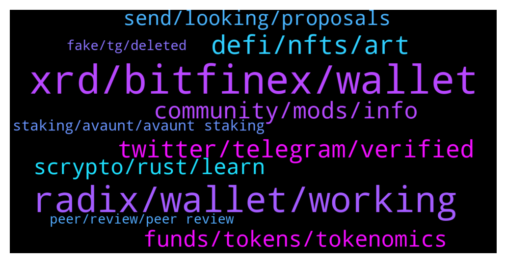

# **@radix_dlt**
 ## Analysis for **2022-01-12** - **2022-01-13**.

---

## 📊 **Basic Stats**

**n_messages_sent**: 512

---

---

## 🔝 **Top keywords and related messages**

1. **xrd, bitfinex, wallet**

    @Burchiello --- *And why so few top holders of Exrd?* **--->** [TG Discussion](https://t.me/radix_dlt/338752)

    @Radstakes --- *Ok, if you have crypto already I would recommend trading for something cheap to transact with like XLM. You can send this to Bitfinex and then trade for USD and then XRD* **--->** [TG Discussion](https://t.me/radix_dlt/338075)

    @ashley_tele --- *you need to conver either via instapass (requires KYC) or on bitfinex (does not need KYC but not available in all jurisdictions - can avoid with a VPN)* **--->** [TG Discussion](https://t.me/radix_dlt/338184)

    @NotBen --- *+1 on the bitfinex warning. I used to recommend it, and i don't anymore after hearing too many horror stories* **--->** [TG Discussion](https://t.me/radix_dlt/338518)

    @SpaceClaim --- *e-XRD is the wrapped XRD on ETH* **--->** [TG Discussion](https://t.me/radix_dlt/338663)

    @ahsimon --- *Perhaps add another option to your "stock answer" list, namely:    Buy eXRD anywhere you can and be patient for a "few" more weeks.  While there is no guarantee, it is IMO likely that we will add more exchange options in January.  (perhaps the 60th day of January?)  I would also add some warnings about using bitfinex.  While painful to admit, the truth is always the best strategy.  (a) (among other things) large amounts of XRD or a pattern of large amounts "may" trigger Bitfinex to freeze your assets, and demand you do KYC and some AML before they allow you to move your assets.  If you are a US citizen using a VPN, you will fail KYC and it is unclear if you can ever regain control of your assets at Bitfinex.  (b) atm Instabridge does not support XRD -> eXRD, but it is on the roadmap.* **--->** [TG Discussion](https://t.me/radix_dlt/338514)

2. **radix, wallet, working**

    @OfficiallyTimeWasted --- *Hey everyone!  I have been working on an event to spread awareness of Radix in my local community.  The event is in Georgetown, KY on 2/22/2022, where the attendees will watch the NYC APE event and then save time at the end for questions and networking.  I am having the event at Country Boy Brewing and working with the Radix marketing team to help spread the word.  https://www.reddit.com/r/Radix/comments/s316vj/radixcrypto_event_in_georgetown_ky_2222_country/?utm_source=share&utm_medium=ios_app&utm_name=iossmf* **--->** [TG Discussion](https://t.me/radix_dlt/338796)

    @fpieper --- *Probably this is part of the general visoned Radix Babylon wallet. Besides that there is Moniker from Adept DAO https://t.me/RadixDevelopers/18032.  However, I would suggest to develop a naming service on neutral ground supported by the whole community (not part of another project), since the implementation is rather easy and straightforward (and mainly depends on the future capabilities of Babylon https://t.me/RadixDevelopers/16522).  IMHO the best way to achieve a common standard would be to onboard the whole dev community in a shared project (which then could maybe even serve as playground of a Radix core version and could be replaced by that in the long term).* **--->** [TG Discussion](https://t.me/radix_dlt/338727)

    @saeglopur10 --- *What makes Radix unique will not set it apart in the realm of art NFTs. The cryptosphere doesn't need Radix for art NFTs, it needs it for much larger finance applications* **--->** [TG Discussion](https://t.me/radix_dlt/338456)

    @Jacob_XRD --- *For the Olympia mainnet, Radix uses an unsharded, simple form of Cerberus as its consensus protocol. Unsharded Cerberus draws heavily from the “HotStuff” consensus protocol. HotStuff has been mathematically proven to have strong guarantees of safety and liveness, and it is also used by the Facebook-led Diem crypto network.  One of the primary attack vectors of any DLT network is known as a Sybil attack. Unsharded Cerberus has a threshold of “2f+1” (~33.3%) of stake in order for an attacker to start adversely affecting the safety or liveness of the network. This is the same as any other “BFT-style” consensus protocol, such as Tendermint, used in networks such as Cosmos and Terra. (Even in the extremely unlikely case of a successful Sybil attack, the attacker couldn’t access the funds in your account).   From this article on Radix Knowledge Base:  https://learn.radixdlt.com/article/are-my-funds-safe-on-radix* **--->** [TG Discussion](https://t.me/radix_dlt/338247)

    @Radstakes --- *There's a list over on Radix talk here: https://radixtalk.com/t/why-do-i-have-these-weird-tokens-in-my-wallet/128  Also check out radixlist.com* **--->** [TG Discussion](https://t.me/radix_dlt/338801)

    @Cpt_Charles --- *https://twitter.com/coinbaseinsto/status/1481043041876168710?s=21  Ugh, they’re shilling eth2.0 instead of Radix, smh 😂* **--->** [TG Discussion](https://t.me/radix_dlt/338134)

3. **defi, nfts, art**

    @Kafkafrate --- *I would say NFTs are DeFi, just because now mostly art is popular with these NFTs, doesn't mean The broader use cases for NFTs are silly. I actually think NFTs are actually having a potential for a huge chunk from this Defi marketcap because are more practical, or more use cases.* **--->** [TG Discussion](https://t.me/radix_dlt/338447)

    @Kafkafrate --- *The problem with use cases like real estate and fractional ownership for real life assets is legislation, and that's why you see art mainly now, because it's more of a safe area. Once legislation passes and you can link NFTs to any phisical asset or shares in a company, etc. it will boom to trillions* **--->** [TG Discussion](https://t.me/radix_dlt/338463)

    @nikolandis --- *Well there isa progm language… which is why they can put out nfts…* **--->** [TG Discussion](https://t.me/radix_dlt/338320)

    @saeglopur10 --- *I'm only talking about the art* **--->** [TG Discussion](https://t.me/radix_dlt/338448)

    @BlAzAk --- *Don't miss our very first NFT collection! 🔥🔥  Join us on Telegram to find out more about @RadixCollection!  https://t.me/RadixCollection/2872* **--->** [TG Discussion](https://t.me/radix_dlt/338640)

    @rubydacheryyyy --- *So many NFTs yet no programming lang yet* **--->** [TG Discussion](https://t.me/radix_dlt/338319)

4. **twitter, telegram, verified**

    @Inspector_Crypto --- *Telegram have 'verified badges' so channels can display their authenticity. Don't know how easy it is to get one though. Elrond community has one.* **--->** [TG Discussion](https://t.me/radix_dlt/338280)

    @Taswegian --- *Wow, lot of fake radix official channels on TG. Reported one already.* **--->** [TG Discussion](https://t.me/radix_dlt/338267)

    @Jacob_XRD --- *Yeah, we cant get a verified Telegram without a verified Twitter or Wikipedia, which we have tried/in the process of trying to get.* **--->** [TG Discussion](https://t.me/radix_dlt/338287)

    @Taswegian --- *Yeah, that's pretty strange. If I search with this TG account they don't show either.  It's only when I search with a burn account setup for dogecube memebrawls that hasn't joined any radix channels they show up.  Maybe they can block users that are already members of this official channel? 🤔* **--->** [TG Discussion](https://t.me/radix_dlt/338358)

    @TaserFace6937 --- *We have 19,000 members now.  If each one posted to 100 followers on their socials we would reach almost 2 million new people!    It is easy to get started by joining the Radix Push group and becoming a Radvocate:  https://t.me/RadixPush* **--->** [TG Discussion](https://t.me/radix_dlt/338222)

    @Alba --- *@Adam_XRD the followers on twitter are not growing anymore as the in the last past months. I was wondering why?* **--->** [TG Discussion](https://t.me/radix_dlt/338459)

5. **community, mods, info**

    @Stephen --- *Thank you Jacob for the thorough response and link!* **--->** [TG Discussion](https://t.me/radix_dlt/338248)

    @AboThamer00 --- *Just got this after my question here* **--->** [TG Discussion](https://t.me/radix_dlt/338599)

    @yr12345678 --- *Setting up a new wiki entry is a pain in the ass if your article gets picked up by the wrong mods (or, depending on your view they might be the right mods :p). I wasn't able to create an article for our college, because any info for which I linked to our website (which is the most reliable source for the info) was labeled as not verifiable, speculation, advertising, etc. I tried 5 times with rewrites, everything as neutral as you could possibly get, external sources as well, but screw it... they decided it's not going to happen* **--->** [TG Discussion](https://t.me/radix_dlt/338288)

    @korone_stan --- *thanks all 🙏radix community has no comparison* **--->** [TG Discussion](https://t.me/radix_dlt/337979)

    @OfficiallyTimeWasted --- *Had to update the link for some corrections on pictures and information* **--->** [TG Discussion](https://t.me/radix_dlt/338828)

    @OfficiallyTimeWasted --- *Thank you to the community member that pointed out the poster date was slightly off in one image* **--->** [TG Discussion](https://t.me/radix_dlt/338809)

6. **funds, tokens, tokenomics**

    @Mleekko --- *I don't have any examples to back this up, but I thought that they return funds based on the last paragraph: https://support.bitfinex.com/hc/en-us/articles/115003461254-U-S-Person-Frequently-Asked-Questions-FAQ-* **--->** [TG Discussion](https://t.me/radix_dlt/338533)

    @Magal36 --- *👆🏻 change in the tokenomics unleashed supply and price held.* **--->** [TG Discussion](https://t.me/radix_dlt/338684)

    @Radstakes --- *Hi Ruben, here's a link to the tokenomics in the knowledge base which should answer your queries: https://learn.radixdlt.com/article/start-here-radix-tokens-and-tokenomics* **--->** [TG Discussion](https://t.me/radix_dlt/338488)

    @NotBen --- *I've done it, it worked fine, but i've heard of people who took the same precautions i did, with similar amounts of money, that got their accounts frozen indefinitely* **--->** [TG Discussion](https://t.me/radix_dlt/338526)

    @aus87 --- *all vested tokens have been unlocked now, so yeah pretty aggresive id say* **--->** [TG Discussion](https://t.me/radix_dlt/338371)

    @happyDog44647 --- *Hello. Is this the correct tokenomics? https://learn.radixdlt.com/article/start-here-radix-tokens-and-tokenomics* **--->** [TG Discussion](https://t.me/radix_dlt/338359)

7. **scrypto, rust, learn**

    @happyDog44647 --- *I have a few concerns relate to Scrypto: - limitation to attract more devs? - limitation for dapps to deploy cross chain?  - limit chance for VCs to join? since most VC prefer end-user reach while ignore importance of tech built behind.* **--->** [TG Discussion](https://t.me/radix_dlt/338226)

    @dpawk --- *I've heard Scrypto is kinda similar to Rust so it will be not too hard to learn it for Solana-based project developers, is it true? I'm not a coder 😜* **--->** [TG Discussion](https://t.me/radix_dlt/338841)

    @Jazzer9F --- *The third instalment in the blog series focusing on our new programming language, Scrypto, is now live on the blog!  https://www.radixdlt.com/post/scrypto-an-asset-oriented-smart-contract-language* **--->** [TG Discussion](https://t.me/radix_dlt/338353)

    @Jacob_XRD --- *One of the limitations of coding in Solidity is the time it takes for builders to get to a point where they can build error free smart contracts and contribute to an ecosystem.   Scrypto is based on Rust, and its “time to talent” is significantly shorter. This leads to more devs getting into DeFi, building an ecosystem, and more staff available to hire for companies.  Re cross chain, protocols like Notoros DLT building cross chain solutions.   Tldr: Scrypto will open door for more devs, not less.* **--->** [TG Discussion](https://t.me/radix_dlt/338237)

    @nikolandis --- *How do I buy some scrypto punks* **--->** [TG Discussion](https://t.me/radix_dlt/338313)

    @fpieper --- *To give you an idea, this should help as entry to Scrypto 😊👍 https://t.me/RadixDevelopers/17184 https://developers.radixdlt.com https://youtu.be/Mu8L-BJFfQM* **--->** [TG Discussion](https://t.me/radix_dlt/338575)

8. **send, looking, proposals**

    @Horas2211 --- *Hello there I have a business proposal its about doing an A.M.A with our community, with who should I contact ?* **--->** [TG Discussion](https://t.me/radix_dlt/338212)

    @ITProfligate --- *Found this spam in DM, in case mods want to know?* **--->** [TG Discussion](https://t.me/radix_dlt/338031)

    @Jacob_XRD --- *We have already paid consultants, and are aware of the requirements and where we are lacking.* **--->** [TG Discussion](https://t.me/radix_dlt/338703)

    @Jacob_XRD --- *@rock_howard I am going to send you a DM shortly* **--->** [TG Discussion](https://t.me/radix_dlt/338352)

    @RadixStaker --- *Tis I.  Can you DM me your address and I will look into it.* **--->** [TG Discussion](https://t.me/radix_dlt/338036)

    @Avaunt --- *Hi, thanks for reaching out. You can send any proposals to hello@radixdlt.com* **--->** [TG Discussion](https://t.me/radix_dlt/338764)

9. **staking, avaunt, avaunt staking**

    @Avaunt --- *417 Scorps of the 500 reserved have been allocated. SO still 83 Scorps to give away!!  🦂🦂Avaunt Staking - Abandoned Scorpion Air Drop🦂🦂   To celebrate 2022, the year of Babylon we will be air dropping  an Abandoned Scorpion 🦂 to every new delegator who stakes 1000 XRD or more with Avaunt Staking until the 13th of Feb, 2022 or until our stocks last.* **--->** [TG Discussion](https://t.me/radix_dlt/338538)

    @isaaaaaaaaaaaac --- *Let me emphasize that the amount of dust left is ridiculous and represents roughly the rewards of one epoch (30 - 60 minutes of staking).  The amount left is so small that the only considerable issue for the user in that the interface becomes polluted with leftovers on various validators.* **--->** [TG Discussion](https://t.me/radix_dlt/338647)

    @Avaunt --- *🦂🦂Avaunt Staking - Abandoned Scorpion Air Drop🦂🦂  To celebrate 2022, the year of Babylon we will be air dropping  an Abandoned Scorpion 🦂 to every new delegator who stakes 1000 XRD or more with Avaunt Staking until the 13th of Feb, 2022 or until stocks last.  SECONDLY, as a thankyou we will also be airdropping TWO!! Abandoned Scorpions 🦂🦂to all existing Avaunt Staking Delegators. A snapshot of all existing delegator addresses was taken on the 8th Jan 2022 @ 1000 UTC.  Avaunt Staking Validator ID: rv1qdn4mwharah5c3w5sw4zfyagvkftrj47ruwatjfr6z2r7pmvk5uuu84j45v Staking Guide: https://avaunt-staking.com/radix-delegation-guide/    Note: Both existing and new delegators will receive their Scorpions 🦂 after the end of the promotion in late Feb.  Avaunt Staking has reserved 500 scorpions 🦂 and the eligible participants will receive a random scorpion(s) 🦂🦂 from this pool. https://radstrike.com/scorpions/wallet/?addr=rdx1qsptwk20ultcmjc3h9f53ftrztj8kvccgv8emjwynr99vyq7ygf5jdg078he8  Telegram: https://t.me/radixstaking* **--->** [TG Discussion](https://t.me/radix_dlt/338720)

    @Avaunt --- *🦂🦂Avaunt Staking - Abandoned Scorpion Air Drop🦂🦂  To celebrate 2022, the year of Babylon we will be air dropping  an Abandoned Scorpion 🦂 to every new delegator who stakes 1000 XRD or more with Avaunt Staking until the 13th of Feb, 2022 or until our stocks last.  SECONDLY, as a thankyou we will also be airdropping TWO!! Abandoned Scorpions 🦂🦂to all existing Avaunt Staking Delegators. A snapshot of all existing delegator addresses was taken on the 8th Jan 2022 @ 1000 UTC.  Avaunt Staking Validator ID: rv1qdn4mwharah5c3w5sw4zfyagvkftrj47ruwatjfr6z2r7pmvk5uuu84j45v Staking Guide: https://avaunt-staking.com/radix-delegation-guide/    Note: Both existing and new delegators will receive their Scorpions 🦂 after the end of the promotion in late February. Avaunt Staking has reserved 500 scorpions 🦂 and the eligible participants will receive a random scorpion(s) 🦂🦂 from this pool. https://radstrike.com/scorpions/wallet/?addr=rdx1qsptwk20ultcmjc3h9f53ftrztj8kvccgv8emjwynr99vyq7ygf5jdg078he8* **--->** [TG Discussion](https://t.me/radix_dlt/338385)

    @Avaunt --- *We have an Abandoned Scorpion 🦂 promo at the moment.  🦂🦂Avaunt Staking - Abandoned Scorpion Air Drop🦂🦂  To celebrate 2022, the year of Babylon we will be air dropping  an Abandoned Scorpion 🦂 to every new delegator who stakes 1000 XRD or more with Avaunt Staking until the 13th of Feb, 2022 or until stocks last.  SECONDLY, as a thankyou we will also be airdropping TWO!! Abandoned Scorpions 🦂🦂to all existing Avaunt Staking Delegators. A snapshot of all existing delegator addresses was taken on the 8th Jan 2022 @ 1000 UTC.  Avaunt Staking Validator ID: rv1qdn4mwharah5c3w5sw4zfyagvkftrj47ruwatjfr6z2r7pmvk5uuu84j45v Staking Guide: https://avaunt-staking.com/radix-delegation-guide/    Note: Both existing and new delegators will receive their Scorpions 🦂 after the end of the promotion in late Feb.  Avaunt Staking has reserved 500 scorpions 🦂 and the eligible participants will receive a random scorpion(s) 🦂🦂 from this pool. https://radstrike.com/scorpions/wallet/?addr=rdx1qsptwk20ultcmjc3h9f53ftrztj8kvccgv8emjwynr99vyq7ygf5jdg078he8  Telegram: https://t.me/radixstaking* **--->** [TG Discussion](https://t.me/radix_dlt/337917)

    @Avaunt --- *Congrats to @korone_stan on selling all 10,000 Scorps. Amazing achievement. 🎊🎉* **--->** [TG Discussion](https://t.me/radix_dlt/337976)

10. **fake, tg, deleted**

    @AV_7744 --- *How do we know we are the real ones 😳😮* **--->** [TG Discussion](https://t.me/radix_dlt/338273)

    @Cpt_Charles --- *What if u search for the exact TG handle of the fake group?* **--->** [TG Discussion](https://t.me/radix_dlt/338363)

    @Cpt_Charles --- *https://youtu.be/blwF0eIOht0  I ment to link a different one, but can’t find it rn 😊* **--->** [TG Discussion](https://t.me/radix_dlt/338348)

    @Cpt_Charles --- *If we mass report those fake tgs, they’ll get deleted* **--->** [TG Discussion](https://t.me/radix_dlt/338333)

    @Taswegian --- *Nice, maybe the team will look into getting one seeing as so many fakes are popping up.* **--->** [TG Discussion](https://t.me/radix_dlt/338283)

    @yassineyaak --- *Also based on activity.. bots don’t talk :) maybe in the future they will be able to because of AI shit 🤭🤣 but for now it’s pretty easy to see which ones are real of fake. Just do research and you’ll be fine* **--->** [TG Discussion](https://t.me/radix_dlt/338276)

