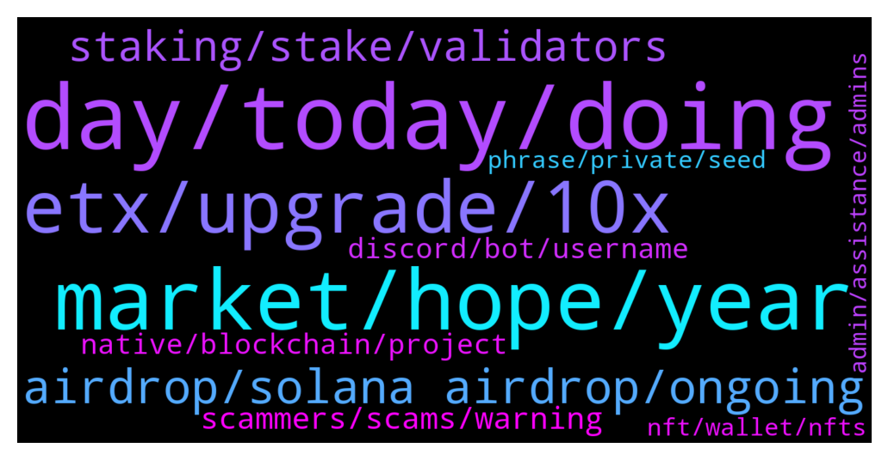

# **@solana**
 ## Analysis for **2022-01-12** - **2022-01-13**.

---

## 📊 **Basic Stats**

**n_messages_sent**: 448

---

---

## 🔝 **Top keywords and related messages**

1. **day, today, doing**

    @nofapgod --- *Says the 50 year old who talks to cat pics* **--->** [TG Discussion](https://t.me/solana/900183)

    @nana8869 --- *Man, I bet you are too.* **--->** [TG Discussion](https://t.me/solana/900152)

    @Dr White --- *Umm that doesn’t even make sense brotha* **--->** [TG Discussion](https://t.me/solana/900153)

    @Dr White --- *Hey bro that’s a lotta effort you put in to bait* **--->** [TG Discussion](https://t.me/solana/900147)

    @Gerardo --- *Again, shut up if you have nothing to say other than throw shit from your mouth.* **--->** [TG Discussion](https://t.me/solana/900184)

    @nana8869 --- *It's nice that it's almost all green today😄* **--->** [TG Discussion](https://t.me/solana/900138)

2. **market, hope, year**

    @Gerardo --- *95% people here said SOL @500$ on 31-12-2021. Now it's 2022. Then it will be 2023 🤣* **--->** [TG Discussion](https://t.me/solana/900171)

    @daniela2i --- *I think from the current price and and in comparison to its bull sol could possibly hit $500 this year at the long run* **--->** [TG Discussion](https://t.me/solana/900167)

    @Hahayaid --- *You can't beat inflation. But you won't have to fight it when you only have crypto.* **--->** [TG Discussion](https://t.me/solana/901368)

    @Farewell_Dai --- *In the current investment environment, maintaining stability is the best choice. You can consider bottoming out under the premise of plummeting, selling high and buying low, so you have quite professional market analysis and unique vision.* **--->** [TG Discussion](https://t.me/solana/901711)

    @ruoyun520 --- *What is the future market of the Metaverse?* **--->** [TG Discussion](https://t.me/solana/900221)

    @Imthemirrorface --- *What will be sol price for this month any prediction ?* **--->** [TG Discussion](https://t.me/solana/900949)

3. **etx, upgrade, 10x**

    @La Maripasa --- *I earn 5X solana, how did you get to earn 10x?* **--->** [TG Discussion](https://t.me/solana/900419)

    @Benve --- *I want your prediction for solana in 2022🤞🏼🔥* **--->** [TG Discussion](https://t.me/solana/900044)

    @Benn2550 --- *Solana showing up as congested for a long time now 😭* **--->** [TG Discussion](https://t.me/solana/900886)

    @Pamela --- *I'm yet to buy some solana please how can I buy* **--->** [TG Discussion](https://t.me/solana/900303)

    @constantrisk4203 --- *Wow so much fud on solana* **--->** [TG Discussion](https://t.me/solana/900337)

    @Lyala --- *I got 6 Solana coin from Etx technology* **--->** [TG Discussion](https://t.me/solana/900560)

4. **airdrop, solana airdrop, ongoing**

    @Cryptos2king --- *I heard there's Solana Airdrop, true or false?* **--->** [TG Discussion](https://t.me/solana/901782)

    @Innoclevers --- *Hi is there any solana airdrop* **--->** [TG Discussion](https://t.me/solana/900878)

    @aleshiang --- *there is a twitter trend #solanaAirdrop* **--->** [TG Discussion](https://t.me/solana/901025)

    @Arjunsingh058 --- *I only ask because I'm in this group on telegram where I get airdrops on Algorand and others. But somebody message me direct to tell me about Solana airdrop So I come here to ask* **--->** [TG Discussion](https://t.me/solana/901053)

    @sinaa778899 --- *It was an airdrop attached to a wallet* **--->** [TG Discussion](https://t.me/solana/899870)

    @bluelightcool --- *Guys, i want to ask, is Solana make event Airdrop?* **--->** [TG Discussion](https://t.me/solana/900777)

5. **staking, stake, validators**

    @WombatDoc --- *When do you see "rewards" from staking Sol on Phantom? Is that a Phantom question?* **--->** [TG Discussion](https://t.me/solana/899739)

    @leanlean --- *I have a question related to staking. Why my stake only gave me a few SOL and just that, never again, since like 1 month ago? Is that normal?* **--->** [TG Discussion](https://t.me/solana/901965)

    @mahib45 --- *You will receive your staking rewards every 2-3 days (on every epoch) and it will automatically be added and compounded to your staked amount.* **--->** [TG Discussion](https://t.me/solana/901985)

    @mahib45 --- *stake/unstake takes several epoch to warm up or to cool down (aprox. 2-3 days). You can read more about it here: https://docs.solana.com/staking/stake-accounts  You can use the https://solanabeach.io/ explorer for monitoring the Epoch* **--->** [TG Discussion](https://t.me/solana/899743)

    @Albert --- *How much APY do I earn staking?* **--->** [TG Discussion](https://t.me/solana/900822)

    @Miguel --- *Wheres the best place to stake SOL?* **--->** [TG Discussion](https://t.me/solana/900341)

6. **scammers, scams, warning**

    @lpcprod --- *Like 3 people are hitting me up, not sure about scammers here* **--->** [TG Discussion](https://t.me/solana/900102)

    @Curly --- *So many bots and scams. Just got like 5  DMs from these scammers. 🤢* **--->** [TG Discussion](https://t.me/solana/901478)

    @mahib45 --- *Read this warning! I already warning about scams! https://t.me/solana/899887* **--->** [TG Discussion](https://t.me/solana/899926)

    @Crypto --- *Yeah it only scams that do that* **--->** [TG Discussion](https://t.me/solana/901176)

    @mahib45 --- *These are scammers! And please read our warning ⚠️* **--->** [TG Discussion](https://t.me/solana/899939)

    @Monterrey_Rice --- *that is a scammer fam. Please block and report. stay safe out there!* **--->** [TG Discussion](https://t.me/solana/899730)

7. **native, blockchain, project**

    @Folaross --- *There are many materials on Solana developers page on how to create token or contract on Solana Blockchain.  Check it out here - https://solana.com/developers  If you are looking forward to create your SPL token on Solana, check it out here - https://spl.solana.com/token  And you can also join Solana dev team on Discord - https://solana.com/discord* **--->** [TG Discussion](https://t.me/solana/900372)

    @mahib45 --- *Hello 👋  Solana has its native blockchain. SOL is the native token of the Solana blockchain. It's not Erc20 or Bep20 token.* **--->** [TG Discussion](https://t.me/solana/899623)

    @mahib45 --- *Hello!  Check this out👇🏻  1️⃣ Solana Ecosystem  https://solana.com/ecosystem  2️⃣ New projects detail https://twitter.com/Solana_Mates   3️⃣ Tokens on Solana chain  https://solscan.io/tokens* **--->** [TG Discussion](https://t.me/solana/902023)

    @Chandan --- *what are the best resources to learn solana smart contracts?* **--->** [TG Discussion](https://t.me/solana/900368)

    @BertSanti --- *Solana website has page for developers* **--->** [TG Discussion](https://t.me/solana/901584)

    @cryptolover1987 --- *Hello! Solana has its native blockchain. SOL is the native token of the Solana blockchain.  It doesn’t have a contract address. Please click on the pinned message to know everything about Solana!* **--->** [TG Discussion](https://t.me/solana/901415)

8. **discord, bot, username**

    @MJcryptofounder --- *Who can I talk to about getting help joining Discord? The anti-dupe bot says I'm using a duplicate username on the server, but wondering how thats possible when every Discord ID is unique.* **--->** [TG Discussion](https://t.me/solana/901399)

    @MijailR --- *Hi. I got banned from the discord group by mistake. I changed my discord username to my domain .sol and now I know sol in the username is prohibited. Can someone help me to get back on discord?* **--->** [TG Discussion](https://t.me/solana/901316)

    @tiotoi --- *Hi there. Could you please refer me to some one who is in charge? I would like to talk about the future collaborations. Thanks* **--->** [TG Discussion](https://t.me/solana/899629)

    @mahib45 --- *Hello 👋  Our dev support will be able to help you technical things!   👉 https://solana.com/discord  ✅Click on #role and select the emoji "Community " 👨‍🌾 on Carl -bot. And then go back to the general section again.  Then you will able to send message!* **--->** [TG Discussion](https://t.me/solana/899996)

    @cryptolover1987 --- *Hello!  Discord is the right place to talk with Dev team! ▫️Join us in the Discord for technical support from the dev team 🔗 https://discord.com/invite/pquxPsq  ✅Click on #role and select the emoji "Community " 👨‍🌾 on Carl -bot. And then go back to the general section again.  Then you will able to send message!* **--->** [TG Discussion](https://t.me/solana/901339)

    @mahib45 --- *Our dev support will be able to help you technical things!   👉 https://solana.com/discord  ✅Click on #role and select the emoji "Community " 👨‍🌾 on Carl -bot. And then go back to the general section again.  Then you will able to send message!* **--->** [TG Discussion](https://t.me/solana/899776)

9. **phrase, private, seed**

    @sinaa778899 --- *Now some people have sent me a message to give me 12 words wallet, we will return the money* **--->** [TG Discussion](https://t.me/solana/899924)

    @Amarjeet --- *Don't know someone else might have used hit and trial with my pass phrase* **--->** [TG Discussion](https://t.me/solana/901532)

    @southy33 --- *You mustve left on automatic confirmation on on your wallets. Or shared your seed phrase with someone.* **--->** [TG Discussion](https://t.me/solana/901840)

    @aneesa_t --- *I suspect strongly someone has your private key* **--->** [TG Discussion](https://t.me/solana/901668)

    @mahib45 --- *Hello 👋  Always be careful before browsing any website! Never disclose your wallet seed or private keys to anyone!* **--->** [TG Discussion](https://t.me/solana/899909)

    @CryptoSurferDude --- *It means someone is trying to steal your seed so just give to them and they can take all of your funds.* **--->** [TG Discussion](https://t.me/solana/899867)

10. **nft, wallet, nfts**

    @CHIPOFFTHEBLOCKCHAIN --- *i mean best solana wallet for nfts/smart contracts* **--->** [TG Discussion](https://t.me/solana/900022)

    @radosh2 --- *Hey admins.  Which wallet do you recommend for solana?* **--->** [TG Discussion](https://t.me/solana/900998)

    @mahib45 --- *Wallet options can be found here  https://t.me/solana/878227* **--->** [TG Discussion](https://t.me/solana/899903)

    @RealPrinceOla --- *Solana NFT marketplace :  1️⃣ Metaplex Metaplex is a decentralized protocol that will allow creators to mint and auction non-fungible tokens on the Solana blockchain.   🔗 https://www.metaplex.com  2️⃣ Lollapalooza  🔗 https://lollapalooza.live-nfts.com  3️⃣ Solanart Solanart is the first fully-fledged NFT marketplace on Solana. Get quick and easy access to digital collectibles and explore, buy and sell NFTs from different collections and artists.  🔗 https://solanart.io  4️⃣ Solarians The very first NFT on Solana   🔗 https://solarians.click/  5️⃣ Frakt FRAKT is the first generative art NFT collection on Solana.  🔗 https://frakt.art* **--->** [TG Discussion](https://t.me/solana/901213)

    @alexDcrypto --- *There are severals and i'll recomand decentralized wallets such as: phantom, sollet, solflare* **--->** [TG Discussion](https://t.me/solana/900033)

    @JoonMo --- *Could you tell me when the wallet system work?* **--->** [TG Discussion](https://t.me/solana/901439)

