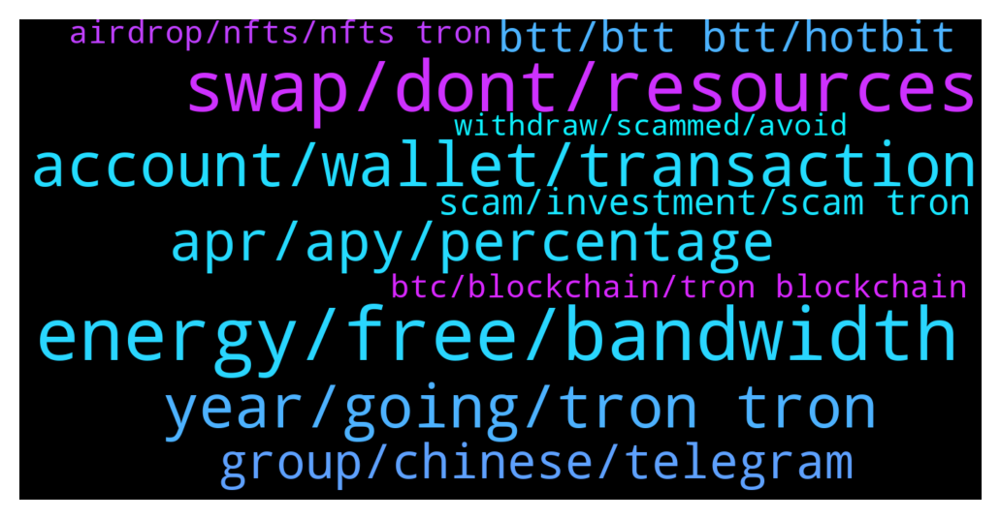

# **@tronnetworkEN**
 ## Analysis for **2022-01-12** - **2022-01-13**.

---

## 📊 **Basic Stats**

**n_messages_sent**: 233

---

---

## 🔝 **Top keywords and related messages**

1. **energy, free, bandwidth**

    @rocket274 --- *Can someone lend me some energy ?* **--->** [TG Discussion](https://t.me/tronnetworkEN/3827847)

    @Olly --- *Thank you, there is a small fee? It used to be with only energy/bandwidth?* **--->** [TG Discussion](https://t.me/tronnetworkEN/3827389)

    @agentpiki --- *Yes, bandwidth and energy are enough 👍* **--->** [TG Discussion](https://t.me/tronnetworkEN/3827400)

    @Kankam --- *Am new here I want to business* **--->** [TG Discussion](https://t.me/tronnetworkEN/3825481)

    @templariotuga --- *I think you guys are in the wrong chat* **--->** [TG Discussion](https://t.me/tronnetworkEN/3826196)

    @coinguy555 --- *The problem now is my train not going down zzz* **--->** [TG Discussion](https://t.me/tronnetworkEN/3828064)

2. **swap, dont, resources**

    @Carlos_TRX --- *Sunswap.com you will find there the option to swap it* **--->** [TG Discussion](https://t.me/tronnetworkEN/3827475)

    @agentpiki --- *FAILED  You said you have TRX already. Go try again* **--->** [TG Discussion](https://t.me/tronnetworkEN/3825161)

    @goblinex --- *was trying to stake trx to gain energy for a smart contract in nile testnet and got error . is any problem wrong with nile or my contract* **--->** [TG Discussion](https://t.me/tronnetworkEN/3825859)

    @erickbrt --- *Guys, dont believe on TRX mining on meta-trx! It is scam!* **--->** [TG Discussion](https://t.me/tronnetworkEN/3824169)

    @goblinex --- *where do i get the contract of pool tokens (after supplying LP on sunswap v2) , i dont see that tokens : Note : Not liquidity mining custom token LP Dupplied* **--->** [TG Discussion](https://t.me/tronnetworkEN/3825583)

    @KingsDove_TRX --- *Failed or not you will burn TRX if you don't have enough energy to cover it* **--->** [TG Discussion](https://t.me/tronnetworkEN/3828180)

3. **account, wallet, transaction**

    @chirrag91 --- *Any update regarding tron24 withdrawal ???* **--->** [TG Discussion](https://t.me/tronnetworkEN/3827381)

    @Salon --- *My trx is not being withdrawn after waiting 12 hours too* **--->** [TG Discussion](https://t.me/tronnetworkEN/3826958)

    @Pawanrangila --- *Not receive my tron wallet but withdraw confirm by deffect app Tron Transaction Hash c375d6bf78150222ebdafd631a05eed0d4d7caa07dba8ec7a515e1abd823540c* **--->** [TG Discussion](https://t.me/tronnetworkEN/3825158)

    @Pattabhi --- *Hi, can anyone tell me process to get bck if sent to wrong account..* **--->** [TG Discussion](https://t.me/tronnetworkEN/3823968)

    @Pawanrangila --- *How to Approve My deffect App Transaction* **--->** [TG Discussion](https://t.me/tronnetworkEN/3825693)

    @Pawanrangila --- *Please Approve This Transaction Please Help Me* **--->** [TG Discussion](https://t.me/tronnetworkEN/3825678)

4. **year, going, tron tron**

    @MadEyeMoody --- *When can we see Tron going up as btc is also going up but Trx is sleeping!!!* **--->** [TG Discussion](https://t.me/tronnetworkEN/3824098)

    @Helanela --- *Am new to the market  Hope is not that late to buy tron (trx)* **--->** [TG Discussion](https://t.me/tronnetworkEN/3825057)

    @Kamal --- *Tron is going to $1 , what you think?* **--->** [TG Discussion](https://t.me/tronnetworkEN/3826017)

    @Amiola --- *When will baby doge be on Tron Network?* **--->** [TG Discussion](https://t.me/tronnetworkEN/3827916)

    @Apareechit --- *Not so soon.... and if you do feel this then please share the year by which TroN will be $1* **--->** [TG Discussion](https://t.me/tronnetworkEN/3826054)

    @skyeyes83 --- *Great news about wink,this week 2nd sportbook release 💪* **--->** [TG Discussion](https://t.me/tronnetworkEN/3824033)

5. **apr, apy, percentage**

    @Diptiranjan --- *Like u said devide by 365 then whats the difference in apy and apr?* **--->** [TG Discussion](https://t.me/tronnetworkEN/3827691)

    @simon866 --- *APR is annual percentage represented so it's what they have agreed to give you and should not change or be diluted by new commers into the pool* **--->** [TG Discussion](https://t.me/tronnetworkEN/3827705)

    @simon866 --- *Well its APR so you can use a calculator and devide that by 365 days then x by 3 👍* **--->** [TG Discussion](https://t.me/tronnetworkEN/3827689)

    @Diptiranjan --- *So i would like to know if i put 100trx for 3 days with 5% apr how much will i get after 3 day* **--->** [TG Discussion](https://t.me/tronnetworkEN/3827676)

    @Diptiranjan --- *According to people and apr will be always stable?* **--->** [TG Discussion](https://t.me/tronnetworkEN/3827716)

    @simon866 --- *APY is annual percentage yield and applies more to farm pools   When more people join the percentage lowers as it's a share of the farm yield* **--->** [TG Discussion](https://t.me/tronnetworkEN/3827700)

6. **group, chinese, telegram**

    @redzhebhalil9 --- *Can someone help me i want to join bittorent group* **--->** [TG Discussion](https://t.me/tronnetworkEN/3825254)

    @alisaghi94 --- *Right in that group, I was learning Chinese.* **--->** [TG Discussion](https://t.me/tronnetworkEN/3824871)

    @alisaghi94 --- *Hi send me chinese group link* **--->** [TG Discussion](https://t.me/tronnetworkEN/3824864)

    @toumbou_djigue --- *I would like to know that there is the group trx francophone community that's just question* **--->** [TG Discussion](https://t.me/tronnetworkEN/3823921)

    @Techieties --- *Admin, can you please mention sun platform telegram group* **--->** [TG Discussion](https://t.me/tronnetworkEN/3827342)

    @Miieooo --- *Do you have a group to talk and play?* **--->** [TG Discussion](https://t.me/tronnetworkEN/3824234)

7. **btt, btt btt, hotbit**

    @Olly --- *Where is best place to convert wbtt to btt?* **--->** [TG Discussion](https://t.me/tronnetworkEN/3827380)

    @Carlos_TRX --- *yes BTT is BTT, OLDBTT is OLDBTT. easy to understand the redenomination* **--->** [TG Discussion](https://t.me/tronnetworkEN/3823887)

    @SchooleyD --- *BTT isn’t even the same as BTT 😂* **--->** [TG Discussion](https://t.me/tronnetworkEN/3823885)

    @agentpiki --- *Wbtt trc20 to BTT trc10 in just stable* **--->** [TG Discussion](https://t.me/tronnetworkEN/3827382)

    @CryptoAAA --- *Dear Hotbit Users,        According to the BitTorrent team, BTT(BitTorrent) split at a ratio of 1000:1 has been activated on December 12th, 2021 UTC. Hotbit will support BTT split and provide swap services for users.      At the same time, Hotbit has closed the BTT deposit, withdrawal and trading functions, and the specific splitting time will be notified later.      BTT(BitTorrent) splitting details:* **--->** [TG Discussion](https://t.me/tronnetworkEN/3825778)

    @xPommepote --- *No, BTT is BTT. Some exchanges  messed up but it will be resolve* **--->** [TG Discussion](https://t.me/tronnetworkEN/3823906)

8. **scam, investment, scam tron**

    @Taiwo --- *So, the Tron link app is a scam right?* **--->** [TG Discussion](https://t.me/tronnetworkEN/3825001)

    @Eneskule --- *But they said all Tron Investment is scam* **--->** [TG Discussion](https://t.me/tronnetworkEN/3827139)

    @Eneskule --- *Please is there Tron project investment going on?* **--->** [TG Discussion](https://t.me/tronnetworkEN/3827129)

    @agentpiki --- *Why ask here? It is not tron legit platform  Go ask there in scam investment support* **--->** [TG Discussion](https://t.me/tronnetworkEN/3827383)

    @agentpiki --- *Not related to real and legit tron. Probably scam* **--->** [TG Discussion](https://t.me/tronnetworkEN/3827240)

    @agentpiki --- *Not related to tron. Probably scam* **--->** [TG Discussion](https://t.me/tronnetworkEN/3825443)

9. **airdrop, nfts, nfts tron**

    @NulledNews --- *I would like to ask a question about purchasing the tron* **--->** [TG Discussion](https://t.me/tronnetworkEN/3824026)

    @Darkthor10 --- *any tron airdrop running right now?* **--->** [TG Discussion](https://t.me/tronnetworkEN/3827394)

    @Mathew --- *Please does  anyone here know about Tron volt?* **--->** [TG Discussion](https://t.me/tronnetworkEN/3825439)

    @agentpiki --- *There is no tron airdrop.  Only legit airdrop here is APENFT airdrop for holding trx* **--->** [TG Discussion](https://t.me/tronnetworkEN/3827398)

    @Theinfinite18 --- *Where can I get a guide to creating NFTs on Tron* **--->** [TG Discussion](https://t.me/tronnetworkEN/3826426)

    @Marris --- *Pls how do I buy tron?!* **--->** [TG Discussion](https://t.me/tronnetworkEN/3826334)

10. **btc, blockchain, tron blockchain**

    @Carlos_TRX --- *If you swap BTC in TRON blockchain you can move to an exchange like poloniex (for example) and send it to a btc wallet if you want (more expensive and slow) but yes, it is the same Btc that moves in the TRON chain so you need a bridge and you cannot move it directly to the btc chain* **--->** [TG Discussion](https://t.me/tronnetworkEN/3827465)

    @Carlos_TRX --- *Yes like all blockchains in the world* **--->** [TG Discussion](https://t.me/tronnetworkEN/3825689)

    @Carlos_TRX --- *if you use BTC in TRON blockchain you can send it to another TRON address... if you wanna send it to a BTC address so you need a bridge like poloniex for example* **--->** [TG Discussion](https://t.me/tronnetworkEN/3828092)

    @PiterSpain --- *Bitcoin has its own blockchain and Bitcoin in other blockchains are wrapped versions. Im the case of TRON you can deposit BTC TRON or WBTC in some exchanges using the TRON Network, for example Poloniex.com or Kucoin.com and withdraw from there using the original Bitcoin network* **--->** [TG Discussion](https://t.me/tronnetworkEN/3827332)

    @mkswpvz --- *TRON-based decentralized exchange protocol between any TRC20 tokens that was deployed to the TRON network.  Coming Soon… 01.02.2022     MakeSwap Dex Official on telegram* **--->** [TG Discussion](https://t.me/tronnetworkEN/3826976)

    @MilNoslen --- *It's BTC that exists on the Tron Blockchain* **--->** [TG Discussion](https://t.me/tronnetworkEN/3826896)

