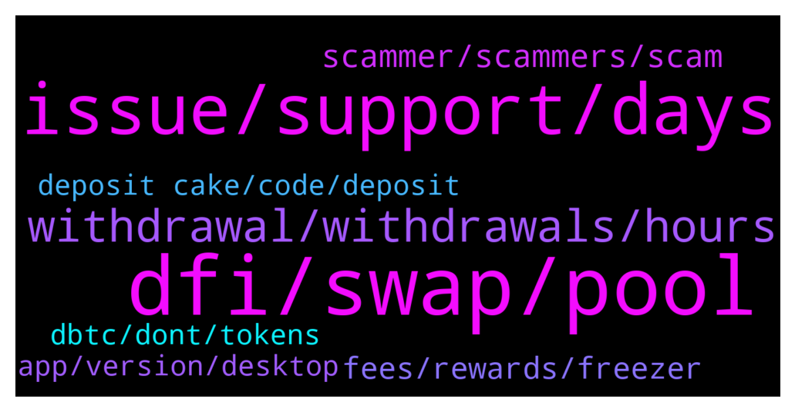

# **@CakeDeFi_EN**
 ## Analysis for **2022-01-13** - **2022-01-14**.

---

## 📊 **Basic Stats**

**n_messages_sent**: 277

---

---

## 🔝 **Top keywords and related messages**

1. **dfi, swap, pool**

    @Siva --- *I tried this and keep getting an error message saying swaps are only allowed to DFI.* **--->** [TG Discussion](https://t.me/CakeDeFi_EN/164436)

    @Siva --- *I only have DFI at the moment. But it will not allow me to swap my DFI for BTC to enter the pool.* **--->** [TG Discussion](https://t.me/CakeDeFi_EN/164419)

    @Timurlenk --- *Pls dont write me bots.. i block immediately.. so should i exit liquidity and send the tokens separately or i can send them as a pair* **--->** [TG Discussion](https://t.me/CakeDeFi_EN/164511)

    @averagecryptoinvestor --- *Hi Cake Community, recently startet with Liquidity Mining and would also like to add to the USDC Liquidity Pool. However I don’t want to pay 130$ for an Ethereum address. How can I send my USDC via DFI Network?* **--->** [TG Discussion](https://t.me/CakeDeFi_EN/164822)

    @AStron6 --- *You can  do simple mode when adding liquidity, unless it got turned off again* **--->** [TG Discussion](https://t.me/CakeDeFi_EN/164410)

    @mm_phoenix --- *!DFI you need dUSDC on the defichain. you can only buy them on the defichain dex* **--->** [TG Discussion](https://t.me/CakeDeFi_EN/164823)

2. **issue, support, days**

    @DmgBautista --- *Hi! Do you still continue facing issues with your KYC procedure? Honestly dont know what you may be facing. If you wish you can DM me with a  printscreen of (only!) the name you submitted in the several support documents as well as the email you received.   Dont know if I will be able to point you in the correct direction but we can try. Best regards!* **--->** [TG Discussion](https://t.me/CakeDeFi_EN/163940)

    @BerndMack --- *!Support can help, just write them.* **--->** [TG Discussion](https://t.me/CakeDeFi_EN/164007)

    @mm_phoenix --- *!Support no the money is not lost. please create a ticket* **--->** [TG Discussion](https://t.me/CakeDeFi_EN/164313)

    @yeahright22 --- *i know, just frustrating about the time, its a lot :) Anyway hopefullly will be completed soon :)* **--->** [TG Discussion](https://t.me/CakeDeFi_EN/164014)

    @fabioandreatta --- *There is no other way than going through support. And i am 100% sure they will attend your issue if you submit your request in a friendly way 😉* **--->** [TG Discussion](https://t.me/CakeDeFi_EN/164011)

    @yeahright22 --- *already did 2 days ago, no proper answer.* **--->** [TG Discussion](https://t.me/CakeDeFi_EN/164010)

3. **withdrawal, withdrawals, hours**

    @yeahright22 --- *Hello after 3 days i still didnt get my 2 dfi withdrawal.I have txid , but on dfichain is not reflecting since 3day.* **--->** [TG Discussion](https://t.me/CakeDeFi_EN/164251)

    @yeahright22 --- *hey, i have 5 dfi withdrawal which is processing (pending) for more than a day, eventho i had problem with txID'S AND THEY fixed, now they are not sending the withdrawal* **--->** [TG Discussion](https://t.me/CakeDeFi_EN/164657)

    @Reggie --- *Kucoin Deposits and withdrawals are back online 🔥* **--->** [TG Discussion](https://t.me/CakeDeFi_EN/164099)

    @prasenjitbarua --- *Is there any chance that transfer can get blocked or paused in the middle? Planning to transfer by total DFI fund in Cake...* **--->** [TG Discussion](https://t.me/CakeDeFi_EN/163994)

    @YyeapY --- *curious question abt 2fa, does anyone stored their key in case the authenticator apps gone?  Or simply just request from support to disable when authenticator missing? (to re-enable back)* **--->** [TG Discussion](https://t.me/CakeDeFi_EN/164566)

    @fabioandreatta --- *A withdrawal can take up to 72-hours* **--->** [TG Discussion](https://t.me/CakeDeFi_EN/164664)

4. **scammer, scammers, scam**

    @Javier --- *It is. Thank you. By the way, I was contacted presumably by a scammer because of this issue* **--->** [TG Discussion](https://t.me/CakeDeFi_EN/164237)

    @NuckFut --- *The number of scammer's watching this chat and pouncing on anyone with questions is too damn high* **--->** [TG Discussion](https://t.me/CakeDeFi_EN/164553)

    @BerndMack --- *The content of your messages does not fit the channel. This is about Cake, not about the scammers who are everywhere. Be careful here and pay attention to the message I forwarded. 🙏* **--->** [TG Discussion](https://t.me/CakeDeFi_EN/164164)

    @BerndMack --- *Watch out for scammers. Do not klick any links or put in your seed or password in any page they send to you!* **--->** [TG Discussion](https://t.me/CakeDeFi_EN/164046)

    @zachgax --- *I was saying. I always ask unsolicited scammers to send an erc-20 token, fund my address creation. 🤣🤣🤣* **--->** [TG Discussion](https://t.me/CakeDeFi_EN/164127)

    @Kassius84 --- *Be careful, they are a lot of scammers out there. Just block and report them 👍* **--->** [TG Discussion](https://t.me/CakeDeFi_EN/164118)

5. **fees, rewards, freezer**

    @Stephan --- *quick question regarding rebate of staking fees: for 36 months of freezing I get 75% rebate of staking fees, how does this look like for 5 and 10 years? There is no information regarding that as far as I can see* **--->** [TG Discussion](https://t.me/CakeDeFi_EN/164473)

    @frnklfrt --- *I have unexpected deposits in my freezer with a one month tenure. Is this an accounting correction related to the recent security exploit or do I likely have something misconfigured that is sending rewards to the freezer automatically?* **--->** [TG Discussion](https://t.me/CakeDeFi_EN/164727)

    @JonD26 --- *Cool. Thanks for clarification. Just also, that 15% fee on the rewards you mentioned before, does that happen as-we-go or will it be taken in the future if withdrawing?* **--->** [TG Discussion](https://t.me/CakeDeFi_EN/164367)

    @NuckFut --- *Susan Risk is based in the price of the mined asset.  Also APY, lockup periods periods if any* **--->** [TG Discussion](https://t.me/CakeDeFi_EN/164563)

    @Kassius84 --- *If you freeze for 5/10 years, you are freezing directly on DeFichain Blockchain. Cake DeFi has some much more efforts to setup and maintain this froozen masternodes, so that case there is no rebate of staking fees* **--->** [TG Discussion](https://t.me/CakeDeFi_EN/164476)

    @Michael_Schredl --- *There is no rebate of staking fees for the 5 and 10 year freezer - but you get 1.5/2X rewards* **--->** [TG Discussion](https://t.me/CakeDeFi_EN/164475)

6. **dbtc, dont, tokens**

    @JonD26 --- *Ok cool. Thanks. Just was reading the github and they were talking about extra fees to cover unbacked dbtc but wasn't sure if it was us paying that.* **--->** [TG Discussion](https://t.me/CakeDeFi_EN/164328)

    @mm_phoenix --- *You can deposit btc and put it into the LM.  LP tokens are still not accepted* **--->** [TG Discussion](https://t.me/CakeDeFi_EN/164258)

    @alessandrolocicero --- *Hey Cake Team! Saw on Twitter that somebody said dBTC deposits are enabled again. Is it not safe to deposit dBTC and withdraw BTC now? Dont see an official tweet or announcement yet. (And scammers: Dont even waste your time to pm me)* **--->** [TG Discussion](https://t.me/CakeDeFi_EN/163972)

    @mm_phoenix --- *"We will introduce an additional fee of 0.1% for Swaps on the BTC-Pool. The fees will be burned as dBTC. Implementing this may take a few weeks." https://github.com/DeFiCh/dfips/issues/101* **--->** [TG Discussion](https://t.me/CakeDeFi_EN/164330)

    @futuristicjag --- *I have made a mistake and purchased dbtc tokens how do I turn the tokens back to Defi* **--->** [TG Discussion](https://t.me/CakeDeFi_EN/164444)

    @mm_phoenix --- *you can deposit coins like btc, eth, usdc* **--->** [TG Discussion](https://t.me/CakeDeFi_EN/164335)

7. **deposit cake, code, deposit**

    @GOS13 --- *Do I pay gas to send dEth from defi to cake ?* **--->** [TG Discussion](https://t.me/CakeDeFi_EN/164742)

    @ykoh1797 --- *I mean is there a way to deposit crypto into cake directly haha, I didn't mean to transfer fiat* **--->** [TG Discussion](https://t.me/CakeDeFi_EN/164344)

    @ykoh1797 --- *is there a way to deposit into cake Defi directly? I can't seem to see an option for that* **--->** [TG Discussion](https://t.me/CakeDeFi_EN/164339)

    @JesulobaMV --- *1. Can I pay or buy directly with NGN Naira? 2. How do I refer, is it just by sending my referral code, no link? 3. Is there P2P trading  Thanks* **--->** [TG Discussion](https://t.me/CakeDeFi_EN/164135)

    @ykoh1797 --- *can anyone tell me how to move money from CDC to cake Defi?* **--->** [TG Discussion](https://t.me/CakeDeFi_EN/164334)

    @mm_phoenix --- *no they are sent over the defichain network there is no gas* **--->** [TG Discussion](https://t.me/CakeDeFi_EN/164744)

