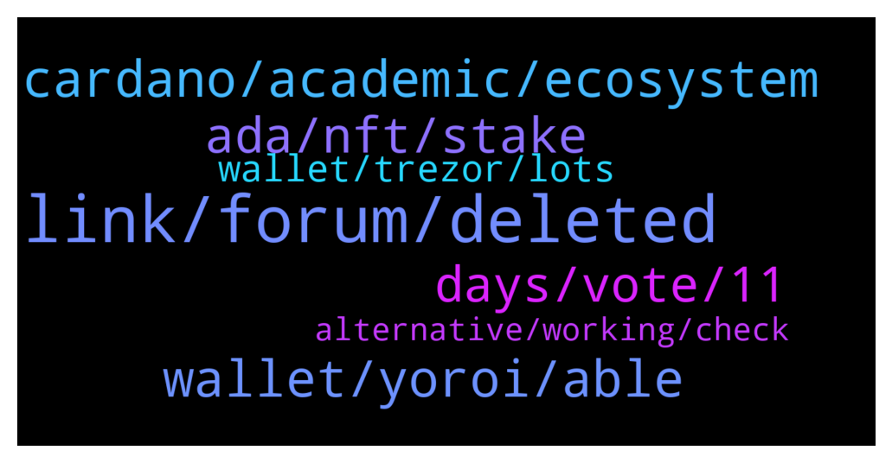

# **@Cardano**
 ## Analysis for **2022-01-13** - **2022-01-14**.

---

## 📊 **Basic Stats**

**n_messages_sent**: 114

---

---

## 🔝 **Top keywords and related messages**

1. **link, forum, deleted**

    @AB’z --- *Yeah it opened a dm first thn there is a link for the forum.* **--->** [TG Discussion](https://t.me/Cardano/768569)

    @AB’z --- *No I clicked on it and it opened a dm and then asked me to verify on some forum* **--->** [TG Discussion](https://t.me/Cardano/768563)

    @glitch04 --- *Should link you to the forum* **--->** [TG Discussion](https://t.me/Cardano/768567)

    @glitch04 --- *Read the link posted directly above your question* **--->** [TG Discussion](https://t.me/Cardano/768484)

    @AB’z --- *Guys is Charlie the bot real?* **--->** [TG Discussion](https://t.me/Cardano/768559)

    @glitch04 --- *link should direct you to https://forum.cardano.org/* **--->** [TG Discussion](https://t.me/Cardano/768570)

2. **cardano, academic, ecosystem**

    @Morpheus369 --- *don't get why you need a degree to improve cardano* **--->** [TG Discussion](https://t.me/Cardano/768772)

    @f96honj7 --- *Wondering currently is there any defi platform for staking in cardano ?* **--->** [TG Discussion](https://t.me/Cardano/768964)

    @glitch04 --- *Veritree will be used to track the planting progress and recorded on the Cardano blockchain* **--->** [TG Discussion](https://t.me/Cardano/768534)

    @Juanlot --- *https://twitter.com/VitalikButerin/status/1481737970562789376?t=lvlEkQyRKCN1SRi9jWU4Bw&s=19 and  the winner is cardano* **--->** [TG Discussion](https://t.me/Cardano/768887)

    @Grip9 --- *Who knows If the Cardona forrest has a proof that there are ready 1000000 trees planted some where in the world and if so where are they?  Or is a way of greenwashing like most companies do it?* **--->** [TG Discussion](https://t.me/Cardano/768532)

    @Eze_King --- *Funny how this got pushed even further out… and people criticize Cardano* **--->** [TG Discussion](https://t.me/Cardano/768844)

3. **wallet, yoroi, able**

    @alban77 --- *any idea about this crash?  Yoroi crashed ATTENTION:  If you want to inspect logs, you can download them here. Logs do not contain sensitive information, and it would be helpful to attach them to problem reports to help the team investigate the issue you are experiencing.  For more help, you can contact support* **--->** [TG Discussion](https://t.me/Cardano/768588)

    @glitch04 --- *Wallet will need additional permissions that it previously did not have so that it will be able to connect to future dapps* **--->** [TG Discussion](https://t.me/Cardano/768471)

    @AB’z --- *Yeah I have reinstalled it and now my wallet won’t connect* **--->** [TG Discussion](https://t.me/Cardano/768542)

    @AB’z --- *I’m trying to restore it but keep getting this error* **--->** [TG Discussion](https://t.me/Cardano/768455)

    @dennypw --- *In 1 week I remove and install chrome ext 4times, cause when I open yoroi in my chrome is just blank cannot show my wallet. 4times restore my wallet in a week 😅* **--->** [TG Discussion](https://t.me/Cardano/768451)

    @AB’z --- *I had to uninstall and now it’s not connecting to my hardware wallet* **--->** [TG Discussion](https://t.me/Cardano/768449)

4. **ada, nft, stake**

    @trustfuland --- *Hello. I want to stake my ADA on Daedalus, do I have to keep it open? Or I can close the program once I have my Ada in there?* **--->** [TG Discussion](https://t.me/Cardano/768828)

    @jaymeyer --- *Hi I need help for staking* **--->** [TG Discussion](https://t.me/Cardano/768584)

    @alban77 --- *go and delegate to one of these pools: https://adapools.org/* **--->** [TG Discussion](https://t.me/Cardano/768589)

    @engamg --- *What happend to the terravirtua cardano summit nft’s? Have they made an anouncement for when they are minting the nft’s / selecting who gets one of the collected jpg’s minted yet?* **--->** [TG Discussion](https://t.me/Cardano/769075)

    @retrostakepool --- *VyFi is the closest atm. You can stake their NFT's and earn vyfi tokens. They have a NFT drop coming up for people who didn't receive the purple of gold NFTs from their ICO. You'll be able to purchase and stake to receive Ada, flickto, vyfi, adax etc* **--->** [TG Discussion](https://t.me/Cardano/768965)

    @FIFTYONE_50 --- *Trying to refresh my memory here regarding the specifics on babel fees but before i dig in again figured i would ask here. When sending a native asset this way does it still require me as the sender to include the minimum amount of ada to move with the asset and the fee is just covered or is it both the minimum and transaction fee?* **--->** [TG Discussion](https://t.me/Cardano/768814)

5. **days, vote, 11**

    @AndreyKarra --- *When the heck the voting on Fund 7 begins?  It was 13 now it says 20th... What is going on?* **--->** [TG Discussion](https://t.me/Cardano/768631)

    @Grip9 --- *it should take 3 month! so show us all a proof in 3 month that its realy happening.  do you take the challenge to proof its real?* **--->** [TG Discussion](https://t.me/Cardano/768549)

    @glitch04 --- *It just was funded like a few days ago you expect them to be planted already?* **--->** [TG Discussion](https://t.me/Cardano/768536)

    @glitch04 --- *The following is an update that was posted:  Due to an unusually large number of potentially invalid CA proposal reviews, we’ve taken the decision to delay the Fund 7 community vote on submitted proposals, originally scheduled for Thursday the 13th of January at 11 AM UTC. The vote will now take place on Thursday the 20th of January at 11 AM UTC.  This allows us to conduct a flash assessment round with the help of Veteran Community Advisors. We appreciate this may cause some trouble and apologize for any inconvenience.  Read more: https://mailchi.mp/iohk/fund-7-vote  You can stay updated by joining @ProjectCatalystChat* **--->** [TG Discussion](https://t.me/Cardano/768652)

    @Мишель --- *It's been too many these last few days for me !* **--->** [TG Discussion](https://t.me/Cardano/768712)

    @Lgbeano --- *Looks like someone is buying many votes for you to win* **--->** [TG Discussion](https://t.me/Cardano/769069)

6. **wallet, trezor, lots**

    @acgg007 --- *guys what is the best wallet i can use? that works also on iOS? (i use Ledger Nano X and Trezor)* **--->** [TG Discussion](https://t.me/Cardano/768882)

    @glitch04 --- *Easy and secure to switch between wallets when you are using the hardware supported option* **--->** [TG Discussion](https://t.me/Cardano/768907)

    @glitch04 --- *Community built light wallet with lots of features* **--->** [TG Discussion](https://t.me/Cardano/768903)

    @glitch04 --- *use one of the light wallets* **--->** [TG Discussion](https://t.me/Cardano/768701)

    @nferdazel --- *Hi guys, any wallet recommendation for Android? Yoroi didn't work well. Thank you.* **--->** [TG Discussion](https://t.me/Cardano/768550)

    @dennypw --- *The other wallet is oke, nami and cc just fine 👍* **--->** [TG Discussion](https://t.me/Cardano/768452)

7. **alternative, working, check**

    @Deji --- *I don't know where they rank them at, but this site has a good list of the projects. https://www.cardanocube.io/* **--->** [TG Discussion](https://t.me/Cardano/768415)

    @exploreBlock --- *Many thanks.. I ll check it out* **--->** [TG Discussion](https://t.me/Cardano/769089)

    @glitch04 --- *I think ccvault just released their ios version* **--->** [TG Discussion](https://t.me/Cardano/768899)

    @Мишель --- *Great, I had no idea about that alternative* **--->** [TG Discussion](https://t.me/Cardano/768705)

    @alban77 --- *Yes is working with second attemp* **--->** [TG Discussion](https://t.me/Cardano/768592)

