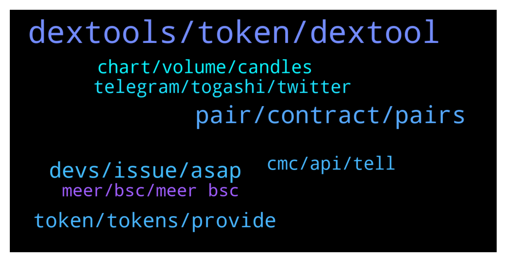

# **@DEXToolsCommunity**
 ## Analysis for **2022-01-12** - **2022-01-14**.

---

## 📊 **Basic Stats**

**n_messages_sent**: 245

---

---

## 🔝 **Top keywords and related messages**

1. **dextools, token, dextool**

    @DEXTOOLS34 --- *I want to trend my token on dextools who can I pm* **--->** [TG Discussion](https://t.me/DEXToolsCommunity/324559)

    @Yokamox --- *How to submit request for update regarding my token ( Jacy ) in dextools?* **--->** [TG Discussion](https://t.me/DEXToolsCommunity/324451)

    @vucky084 --- *Thanks. How I can find our token on dextool as there are lot of fake tokens there* **--->** [TG Discussion](https://t.me/DEXToolsCommunity/323958)

    @GhosTMan96QuelloVeroDal2014 --- *Friend , do you have any other Dextools communities? I don't understand when you talk🥺🥺* **--->** [TG Discussion](https://t.me/DEXToolsCommunity/324364)

    @fastsafe01 --- *How can I add logo from dextools.* **--->** [TG Discussion](https://t.me/DEXToolsCommunity/324891)

    @rambo_dev --- *why is dextools becoming so fucking trash nowadays, from bad to worst, tokens launched for more than 30 mins and dextools still says liquidity is not added. past few days transactions even jammed and not moving. Totally unreliable. If this continues, dextool is going down the drain. Compare to poocoin that never once had any issue.* **--->** [TG Discussion](https://t.me/DEXToolsCommunity/324283)

2. **pair, contract, pairs**

    @stanes --- *Ok, thanks, any specific pair? I don't see any pb with some random ones.* **--->** [TG Discussion](https://t.me/DEXToolsCommunity/324803)

    @bastardganpunk --- *this pair has just not been traded* **--->** [TG Discussion](https://t.me/DEXToolsCommunity/324631)

    @Boo_Scares_You --- *how to add pair on dext price bot ? i tried set_pair 1 bsc [contract] added successfully but then it said "Pair not found"* **--->** [TG Discussion](https://t.me/DEXToolsCommunity/324945)

    @ATX_987 --- *Are you having issues? At least on of your pairs is about 3 hours behind right now (0xb2ba36ee6ba6113a914f3e8812a0df094dec5994)* **--->** [TG Discussion](https://t.me/DEXToolsCommunity/324546)

    @stanes --- *Hi, what is the contract address?* **--->** [TG Discussion](https://t.me/DEXToolsCommunity/324800)

    @nate102 --- *I’ve actually noticed the data bug on a few pairs btw do u want me to send in some?* **--->** [TG Discussion](https://t.me/DEXToolsCommunity/324623)

3. **devs, issue, asap**

    @bastardganpunk --- *thank you, the devs are on it 🙂* **--->** [TG Discussion](https://t.me/DEXToolsCommunity/324634)

    @bastardganpunk --- *devs are checking… something is not correct here 😄* **--->** [TG Discussion](https://t.me/DEXToolsCommunity/324612)

    @bastardganpunk --- *yes, any bugs are great if you report them, that the devs can fix them* **--->** [TG Discussion](https://t.me/DEXToolsCommunity/324624)

    @bastardganpunk --- *there have been server problems, but it’s being fixed atm 🙂* **--->** [TG Discussion](https://t.me/DEXToolsCommunity/324551)

    @rpoole69 --- *It got me again this morning, then I remembered the issue and just wanted to remind you all* **--->** [TG Discussion](https://t.me/DEXToolsCommunity/324227)

    @stanes --- *I know what you are talking about, will ping the devs.* **--->** [TG Discussion](https://t.me/DEXToolsCommunity/324224)

4. **token, tokens, provide**

    @bastardganpunk --- *the token was duplicated in the database, so thanks for reporting. but apart from that i found that thunderverse is a bsc token, not sure if the one you provided is the real one, so careful and better research 🙂* **--->** [TG Discussion](https://t.me/DEXToolsCommunity/324617)

    @Toota2010 --- *Hi guys need help with some promising tokens presale* **--->** [TG Discussion](https://t.me/DEXToolsCommunity/324051)

    @milanzlatan11 --- *Hi guys, how can we add infos about our token (website, telegram, twitter...) ?* **--->** [TG Discussion](https://t.me/DEXToolsCommunity/323902)

    @bastardganpunk --- *are you sure this is a legit token?* **--->** [TG Discussion](https://t.me/DEXToolsCommunity/324614)

    @Somewifesidedude --- *Wait, so he lost his $3,000?!?* **--->** [TG Discussion](https://t.me/DEXToolsCommunity/323928)

    @ATX_987 --- *I hear that the best way is to create a solid following, provide value and get people to increase your token volume, preferablly with buys 🤣* **--->** [TG Discussion](https://t.me/DEXToolsCommunity/324565)

5. **telegram, togashi, twitter**

    @zamolian --- *it is the togashi currency and when you press twitter or telegram it directs you to this channel* **--->** [TG Discussion](https://t.me/DEXToolsCommunity/324424)

    @zamolian --- *Well, how is it normal to access togashi and when you give twitter or telegram appears dext Țools on the togashi page!* **--->** [TG Discussion](https://t.me/DEXToolsCommunity/324434)

    @tdm516 --- *@FredericDEXT Another Q for you, please. Right now the Telegram link on BINU's Dext page directs to telegram . org's homepage instead of BINU's telegram community chat. Can this be updated, please?* **--->** [TG Discussion](https://t.me/DEXToolsCommunity/323890)

    @zamolian --- *ecxact, I'm on togashi click twitter or telegram and redirect me here, what phase?* **--->** [TG Discussion](https://t.me/DEXToolsCommunity/324427)

    @zamolian --- *Hello, can someone explain to me why from the Togashi when I give a telegram, does he redict me in this group?* **--->** [TG Discussion](https://t.me/DEXToolsCommunity/324421)

    @zamolian --- *administered togashi currency?  or how is it possible and what is the explanation?* **--->** [TG Discussion](https://t.me/DEXToolsCommunity/324431)

6. **cmc, api, tell**

    @Yokamox --- *But it's listed on CMC and tracked there* **--->** [TG Discussion](https://t.me/DEXToolsCommunity/324906)

    @Yokamox --- *But for example the links are not there like CMC* **--->** [TG Discussion](https://t.me/DEXToolsCommunity/324458)

    @JoeyDieleman --- *You say the CMC data is different.* **--->** [TG Discussion](https://t.me/DEXToolsCommunity/324471)

    @stanes --- *What you see on CMC is different than what CMC provides in their api.* **--->** [TG Discussion](https://t.me/DEXToolsCommunity/324908)

    @stanes --- *Oh this one have been reported already, the new contract address is not in the CMC api yet so you will have to wait till they update it.* **--->** [TG Discussion](https://t.me/DEXToolsCommunity/324904)

    @Yokamox --- *Okay could you tell me if I should make a request for CMC to update their API and which one?* **--->** [TG Discussion](https://t.me/DEXToolsCommunity/324912)

7. **chart, volume, candles**

    @nate102 --- *https://www.dextools.io/app/ether/pair-explorer/0x98858a67b3975903b0e77ced4831105262aa7aa0 same story with this one also, however only third and fourth 1 minute candles. (About 200k volume in those 2 candles total and chart makes it appear like theres been 0 volume haha)* **--->** [TG Discussion](https://t.me/DEXToolsCommunity/324627)

    @Undine1 --- *Hi, is there any way to use the 12 hours chart instead? on the price bot* **--->** [TG Discussion](https://t.me/DEXToolsCommunity/324573)

    @Undine1 --- *The chart the bot is displaying for my token pair looks ugly. The 12 hour chart would look better* **--->** [TG Discussion](https://t.me/DEXToolsCommunity/324576)

    @rpoole69 --- *@stanes is the backend resyncing? I am getting delays on transaction list and graph* **--->** [TG Discussion](https://t.me/DEXToolsCommunity/324770)

    @nate102 --- *I’ve noticed it on a few eth tokens, but only new pairs and then it fixes itself, I believe the price in the trade history is correct however the visible chart is off. You can see the first 3 minutes look like there’s 0 volume but there’s actually a tens of thousands haha* **--->** [TG Discussion](https://t.me/DEXToolsCommunity/324613)

    @nate102 --- *https://www.dextools.io/app/ether/pair-explorer/0x7dec9d12a30eebe5c570fa1603a00c5fc705b5a7, I haven't checked if this one is legit either but regardless u can see there is clear volume (around 400k) first 3 minutes and price in trade history first 3 minutes is different on chart. same bug* **--->** [TG Discussion](https://t.me/DEXToolsCommunity/324625)

