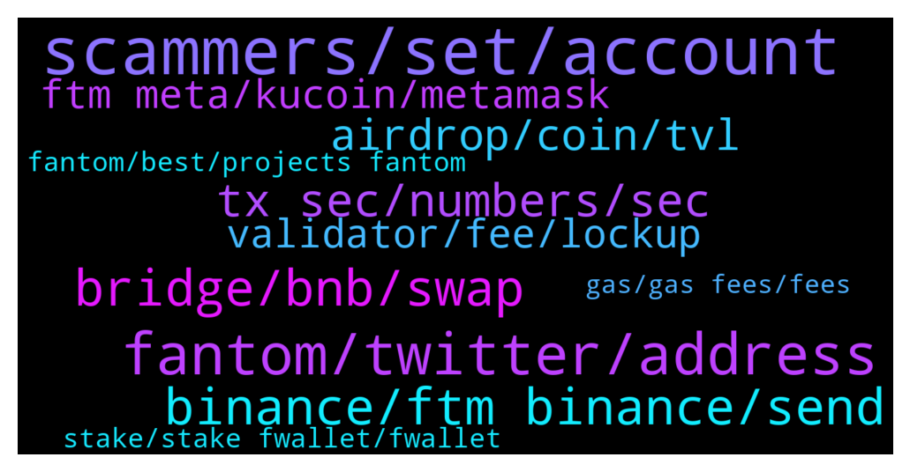

# **@Fantom_English**
 ## Analysis for **2022-01-13** - **2022-01-14**.

---

## 📊 **Basic Stats**

**n_messages_sent**: 399

---

---

## 🔝 **Top keywords and related messages**

1. **scammers, set, account**

    @Ridehi --- *I want legitimate and honest scammer to pm me* **--->** [TG Discussion](https://t.me/Fantom_English/629967)

    @Ridehi --- *I guess you are a newbie scammer, scammers got no time reporting others* **--->** [TG Discussion](https://t.me/Fantom_English/629980)

    @Joe --- *Honest answers please  Scammers f**k off* **--->** [TG Discussion](https://t.me/Fantom_English/630277)

    @Mcjig --- *there are no giveaways. those are all scams* **--->** [TG Discussion](https://t.me/Fantom_English/629230)

    @BigBoyCryptoPants --- *Wow i got 4 scammer after asking a question here* **--->** [TG Discussion](https://t.me/Fantom_English/629392)

    @pluggedIN55 --- *So many scammers even calling me up 😂* **--->** [TG Discussion](https://t.me/Fantom_English/629823)

2. **fantom, twitter, address**

    @gabuarabu --- *It's a validator node . It is very important for the stability of the entire project . And you must own 500k ftm to start one . So ....as these nodes will start to appear , AND THEY WILL , more&more people will realise that fantom is making an offer we can not refuse .* **--->** [TG Discussion](https://t.me/Fantom_English/630900)

    @Jamie --- *I’m not sure how it’ll work, you will need to check his Twitter for more info but I don’t think the exact details are out yet.* **--->** [TG Discussion](https://t.me/Fantom_English/630138)

    @RidgeRacer7 --- *Hi. Just to clarify, when you say details soon from Andre, where exactly will he be posting this info? Twitter? And when you say "not on Fantom" what do you mean? His tweet says the protocol will be launching on Fantom.* **--->** [TG Discussion](https://t.me/Fantom_English/630213)

    @kwfoo24 --- *This is my first time in fantom and metamask. Trying to buy beets.* **--->** [TG Discussion](https://t.me/Fantom_English/629934)

    @kwfoo24 --- *Yup, but why is it confirm button is grey out? I am in fantom chain.* **--->** [TG Discussion](https://t.me/Fantom_English/629926)

    @DT20000 --- *If that’s the case, does slashing risk still exist for Fantom’s official validator?* **--->** [TG Discussion](https://t.me/Fantom_English/630675)

3. **bridge, bnb, swap**

    @Janevietani --- *hello, multichain bridge doesnt have much liquidity , once more liquidity comes, you will get your funds funds are safe , please do not worried. you can check your tx on anyswap explorer anyswap.net  please use app.multichain.xyz in future* **--->** [TG Discussion](https://t.me/Fantom_English/631024)

    @Janevietani --- *bridge it now, spookyswap have 270k FTM liquidity* **--->** [TG Discussion](https://t.me/Fantom_English/629834)

    @nortontop --- *Hey does anyone know where I can bridge my eFTM over to opera network. Spooky swap has no liquidity* **--->** [TG Discussion](https://t.me/Fantom_English/629828)

    @M --- *So i want to bridge my btcb or wbtc on avax to fantom, is anyswap the only bridge to do this? It does seem so? I cant find any other btc bridges to fantom* **--->** [TG Discussion](https://t.me/Fantom_English/630064)

    @gnikits --- *Thank you for your answer. I would like to bridge renbtc and beth which i have in BSC network. But it is ok if i have to swap them in other tokens. Any link that i could find the bridging ways compared to read would be great too and would save the burden i cause here by asking noob questions.* **--->** [TG Discussion](https://t.me/Fantom_English/630837)

    @Mcjig --- *Helpful tip: if you want a cheaper alternative than bridging ftm and paying eth gas From binance or kucoin, get bnb and withdraw as bep20, then use https://swap.spiritswap.finance/#/bridge To bridge bnb bep20 to bnb fantom. Then use spiritswap to swap bnb to ftm spiritswap bridge will also send you 0.4 ftm for gas when bridging (edited)* **--->** [TG Discussion](https://t.me/Fantom_English/629265)

4. **binance, ftm binance, send**

    @Crypto --- *Hi I wanted to transfer my FTM from binance and is has an error message stating FTM network withdrawal suspended. Can anyone let me know how long with will be for? Many thanks 🙏* **--->** [TG Discussion](https://t.me/Fantom_English/629631)

    @Joe --- *I have sent bnb to my address and it went through fine to meta mask  The ftm from Binance  to meta , is this possible  No scammers please* **--->** [TG Discussion](https://t.me/Fantom_English/629229)

    @Lane --- *I just sent my ftm from binance to metamask* **--->** [TG Discussion](https://t.me/Fantom_English/629248)

    @Filippocacchioli --- *Hi admin,  Last night I accidentally sent my FTM, that I had on the BSC network to the general Fantom token address on BSC  instead of sending them on my Binance FTM address    Can I recover my FTM in some way? Tks* **--->** [TG Discussion](https://t.me/Fantom_English/629795)

    @Joe --- *I have done  Should I send the ftm from Binance direct to smart chain or fantom opera* **--->** [TG Discussion](https://t.me/Fantom_English/629174)

    @Joe --- *I just realized a problem how do I connect my meta to Binance* **--->** [TG Discussion](https://t.me/Fantom_English/629194)

5. **tx sec, numbers, sec**

    @Kevarti --- *What about the ftm give away* **--->** [TG Discussion](https://t.me/Fantom_English/629210)

    @Phuongvechai --- *I am long ftm x50, lol* **--->** [TG Discussion](https://t.me/Fantom_English/629738)

    @Joe --- *How is ftm doing so well with no way of getting ftm to there ecosystem* **--->** [TG Discussion](https://t.me/Fantom_English/629246)

    @Mcjig --- *well their wallet shows 1 mil ftm. so hopefully not much longer* **--->** [TG Discussion](https://t.me/Fantom_English/629399)

    @DT20000 --- *Hey guys, new here and have a beginner question. On the website it says totally FTM supply will be 3.175 billion. Does this mean that FTM will never change its mind down the road and raise total supply?* **--->** [TG Discussion](https://t.me/Fantom_English/630642)

    @Jamie --- *Can any kind soul please send over a tiny bit of FTM?* **--->** [TG Discussion](https://t.me/Fantom_English/629800)

6. **airdrop, coin, tvl**

    @Lane --- *Is someone holding a good and promising coin?* **--->** [TG Discussion](https://t.me/Fantom_English/629220)

    @pajamasfreak --- *Depends on what are you holding right now* **--->** [TG Discussion](https://t.me/Fantom_English/630798)

    @Janevietani --- *Fantom foundations doesnt do any airdrop* **--->** [TG Discussion](https://t.me/Fantom_English/630803)

    @stefaan555 --- *is there an airdrop of the new coin of andre cronje? And how to get it?* **--->** [TG Discussion](https://t.me/Fantom_English/630057)

    @Felix --- *how does one takes part in the FTM AirDrop. what exactly do I have to do. your help will be greatly appreciated thanks* **--->** [TG Discussion](https://t.me/Fantom_English/630800)

    @Shaad --- *Truth verse coin I launch have anyone want to buy it* **--->** [TG Discussion](https://t.me/Fantom_English/629952)

7. **ftm meta, kucoin, metamask**

    @Lolotorga --- *because now in my metamaxk instead of ftm I have splp thank you* **--->** [TG Discussion](https://t.me/Fantom_English/630832)

    @Joe --- *Thank you  So is there a a way of getting my ftm to meta mask* **--->** [TG Discussion](https://t.me/Fantom_English/629243)

    @Joe --- *I am not moveing from here or clicking on any links  But how do I get my ftm to meta mask so frustrating* **--->** [TG Discussion](https://t.me/Fantom_English/629167)

    @adekunle_pc --- *So is there a way of getting my ftm to meta mask* **--->** [TG Discussion](https://t.me/Fantom_English/629476)

    @nortontop --- *Hey where to I find the MetaMask contract code for adding the ftm-tomb lp token?* **--->** [TG Discussion](https://t.me/Fantom_English/629849)

    @Joe --- *So I can send my ftm to kucoin then on to metamask* **--->** [TG Discussion](https://t.me/Fantom_English/629258)

8. **validator, fee, lockup**

    @Easiq --- *The site gives an estimation of apr but how do we know which validator this applies to? The validator I got only has 3months lockup* **--->** [TG Discussion](https://t.me/Fantom_English/630968)

    @omega5705 --- *I see. Everybody charges 15%? I'm assuming different validators can change the % they take correct?* **--->** [TG Discussion](https://t.me/Fantom_English/630732)

    @omega5705 --- *That's not my question. So do FTM validators charge a percentage fee of the return? How can I see what each validator charges?* **--->** [TG Discussion](https://t.me/Fantom_English/630729)

    @omega5705 --- *Have a question. Upon delegating FTM to a validator, how can I see what is the % of fee charged?* **--->** [TG Discussion](https://t.me/Fantom_English/630726)

    @Easiq --- *Ah oké, so apr shown regards all’s validator* **--->** [TG Discussion](https://t.me/Fantom_English/630971)

    @m76667 --- *Whats the fee transfering from kucoin to ftm wallet?* **--->** [TG Discussion](https://t.me/Fantom_English/630201)

9. **fantom, best, projects fantom**

    @vangoh1991 --- *any list of fantom dapps ? farming or sth like that* **--->** [TG Discussion](https://t.me/Fantom_English/629664)

    @thunderare --- *What is the best nft project on fantom? What's not sold out already?* **--->** [TG Discussion](https://t.me/Fantom_English/630621)

    @BigBoyCryptoPants --- *where should i invest in fantom eco system?* **--->** [TG Discussion](https://t.me/Fantom_English/629859)

    @Alexyamin --- *Hello, where is the best yield for fantom ?* **--->** [TG Discussion](https://t.me/Fantom_English/629740)

    @shashashashashash --- *what are the good projects on fantom?* **--->** [TG Discussion](https://t.me/Fantom_English/629307)

    @pajamasfreak --- *you can use metamask add /rpc and check out projects.fantom.network for a start* **--->** [TG Discussion](https://t.me/Fantom_English/630637)

10. **stake, stake fwallet, fwallet**

    @Janevietani --- *we dont have one. you can not stake on Kucoin. you can stake on fwallet if you want* **--->** [TG Discussion](https://t.me/Fantom_English/630198)

    @JOHprosperity --- *Are there no community governance to vote for burning?* **--->** [TG Discussion](https://t.me/Fantom_English/630702)

    @Fluffy_Fuse --- *So what is a thornode, never heard of it😬* **--->** [TG Discussion](https://t.me/Fantom_English/630887)

    @stefaan555 --- *I still have them on an exchange. So i need to stake my coins then right* **--->** [TG Discussion](https://t.me/Fantom_English/630134)

    @GanthaMakala --- *hello we can not choose the same delegation for staker please?  do we have to change every time?* **--->** [TG Discussion](https://t.me/Fantom_English/630044)

    @Janevietani --- *you can stake it on fwallet, Yearn or Tarot i think* **--->** [TG Discussion](https://t.me/Fantom_English/630206)

