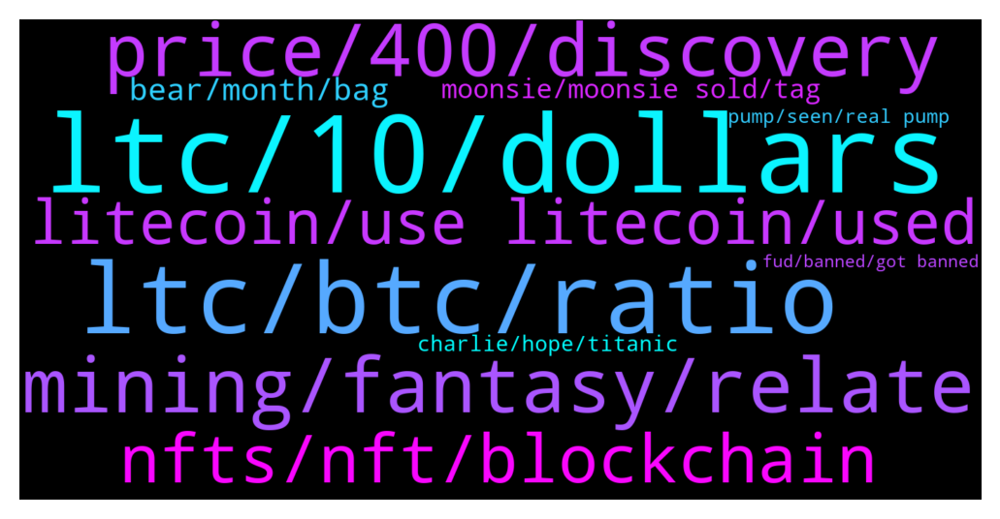

# **@Litecoin**
 ## Analysis for **2022-01-13** - **2022-01-14**.

---

## 📊 **Basic Stats**

**n_messages_sent**: 762

---

---

## 🔝 **Top keywords and related messages**

1. **ltc, 10, dollars**

    @khalid --- *Ltc will get dumped soon dont worry* **--->** [TG Discussion](https://t.me/Litecoin/2045326)

    @ck42069 --- *Look man LTC went outside of the top 5 then top 10 then top 20* **--->** [TG Discussion](https://t.me/Litecoin/2046183)

    @moonsie --- *i had 30000 ltc at one point* **--->** [TG Discussion](https://t.me/Litecoin/2045773)

    @CookieSlayer --- *Why even do it, if LTC has sound fundamentals...* **--->** [TG Discussion](https://t.me/Litecoin/2046071)

    @CryptoLegalLawyer --- *Banning who are good for LTC  and supporting who are against LTC  it seems like traitors are into admin itself* **--->** [TG Discussion](https://t.me/Litecoin/2046132)

    @RorschachTesst --- *Ultimately one of the groups will be proven right and by no means will I label myself a staunch LTC supporter I hope nothing else in the world than to be proven wrong so I can retire this year lol* **--->** [TG Discussion](https://t.me/Litecoin/2046597)

2. **ltc, btc, ratio**

    @jrx486 --- *ltc needs to break loose from btc* **--->** [TG Discussion](https://t.me/Litecoin/2046673)

    @coblee --- *LTC always perform worse than BTC except for a few occassions when it blows everything else away.* **--->** [TG Discussion](https://t.me/Litecoin/2046331)

    @TonyNakamoto --- *BTC and LTC r 10+ yrs olB th0* **--->** [TG Discussion](https://t.me/Litecoin/2046255)

    @Macro5674 --- *Ltc/btc right now is fight it out against the tide ! Rare !* **--->** [TG Discussion](https://t.me/Litecoin/2046671)

    @jrx486 --- *The resistance on LTC is because it touched 100 GBP (pound sterling). This won’t hold.* **--->** [TG Discussion](https://t.me/Litecoin/2045630)

    @Azkha --- *LTC always loose from BTC bain* **--->** [TG Discussion](https://t.me/Litecoin/2045240)

3. **mining, fantasy, relate**

    @Jim --- *What do you think about cryptos future next months ? Sp500 press cryptos* **--->** [TG Discussion](https://t.me/Litecoin/2046481)

    @moonsie --- *i will just hold on whatever i have left and get out of all crypto if it ever comes close to its former highs* **--->** [TG Discussion](https://t.me/Litecoin/2045885)

    @RorschachTesst --- *How difficult is it to release frequent updates? Isn't crypto  decentralized and community driven? I hardly see any community engagement or even a whiff of what your long term plans are* **--->** [TG Discussion](https://t.me/Litecoin/2046434)

    @DJFrohFace --- *Ok crypto legal lawyer Henry Collimbs* **--->** [TG Discussion](https://t.me/Litecoin/2046144)

    @ck42069 --- *Crypto has no real products and everything is abstract.* **--->** [TG Discussion](https://t.me/Litecoin/2046530)

    @arnego2 --- *Not me. I went to crypto in 2015 but also as a newbie took a bad wallet. Exitscam* **--->** [TG Discussion](https://t.me/Litecoin/2046263)

4. **price, 400, discovery**

    @jrx486 --- *might never happen. Lowest LTCUSD price, by year 2015 - $1.12 2016 - $3.02 2017 - $3.66 2018 - $23.10 2019 - $30.11 2020 - $30.23 2021 - $107.82 2022 - ???* **--->** [TG Discussion](https://t.me/Litecoin/2046661)

    @E --- *Had 500 ltc when it reached $400.  Should have sold too 🥲* **--->** [TG Discussion](https://t.me/Litecoin/2045769)

    @nltox --- *200 usd as floor before mimblewimble would be awesome* **--->** [TG Discussion](https://t.me/Litecoin/2046746)

    @shahabszd --- *7000$ is very close, believe me* **--->** [TG Discussion](https://t.me/Litecoin/2045364)

    @moonsie --- *there is very little chance of ever seeing $400 again, it has become reinforced concrete resistance* **--->** [TG Discussion](https://t.me/Litecoin/2045738)

    @moonsie --- *hopefully mimblewimble will propel it to $400 and i am out* **--->** [TG Discussion](https://t.me/Litecoin/2045987)

5. **nfts, nft, blockchain**

    @RorschachTesst --- *Focus on one thing: payment medium and go all out on that shit. No point chasing NFTs, a new trend will emerge in 6 months. Instead try to diversify from PayPal into uber or whatever I don't know. We are meant to be a payment medium nothing else* **--->** [TG Discussion](https://t.me/Litecoin/2046462)

    @RabbitL0v3r --- *NFT is just a hash of a contract address and a token id Without a central authority to say which contract is the real one, it has 0 value* **--->** [TG Discussion](https://t.me/Litecoin/2046870)

    @morningzone --- *Every company wanted to implement whatever-blockchain cos it was hyped buzzword. Now same is happening with NFT; all these big companies launching their own "NFTs" which are not even NFTs.* **--->** [TG Discussion](https://t.me/Litecoin/2046843)

    @RorschachTesst --- *What do you mean blockchain? Its just another token except that its non-fungible. I agree that every new chain is targeting NFTs but erc72 tokens are powerful enough without needing any side chains* **--->** [TG Discussion](https://t.me/Litecoin/2046841)

    @JohnTheApostle --- *NFT is like Blockchain  Everyone wants it applied to everything but their own version of it* **--->** [TG Discussion](https://t.me/Litecoin/2046833)

    @nltox --- *nfts are just good for money laundry not more kek* **--->** [TG Discussion](https://t.me/Litecoin/2046827)

6. **litecoin, use litecoin, used**

    @arnego2 --- *Because the people lack vision. Real use is with Litecoin a reality. Is used to lower fees. A few tools and people can relate.* **--->** [TG Discussion](https://t.me/Litecoin/2046533)

    @Holamixy --- *Please what is the minimum confirmation for litecoin* **--->** [TG Discussion](https://t.me/Litecoin/2045210)

    @morningzone --- *The Litecoin Foundation mandated Quarkslab to audit the implementation of the MimbleWimble protocol in the Litecoin blockchain. This protocol acts as a sidechain in which privacy of the transactions is improved compared to the privacy on the classical chain.  https://blog.quarkslab.com/audit-of-the-mimblewimble-integration-inside-litecoin.html* **--->** [TG Discussion](https://t.me/Litecoin/2045621)

    @coblee --- *comparing ATHs is pretty silly. Litecoin has been in an uptrend for 10 years. Yes, it hasn’t performed crazy like some shitcoins and have not outperformed Bitcoin. But it is what it is. I always tell people to diversify. No need to be attached to one single coin even Litecoin.* **--->** [TG Discussion](https://t.me/Litecoin/2045857)

    @Jim --- *How many lines of code litecoin has in total?* **--->** [TG Discussion](https://t.me/Litecoin/2046441)

    @Mayaserrrbe --- *Litecoin all the way. If there is one coin I am positive about it is litecoin* **--->** [TG Discussion](https://t.me/Litecoin/2045589)

7. **bear, month, bag**

    @jrx486 --- *in a year? sh*t. i was hoping somewhere over the next weeks.* **--->** [TG Discussion](https://t.me/Litecoin/2046362)

    @moonsie --- *everyone knows about it. it will do the opposite of what everone expects.* **--->** [TG Discussion](https://t.me/Litecoin/2045810)

    @ck42069 --- *Big bear is in the house* **--->** [TG Discussion](https://t.me/Litecoin/2046483)

    @moonsie --- *maybe novogratz looking for a bag to short* **--->** [TG Discussion](https://t.me/Litecoin/2045949)

    @ck42069 --- *No bro I think this will go sideways for a year* **--->** [TG Discussion](https://t.me/Litecoin/2046174)

    @KisakiTetta39 --- *Already mid of the month 🥺* **--->** [TG Discussion](https://t.me/Litecoin/2046647)

8. **moonsie, moonsie sold, tag**

    @ck42069 --- *Look at him his profile picture is black. I feel bad for moonsie.* **--->** [TG Discussion](https://t.me/Litecoin/2046126)

    @Pablocality --- *Moonsie please lighten up on the fud* **--->** [TG Discussion](https://t.me/Litecoin/2045730)

    @Carlos_PRO_Holder --- *Do not do that to moonsie, he is right!* **--->** [TG Discussion](https://t.me/Litecoin/2046307)

    @Carlos_PRO_Holder --- *Moonsie is just a victim like me, we believe in Litecoin, it is our mistake* **--->** [TG Discussion](https://t.me/Litecoin/2046312)

    @ck42069 --- *Yo moonsie what do you say mate* **--->** [TG Discussion](https://t.me/Litecoin/2046104)

    @ck42069 --- *You were a living meme moonsie it was nice knowing you friend* **--->** [TG Discussion](https://t.me/Litecoin/2045204)

9. **charlie, hope, titanic**

    @guallpa321 --- *What? I was just asking a question lmao 😂 I was reading the comments and charlie lee name was being mentioned frequently* **--->** [TG Discussion](https://t.me/Litecoin/2046594)

    @CarmenC20 --- *Good night, I hope I don't disturb you with my message, I am a single mother and the situation has led me to sell hot content, if there is anyone interested, write to me privately, have a nice night* **--->** [TG Discussion](https://t.me/Litecoin/2046925)

    @CoinLoin --- *But Bobby said the bull run is back on..?* **--->** [TG Discussion](https://t.me/Litecoin/2045726)

    @coblee --- *still doesn’t make sense to me. give me an example* **--->** [TG Discussion](https://t.me/Litecoin/2046342)

    @robbSB --- *“Charlie, can I speak to your manager?”* **--->** [TG Discussion](https://t.me/Litecoin/2045868)

    @RorschachTesst --- *Charlie please do an AMA. Thank you* **--->** [TG Discussion](https://t.me/Litecoin/2046571)

10. **pump, seen, real pump**

    @🔺ᬼ⃝ℝ🔺 --- *If it dumping for 50$ again I don't buy also if it pumping for 250 $ I don't sell I holded (12.37LTC) for 500$ If hit 500$ I say bye LTC if not like that I leave my Kucoin  until Thier company will close* **--->** [TG Discussion](https://t.me/Litecoin/2045357)

    @ck42069 --- *Only if you can withstand maximum pain you can witness the maximum pumpage similar to dogecoin* **--->** [TG Discussion](https://t.me/Litecoin/2045193)

    @ck42069 --- *Ok guys now that we have redistributed everything on the last exit liquidity pump* **--->** [TG Discussion](https://t.me/Litecoin/2045993)

    @bake_Crypto --- *Max pain u say?? Nobody I know could hold the doge pump, many short this shit on the way up. It was just insane* **--->** [TG Discussion](https://t.me/Litecoin/2045219)

    @Macro5674 --- *I have seen it when it's real pump/breakout ltc pumps crazy fast !* **--->** [TG Discussion](https://t.me/Litecoin/2046744)

    @ck42069 --- *Yesterday I was selling and telling evetyone that there will be a pump* **--->** [TG Discussion](https://t.me/Litecoin/2046016)

