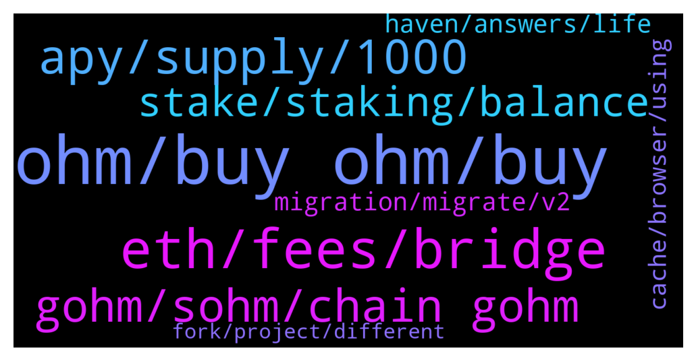

# **@OlympusTG**
 ## Analysis for **2022-01-13** - **2022-01-14**.

---

## 📊 **Basic Stats**

**n_messages_sent**: 641

---

---

## 🔝 **Top keywords and related messages**

1. **ohm, buy ohm, buy**

    @Mine --- *Hello guys, Please can someone assist me with the steps to obtain ohm through Avalanche* **--->** [TG Discussion](https://t.me/OlympusTG/150348)

    @u37185 --- *Hi All, what’s the cheapest way to buy Ohm? Also I should buy v2 right? Thanks* **--->** [TG Discussion](https://t.me/OlympusTG/149377)

    @Chad --- *Just bought 28.5 OHM and stakes today* **--->** [TG Discussion](https://t.me/OlympusTG/150184)

    @huangkaoya --- *hello， why ohm's riskfree assets went down rapidly yesterday?* **--->** [TG Discussion](https://t.me/OlympusTG/149267)

    @Hele_beger --- *I was going through Ohm's page and I saw a trend on borrowing Ohm to create more Ohm* **--->** [TG Discussion](https://t.me/OlympusTG/149431)

    @Leny --- *is a g-ohm the same price a a ohm ie approx 200 usd* **--->** [TG Discussion](https://t.me/OlympusTG/149790)

2. **eth, fees, bridge**

    @Mannish_Boy --- *done… the bridging isnt working for me though. Not arbitrum either. Maybe I need to try another browser?* **--->** [TG Discussion](https://t.me/OlympusTG/150397)

    @nfwaple --- *if they're buying a lot, the liquidity on ETH may be better* **--->** [TG Discussion](https://t.me/OlympusTG/149255)

    @Bob_Crypto_Builder --- *How do I turn it from eth* **--->** [TG Discussion](https://t.me/OlympusTG/149897)

    @Leny --- *thats why i seel all my eth so they rob me blind before i leave* **--->** [TG Discussion](https://t.me/OlympusTG/149649)

    @nfwaple --- *no need to bridge them now if you're just holding though, you can bridge in the future* **--->** [TG Discussion](https://t.me/OlympusTG/149419)

    @Eli --- *Hi guys , question here please, are ether high forever?  Or it’s a temporary thing ? Smart contact is so expensive I could spend 1k on 6 contracts :(,* **--->** [TG Discussion](https://t.me/OlympusTG/149382)

3. **apy, supply, 1000**

    @OGCryptoo --- *You should consider that the APY is continuously dropping until it reflects what the protocol is actually earning.* **--->** [TG Discussion](https://t.me/OlympusTG/150255)

    @nfwaple --- *the first link, scroll down to see APY over time* **--->** [TG Discussion](https://t.me/OlympusTG/149619)

    @Leny --- *its hard to get the bad boy apy for sure* **--->** [TG Discussion](https://t.me/OlympusTG/149693)

    @Ap0l1o --- *If the APY remains the same (it shouldn’t) and you start with 1 sOhm, after one year you would have 51 sOhm* **--->** [TG Discussion](https://t.me/OlympusTG/149836)

    @TurboLaserClip --- *5k apy? is it because of people not stacking?* **--->** [TG Discussion](https://t.me/OlympusTG/149162)

    @nfwaple --- *you have to do the estimation yourself, it's hard to estimate the APY as it changes, you can use this as a reference though https://twitter.com/OberonSky/status/1457003045078843395* **--->** [TG Discussion](https://t.me/OlympusTG/149336)

4. **gohm, sohm, chain gohm**

    @nfwaple --- *gohm is v2m wsohm is v1* **--->** [TG Discussion](https://t.me/OlympusTG/150424)

    @liu --- *Does that mean Gohm is better?* **--->** [TG Discussion](https://t.me/OlympusTG/150198)

    @Mine --- *Pls what's the diff with wsOHM and gOHM* **--->** [TG Discussion](https://t.me/OlympusTG/150423)

    @nfwaple --- *you can buy gOHM on other chain, gOHM gets the same APY as staking OHM* **--->** [TG Discussion](https://t.me/OlympusTG/149393)

    @Pol --- *Morning Ohmies! I'm thinking to unwrap my gOHM. I will lose some advantage if just I have sOHM?* **--->** [TG Discussion](https://t.me/OlympusTG/149484)

    @Pol --- *Dunno i'm typical boomer that feels better if sOHM appear on the balance. 😂* **--->** [TG Discussion](https://t.me/OlympusTG/149494)

5. **stake, staking, balance**

    @KrAl086 --- *Benim için ohm alıp nasıl stake edebileceğim nasıl aktarabilecegim konusunda bir vidyo bulunuyormu* **--->** [TG Discussion](https://t.me/OlympusTG/149994)

    @samboan --- *Like the stake button is not showing* **--->** [TG Discussion](https://t.me/OlympusTG/149519)

    @samboan --- *I connected wallet but cant see the numbers of my staking info* **--->** [TG Discussion](https://t.me/OlympusTG/149514)

    @Eli --- *I have phantom set up but my funds are ether and bnb and am staked through ether contract, gotta start going away from ether* **--->** [TG Discussion](https://t.me/OlympusTG/149412)

    @nfwaple --- *I see, please give the stake page a few seconds, it might take time to load* **--->** [TG Discussion](https://t.me/OlympusTG/149574)

    @safuking --- *then how they going to stake* **--->** [TG Discussion](https://t.me/OlympusTG/149922)

6. **migration, migrate, v2**

    @Toddh909 --- *Thanks for replying. Then what is the point of migration? I just see it as a unnecessary fee for myself. Especially now for gas* **--->** [TG Discussion](https://t.me/OlympusTG/150046)

    @Toddh909 --- *Is there a expiry date to migrate?or no deadline* **--->** [TG Discussion](https://t.me/OlympusTG/150044)

    @TNrafi2109 --- *When the migration will be completed?* **--->** [TG Discussion](https://t.me/OlympusTG/150264)

    @Ap0l1o --- *Yes, couple of clicks to approve then migrate. For me the costs were around 40$, 12$ for approval and 26$ for the migration.* **--->** [TG Discussion](https://t.me/OlympusTG/150022)

    @theMagicUnicorn --- *people who understand the hard work of migration and the overall big picture benefit of everything going on right now in this process they can easily feel at ease and not be flustered by temporary technical issues, quite the contrary, its all very exciting now* **--->** [TG Discussion](https://t.me/OlympusTG/149283)

    @Eli --- *Oh right , yeah am not planning to do anything but make sure am not left behind when migrating happens, and I thought because I have not migrated yet the yield and roi is na* **--->** [TG Discussion](https://t.me/OlympusTG/149424)

7. **haven, answers, life**

    @Baby_Grinch --- *Now you know how I feel.* **--->** [TG Discussion](https://t.me/OlympusTG/149383)

    @saitalover --- *I'm going to try to see, and I'll tell you throughout the day. Thanks mate.* **--->** [TG Discussion](https://t.me/OlympusTG/149581)

    @theMagicUnicorn --- *^ this might help as well* **--->** [TG Discussion](https://t.me/OlympusTG/149339)

    @Toddh909 --- *Thats fair. Thank you clearsight for the answers* **--->** [TG Discussion](https://t.me/OlympusTG/150060)

    @Cali_millionaire --- *I honestly replied to a posted question* **--->** [TG Discussion](https://t.me/OlympusTG/150163)

    @Hele_beger --- *You gave a comprehensive detail and the community seems active. I like this* **--->** [TG Discussion](https://t.me/OlympusTG/149479)

8. **cache, browser, using**

    @Bracin --- *Please help I’m having same issue right now and I tried clearing my cache too* **--->** [TG Discussion](https://t.me/OlympusTG/149515)

    @cdp279 --- *Just try clear cache, refresh reconnect.* **--->** [TG Discussion](https://t.me/OlympusTG/149178)

    @Ap0l1o --- *Try opening the page from the metamask browser* **--->** [TG Discussion](https://t.me/OlympusTG/149258)

    @nfwaple --- *go to your browser, settings, then if there is a search bar in settings, search cache* **--->** [TG Discussion](https://t.me/OlympusTG/149512)

    @nfwaple --- *are you using metamask? have you tried clearing cache and using desktop version?* **--->** [TG Discussion](https://t.me/OlympusTG/149502)

    @nfwaple --- *have you tried clearing browser cache?* **--->** [TG Discussion](https://t.me/OlympusTG/149510)

