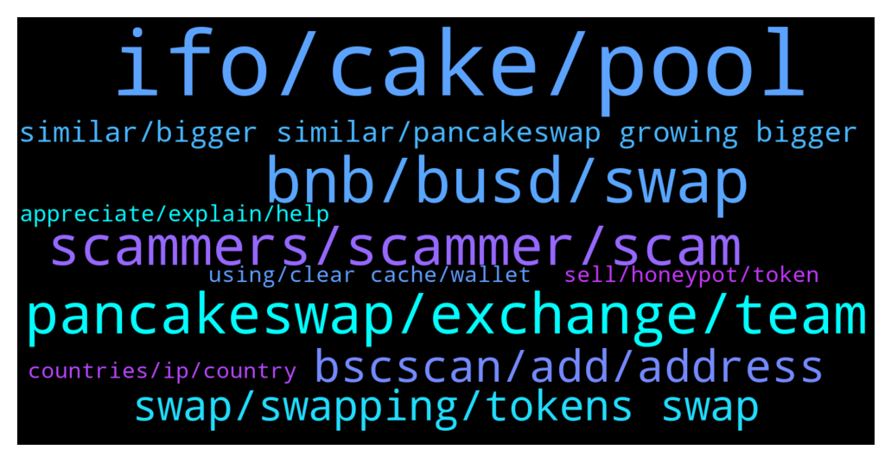

# **@PancakeSwap**
 ## Analysis for **2022-01-13** - **2022-01-14**.

---

## 📊 **Basic Stats**

**n_messages_sent**: 1692

---

---

## 🔝 **Top keywords and related messages**

1. **ifo, cake, pool**

    @RangerApos --- *By interacting with smart contracts via Bscscan (without Pancakeswap interface), you can get your cakes back from PancakeSwap Manual Stake Cake Earn Cake (Core Pool)  For this, you have to interact with Masterchef, which manages the entire staking process.  First, go to the Write tab of the Masterchef Contract at bscscan  https://bscscan.com/address/0x73feaa1ee314f8c655e354234017be2193c9e24e#writeContract  Connect your web3 wallet (technically works with all wallets) to the page by clicking [🔴]Connect to Web3  Type 0 in the emergencyWithdraw box in the 4th row  Click on Write and confirm the txn transaction in your wallet plugin, after your transaction is confirmed on the network, all your Cakes are in your wallet.  You can follow this video for guide: https://www.youtube.com/watch?v=3cFrr3dFeOo  Unfortunately, if you do emergencyWithdraw, you say goodbye to your rewards forever.* **--->** [TG Discussion](https://t.me/PancakeSwap/2271172)

    @King2850 --- *Hello good time I had a question, can we use the same amount of cake that we put in ifo. Stake in the pools section without leaving ifo?* **--->** [TG Discussion](https://t.me/PancakeSwap/2268210)

    @Beni_hs --- *All my asset was in  *auto cake* pool* **--->** [TG Discussion](https://t.me/PancakeSwap/2270081)

    @HAITIENLK --- *you can swap after IFO ended* **--->** [TG Discussion](https://t.me/PancakeSwap/2271970)

    @fomoebit --- *my ifo credit doesnt go up, its stable, i stake from 26.12.2021* **--->** [TG Discussion](https://t.me/PancakeSwap/2267910)

    @Ajiky93 --- *Pls i need Enlightenment of IFO* **--->** [TG Discussion](https://t.me/PancakeSwap/2268656)

2. **bnb, busd, swap**

    @xandercakes --- *No, cause 0.06 FRE is equal to 1 BNB according to your example* **--->** [TG Discussion](https://t.me/PancakeSwap/2267790)

    @jaskymillz --- *Please what’s the minimum amount of bnb you must have in wallet before you can make a swap* **--->** [TG Discussion](https://t.me/PancakeSwap/2269419)

    @BroSomeone --- *When your adding liquidity for a token and it says(example not actual thing)  0.06FRE=1BNB If I swap 0.06 FRE will I actually get 1 bnb?* **--->** [TG Discussion](https://t.me/PancakeSwap/2267786)

    @Aosh1ma --- *First *0 bnb* because Its Smart contract call.* **--->** [TG Discussion](https://t.me/PancakeSwap/2272454)

    @Aladdin_21 --- *I swapped bnb to safemoon but got safemoondividend instead* **--->** [TG Discussion](https://t.me/PancakeSwap/2270801)

    @adebayo --- *Hi guys can you please  help me I have 2.2 bnb on my trust wallet and I wanted to swap for a token but is telling me insufficient bnb balance for the gas fees. Am totally confused i have 2.2 and I wanted to use only 2* **--->** [TG Discussion](https://t.me/PancakeSwap/2271825)

3. **pancakeswap, exchange, team**

    @jaskymillz --- *Hi guys, please am new to pancakeswap* **--->** [TG Discussion](https://t.me/PancakeSwap/2269416)

    @vvmdov --- *That was my first time using Metamask and Pancakeswap. How is it possible?* **--->** [TG Discussion](https://t.me/PancakeSwap/2267185)

    @WatanabeKika --- *Is there any way to reduce impermanentlosses on pancakes* **--->** [TG Discussion](https://t.me/PancakeSwap/2273482)

    @hotgarbage --- *This means pancakeswap is contradicting itself.* **--->** [TG Discussion](https://t.me/PancakeSwap/2268974)

    @Tina --- *Maybe the problem is with PancakeSwap!* **--->** [TG Discussion](https://t.me/PancakeSwap/2271617)

    @snel --- *what is the pancakeswap website? helpdesk???* **--->** [TG Discussion](https://t.me/PancakeSwap/2273329)

4. **scammers, scammer, scam**

    @greenherbs --- *Lots of scammers here wow incredible* **--->** [TG Discussion](https://t.me/PancakeSwap/2269591)

    @vvmdov --- *Thanks for the response. I just tried to sell them. Why would I send there?* **--->** [TG Discussion](https://t.me/PancakeSwap/2267164)

    @Godbabybeby --- *You shouldn't have done that there all scammers claiming to be customer service or support* **--->** [TG Discussion](https://t.me/PancakeSwap/2273625)

    @sentientAlpha --- *very impressed with this group, the moment I joined some scammer called me from "support"* **--->** [TG Discussion](https://t.me/PancakeSwap/2273553)

    @ahmedmaanis --- *so many scammers messaging me since i joined here* **--->** [TG Discussion](https://t.me/PancakeSwap/2269101)

    @Chris --- *U said they never call? But they just called me 4 times* **--->** [TG Discussion](https://t.me/PancakeSwap/2268505)

5. **bscscan, add, address**

    @EvlVega --- *every one you add gives a warning like "anyone can create a bsc contract..please ensure this is the correct contract address"* **--->** [TG Discussion](https://t.me/PancakeSwap/2269698)

    @vladpronin --- *You can find it on bscscan.com* **--->** [TG Discussion](https://t.me/PancakeSwap/2270711)

    @Hussein_Adib --- *Thanks buddy, but I think it's not on bsc, there is too much gas* **--->** [TG Discussion](https://t.me/PancakeSwap/2271544)

    @HAITIENLK --- *you can see it on bscscan.com bro. you need add token, follow thiss https://t.me/PancakeSwap/2268744* **--->** [TG Discussion](https://t.me/PancakeSwap/2268760)

    @Aosh1ma --- *as you can see, you received 0.071WBNB ser  Bscscan doesn't work well on shows WBNB on transfers you can check your ballance via directly our swap or bitquery explorer  https://explorer.bitquery.io/bsc/tx/0x914ec2b18db8c92920e3fa6f31b6663123d8fa5ff9f3c4039feb60f3109dde2b/transfers* **--->** [TG Discussion](https://t.me/PancakeSwap/2270942)

    @Jeff --- *Nothing found on BSCscan. Transaction shows up on Etherscan* **--->** [TG Discussion](https://t.me/PancakeSwap/2273709)

6. **swap, swapping, tokens swap**

    @Danny0TG --- *Hello admin please I need assistance on how to swap my Bep20 tokens* **--->** [TG Discussion](https://t.me/PancakeSwap/2269487)

    @Ceddi200 --- *If it’s a scam coin. They could take your busd etc  whenever you swap. Use https://unrekt.net/ you can revoke the privileges on this tool if you give allowance* **--->** [TG Discussion](https://t.me/PancakeSwap/2268956)

    @bumbumqueen --- *Hello I tried swapping but all I got is error message* **--->** [TG Discussion](https://t.me/PancakeSwap/2273662)

    @xandercakes --- *Yea cause you'll be swapping against your own funds.* **--->** [TG Discussion](https://t.me/PancakeSwap/2267972)

    @HAITIENLK --- *You need ask team of that token about condition to swap.* **--->** [TG Discussion](https://t.me/PancakeSwap/2268549)

    @MyLovenguyen --- *6 days ago I couldn't, somehow it's still locked and now I'm trying to ask if it can be swapped, I'm afraid of what happened 6 days ago* **--->** [TG Discussion](https://t.me/PancakeSwap/2270823)

7. **similar, bigger similar, pancakeswap growing bigger**

    @CakeCompounder --- *We've enabled IP block at some countries. Belarus is one of those.  As PancakeSwap is growing bigger, similar to other major trading platforms, it has to comply with legal requirements to continue providing service.* **--->** [TG Discussion](https://t.me/PancakeSwap/2270538)

    @Aosh1ma --- *We've enabled IP block for some countries. As PancakeSwap is growing bigger, similar to other major trading platforms, it has to comply with legal requirements to continue providing our service.  These countries will be affected:  Belarus - BY Burma(Myanmar) - MM, Cote D'Ivoire (Ivory Coast) - CI Cuba - CU Democratic Republic of Congo - CD, Iran - IR Iraq - IQ Liberia - LR North Korea - KP Sudan - SD Syria - SY Zimbabwe - ZW* **--->** [TG Discussion](https://t.me/PancakeSwap/2273237)

    @RangerApos --- *This is list of countries that no longer have IP access to pancakeswap, are you in one of them?  Belarus - BY Burma(Myanmar) - MM, Cote D'Ivoire (Ivory Coast) - CI Cuba - CU Democratic Republic of Congo - CD, Iran - IR Iraq - IQ Liberia - LR North Korea - KP Sudan - SD Syria - SY Zimbabwe - ZW* **--->** [TG Discussion](https://t.me/PancakeSwap/2271230)

    @CakeCompounder --- *We've enabled IP block for some countries. As PancakeSwap is growing bigger, similar to other major trading platforms, it has to comply with legal requirements to continue providing our service.  These countries will be affected:  Belarus - BY Burma(Myanmar) - MM, Cote D'Ivoire (Ivory Coast) - CI Cuba - CU Democratic Republic of Congo - CD, Iran - IR Iraq - IQ Liberia - LR North Korea - KP Sudan - SD Syria - SY Zimbabwe - ZW* **--->** [TG Discussion](https://t.me/PancakeSwap/2272254)

    @Aosh1ma --- *We've enabled IP block at some countries. Belarus is one of those.  As PancakeSwap is growing bigger, similar to other major trading platforms, it has to comply with legal requirements to continue providing service.* **--->** [TG Discussion](https://t.me/PancakeSwap/2270969)

    @Ceddi200 --- *We've enabled IP block. Official answer to the users about it : As PancakeSwap is growing bigger, similar to other major trading platforms, it has to comply with legal requirements to continue providing service.  Belarus - BY Burma(Myanmar) - MM, Cote D'Ivoire (Ivory Coast) - CI Cuba - CU Democratic Republic of Congo - CD, Iran - IR Iraq - IQ Liberia - LR North Korea - KP Sudan - SD Syria - SY Zimbabwe - ZW* **--->** [TG Discussion](https://t.me/PancakeSwap/2273778)

8. **appreciate, explain, help**

    @EvlVega --- *ok..thanks for your help.  i appreciate it.* **--->** [TG Discussion](https://t.me/PancakeSwap/2269728)

    @chips_B --- *now without taking u guys valuable time i want to ask u a simple and fast question since im lazy to go through docs* **--->** [TG Discussion](https://t.me/PancakeSwap/2269865)

    @SecuestPcs --- *Please explain your issue in detail and as clearly as possible - we can’t read your mind.* **--->** [TG Discussion](https://t.me/PancakeSwap/2269934)

    @Coco --- *Then what I have to do* **--->** [TG Discussion](https://t.me/PancakeSwap/2269177)

    @TomorrowlandForLife --- *what are you talking about and to whom exactly?* **--->** [TG Discussion](https://t.me/PancakeSwap/2273402)

    @TomorrowlandForLife --- *I'm sorry, I don't understand What do you want to do exactly?* **--->** [TG Discussion](https://t.me/PancakeSwap/2267306)

9. **using, clear cache, wallet**

    @HAITIENLK --- *Please explain your issue in detail and as clearly as possible - we can’t read your mind. ⁃ Which wallet are you using? ⁃ Which type of device are you using? ⁃ Which browser are you using? ⁃ What exactly do you need assistance for? ⁃ What error are you getting?* **--->** [TG Discussion](https://t.me/PancakeSwap/2271945)

    @Ro --- *I try since 3 days ago. Just reinstalled the wallet. Same issue* **--->** [TG Discussion](https://t.me/PancakeSwap/2272353)

    @eddd1111 --- *No it doesn't work  On my wallet and web site* **--->** [TG Discussion](https://t.me/PancakeSwap/2268806)

    @ManBlyat --- *Make sure you Connect with right wallet* **--->** [TG Discussion](https://t.me/PancakeSwap/2270181)

    @Aosh1ma --- *Please explain your issue in detail and as clearly as possible - we can’t read your mind.   ⁃ Which wallet are you using?   ⁃ Which type of device are you using?  ⁃ Which browser are you using?   ⁃ What exactly do you need assistance for?* **--->** [TG Discussion](https://t.me/PancakeSwap/2269511)

    @tm --- *I verified my wallet. It gives me a qr code* **--->** [TG Discussion](https://t.me/PancakeSwap/2271469)

10. **countries, ip, country**

    @maAlmaliky --- *How can I be sure that my country is banned?* **--->** [TG Discussion](https://t.me/PancakeSwap/2270983)

    @Mmdzad75961 --- *Why Blocked Irani's Ip In Pcs !!!!!* **--->** [TG Discussion](https://t.me/PancakeSwap/2270448)

    @CakeCompounder --- *Yes. As far as we know. These countries will be affected.   Belarus - BY Burma(Myanmar) - MM, Cote D'Ivoire (Ivory Coast) - CI Cuba - CU Democratic Republic of Congo - CD, Iran - IR Iraq - IQ Liberia - LR North Korea - KP Sudan - SD Syria - SY Zimbabwe - ZW* **--->** [TG Discussion](https://t.me/PancakeSwap/2271592)

    @hooman0994 --- *chill about what sir? u have blocked some countries IP thats  againt decentrelized! how can ur team explain this?* **--->** [TG Discussion](https://t.me/PancakeSwap/2270565)

    @Vengeful_one_13 --- *ask who ? from today PCS  block my country ips , what happened ?* **--->** [TG Discussion](https://t.me/PancakeSwap/2272206)

    @hotgarbage --- *Why the website became geo restricted* **--->** [TG Discussion](https://t.me/PancakeSwap/2270571)

