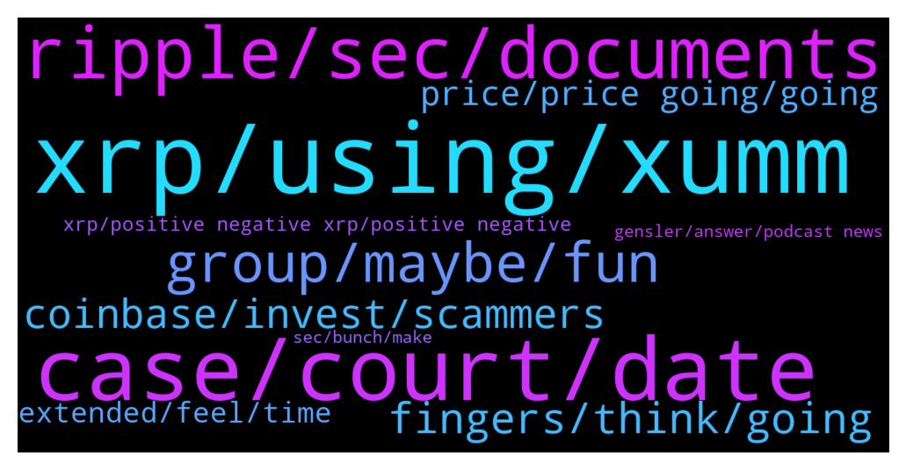

# **@Ripple**
 ## Analysis for **2022-01-13** - **2022-01-14**.

---

## 📊 **Basic Stats**

**n_messages_sent**: 236

---

---

## 🔝 **Top keywords and related messages**

1. **xrp, using, xumm**

    @triplet45 --- *Do u guys think xrp will cross 100$ mark?* **--->** [TG Discussion](https://t.me/Ripple/3040195)

    @JesusJames --- *Welcome here! 😃 PLEASE READ BEFORE POSTING.  👉 @Ripple: general chat about the XRP token & Ripple 👉 @XRPStarters: beginner's questions 👉 @XRPTraders: chart & market analysis only 👉 @XRPOffTopic: hmmm…  THERE ARE NO GIVEAWAYS or 'COMMUNITY REDISTRIBUTION PROGRAMS'!!!  ENGLISH only in here! Chinese 欢迎中国的朋友如果你想加入中文群请加入: @RippleCN Deutsch: @RippleDE Italian: @RippleIT Russian: @RippleRU Turkish: @RippleTurkiye Dutch: @XRP_dutch Portuguese: @RippleBR Spanish: @RippleEspanol India: @XRP_India Indonesia: @xrp589armyindonesia OTHER GROUPS might be SCAM GROUPS. WATCH OUT  Link to this group: ➡️ https://telegram.me/Ripple   Please set a profile image/avatar and a @username in Telegram (don't forget to make both visible: https://t.me/Ripple/1704301)  FREQUENT QUESTIONS & ANSWERS - READ FIRST, PLEASE:  👉 @TermsConditions for posting  👉 What is XRP/Ripple? a) youtu.be/PmQBrMIwNRk?t=3460 b) xrpcommunity.blog/the-basics-of-xrp/  ❓"Which wallet to use?" ℹ️ We strongly discourage: a) storing your tokens on exchanges or 'custodial wallets' instead of YOUR OWN wallet, but KEEP your PRIVATE KEY SAFE!! b) Avoid all the fake wallets, 'online wallets' etc. -WATCH OUT! We can recommend the following options: Hardware: Ledger Nano Desktop: Github.com/rippex , Exodus Online: GateHub.net Paper Wallet: xrppaperwallet.com, github.com/jatchili/minimalist-ripple-client How-to for the above: bit.ly/xrpmini Android, IOS: Xumm Wallet ( www.xumm.app ). Toast Wallet = outdated!  ❓"Where to buy XRP?" ℹ️ Enter /t in the chat  ❓"Price prediction for end of 2021? 2025?" ℹ️ No idea, our crystal ball got lost!🤪 Translate: NO ONE knows the future!!  ❓"When moon?" ℹ️ In the past, and hopefully soon again.  ❓"When should I sell?" ℹ️ DYOR (do your own research!) -or 'never'. 😊  ❓"When is a good time to buy?" ℹ️ DYOR - or 'last week/month/year'. 😉  ❓"Can I talk about other coins in here?" ℹ️ No. Do that at @theCoinFarm  ❓"Why can't I post pics/links?" ℹ️ You can't during the first 30 days. Note: Media flooding can result in losing these rights.  ❓"Who should I trust?" ℹ️ ONLY YOURSELF!! Do your own research (DYOR).  ❓Where Ripple News? ℹ️ Visit ripple.com/insights  ❓When Airdrop? ℹ️ Visit https://bit.ly/xrpair  ❓Interact with & trade on the XRP ledger: ℹ️ XRPtoolkit.com  ❓Using the XRP decentralized exchange: ℹ️ https://youtube.com/watch?v=MivQ6SWRGXo  ❓Can I stake XRP? ℹ️ Bitrue, HotBit, Celsius, Nexo,...  Note: staking involves security risks.  ❓What about Flare, SGB? ℹ️ Ask at @FlareNetwork  ❓How to mine XRP tokens? ℹ️ XRPs are pre-mined.  ❓Is XRP open source? ℹ️ Yes, check out github.com/ripple/rippled  ❓Can I run a Ripple node? ℹ️ Yes: ripple.com/build/rippled-setup  ❓"What about the lawsuits?" ℹ️ https://lmgtfy.app/?q=Ripple+lawsuit Text: https://www.sec.gov/litigation/complaints/2020/comp-pr2020-338.pdf  ❓"Who is actually using XRP/ODL?" ℹ️ xrparcade.com/xrpecosystem/  ✔️ XRP statistics & news: https://ledger.exposed  ⛔️ RUMORS, PRICE CALLS, PREDICTIONS: Sharing of 'mild' rumors (FUD) is allowed, but trolling with nothing but FUD or negativity is a bannable offense. Same applies for price calls: if you make 'predictions' or price calls, you'll risk a warning or ban if you don't provide credible sources or a chart analysis backing up your claims.  ⛔️ SCAM WARNING: watch out for users trying to impersonate admins! Our real admins would NEVER contact users privately offering any deals. Please report such things using the "Report Spam" button in Telegram.  ❗️People new to Crypto should read @CryptoTips  More Telegram Groups:  @Crypto @CryptoAlerts @CryptoChannels (News) @CryptoCommunities @CryptoCurrencies @CryptoIndicators @CryptoJobs @CryptoServices  📍Other languages:📍 ▶️@CryptoInternational  Are you banned from a @crypto group? Check @WhyWasIBanned first. Then, go to @RippleResolutions to try get unbanned.* **--->** [TG Discussion](https://t.me/Ripple/3039323)

    @solodeji --- *Here’s How to Send XRP to Human-Readable Addresses via A New XUMM Integration https://timestabloid.com/heres-how-to-send-xrp-to-human-readable-addresses-via-a-new-xumm-integration/* **--->** [TG Discussion](https://t.me/Ripple/3039517)

    @Zakkah --- *I'm considering using XUMM. How's your experience been so far using it? Thanks 😁* **--->** [TG Discussion](https://t.me/Ripple/3039834)

    @gerrymchugh --- *Yeah, definitely - I stick mainly to XRP and Solo* **--->** [TG Discussion](https://t.me/Ripple/3039840)

    @gerrymchugh --- *I love it, been using it a while. Easy to use and very handy for the airdrops etc. Use XRPtoolkit to manage it from laptop* **--->** [TG Discussion](https://t.me/Ripple/3039836)

2. **case, court, date**

    @philip_218 --- *It is already extended to feb 28 and court decision will delay to aug or sept 2022 according to hogan* **--->** [TG Discussion](https://t.me/Ripple/3039800)

    @DhCryptoGroup --- *Good luck bro! Hogan just mentioned that case will get resolved in aug/sept. But again we run 8x with lawsuit intact before so still i say $5 is doable 🤞* **--->** [TG Discussion](https://t.me/Ripple/3039867)

    @Rektallstar --- *And even then there isn't likely to be a conclusion on that date* **--->** [TG Discussion](https://t.me/Ripple/3039702)

    @ShaLtran --- *Yeah it's not like there was a major event happening at that Time, like a world war.* **--->** [TG Discussion](https://t.me/Ripple/3039366)

    @esmocodecom --- *do you know when is the last date for the desicion ?* **--->** [TG Discussion](https://t.me/Ripple/3039705)

    @marianmp --- *When moon - soon  When 1$ - soon When win case - soon  When 100 $ - this lifetime* **--->** [TG Discussion](https://t.me/Ripple/3040079)

3. **ripple, sec, documents**

    @Top_of_mind --- *SEC Must Surrender Hinman Email on Ether to Ripple, Judge Rules https://www.coindesk.com/policy/2022/01/14/sec-must-surrender-hinman-email-on-ether-to-ripple-judge-rules/* **--->** [TG Discussion](https://t.me/Ripple/3040016)

    @Rektallstar --- *I think we will see an agreement favorable to Ripple before the year is over. It won't be a "win" in the court records, but for Ripple and for us it will be a win.* **--->** [TG Discussion](https://t.me/Ripple/3040129)

    @EML1993 --- *The SEC tried to prevent these documents to be disclosed and therefore become part of Ripple’s evidence. Now that many of these documents are declared “not privileged” and therefore can be disclosed and become part of Ripple’s evidence, to me is a win.* **--->** [TG Discussion](https://t.me/Ripple/3039770)

    @Tinkabellagal --- *Documents that the SEC didn't want Ripple to be able to see can now be seen by Ripple. These documents most likely will be extremely damaging to the SEC's argument. Perhaps to the extent that a settlement may be the only option.  Also Entry 9 is granted in full which is the email sent to SEC staff containing the attached handwritten draft of the hinmann speech (where it was claimed that BTC & ETH are no securities)  https://twitter.com/FilanLaw/status/1481739856069939203?s=20* **--->** [TG Discussion](https://t.me/Ripple/3039793)

    @Zakkah --- *Brad said he is open for settlement as long as SEC provides clarity I.e. XRP is not a security.   SEC sued Ripple for $1.5bn! Thought it was gonna be an easy money grab! I'm glad Ripple is fighting the good battle.* **--->** [TG Discussion](https://t.me/Ripple/3039871)

    @saca_rolhas --- *For that to happen, Ripple would need to be willing to increase burning rate. Maintaining cheap and fast transactions* **--->** [TG Discussion](https://t.me/Ripple/3040214)

4. **group, maybe, fun**

    @Akshay059 --- *Is it joke If some seriously ask Why always all wrong replying there* **--->** [TG Discussion](https://t.me/Ripple/3040091)

    @Lacike --- *Hmmm maybe they are friend now 😂😂😂😂😂* **--->** [TG Discussion](https://t.me/Ripple/3039274)

    @JesusJames --- *they are waiting for everyone to get a profile picture...* **--->** [TG Discussion](https://t.me/Ripple/3039814)

    @Akshay059 --- *No one knows what is going on* **--->** [TG Discussion](https://t.me/Ripple/3040178)

    @Blooper1 --- *It's been fun this group doesn't do anything for me enjoy I'm out* **--->** [TG Discussion](https://t.me/Ripple/3039497)

    @Blooper1 --- *Group won't allow me to share any pictures... That sucks for you guys I would love to show you what I found* **--->** [TG Discussion](https://t.me/Ripple/3039488)

5. **fingers, think, going**

    @abm_alm --- *Couple weeks to go ! I hope so👍🏼XRP😎* **--->** [TG Discussion](https://t.me/Ripple/3039799)

    @Rami --- *I'm worried about where I'm going* **--->** [TG Discussion](https://t.me/Ripple/3039624)

    @CRypt0ph3r --- *I think the staunch confidence embodied by the herd is an indication we lose. When BitBoy is 100% confident that we win, I short.* **--->** [TG Discussion](https://t.me/Ripple/3040146)

    @EML1993 --- *And everyone is entitled to 3 warnings, so they’re gonna milk the time. Lol.* **--->** [TG Discussion](https://t.me/Ripple/3039819)

    @yassinetrades --- *Fairly a positive outcome is coming...* **--->** [TG Discussion](https://t.me/Ripple/3039528)

    @Blooper1 --- *I seen reports that this is all scare tactics and the report will be out on the 14th no matter what so keep you guys his fingers crossed... I think we're going to be very happy next weekend 🤑* **--->** [TG Discussion](https://t.me/Ripple/3039487)

6. **coinbase, invest, scammers**

    @Florian --- *Just be aware of scam projects - before investing - look at the fundamentals first* **--->** [TG Discussion](https://t.me/Ripple/3039838)

    @Jake_ripple_XRP --- *I've only heard good things about Coinbase... and Coinbase Pro... only that fees are high... but they seem trustworthy... IMO* **--->** [TG Discussion](https://t.me/Ripple/3039397)

    @DeltaOMI --- *Yes coinbase have a history of being scammers they are us government in diguise* **--->** [TG Discussion](https://t.me/Ripple/3039386)

    @SirCuanist --- *Just look at the bitcoin dominance. It says the opposite* **--->** [TG Discussion](https://t.me/Ripple/3039921)

    @arunmaster --- *Invested around one doller 😥. Now suffering much* **--->** [TG Discussion](https://t.me/Ripple/3039582)

    @Florian --- *Not a problem - Uphold is the only place I accumulate and transfer it off immediately to a wallet. You don’t want it to happen that they decide - we freeze all* **--->** [TG Discussion](https://t.me/Ripple/3039825)

7. **price, price going, going**

    @arunmaster --- *Its 39.65. Don't u think it's breakdown?* **--->** [TG Discussion](https://t.me/Ripple/3039923)

    @Akshay059 --- *Is any chance to price going down at 14 January?* **--->** [TG Discussion](https://t.me/Ripple/3039546)

    @Voltaire123 --- *Dont have many and bear market is in sept 2022.* **--->** [TG Discussion](https://t.me/Ripple/3040221)

    @sotero_br --- *Yes ... When I sell it* **--->** [TG Discussion](https://t.me/Ripple/3040202)

    @DhCryptoGroup --- *He got the offer before, he is saving his a$$* **--->** [TG Discussion](https://t.me/Ripple/3039870)

    @Nilesh --- *lol I’m like 67.9% sure they are working together to delay increasing the price before everything is ready with the cbdcs and institutions can pour money in* **--->** [TG Discussion](https://t.me/Ripple/3039798)

8. **extended, feel, time**

    @FTWASM --- *Delays, pushback, it's like a neverending story. And what does omikron have to do with it? Zoom, teams, skype anything Will do.* **--->** [TG Discussion](https://t.me/Ripple/3039470)

    @yassinetrades --- *Here is an amazing findings behind the "delay" https://www.youtube.com/watch?v=S3vObMS081o* **--->** [TG Discussion](https://t.me/Ripple/3039526)

    @eddychangg --- *Why do they keep delaying.. feel like they are buying time* **--->** [TG Discussion](https://t.me/Ripple/3039812)

    @Tinkabellagal --- *I also feel something is brewing But as usual I just wait and hodl until events unravel* **--->** [TG Discussion](https://t.me/Ripple/3039418)

    @Tinkabellagal --- *I think it’s weird too 🤷‍♀️* **--->** [TG Discussion](https://t.me/Ripple/3039490)

    @localfeeder --- *On the plus side, accumulation time extended!* **--->** [TG Discussion](https://t.me/Ripple/3039475)

9. **xrp, positive negative xrp, positive negative**

    @Hemantwadhwa --- *We will not see any agreement as per sec its an security which is directly will impact us finacial market .. Xrp can only win by court order only* **--->** [TG Discussion](https://t.me/Ripple/3040130)

    @Hemantwadhwa --- *Mr admin as per this tweet please tell is it positive or negative for xrp* **--->** [TG Discussion](https://t.me/Ripple/3040101)

    @gerrymchugh --- *Thank you, friend was asking me - I'm in Europe and XRP is there for me, so they obviously do remove it while SEC case on over there.* **--->** [TG Discussion](https://t.me/Ripple/3039823)

    @Florian --- *Just checked - XRP does not show up on the App. All I know is Uphold in the US* **--->** [TG Discussion](https://t.me/Ripple/3039821)

    @justmuv --- *What if SEC is buying xrp right now before the settlement?🤔😅* **--->** [TG Discussion](https://t.me/Ripple/3039946)

    @Hemantwadhwa --- *If anyone who has some knowledge of US law can u confirm the todays statement is positive or negative for xrp* **--->** [TG Discussion](https://t.me/Ripple/3040089)

10. **sec, bunch, make**

    @richcryto --- *The SEC are a crooked bunch of retards just like the UK goverment .* **--->** [TG Discussion](https://t.me/Ripple/3040118)

    @ShaLtran --- *Both parties agreed to this, so it's not only the SEC.* **--->** [TG Discussion](https://t.me/Ripple/3039273)

    @EML1993 --- *“this to me just bolstered the FND!  If Commissioner Pierce, Clayton, SEC and Hinman’s views differ - how can a reasonable person have a definite understanding of what the regulations actually stand for.”* **--->** [TG Discussion](https://t.me/Ripple/3039755)

    @ghostTownXXX --- *She has rules mainly with the SEC saying she doesn’t want to affect there decisions making by diclousing too much* **--->** [TG Discussion](https://t.me/Ripple/3039724)

    @tilizs --- *Sec are a bunch of corrupt clowns. Half of them hold or have held xrp. Make it make sense. This is all fixed.* **--->** [TG Discussion](https://t.me/Ripple/3039345)

