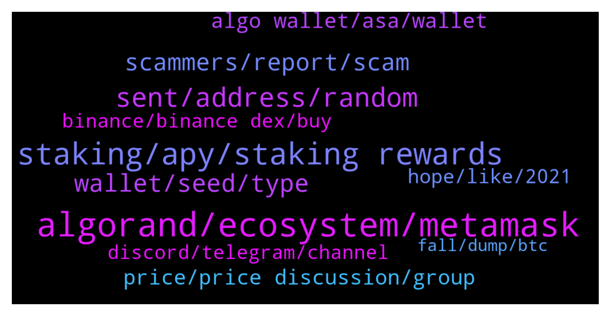

# **@algorand**
 ## Analysis for **2022-01-13** - **2022-01-14**.

---

## 📊 **Basic Stats**

**n_messages_sent**: 201

---

---

## 🔝 **Top keywords and related messages**

1. **algorand, ecosystem, metamask**

    @Kytelegramm --- *What are the defi projects running on algorand so far* **--->** [TG Discussion](https://t.me/algorand/332246)

    @NightAlgorand --- *Algorand is not supported on Metamask* **--->** [TG Discussion](https://t.me/algorand/332289)

    @silverotoi --- *can I use metamask on algorand?* **--->** [TG Discussion](https://t.me/algorand/332285)

    @silverotoi --- *hi, is there a bridge to algorand from other ecosystem?* **--->** [TG Discussion](https://t.me/algorand/332578)

    @walkerranger --- *How do we add our project?* **--->** [TG Discussion](https://t.me/algorand/332248)

    @OARTSRCTEY --- *Good day, Algopad is really the first launchpad platform in your ecosystem, or do you have nothing in common?* **--->** [TG Discussion](https://t.me/algorand/332314)

2. **staking, apy, staking rewards**

    @iamaturtle123 --- *Hi guys, programmer here new to the Blockchain. I am thinking of creating a tax preparation app for yieldly where I put in an address and it spits out a list of interactions with the yieldly staking app along with the price of yieldly on the day of the transaction. My question is how should I query the blockchain? It looks like the algo explorer api would do what I want, but I also see that is deprecated and frowned upon. Would I have to run my own algo node to do this, or is there another api I should use?* **--->** [TG Discussion](https://t.me/algorand/332161)

    @MackDenver --- *Hello there, you can simply hold Algo in official wallets to get staking rewards.* **--->** [TG Discussion](https://t.me/algorand/332547)

    @MackDenver --- *Hey R,  Yes, the staking rewards has dropped. Check it out here: https://algoexplorer.io/rewards-calculator* **--->** [TG Discussion](https://t.me/algorand/332191)

    @MackDenver --- *Please check the staking APY here: https://algoexplorer.io/rewards-calculator* **--->** [TG Discussion](https://t.me/algorand/332561)

    @MackDenver --- *Download My Algo wallet, deposit Algo on it and hold them. You will get staking rewards automatically.* **--->** [TG Discussion](https://t.me/algorand/332556)

    @SankaLover --- *Guys did the reward for staking Algorand drop significantly?* **--->** [TG Discussion](https://t.me/algorand/332188)

3. **sent, address, random**

    @studentoflife --- *I just sent some Yieldly from my algo wallet and it went to a random address i never even typed in. Can someone please help me by looking at my transaction to see whats goig on?* **--->** [TG Discussion](https://t.me/algorand/332433)

    @RalphCraig --- *You may have malware that replaces addresses when you cut and paste.  Try cutting and pasting an Algo address into a notepad and see what happens.  If it occurred without you sending anything perhaps your seed phrase was compromised.  Did you store it electronically at all?  Perhaps as a screenshot?* **--->** [TG Discussion](https://t.me/algorand/332500)

    @studentoflife --- *And then it just sent to some random address* **--->** [TG Discussion](https://t.me/algorand/332448)

    @studentoflife --- *It was in there for the past 10 days, then the second i try to send it goes to a random spot* **--->** [TG Discussion](https://t.me/algorand/332441)

    @studentoflife --- *then i sent more algo to the wallet and it was sent to this random place* **--->** [TG Discussion](https://t.me/algorand/332435)

    @studentoflife --- *Never ever copied the address that it sent to* **--->** [TG Discussion](https://t.me/algorand/332451)

4. **wallet, seed, type**

    @NightAlgorand --- *Hi there, it seems nothing is wrong with the wallet, please try to type your seed exactly the same 🙂* **--->** [TG Discussion](https://t.me/algorand/332401)

    @studentoflife --- *It worked up until last month. Is something wrong with the wallet?* **--->** [TG Discussion](https://t.me/algorand/332397)

    @studentoflife --- *Yes, I did store it as a screen shot* **--->** [TG Discussion](https://t.me/algorand/332557)

    @studentoflife --- *Hey guys, i have been trying to access my algorand wallet for a while and my seed phrase is not working on it* **--->** [TG Discussion](https://t.me/algorand/332396)

    @NightAlgorand --- *The wallet is in Algorand network 🙂* **--->** [TG Discussion](https://t.me/algorand/332166)

    @studentoflife --- *does the wallet name i enter need to be anything specific?* **--->** [TG Discussion](https://t.me/algorand/332403)

5. **scammers, report, scam**

    @NightAlgorand --- *Reminder that Admins will never DM you first. Beware of scammers.* **--->** [TG Discussion](https://t.me/algorand/332098)

    @xM3Dx --- *So many scammers in this channel, you send a message and receive 5 DMs from scams 🤢* **--->** [TG Discussion](https://t.me/algorand/332097)

    @studentoflife --- *don't try messaging me scammers. i know any DM's are false* **--->** [TG Discussion](https://t.me/algorand/332398)

    @Whateverrrrlahhhh --- *jsut block and report. Nobody will dm you LOL!* **--->** [TG Discussion](https://t.me/algorand/332376)

    @MackDenver --- *Hello Нитья, In case you have DM from someone, please share it so we can ban scammers.* **--->** [TG Discussion](https://t.me/algorand/332216)

    @NightAlgorand --- *We try our best but please understand that scam accounts don't use their scam account to join the group, they have sub accounts just stationed inside and there is nothing we can do to detect them. Furthermore, there is just a lot of scammer targeting big and popular projects.* **--->** [TG Discussion](https://t.me/algorand/332100)

6. **algo wallet, asa, wallet**

    @MackDenver --- *If you are asking for the minimum balance requirements, it depends on the amount of ASA you added in your wallet* **--->** [TG Discussion](https://t.me/algorand/332525)

    @KAPIBAYSIDE --- *What is the min amount of algo I need to have in my algo wallet ?* **--->** [TG Discussion](https://t.me/algorand/332424)

    @M --- *grab algo at 1.4650usdt and wait for 2 hour* **--->** [TG Discussion](https://t.me/algorand/332281)

    @NightAlgorand --- *Hi there 🙂 Yes, currently is 0.67% And we don't have an official recommendation other than Algo Wallet 🙂* **--->** [TG Discussion](https://t.me/algorand/332142)

    @NightAlgorand --- *Hi there, if you are going to empty you Algo Wallet, you can set "MAX", minus transaction fee 🙂* **--->** [TG Discussion](https://t.me/algorand/332427)

    @Luzz41 --- *You can check out the swapper on algo world explorer if you want to swap ASA for ASA* **--->** [TG Discussion](https://t.me/algorand/332135)

7. **price, price discussion, group**

    @lalelilulos --- *Hey there, is there a price group?* **--->** [TG Discussion](https://t.me/algorand/332147)

    @cryptocomicc --- *Didn’t have anything to do with price* **--->** [TG Discussion](https://t.me/algorand/332350)

    @MackDenver --- *Please join the price chat about this  @algorand_price* **--->** [TG Discussion](https://t.me/algorand/332282)

    @MackDenver --- *Hi Jorge, Please join our price chat for price discussion:  @algorand_price* **--->** [TG Discussion](https://t.me/algorand/332223)

    @NightAlgorand --- *There is an unofficial price group here @algorand_price* **--->** [TG Discussion](https://t.me/algorand/332149)

    @NightAlgorand --- *Hi there, how are you today? Please refer to @algorand_price to price chat 🙂* **--->** [TG Discussion](https://t.me/algorand/332348)

8. **hope, like, 2021**

    @Emi --- *As I remember its been mentioned end of 2021* **--->** [TG Discussion](https://t.me/algorand/332596)

    @MackDenver --- *There is no burning plan as of now.* **--->** [TG Discussion](https://t.me/algorand/332572)

    @Brightmoon23 --- *I hope so ,I am really disappointed, I was so excited for 2022* **--->** [TG Discussion](https://t.me/algorand/332569)

    @J --- *Well, it’s looking like it might. Hope not* **--->** [TG Discussion](https://t.me/algorand/332325)

    @Curly --- *I see massive pump to the moon soon* **--->** [TG Discussion](https://t.me/algorand/332192)

    @aneesa_t --- *Only time will tell, everything said now is speculative* **--->** [TG Discussion](https://t.me/algorand/332483)

9. **binance, binance dex, buy**

    @SonTrab --- *how, i buy token on binance dex* **--->** [TG Discussion](https://t.me/algorand/332554)

    @BANTONIX --- *How can I get this token please* **--->** [TG Discussion](https://t.me/algorand/332520)

    @SonTrab --- *wwhy, the token list on binance ?* **--->** [TG Discussion](https://t.me/algorand/332562)

    @MackDenver --- *You can't buy it on binance dex.* **--->** [TG Discussion](https://t.me/algorand/332560)

    @noxx88 --- *wtf so my tokens are blocked* **--->** [TG Discussion](https://t.me/algorand/332129)

    @mcmaxims --- *You can buy it on Binance* **--->** [TG Discussion](https://t.me/algorand/332565)

10. **discord, telegram, channel**

    @xM3Dx --- *I'm a veteran on telegram ser, but you should do some cleaning with your channel as an admin. It's 10x a better place the unofficial Algorand discussion channel than main channel and this ain't alright.* **--->** [TG Discussion](https://t.me/algorand/332099)

    @M --- *Hi guys, I am launching a NFT project on Algorand BC, can i post my twitter here ? (First people joining my discord have free Pixel Lobster)* **--->** [TG Discussion](https://t.me/algorand/332136)

    @<UNK> --- *Is there a Chinese telegram group?* **--->** [TG Discussion](https://t.me/algorand/332205)

    @mcmaxims --- *I like to keep track of new projects. But I am not on discord* **--->** [TG Discussion](https://t.me/algorand/332266)

    @mcmaxims --- *you can also send me a link in private chat if its better* **--->** [TG Discussion](https://t.me/algorand/332265)

    @bigboy87183 --- *You should ask in the discord. They are more devs there that can help. Dont know if you will receive an acceptable response here.* **--->** [TG Discussion](https://t.me/algorand/332193)

