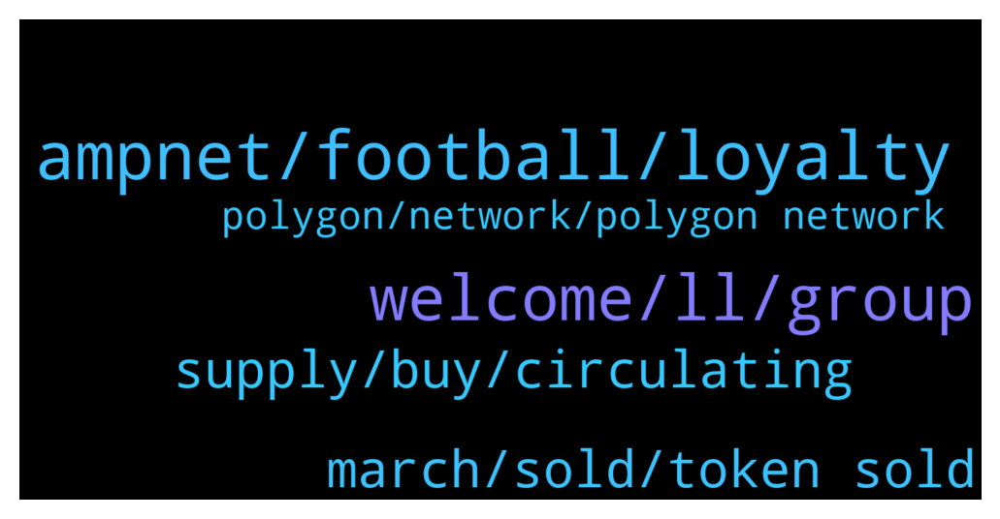

# **@ampnetapxchat**
 ## Analysis for **2022-01-09** - **2022-01-14**.

---

## 📊 **Basic Stats**

**n_messages_sent**: 148

---

---

## 🔝 **Top keywords and related messages**

1. **ampnet, football, loyalty**

    @mislavjavor --- *As always, there will be buybacks - the revenue for those, however, will not be coming only from the successfull collection of funds to the campaign, but also continuously - since AMPnet has several other fees included in the loyalty token business model. As for visibility - AMPnet has been assigned as the main sponsor for the HNS-CFF season and will be featured prominently on all football federation materials.* **--->** [TG Discussion](https://t.me/ampnetapxchat/36371)

    @mislavjavor --- *Yes - players will directly marekt* **--->** [TG Discussion](https://t.me/ampnetapxchat/36385)

    @mislavjavor --- *When there is a chargeable event on AMPnet* **--->** [TG Discussion](https://t.me/ampnetapxchat/36374)

    @tradingjo98 --- *partnership with a national football team, oh god this must be kinda bullish* **--->** [TG Discussion](https://t.me/ampnetapxchat/36338)

    @Cy --- *what will Biznisport do in this partnership ? I believe they were already involved on previous deals with ampnet.* **--->** [TG Discussion](https://t.me/ampnetapxchat/36377)

    @Cy --- *Great... but could you say The Croatian National Selection :D That would be a lot clearer for non croatians ˆˆˆ* **--->** [TG Discussion](https://t.me/ampnetapxchat/36304)

2. **welcome, ll, group**

    @Troop --- *Hi @jakovtradingmentor! Thanks for taking care of us! Welcome! 😊* **--->** [TG Discussion](https://t.me/ampnetapxchat/36423)

    @matejmz --- *@IncogSen you might like this too 😆* **--->** [TG Discussion](https://t.me/ampnetapxchat/36219)

    @tradingjo98 --- *Maybe you wanna tell us some things about you?* **--->** [TG Discussion](https://t.me/ampnetapxchat/36422)

    @mislavjavor --- *Yes - details still being panned out, don’t want to rush with announcement* **--->** [TG Discussion](https://t.me/ampnetapxchat/36388)

    @bazzie123 --- *Ok so you failed basically everywhere* **--->** [TG Discussion](https://t.me/ampnetapxchat/36233)

    @panos_dim --- *all good mate, just cooking right now* **--->** [TG Discussion](https://t.me/ampnetapxchat/36525)

3. **supply, buy, circulating**

    @North --- *I really hope so. There are no details on how it benefits AAPX holders yet though which is unfortunate, but at least we have a great partner and some exposure now* **--->** [TG Discussion](https://t.me/ampnetapxchat/36339)

    @scemodonore --- *guess aapx will benefit from buybacks but let's wait for the ama later* **--->** [TG Discussion](https://t.me/ampnetapxchat/36341)

    @Hydayashi --- *Stop selling people...let it grow. This guys will make it in the end. Mark my words.* **--->** [TG Discussion](https://t.me/ampnetapxchat/36294)

    @whimofnature --- *having a large partner helps a lot of course, but crypto-space itself can be fund-raising .. even for fund-raising technologies. IMO the main problem what keeps people from looking at AAPX is that there is no circulating supply visible for the AAPX token. this causes the token to be ranked somewhere in the >10000 rank area. nobody looks at this. if there was a circ. supply information it would be immediately ranked lower, and people would look what the project is about. and then they would be fascinated, because everyone knows real estate / equities on blockchain is the future. and then they would buy AAPX.* **--->** [TG Discussion](https://t.me/ampnetapxchat/36136)

    @matejmz --- *Prepare for the "what is circulating supply?" questions 😆* **--->** [TG Discussion](https://t.me/ampnetapxchat/36139)

    @Tenken34 --- *none of the big influencers that used to be invested in $AAPX are tweeting about this huge news* **--->** [TG Discussion](https://t.me/ampnetapxchat/36352)

4. **march, sold, token sold**

    @matejmz --- *How many tokens are going to be sold during this ICO? I only found total supply info.* **--->** [TG Discussion](https://t.me/ampnetapxchat/36373)

    @PFCBLic --- *Can we put final date and final ammount of released tokens? Mcap wont be correct but it is better than nothing* **--->** [TG Discussion](https://t.me/ampnetapxchat/36153)

    @MarcusVieiraCosta --- *will there be the promised tokens for us that made the cryptobond with Sync?* **--->** [TG Discussion](https://t.me/ampnetapxchat/36114)

    @Hydayashi --- *Will the foobal token be sold for crypto or only for fiat? it doesnt say anywhere...* **--->** [TG Discussion](https://t.me/ampnetapxchat/36382)

    @matejmz --- *Is this token first of its kind in region?* **--->** [TG Discussion](https://t.me/ampnetapxchat/36389)

    @North --- *That answers partially, thanks. And the fees from VATRENI are collected on each token transaction or some other way?* **--->** [TG Discussion](https://t.me/ampnetapxchat/36384)

5. **polygon, network, polygon network**

    @mislavjavor --- *Agreed, for low fees at this time, though - I can recommend the Polygon network* **--->** [TG Discussion](https://t.me/ampnetapxchat/36387)

    @TL170x --- *You kinda answered to this already, but I'd like to recommend atleast some CEX since ETH is congested all the time. I understand that something like Kucoin is now "pointless" until there is enough progression from this "new start", but there is some smaller CEXes like MEXC or AscendEX where you can get listed quite easily and can have decent userbase & volume* **--->** [TG Discussion](https://t.me/ampnetapxchat/36383)

    @adhamalkhaja --- *I think polymath does something similar* **--->** [TG Discussion](https://t.me/ampnetapxchat/36545)

    @panos_dim --- *Cool, lowcap, do you guys have any competitors in other chains?* **--->** [TG Discussion](https://t.me/ampnetapxchat/36544)

    @BlinkmothNexus --- *Yeah I know this page. My question was If I can claim with polygon network, not eth mainnet* **--->** [TG Discussion](https://t.me/ampnetapxchat/36173)

    @Tinus_Tussengas_1984 --- *When will the team make it possible to claim pre sale tokens on polygon network to avoid us to pay gas fees?* **--->** [TG Discussion](https://t.me/ampnetapxchat/36488)

