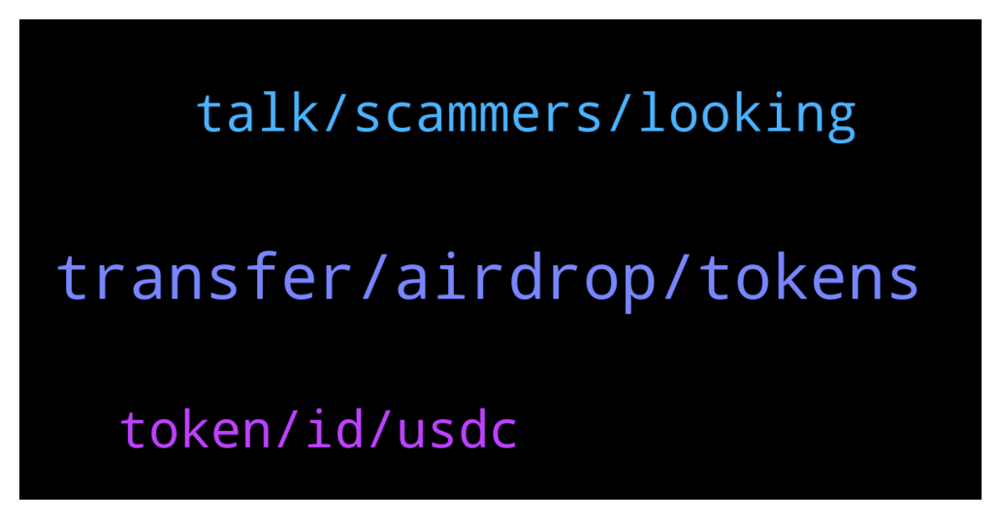

# **@avalancheavax**
 ## Analysis for **2022-01-13** - **2022-01-14**.

---

## 📊 **Basic Stats**

**n_messages_sent**: 133

---

---

## 🔝 **Top keywords and related messages**

1. **transfer, airdrop, tokens**

    @AlmanT10 --- *ETH is gone from the ETH side no record on the AVAX side* **--->** [TG Discussion](https://t.me/avalancheavax/321972)

    @Nicolas_A --- *For dev questions ask on Discord please chat.avax.network* **--->** [TG Discussion](https://t.me/avalancheavax/322156)

    @caligula_0 --- *Is AVAX a scam? Many people are saying this.* **--->** [TG Discussion](https://t.me/avalancheavax/322336)

    @oathtobarbatos --- *Use a DEX (Trader Joe, for example) they allow you to trade BNB to AVAX directly* **--->** [TG Discussion](https://t.me/avalancheavax/321986)

    @Victoredd --- *What is the best game on AVAX right now? Suggestions? I mean a JEWEL level game* **--->** [TG Discussion](https://t.me/avalancheavax/322204)

    @Bluevicky --- *Pleaze admin does avax has an app* **--->** [TG Discussion](https://t.me/avalancheavax/322067)

2. **talk, scammers, looking**

    @Dante --- *Hello Is there an admin in this group . My swap from metamask still pending for a while.* **--->** [TG Discussion](https://t.me/avalancheavax/321940)

    @jenkk --- *Will you just ignore the scammers make a fake group and pretend they are you and run an airdrop there?* **--->** [TG Discussion](https://t.me/avalancheavax/321997)

    @hayshanaba --- *Hey hun,Not to waste your precious time, because I believe you’re a very busy person. I’ll like to talk to you about something. Can I proceed?💫 I’ll like to talk to you about crypto currency investment I’m a professional in crypto and forex trading, I have been trading for quite some time now. I trade and manage accounts for my clients  and also make them good profits weekly.* **--->** [TG Discussion](https://t.me/avalancheavax/322209)

    @oathtobarbatos --- *I'm not sure, honestly. You could join this one too https://t.me/avalanche_trading* **--->** [TG Discussion](https://t.me/avalancheavax/322010)

    @Victoredd --- *I mean yes and anything else* **--->** [TG Discussion](https://t.me/avalancheavax/322206)

    @Akshay_LATOKEN --- *Hello Team,  This is probably a general inbox but I need your help.  Could you reply to me with an email address/number of someone in management.  I have some information which I think they will appreciate relating to the project.  Hope to get a reply soon, thank you.* **--->** [TG Discussion](https://t.me/avalancheavax/322088)

3. **token, id, usdc**

    @julioauto --- *e.g. I think this is the genesis of a token: https://avascan.info/blockchain/c/tx/0x8c9ff2c66440020016f5005aa64ac7a90867bd9f44bc4264ae8fc7c6327dc99e but I don't see base58 anywhere* **--->** [TG Discussion](https://t.me/avalancheavax/322147)

    @Pedro --- *Hi, I'm trying to bridge USDC from avalanche to ethereum but I can't see it on the token list.* **--->** [TG Discussion](https://t.me/avalancheavax/322157)

    @Nicolas_A --- *You bridge the WETH to Avalanche* **--->** [TG Discussion](https://t.me/avalancheavax/321978)

    @Nicolas_A --- *Withdraw to BSC and then bridge to Avalanche via Celer network / Synapse protocol* **--->** [TG Discussion](https://t.me/avalancheavax/322110)

    @julioauto --- *how do I find the asset ID of a c-chain token?* **--->** [TG Discussion](https://t.me/avalancheavax/322142)

    @Matt2367 --- *anybody know where i can get the contract address for bnb on avalanche chain?* **--->** [TG Discussion](https://t.me/avalancheavax/321985)

