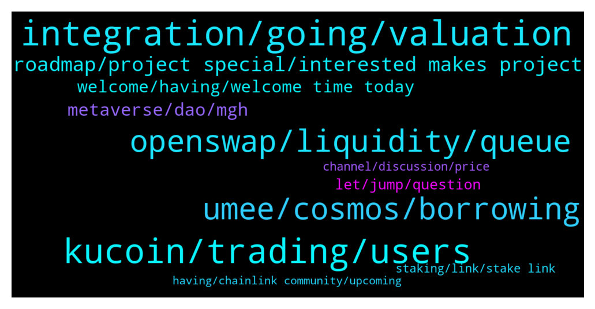

# **@chainlinkofficial**
 ## Analysis for **2022-01-13** - **2022-01-14**.

---

## 📊 **Basic Stats**

**n_messages_sent**: 233

---

---

## 🔝 **Top keywords and related messages**

1. **integration, going, valuation**

    @BrapreetLadysMan --- *Gm all chainlink family hope ur staying well from omnicrom* **--->** [TG Discussion](https://t.me/chainlinkofficial/363613)

    @Rahi2002 --- *hi can i get chainlink roadmap* **--->** [TG Discussion](https://t.me/chainlinkofficial/363909)

    @Walter --- *Hello my fellow chainlist members. I have a quick question regarding partners. Does anyone know Metaplace finance and are they partnered with chainlink? Because we are investigating a scam. Thank you for you response❤️* **--->** [TG Discussion](https://t.me/chainlinkofficial/364320)

    @marcromeron --- *Chainlink is a decentralized network of oracles that enables smart contracts to securely interact with real-world data and services that exist outside of blockchain networks. We're not a Parachain.* **--->** [TG Discussion](https://t.me/chainlinkofficial/363936)

    @BlazeBRT --- *Is chainlink going for polkadot auction* **--->** [TG Discussion](https://t.me/chainlinkofficial/363934)

    @thenicolasweber --- *Chainlink bot is tougher than bouncer at club 😃* **--->** [TG Discussion](https://t.me/chainlinkofficial/364450)

2. **kucoin, trading, users**

    @marcromeron --- *Our Community want to know about the near future of Kucoin. What’s next on your KuCoin’s roadmap?* **--->** [TG Discussion](https://t.me/chainlinkofficial/363886)

    @Johnny_LYU_KuCoin --- *As the number of KuCoin users keep surging, our trading demand also grows at a exponential speed. Therefore, KuCoin needs a high-quality price reference data to our P2P markets, and we chose Chainlink Price Feeds as a perfect data solution. The partnership with Chainlink, the industry-leading decentralized oracle network, will empower us to access accurate and tamper-proof exchange rates between various fiat currencies and cryptocurrencies. At the same time, our users can trade more confidently and securely at KuCoin under market volatilities. We have first introduced INR/USD and USDT/USD Chainlink Price Feeds, and more will be introduced in the future, please stay tuned.* **--->** [TG Discussion](https://t.me/chainlinkofficial/363867)

    @Johnny_LYU_KuCoin --- *KuCoin is a world-leading crypto exchange launched in September 2017. Today, it has become a top 5 global exchange with a diversified category of crypto products, covering Spot trading, Margin trading, P2P fiat trading, Futures trading, Staking, and Lending services, etc.* **--->** [TG Discussion](https://t.me/chainlinkofficial/363846)

    @Johnny_LYU_KuCoin --- *This is a great question. As the accelerator and active participant of the crypto industry, KuCoin has a mission of facilitating the global free flow of digital value. We believe everyone will get involved with crypto one day, and technological progress will revolutionize the way we create and distribute value.* **--->** [TG Discussion](https://t.me/chainlinkofficial/363854)

    @Johnny_LYU_KuCoin --- *Known as "People’s Exchange", KuCoin offers crypto services for all classes of investors. For beginners, we offer offer easy ways to earn a stable passive income. For advanced traders, KuCoin provides margin trading and futures trading, to help them amplify their gains from successful trades. I can show you some UI pics of our KuCoin S social trading feature.* **--->** [TG Discussion](https://t.me/chainlinkofficial/363857)

    @Johnny_LYU_KuCoin --- *Besides, KuCoin will continue to explore more crypto gems in the trending fields, such as Metaverse, NFT, and Web3.0, GameFi, etc. In addition, we have noticed the steady growth of KCC lately and some interesting projects and Dapps have been built on it. Next year this might be another place to hunt for gems.* **--->** [TG Discussion](https://t.me/chainlinkofficial/363891)

3. **openswap, liquidity, queue**

    @Joypokkamol --- *Please tell us about OpenSwap. How does it work?* **--->** [TG Discussion](https://t.me/chainlinkofficial/363982)

    @Joypokkamol --- *In just a few moments, we will have a Community Q&A with OpenSwap who recently announced that it integrates Chainlink VRF to Ensure Fair Randomness for OpenSwap’s Bridge Troll NFTs https://twitter.com/chainlink/status/1478352303832944651?s=20* **--->** [TG Discussion](https://t.me/chainlinkofficial/363971)

    @marcromeron --- *Bruce Chau // OpenSwap (No DM): Community members can periodically check in on what we new NFT campaigns we are running - you can do so by visiting our NFT Loyalty Program page: https://www.openswap.xyz/#/nfts* **--->** [TG Discussion](https://t.me/chainlinkofficial/363993)

    @Bruce_OpenSwap --- *So yeah, we believe the above mentioned OpenSwap Key Offerings are special and unique in the DeFi space and are offerings that will allow us to grow with the top-tier projects that will onboard with us.* **--->** [TG Discussion](https://t.me/chainlinkofficial/363999)

    @Bruce_OpenSwap --- *At OpenSwap, we position ourselves as every Crypto Project’s BFF by providing a set of tools to empower teams to establish funding and sustained token health, allowing teams to focus on what they do best - BUIDLing!* **--->** [TG Discussion](https://t.me/chainlinkofficial/363984)

    @Bruce_OpenSwap --- *1. On-chain Private Sales Offering - which is a service enabled by our OpenSwap Booster Queue, a technology that allows projects to facilitate private sale rounds, and providing an end-to-end on-chain solution including token purchase, vesting schedules, and secondary market for vested tokens.   The OpenSwap Booster Queue is applicable for projects seeking additional funding without the risk of market price impacts. Projects may choose to whitelist the offering and offer guaranteed buybacks to participants to instill even more confidence in the project during unstable market conditions.* **--->** [TG Discussion](https://t.me/chainlinkofficial/363986)

4. **umee, cosmos, borrowing**

    @kennynajarr0 --- *Hi everyone! Happy to be here! My name is Kenny Najarro and I am the Marketing Lead at Umee. 🌊🏄‍♂️* **--->** [TG Discussion](https://t.me/chainlinkofficial/364559)

    @bond_dog_51 --- *Of course - Umee will be connected via IBC with close 30-40 other Cosmos based blockchains. These networks account for close to $80-100bn worth of crypto assets.  Umee intends to be a gateway for onboarding these assets into Ethereum DeFi via Chainlink oracles.* **--->** [TG Discussion](https://t.me/chainlinkofficial/364585)

    @bond_dog_51 --- *Umee has structured the official price feed for the Cosmos ATOM to be on Ethereum. This means that Cosmos ATOMs will be able to be traded on AMM's, leveraged on the Umee platform for borrowing and lending, as well as integrated into yield aggregator platforms.* **--->** [TG Discussion](https://t.me/chainlinkofficial/364587)

    @bond_dog_51 --- *2022 February: Umee Base Functionality Deployment on Mainnet and Token Launch 2022 March: Umee Lending Facility Upgrades  2022 April - Onward: -Protocol developments on top of Umee: meTokens, staking curves, defi debt protocols -Umee Polygon Lending and Borrowing Application -Umee Arbitrum Lending and Borrowing Application -Umee Optimism Lending and Borrowing Application -Umee Solana Lending and Borrowing Application -Umee Binance Smart Chain Lending and Borrowing Application *Disclaimer - timeline is subject to change** **--->** [TG Discussion](https://t.me/chainlinkofficial/364605)

    @bond_dog_51 --- *Of course - Umee is a blockchain that is powered by Tendermint BFT Consensus. The Umee blockchain itself is a base layer protocol upon which lots of DeFi apps can be built. We're expecting many borrowing and lending type platforms to be built on top of the Umee blockchain.* **--->** [TG Discussion](https://t.me/chainlinkofficial/364570)

    @bond_dog_51 --- *Yes that is correct - Umee is powered by a network of validators that run proof of stake consensus* **--->** [TG Discussion](https://t.me/chainlinkofficial/364572)

5. **roadmap, project special, interested makes project**

    @mcrisk58 --- *An itibari ile 670 bin içerideyim* **--->** [TG Discussion](https://t.me/chainlinkofficial/364083)

    @Remzi --- *What are the short, medium and long term goals? so any guesses?* **--->** [TG Discussion](https://t.me/chainlinkofficial/364070)

    @PolivodaTatiana --- *Where can the audience follow you and your project?* **--->** [TG Discussion](https://t.me/chainlinkofficial/364610)

    @marcromeron --- *A reminder on howto follow this project* **--->** [TG Discussion](https://t.me/chainlinkofficial/364489)

    @marcromeron --- *I hope you the best for your project.* **--->** [TG Discussion](https://t.me/chainlinkofficial/363903)

    @PolivodaTatiana --- *Tell us about your project, how does it work?* **--->** [TG Discussion](https://t.me/chainlinkofficial/364565)

6. **metaverse, dao, mgh**

    @thenicolasweber --- *At MetaGameHub DAO we focus on the convergence of DeFi, Data and the Metaverse. As the Metaverse is currently hyped a lot, we believe that the next hype within the Metaverse will be applications on top and directly integrated within the Metaverse. Our core principle is “Navigating through the Open Metaverse together”. We do this with the following two aspects:   Building a decentralized “state” in the Open Metaverse by acquiring and managing LANDs across various Metaverses such as The Sandbox, Decentraland and many more which our community governs and thus monetised via e.g. GameFi applications, event venues, art galleries and more. Building intuitive tools such as our evaluation tool for finding the fair price for your The Sandbox LAND and leveraging the data we have from an algorithm we developed to generate further revenue via our collaborations with Chainlink and Ocean Protocol to sell this NFT pricing data on their marketplaces. You can check out the tool in our dApp! The idea behind MGH DAO originated from 1) the fact that we want to onboard “the masses” via decentralized governance and monetization of LANDs as typically LAND in the Metaverse is owned by centralized parties and 2) we discovered that many Metaverse assets are lacking a fair and transparent pricing and therefore started developing the pricing algorithm.* **--->** [TG Discussion](https://t.me/chainlinkofficial/364419)

    @marcromeron --- *How is MetaGame Hub DAO converging metaverse - dataverse?* **--->** [TG Discussion](https://t.me/chainlinkofficial/364472)

    @marcromeron --- *Nicolas {Beware of Impersonators}: for this we have set up the various working groups which each can then subsequently apply for grants from the MGH DAO Treasury on a periodic basis to support the ecosystem growth. the working group application form is you path and after filling it out the DAO and respective working groups vote on new applicants. https://forms.gle/A6vCq2kxQpsdqp2o8 (here is the from)* **--->** [TG Discussion](https://t.me/chainlinkofficial/364470)

    @thenicolasweber --- *excited to speak about the convergence of the dataverse with the Open Metaverse via on chain data 🙂* **--->** [TG Discussion](https://t.me/chainlinkofficial/364396)

    @marcromeron --- *Nicolas {Beware of Impersonators}: The best way to be engaged with is 1) joining our community channels on TG(https://t.me/metagamehub_dao), Discord (https://discord.gg/8WJVMDXZwH) and following us on Twitter (https://twitter.com/MGH_DAO) while 2) you can become part of the Working Groups where you can apply to via the application form:https://forms.gle/A6vCq2kxQpsdqp2o8 - here we have an Operations WG, Data/Algo WG, Tech WG, Awareness/Marketing WG, Legal WG and Metaverse Development WG with our collab that we foster with University of Applied Sciences Aachen 🙂 Generally I invite everyone to join us on our mission to accelerate decentralization and transparency within the Open Metaverse. 🙏 Lastly, you can of course contact us directly via TG or Twitter: https://twitter.com/thenicolasweber* **--->** [TG Discussion](https://t.me/chainlinkofficial/364488)

    @marcromeron --- *DeFi, Data and Metaverse sounds really interesting.* **--->** [TG Discussion](https://t.me/chainlinkofficial/364425)

7. **welcome, having, welcome time today**

    @ming0duan --- *Thank you so much for having us today!!!❤️🌊🏄‍♂️* **--->** [TG Discussion](https://t.me/chainlinkofficial/364568)

    @Bruce_OpenSwap --- *Thank you again for having me here today, and we look forward to seeing you guys in our community!* **--->** [TG Discussion](https://t.me/chainlinkofficial/364046)

    @Joypokkamol --- *Thank you. It's always a pleasure to hear from you.* **--->** [TG Discussion](https://t.me/chainlinkofficial/364045)

    @Joypokkamol --- *Happy to have you with us today.* **--->** [TG Discussion](https://t.me/chainlinkofficial/363978)

    @Johnny_LYU_KuCoin --- *Thank you for having me, and thanks for your time!* **--->** [TG Discussion](https://t.me/chainlinkofficial/363904)

    @Johnny_LYU_KuCoin --- *Hi everyone, nice to meeting you here today* **--->** [TG Discussion](https://t.me/chainlinkofficial/363838)

8. **let, jump, question**

    @PolivodaTatiana --- *before we begin, please introcude yourselves, guys* **--->** [TG Discussion](https://t.me/chainlinkofficial/364558)

    @marcromeron --- *After this amazing technical explanation, let's go for another one...* **--->** [TG Discussion](https://t.me/chainlinkofficial/364445)

    @marcromeron --- *This is one of the most interesting questions from our Community members....* **--->** [TG Discussion](https://t.me/chainlinkofficial/364432)

    @marcromeron --- *Let's jump into our first question...* **--->** [TG Discussion](https://t.me/chainlinkofficial/364415)

    @marcromeron --- *Let's jump to my favourite question...* **--->** [TG Discussion](https://t.me/chainlinkofficial/363864)

    @marcromeron --- *Let's start with our first question....* **--->** [TG Discussion](https://t.me/chainlinkofficial/363844)

9. **channel, discussion, price**

    @Linkederic --- *Lets keep the conversation in this channel in English please, and also avoid trading discussion* **--->** [TG Discussion](https://t.me/chainlinkofficial/364084)

    @Linkederic --- *Price discussion and speculation is prohibited in this channel* **--->** [TG Discussion](https://t.me/chainlinkofficial/364201)

    @mcrisk58 --- *No it's not commercial.  I said that I only lost 670 thousand.  We have no choice but to wait.  If you want, I can also send this message as a voicemail.* **--->** [TG Discussion](https://t.me/chainlinkofficial/364086)

    @Linkederic --- *Price discussion is not permitted in this channel* **--->** [TG Discussion](https://t.me/chainlinkofficial/363924)

    @PolivodaTatiana --- *No price discussions allowed in this channel* **--->** [TG Discussion](https://t.me/chainlinkofficial/363757)

    @marcromeron --- *Please, no price/market discussion allowed here. Thank you.* **--->** [TG Discussion](https://t.me/chainlinkofficial/363556)

10. **staking, link, stake link**

    @moscowberkay --- *Hi guys just question, there s a way to stake link on Binance? When check on binance stake for link always sold out and lock* **--->** [TG Discussion](https://t.me/chainlinkofficial/364354)

    @mcmaxims --- *Can I stake my link tokens somewhere?* **--->** [TG Discussion](https://t.me/chainlinkofficial/364496)

    @Kickthetrend --- *Is there any official platform to stake LINK?* **--->** [TG Discussion](https://t.me/chainlinkofficial/363925)

    @todo_terreno_boy --- *Link’s staking isn’t live yet. What exchanges offer isn’t staking but lending* **--->** [TG Discussion](https://t.me/chainlinkofficial/364497)

    @Sylvarantt --- *Staking is not yet live. This article provides an overview of explicit staking from the Chainlink 2.0 Whitepaper. This presentation by Sergey discusses staking and the difference between implicit and explicit staking, while in this other presentation Sergey announced the team is planning to implement some form of staking in 2022.  As a rule the team doesn’t offer timelines for development targets. You can follow development progress via github.  Anything you find out there claiming to be "LINK staking" is actually some form of either lending or yield farming, which is out of the scope of this channel.* **--->** [TG Discussion](https://t.me/chainlinkofficial/364360)

    @marcromeron --- *Chainlink staking is not yet available. Other forms of staking offered by exchanges are actually yield farming, lending/borrowing, which is not endorsed by us and is outside the scope of discussion in this channel.* **--->** [TG Discussion](https://t.me/chainlinkofficial/363927)

