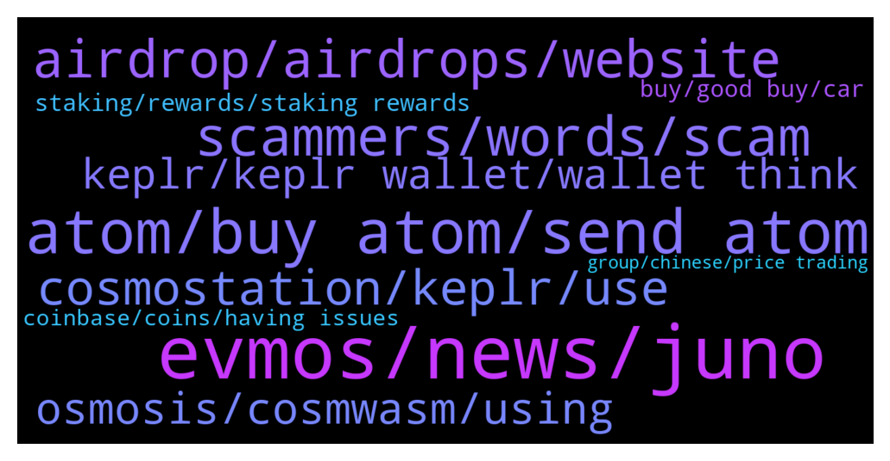

# **@cosmosproject**
 ## Analysis for **2022-01-13** - **2022-01-14**.

---

## 📊 **Basic Stats**

**n_messages_sent**: 414

---

---

## 🔝 **Top keywords and related messages**

1. **evmos, news, juno**

    @jquinn13 --- *Can someone explain EVMOS to me like I’m 5* **--->** [TG Discussion](https://t.me/cosmosproject/473371)

    @AtomJazz --- *Yeah sure, but wait for another week (until Evmos mainnet launch 😁)* **--->** [TG Discussion](https://t.me/cosmosproject/473762)

    @Gabriele21R --- *I hope that I can be elegibile for evmos drop .. when it will happen* **--->** [TG Discussion](https://t.me/cosmosproject/473239)

    @AtomJazz --- *Snapshot was already taken, late October* **--->** [TG Discussion](https://t.me/cosmosproject/473241)

    @Julius_megusta30 --- *Is there already an announcement channel for sagan? Or just Twitter channel?* **--->** [TG Discussion](https://t.me/cosmosproject/473847)

    @hempshox420 --- *it's not about the price, it's about the project. Has the news that caused the ath already arrived or just announced?* **--->** [TG Discussion](https://t.me/cosmosproject/473384)

2. **atom, buy atom, send atom**

    @Lambo2025 --- *$ATOM is ready to fly high, recently it is rated as A class asset by a decentralised cryptoassets rating platform evai. io ✅* **--->** [TG Discussion](https://t.me/cosmosproject/473670)

    @nickyyyjj --- *wondered if $ATOM is in smth like this https://medium.com/dehive/what-is-a-crypto-index-and-how-is-it-better-than-regular-cryptocurrencies-f25eb61818f7* **--->** [TG Discussion](https://t.me/cosmosproject/473948)

    @Jonathan --- *hello, new to the atom ecosystem.  what are your favorite projects inside atom 🙂* **--->** [TG Discussion](https://t.me/cosmosproject/474405)

    @nickyyyjj --- *and how many new $ATOM then minted per year atm?* **--->** [TG Discussion](https://t.me/cosmosproject/473919)

    @focused0101 --- *damn, well guys are waiting $ATOM for $60 🤤 https://www.youtube.com/watch?v=JuNRPV436-o* **--->** [TG Discussion](https://t.me/cosmosproject/473586)

    @JCFishing --- *The best advice I can give you if you did you research and feel this is the right project for investment.  DCA into Atom.  This way, it’s much safer.* **--->** [TG Discussion](https://t.me/cosmosproject/473578)

3. **scammers, words, scam**

    @David_H99 --- *Seems to be down atm will try later thank you for the quick reply !  Even despite your speed a scammer DMd offering membership if another group where they would help! Total #*%$¥!!* **--->** [TG Discussion](https://t.me/cosmosproject/473351)

    @bcosmos --- *Just a beware, do not send anyone your coins or keys* **--->** [TG Discussion](https://t.me/cosmosproject/473332)

    @Mratarl --- *guys be careful. There is a scam osmosis telegram group with 80k members. looks official* **--->** [TG Discussion](https://t.me/cosmosproject/474197)

    @StudentForAllMyLife --- *Seems scammy, if you have something write it here. I don't and won't use telegram pms* **--->** [TG Discussion](https://t.me/cosmosproject/474293)

    @nickyyyjj --- *Haha really? Check ur dm pls* **--->** [TG Discussion](https://t.me/cosmosproject/474291)

    @cc1742x --- *Anyone know why Double Counter verification bot in the Discord says I have a VPN?* **--->** [TG Discussion](https://t.me/cosmosproject/473458)

4. **airdrop, airdrops, website**

    @TicoJohnny --- *Well, i'm not sure what to say to be honest, I don't have control over each user's security tolerances and it's up to each project how they airdrop* **--->** [TG Discussion](https://t.me/cosmosproject/473613)

    @TicoJohnny --- *There's at this point dozens if not hundreds of dev teams, they're all witnessing what is happening and how things are being done, each airdrop seems to be getting smarter but there have been a few exceptions* **--->** [TG Discussion](https://t.me/cosmosproject/473618)

    @Gabriele21R --- *I'm too late I know hope I will get some future airdrop..* **--->** [TG Discussion](https://t.me/cosmosproject/473244)

    @ZoltanAtom --- *Hello,All you need to do is stake your Atom. Eventually you will need to use Keplr wallet to claim your airdrops.   Couple of important point you need to know that do not stake your Atom with exchange validators and validators which offers 0 commission.* **--->** [TG Discussion](https://t.me/cosmosproject/474350)

    @TicoJohnny --- *Ultimately, it's your decision to do what you want with your wallet. If your risk tolerance allows it then do it, each developers know the multiple methods in which they can airdrop and it's literally up to each sovereign chain to do it how they want to.* **--->** [TG Discussion](https://t.me/cosmosproject/473623)

    @Marcincrypto --- *🚀 Airdrop's | ⛲️APR | ♻️DEX's | 🌆NFT | all in one place info - ⚛️Cosmos Ecosystem https://docs.google.com/spreadsheets/u/0/d/1xQJ1YwE4gv2zXduScgN71wYCv8nb9MhVMdiXb8yexxc/htmlview* **--->** [TG Discussion](https://t.me/cosmosproject/473739)

5. **cosmostation, keplr, use**

    @Lee_CryptoNFT --- *so most people use keplr as their wallet, but instead one could use cosmostation wallet* **--->** [TG Discussion](https://t.me/cosmosproject/473284)

    @ZoltanAtom --- *Ofcourse!  Lots of! For example, Keplr wallet is the way to connect Cosmos dexs such as Gdex,Osmosis and Sifchain.   If you don’t use Keplr wallet, you will not able to claim your airdrops.   Cosmostation mobile app also many features which are given to users more flexibility and accessibility to all Cosmos.   I do use both Keprl and Cosmostation. Both wallet core teams are Cosmos contributors.  For example ;you will not have any issues which many other third party wallets had after network upgrades!* **--->** [TG Discussion](https://t.me/cosmosproject/473863)

    @hempshox420 --- *do i have any risk to stake my cosmos? and how can i find a reliable validator?* **--->** [TG Discussion](https://t.me/cosmosproject/473404)

    @TicoJohnny --- *this is strange! is there a space at the end of the front of it? it's for sure the "Cosmos" Tab on the top middle of Keplr?* **--->** [TG Discussion](https://t.me/cosmosproject/473632)

    @AtomJazz --- *Yes, it's the best Cosmos wallet* **--->** [TG Discussion](https://t.me/cosmosproject/474226)

    @TicoJohnny --- *I see, is there a reason he doesn’t use the phone app? For pc we recommend Keplr, the chrome extension, for mobile we recommend cosmostation. The online web wallet doesn’t have all the functionality of the app, I could recommend you to either import your mnemonic onto cosmostation app or Keplr or contact cosmostation support team* **--->** [TG Discussion](https://t.me/cosmosproject/474099)

6. **osmosis, cosmwasm, using**

    @TicoJohnny --- *Is this in Terra or osmosis? You can try asking here: https://t.me/TerraLunaChat* **--->** [TG Discussion](https://t.me/cosmosproject/473444)

    @Cordtus --- *Osmosis, gravity dex, sifchain, soon juno swap* **--->** [TG Discussion](https://t.me/cosmosproject/473463)

    @Scamergohell --- *Hi how to bridge from osmosis to harmony?* **--->** [TG Discussion](https://t.me/cosmosproject/474220)

    @cryptogainz2 --- *is Osmosis safe to deposit on?* **--->** [TG Discussion](https://t.me/cosmosproject/473637)

    @jquinn13 --- *Is there a native stable coin for osmosis* **--->** [TG Discussion](https://t.me/cosmosproject/473512)

    @Xahriwi --- *Ok thanks, is this CosmWasm VM the same that is possibly getting integrated into Osmosis?* **--->** [TG Discussion](https://t.me/cosmosproject/473751)

7. **keplr, keplr wallet, wallet think**

    @trabzonizm61 --- *Keplr yes. İ did 5 times meybe more Fırat time i have problem* **--->** [TG Discussion](https://t.me/cosmosproject/474400)

    @Buri7xxx --- *And how I can install keplr safeful* **--->** [TG Discussion](https://t.me/cosmosproject/474370)

    @matthew4you --- *Only the web kelpr possible to add not the android kelpr wallet?* **--->** [TG Discussion](https://t.me/cosmosproject/474332)

    @明 --- *I only used the IBC Transfer in my Keplr wallet.* **--->** [TG Discussion](https://t.me/cosmosproject/473705)

    @cattaccat --- *Chrome, and I contacted Keplr manager* **--->** [TG Discussion](https://t.me/cosmosproject/474187)

    @AtomJazz --- *You need to connect your Keplr wallet with https://juno.omniflix.co/ website* **--->** [TG Discussion](https://t.me/cosmosproject/473331)

8. **staking, rewards, staking rewards**

    @David_H99 --- *Thank you no, I was already staking - I wanted to know whether it was possible to see )and download the staking rewards listed as they they occurred* **--->** [TG Discussion](https://t.me/cosmosproject/474425)

    @David_H99 --- *Good afternoon I have a question which I would appreciate some help and advice with -  Is there a cosmos explorer that will show when staking rewards are earned ? When I look at mintscan I can only see transactions when I receive and send or stake and unstake - but I cannot see the build of staking rewards over time?  Thanks in advance* **--->** [TG Discussion](https://t.me/cosmosproject/474407)

    @supyoshi --- *Where can I see apy for staking? From kepr I can t see it :/* **--->** [TG Discussion](https://t.me/cosmosproject/473279)

    @MPLD35 --- *Jazz can’t find answer on my question on discord. Can someone here help me, why block time snd on chain staking % is different sometimes a lot and sometimes just a little?* **--->** [TG Discussion](https://t.me/cosmosproject/473732)

    @AtomJazz --- *If you're staking on trust wallet and then import your mnemonic code to Keplr, staking will continue. Wallets are just UIs, staking is done on-chain* **--->** [TG Discussion](https://t.me/cosmosproject/473259)

    @MPLD35 --- *Hi, can someone clarify for me why some chains have small gap between on chain params and real block time in % for staking and others have bery small? Is it effectivness of validators?* **--->** [TG Discussion](https://t.me/cosmosproject/473690)

9. **buy, good buy, car**

    @ZoltanAtom --- *👩🏻‍🚀👨🏽‍🚀 Cosmonauts,  Reminding you that Cosmos has many “Local Community Groups.”  Join Our Local Communities and support your fellows!  ⚛️ Our Local Communities ⚛️ 🇰🇷 @Cosmos_Korea 🇨🇳@CosmosNetworkChina 🇷🇺 @CosmosprojectRu 🇯🇵 @cosmos_japan 🇹🇷 @cosmosturkeycommunity 🇮🇳 @cosmosindia 🇭🇷 @CosmosCroatia 🇸🇬 @cosmosSG 🇵🇭 @cosmosPH 🇮🇩 @CosmosID 🇪🇸 @Cosmos_Network_ES 🇩🇪 @cosmosDE 🇫🇷 @CosmosFrance 🇧🇷 @cosmosnetworkbrasil* **--->** [TG Discussion](https://t.me/cosmosproject/474346)

    @JCFishing --- *Why would you ask a cosmos public forum to see if it’s good to buy cosmos now?  It’s like going to a car dealership asking is this car a good buy now?   People are nice here, that’s why they don’t say wether to buy or not.  if you do not know this project, stay away.  If you do then do waht’s best for yourself.  In other chat, they will tell you to buy 39, 89, 149 or 589…..here we ask you to dyor.* **--->** [TG Discussion](https://t.me/cosmosproject/473567)

    @bigsuse --- *Hey everyone, we are currently live talking about privacy in the Cosmos ecosystem with a focus on scalability, come and join us!  https://hopin.com/events/privacy-in-cosmos-scalability-edition* **--->** [TG Discussion](https://t.me/cosmosproject/473907)

    @ZoltanAtom --- *Cosmos official launchpad is Starport ! Join them ;  https://discord.gg/starport* **--->** [TG Discussion](https://t.me/cosmosproject/473876)

    @ZoltanAtom --- *Please share such kind of post at Cosmos nfts community group.   https://t.me/CosmosNFTs* **--->** [TG Discussion](https://t.me/cosmosproject/473658)

    @AtomJazz --- *Cosmos will overtake Ethereum soon 😉* **--->** [TG Discussion](https://t.me/cosmosproject/474011)

10. **coinbase, coins, having issues**

    @AtomJazz --- *Just holding coins seems like a waste. Make your coins work for you 😁* **--->** [TG Discussion](https://t.me/cosmosproject/474300)

    @bcosmos --- *Have just used it, so try again in a few and clear cache* **--->** [TG Discussion](https://t.me/cosmosproject/474210)

    @AtomJazz --- *Nope not working. I have no idea what's wrong* **--->** [TG Discussion](https://t.me/cosmosproject/473969)

    @S_Frank1 --- *Coinbase needed  Big funds deal  Instant reflection* **--->** [TG Discussion](https://t.me/cosmosproject/473727)

    @Cordtus --- *Are you running any ad blockers? Some of them use DNS/vpn* **--->** [TG Discussion](https://t.me/cosmosproject/473460)

    @ZoltanAtom --- *Which browser are you using ?* **--->** [TG Discussion](https://t.me/cosmosproject/474186)

