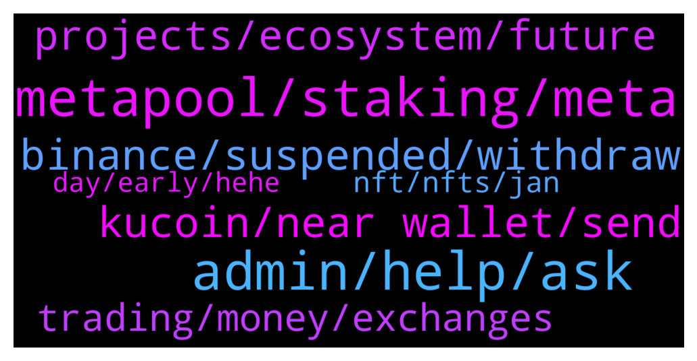

# **@cryptonear**
 ## Analysis for **2022-01-13** - **2022-01-14**.

---

## 📊 **Basic Stats**

**n_messages_sent**: 759

---

---

## 🔝 **Top keywords and related messages**

1. **metapool, staking, meta**

    @mv_the_realone --- *Larry, I lost a huge amount of money $30k, swapping on ref finance. They are not helping. Who can I contact on near team to help with this?* **--->** [TG Discussion](https://t.me/cryptonear/285524)

    @GeorgePro1 --- *1. MetaPool (https://metapool.app/dapp/mainnet/meta/#)  distributes the tokens proportionally to the validators, so no worries which validator to choose. 2. You still get ~11% APY on your $NEAR, and withdraw NEAR whenever you want without waiting (with fee). 3. On top of that you get MetaPools $META token payed out daily 4. You get stNear which can be used on other DeFi applications such as app.ref.finance* **--->** [TG Discussion](https://t.me/cryptonear/284041)

    @a1sunny --- *Any minimum or maximum quantity and date for staking? When will be we get awards/meta* **--->** [TG Discussion](https://t.me/cryptonear/284142)

    @kv9990 --- *You'll need to stake minimum 1 $NEAR on metapool* **--->** [TG Discussion](https://t.me/cryptonear/284151)

    @fiolalala --- *Where is a relatively large liquidity pool for swap in meta, oin / wnear?* **--->** [TG Discussion](https://t.me/cryptonear/285079)

    @ieatapple --- *Right - so then why do I want to do it on Metapool then? Is it cos of the advantage of fast unstaking?* **--->** [TG Discussion](https://t.me/cryptonear/285672)

2. **admin, help, ask**

    @iangfox --- *Hi is there an admin I can to, I can’t claim my account and I sent some near there already* **--->** [TG Discussion](https://t.me/cryptonear/285263)

    @wardlaw --- *Admini should have a better answer* **--->** [TG Discussion](https://t.me/cryptonear/284534)

    @mv_the_realone --- *I can dm you and send details* **--->** [TG Discussion](https://t.me/cryptonear/285543)

    @rafaeldbh1 --- *Yeah, admin. Already got help. TY* **--->** [TG Discussion](https://t.me/cryptonear/284154)

    @larry_lang --- *may i ask what is adm?* **--->** [TG Discussion](https://t.me/cryptonear/284148)

    @mv_the_realone --- *Are you admin? Can I dm?* **--->** [TG Discussion](https://t.me/cryptonear/285529)

3. **binance, suspended, withdraw**

    @masstahcoiner --- *it's happening weekly/monthly  and as reputation of binance exchange and l33t near team  i am sure you have some communication with binance dev support team* **--->** [TG Discussion](https://t.me/cryptonear/284328)

    @Lloyd75 --- *Guys do you know if withdraw from binance will be soon available again ? I try to set up my wallet but I can't withdraw* **--->** [TG Discussion](https://t.me/cryptonear/285520)

    @Ryan Campbell --- *Good morning, Any idea How long before we can deposit near to binance. It’s been suspended for quite a long while?* **--->** [TG Discussion](https://t.me/cryptonear/285160)

    @FaisalRobbiR --- *My near gift from binance is invalid , solved?* **--->** [TG Discussion](https://t.me/cryptonear/283791)

    @masstahcoiner --- *don't have bank anymore, don't have $ on acc anymore  money is scam   ALL IN near wallet and on shitty centralized binance    must withdraw all to privat wallet* **--->** [TG Discussion](https://t.me/cryptonear/284505)

    @masstahcoiner --- *NEAR network withdrawal suspended. Withdrawals can be processed through alternative networks. Subscribe to network recovery reminders to receive updates.    this is noob* **--->** [TG Discussion](https://t.me/cryptonear/284302)

4. **kucoin, near wallet, send**

    @xMetaCrypt --- *Guys don’t use Kucoin for withdrawals! Taking ages!* **--->** [TG Discussion](https://t.me/cryptonear/284581)

    @xMetaCrypt --- *If that happens I will book a flight to the KuCoin office and ask for compensation 😂* **--->** [TG Discussion](https://t.me/cryptonear/284637)

    @Ryan Campbell --- *Hi with near on near wallet, is then anyplace you can send it or swap it to Usdt or Usdc besides binance.* **--->** [TG Discussion](https://t.me/cryptonear/285331)

    @kv9990 --- *Deposit it to 64 digits deposit address from binance/kucoin on "NEAR NETWORK" only!* **--->** [TG Discussion](https://t.me/cryptonear/284980)

    @iamkemoo --- *Hey mate, here is how you can avoid the suspension:  - Sell your $NEAR to $USDT - send $USDT on Tron Network for free to KuCoin - Buy $NEAR with $USDT - Send $NEAR to wallet - Use Ref Finance  Hope this helps you* **--->** [TG Discussion](https://t.me/cryptonear/284315)

    @jayendra10 --- *Frm kucoin transfer which address will we need* **--->** [TG Discussion](https://t.me/cryptonear/285046)

5. **projects, ecosystem, future**

    @kv9990 --- *#Future_is_MultiChain ,no disrespect for other projects pls. 👀✌️* **--->** [TG Discussion](https://t.me/cryptonear/284455)

    @iamkemoo --- *Yes, with Simple Nightshade upgrade, which should be done end of 2022.* **--->** [TG Discussion](https://t.me/cryptonear/285678)

    @TheGo1denBull --- *Imagine when more devs realize the advantages of building on NEAR* **--->** [TG Discussion](https://t.me/cryptonear/283616)

    @l_webster --- *So many intigrations to this project* **--->** [TG Discussion](https://t.me/cryptonear/283984)

    @VCCrescit --- *Hi guys! If you're following near and its ecosystem, which projects are on your radar? I only know aurora and Solaris, but don't know many upcoming projects yet* **--->** [TG Discussion](https://t.me/cryptonear/284108)

    @masstahcoiner --- *what is OIN project on nera?* **--->** [TG Discussion](https://t.me/cryptonear/283963)

6. **trading, money, exchanges**

    @TheGo1denBull --- *Good job man. We all have much more to acquire this decade and beyond. Stay true to yourself and don't be one of the d heads in the crypto space* **--->** [TG Discussion](https://t.me/cryptonear/284653)

    @Aflatoon123 --- *Thats quite a lot of time.  In eth i saw a sale being gone in less than a second. Imagine eth working faster than near😂 They used 1.3 ethereum approx as their gas fees for the same.* **--->** [TG Discussion](https://t.me/cryptonear/285119)

    @masstahcoiner --- *no need for $ anymore   even bills i can pay with crypto  over payment processor* **--->** [TG Discussion](https://t.me/cryptonear/284510)

    @masstahcoiner --- *crypto is future  every month more and more business people own crypto use crypto  fee's are smaller* **--->** [TG Discussion](https://t.me/cryptonear/284512)

    @masstahcoiner --- *my keys my power  f+++ banksters and third world order* **--->** [TG Discussion](https://t.me/cryptonear/284506)

    @masstahcoiner --- *banksters $ politics are scammers they have scenarios — crypto is power to the people* **--->** [TG Discussion](https://t.me/cryptonear/284517)

7. **nft, nfts, jan**

    @vsx007 --- *@TheGo1denBull I like the expensive NFT in your profile btw ☺️* **--->** [TG Discussion](https://t.me/cryptonear/284700)

    @TheGo1denBull --- *Which one is that? I don't have anything expensive in NFTs* **--->** [TG Discussion](https://t.me/cryptonear/284702)

    @Blencha --- *I don't knw y people buy nft* **--->** [TG Discussion](https://t.me/cryptonear/284708)

    @Blencha --- *You can create those nft it's easy. I don't knw y people lik that stuff* **--->** [TG Discussion](https://t.me/cryptonear/284704)

    @vsx007 --- *If you buy these, they provide you 3d model files and much more. A dashboard to change anything in the NFT* **--->** [TG Discussion](https://t.me/cryptonear/284729)

    @vsx007 --- *I had seen in a garyvee video where he said we can provide certificates in form of NFT.* **--->** [TG Discussion](https://t.me/cryptonear/284726)

