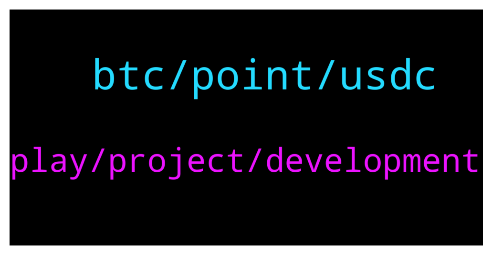

# **@de_fi**
 ## Analysis for **2022-01-13** - **2022-01-14**.

---

## 📊 **Basic Stats**

**n_messages_sent**: 37

---

---

## 🔝 **Top keywords and related messages**

1. **btc, point, usdc**

    @xnatasx --- *Btc is the most decentralized. Had the fairest launch. Is the most secure. Is basically free to send over lightning. Has a fixed supply with reducing inflation...* **--->** [TG Discussion](https://t.me/de_fi/233948)

    @Me_Jakob --- *BTC is most decentralised- but governments can control miners, miners can control price. Isn’t it? BTC transactions are quantum vulnerable. It’s just a matter of time when China or whoever else will reach quantum supremacy. And lightning network is just and banking system as big coders says.. Maybe I’m wrong and I need some deeper research, but in comparing BTC with NXS it’s still a lot of things that BTC is missing.* **--->** [TG Discussion](https://t.me/de_fi/233950)

    @Mark --- *Buy BTC and wait for 100KUSD this year😂* **--->** [TG Discussion](https://t.me/de_fi/233938)

    @xnatasx --- *To be part of an alternative economy. Own censorship resistant, immutable digital assets...?* **--->** [TG Discussion](https://t.me/de_fi/233946)

    @xnatasx --- *Yeah, don't think it has to do with gas, but liquidity.* **--->** [TG Discussion](https://t.me/de_fi/233962)

    @xnatasx --- *Oh, no. I talked about how Strike utilize usdt  https://twitter.com/jackmallers/status/1480964599768059905* **--->** [TG Discussion](https://t.me/de_fi/233968)

2. **play, project, development**

    @never_sold_a_decimal --- *Hey guys is it ok to share a project I’ve come across* **--->** [TG Discussion](https://t.me/de_fi/233991)

    @Frankie --- *Hmmm. I haven't heard of that. Tell me more bout it.* **--->** [TG Discussion](https://t.me/de_fi/234171)

    @dereksilva --- *This depends on the jurisdiction. I think most are now registering DAOs in Wyoming, foundations in crypto friendly countries, or corporations in exotic locales like British Virgin Islands or the Canary Islands. That entity holds funds AMA can pay contractors via invoice.   Or you go full decentralization and don’t register a thing. The contractors are solely responsible for their personal taxes.* **--->** [TG Discussion](https://t.me/de_fi/234156)

    @Frankie --- *Ohhh. Sounds fun. Where do I play it?* **--->** [TG Discussion](https://t.me/de_fi/234173)

    @Frankie --- *Heyya! Looking for NFT games to play. Got any suggestions?* **--->** [TG Discussion](https://t.me/de_fi/234169)

    @r_u_l_e --- *Hi all, I have a few questions that maybe someone can help me with. When building a defi protocol does the team behind the development need to be incorporated somewhere? How, for example, are the employees paid or where is the initial funding for the project held? In a bank under the LLC of the project?* **--->** [TG Discussion](https://t.me/de_fi/234123)

