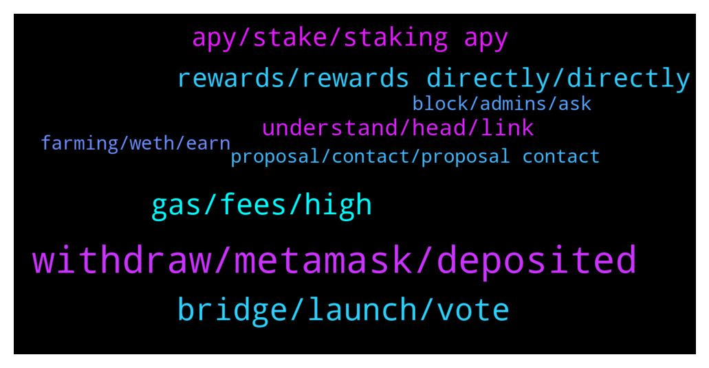

# **@dypfinance**
 ## Analysis for **2022-01-13** - **2022-01-14**.

---

## 📊 **Basic Stats**

**n_messages_sent**: 203

---

---

## 🔝 **Top keywords and related messages**

1. **withdraw, metamask, deposited**

    @monstar126 --- *And 1 last question Can I withdrawal it any time* **--->** [TG Discussion](https://t.me/dypfinance/239698)

    @DhoniMSD516 --- *Then in this case try depositing some amount again, and next withdraw full amount and this tike complete 2 transactions* **--->** [TG Discussion](https://t.me/dypfinance/239749)

    @LimitMiza --- *what the hell is this, the cost of approving deposit and deposit i spent $2+ and now i can't withdraw even though i chose stake without minimum time* **--->** [TG Discussion](https://t.me/dypfinance/239630)

    @DhoniMSD516 --- *The iDYP you deposited in farms is your claimed iDYP and there is no lock for it, so if you withdraw as iDYP after your farm lock you can trade it freely* **--->** [TG Discussion](https://t.me/dypfinance/239411)

    @IbnuFals --- *oh yess, it works sir. but please fix this sir, even though the user cancels the transaction on metamask, please be able to immediately make a withdrawal to confirm 2 times on metamask. please fix what happened to me🙏* **--->** [TG Discussion](https://t.me/dypfinance/239755)

    @IbnuFals --- *this doesn't work sir, the confirmation in metamask still doesn't show up* **--->** [TG Discussion](https://t.me/dypfinance/239753)

2. **bridge, launch, vote**

    @alvindrajw --- *Can we expect listing before jan 31...* **--->** [TG Discussion](https://t.me/dypfinance/239578)

    @iamJubi --- *Hello. ICO was already done back in 2020. If you are referring to the NFT, there is no exact minting date yet.* **--->** [TG Discussion](https://t.me/dypfinance/239257)

    @Ame --- *Hello, When is the first launchpad project expected ? Or when can we get any updates or teasers about the first project to be launched on DYP platform ?* **--->** [TG Discussion](https://t.me/dypfinance/239417)

    @cryptocade --- *Will polychain be included in the bridge?* **--->** [TG Discussion](https://t.me/dypfinance/239251)

    @MJMuppet_JayJay --- *So since the vote seems to be going to pass, will the bridge launch today?* **--->** [TG Discussion](https://t.me/dypfinance/239829)

    @iamJubi --- *We love to listen to our community so the Governance proposal for the launch of the iDYP Bridge is now available multi-chain for all the users.  Binance Smart Chain Proposal https://gov-bsc.dyp.finance/proposals/7  Ethereum Chain Proposal https://gov.dyp.finance/proposals/15  Avalanche Chain Proposal https://gov-avax.dyp.finance/proposals/3  At the end of the vote, we will sum up all the votes across all the chains. Don't forget, that we need your vote regarding the #iDYP Bridge Launch!* **--->** [TG Discussion](https://t.me/dypfinance/239625)

3. **gas, fees, high**

    @ThunderChaos --- *Why "Reinvest" fee for Dyp is again 0.006 BNB when it was halved for a period of time? Fee is too high!* **--->** [TG Discussion](https://t.me/dypfinance/239318)

    @Twittsbets --- *Why is it caliming the reward in ETH the gas is ridiculously insanely high?  I know Eth gas fees is high but like 3 times high here.* **--->** [TG Discussion](https://t.me/dypfinance/239428)

    @Twittsbets --- *Now the gas is 3 times more that my reward 😁😁😁* **--->** [TG Discussion](https://t.me/dypfinance/239437)

    @jstby --- *How come the transaction fee so expensive? Around 0.03 avax?* **--->** [TG Discussion](https://t.me/dypfinance/239587)

    @Twittsbets --- *my claim is only $200 and the gas is $1000 geez!* **--->** [TG Discussion](https://t.me/dypfinance/239432)

    @DhoniMSD516 --- *That is the max fees to be charged the actual fees will be way less* **--->** [TG Discussion](https://t.me/dypfinance/239588)

4. **rewards, rewards directly, directly**

    @WatermelonNoia --- *Hey DYP, is a DYP credit card still on the horizon?  I saw this and thought id share:  https://twitter.com/HathorNetwork/status/1480839575190880256?t=Atq8SXuux0NrguIR_9SGHg&s=19* **--->** [TG Discussion](https://t.me/dypfinance/239313)

    @NoMoreStressed --- *did dyp ath on kucoin ?* **--->** [TG Discussion](https://t.me/dypfinance/239356)

    @DhoniMSD516 --- *https://www.youtube.com/c/DeFiYieldProtocol/videos You can find tutorial here to setup wallets and using DYP products* **--->** [TG Discussion](https://t.me/dypfinance/239678)

    @John --- *Hi, I am in Eth 90 day stake pool. My dyp rewards have gone from over 800 to 760 today. Would be grateful if you could tell me the reason for this* **--->** [TG Discussion](https://t.me/dypfinance/239472)

    @iamJubi --- *Buy DYP https://dyp.finance/buyDYP You can check our products here https://t.me/dypfinance/229271* **--->** [TG Discussion](https://t.me/dypfinance/239258)

    @Wen Hsiang --- *Why is my dyp reward on the avax farm decreasing?* **--->** [TG Discussion](https://t.me/dypfinance/239413)

5. **apy, stake, staking apy**

    @DhoniMSD516 --- *This APY is based on Staking APY, so you can check Staking APY's* **--->** [TG Discussion](https://t.me/dypfinance/239693)

    @Stkim87 --- *But as you mentioned, iDYP price will impact the staking pool APY also.* **--->** [TG Discussion](https://t.me/dypfinance/239294)

    @Stkim87 --- *Actually I would want to know what factors impact to APY for STAKE.* **--->** [TG Discussion](https://t.me/dypfinance/239283)

    @Paulus --- *How can i check the APY for DYP in farming?* **--->** [TG Discussion](https://t.me/dypfinance/239687)

    @Stkim87 --- *Is there any doc or white paper regarding how to calculate STAKE APY %?* **--->** [TG Discussion](https://t.me/dypfinance/239281)

    @hemanrock --- *please check more from here https://t.me/dypfinance/229271 . FARMS/STAKE/Buyback has various pools with APY* **--->** [TG Discussion](https://t.me/dypfinance/239457)

6. **understand, head, link**

    @monstar126 --- *Please share me the Vedio so that i can understand it* **--->** [TG Discussion](https://t.me/dypfinance/239680)

    @monstar126 --- *But not understand properly can you please explain it in short words* **--->** [TG Discussion](https://t.me/dypfinance/239669)

    @DhoniMSD516 --- *Sure you can head here https://t.me/dypfinance/229271 this message include all our products and explains how they work* **--->** [TG Discussion](https://t.me/dypfinance/239666)

    @monstar126 --- *I m new So i want to know about this* **--->** [TG Discussion](https://t.me/dypfinance/239665)

    @hemanrock --- *please check this https://t.me/dypfinance/229271 also youtube tutorials https://www.youtube.com/c/DeFiYieldProtocol/videos* **--->** [TG Discussion](https://t.me/dypfinance/239503)

    @DhoniMSD516 --- *Actually used basic English so try to understand a bit and it can be easy :)* **--->** [TG Discussion](https://t.me/dypfinance/239685)

7. **farming, weth, earn**

    @DhoniMSD516 --- *Ok in Farming you can deposit assets like ETH, BNB, USDT, AVAX etc, and these asset you deposited is converted 75% to LP pair on which you earn rewards WBNB/WETH/WAVAXX and 25% is converted to DYP on which you earn DYP as rewards https://dyp.finance/farmv2 Farming is available on ETH, BSC and AVAXX chains* **--->** [TG Discussion](https://t.me/dypfinance/239672)

    @hemanrock --- *FARMS work this way. please check this   Ex: Consider a scenario wherein you deposit WETH $1000, the smart contract will split the WETH $1000 in two parts: WETH $750 is added to Uniswap ETH/iDYP LP and WETH $250 is sent to DYP Staking with 200% APY.   you can read more about it from here https://dypfinance.medium.com/staking-farming-and-buyback-v2-is-live-on-ethereum-c08cb2fa11cd* **--->** [TG Discussion](https://t.me/dypfinance/239480)

    @monstar126 --- *Oh after that how can I cheak my farming* **--->** [TG Discussion](https://t.me/dypfinance/239727)

    @DhoniMSD516 --- *Check our various staking and farming tools where you can earn passive income https://dyp.finance/earnv2* **--->** [TG Discussion](https://t.me/dypfinance/239408)

    @DhoniMSD516 --- *You can use Metamask, Trustwallet, Coin98 wallets and participate in our farming* **--->** [TG Discussion](https://t.me/dypfinance/239677)

    @Idaveofficial --- *I put on farm  v2 for 30 days BSC side. I hope i made a right decision.* **--->** [TG Discussion](https://t.me/dypfinance/239192)

8. **block, admins, ask**

    @DhoniMSD516 --- *Hey firstly we don't have a wallet, if your friends got scammed ask them to check google on how to avoid further loss, we always keep on saying never accept dm's claiming who are admins and never click links* **--->** [TG Discussion](https://t.me/dypfinance/239808)

    @luruch --- *I have some friends with yours wallets scammed, how can a allowance(revoke token) protect they?* **--->** [TG Discussion](https://t.me/dypfinance/239807)

    @nguyenngocthai --- *If they are here, you can block or kich them* **--->** [TG Discussion](https://t.me/dypfinance/239349)

    @DhoniMSD516 --- *Please report and block all of them we admins will never DM you FIRST* **--->** [TG Discussion](https://t.me/dypfinance/239345)

    @nguyenngocthai --- *After i ask, a lot of supporter call me and DM me* **--->** [TG Discussion](https://t.me/dypfinance/239342)

    @DhoniMSD516 --- *Hey we have included DeFi Research and Integration for spending Interests via Debit Cards in our roadmap already for Q3-Q4 2022 https://dyp.finance/roadmap* **--->** [TG Discussion](https://t.me/dypfinance/239317)

9. **proposal, contact, proposal contact**

    @mdmonir1 --- *Hello everyone I Have an AMA   proposal, whom should I contact to directly discuss about it?* **--->** [TG Discussion](https://t.me/dypfinance/239615)

    @yangxt --- *Hello, I am listing BD of  XT Exchange. Who should I contact to discuss listing and marketing cooperation? Thank you.* **--->** [TG Discussion](https://t.me/dypfinance/239298)

    @Ana_ahmedsa --- *I Have a business proposal about creating an Arabic telegram community for $DeFi* **--->** [TG Discussion](https://t.me/dypfinance/239181)

    @King7oda --- *I Have a business proposal about creating an Arapic telegram community Who should i dm?* **--->** [TG Discussion](https://t.me/dypfinance/239230)

    @DhoniMSD516 --- *Hey please email your proposal to contact@dyp.finance* **--->** [TG Discussion](https://t.me/dypfinance/239616)

    @WatermelonNoia --- *Not promoting Hathor, just the CC idea* **--->** [TG Discussion](https://t.me/dypfinance/239314)

