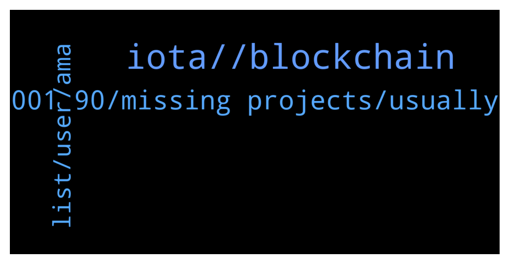

# **@iotatangle**
 ## Analysis for **2022-01-13** - **2022-01-14**.

---

## 📊 **Basic Stats**

**n_messages_sent**: 53

---

---

## 🔝 **Top keywords and related messages**

1. **iota, , blockchain**

    @everyday_burns_a_hole_in_my_soul --- *Isnt iota much more than regular blockchain ?* **--->** [TG Discussion](https://t.me/iotatangle/306739)

    @papygus --- *Hello, do you know some projects who are developing on Iota ? Especially in DeFi ?* **--->** [TG Discussion](https://t.me/iotatangle/306707)

    @ghelutzu --- *Hello,  Are there any airdrops/ido s that you know that are being planned on iota?* **--->** [TG Discussion](https://t.me/iotatangle/306778)

    @tristanc --- *It would be nice to know which network these projects are going to be on, Shimmer or Assembly.* **--->** [TG Discussion](https://t.me/iotatangle/306717)

    @papygus --- *Double spending on GoShimmer network ?* **--->** [TG Discussion](https://t.me/iotatangle/306765)

    @Basti --- *Altcoin Gordon (@AltcoinGordon) Tweeted: Some of the OG coins are making a comeback this year 👀 $IOTA https://twitter.com/AltcoinGordon/status/1481220089613635587?s=20* **--->** [TG Discussion](https://t.me/iotatangle/306629)

2. **001 90, missing projects, usually**

    @cbedon --- *It was trending under technology pbly I got over exited* **--->** [TG Discussion](https://t.me/iotatangle/306732)

    @N1ghtBl00d --- *usually i know that big projects with ecosystem run btween 0.001 to 0.90* **--->** [TG Discussion](https://t.me/iotatangle/306647)

    @Tahmis --- *It's under development so no need to worry. This is good that they found a bug* **--->** [TG Discussion](https://t.me/iotatangle/306766)

    @itsmedev --- *Did you even read this message* **--->** [TG Discussion](https://t.me/iotatangle/306671)

    @Pantra86 --- *I know , i am talking about prediction after launching.* **--->** [TG Discussion](https://t.me/iotatangle/306646)

    @N1ghtBl00d --- *i believe so much in this project* **--->** [TG Discussion](https://t.me/iotatangle/306669)

3. **list, user, ama**

    @cryptopioneer678 --- *Hi admin.  Where can i find info over decensored social media?* **--->** [TG Discussion](https://t.me/iotatangle/306632)

    @Tahmis --- *Maybe send a message to the list maker: https://twitter.com/Odd_Kesson/status/1478133195254161413?s=20* **--->** [TG Discussion](https://t.me/iotatangle/306718)

    @Tahmis --- *Probably at their website or discord: https://discord.com/invite/NzCQJ53q* **--->** [TG Discussion](https://t.me/iotatangle/306633)

    @Tahmis --- *Yeah ;) Started to do this for all quite obvious scam bots before banning so other people hopefully learn to recognize them also :)* **--->** [TG Discussion](https://t.me/iotatangle/306776)

    @tristanc --- *@admin , We have a user in the group who has been trying to impersonate me in the groups where I am an administrator, please ban him and report him , the user is @triistanc* **--->** [TG Discussion](https://t.me/iotatangle/306698)

    @Tahmis --- *Maybe check this community member made list:* **--->** [TG Discussion](https://t.me/iotatangle/306708)

