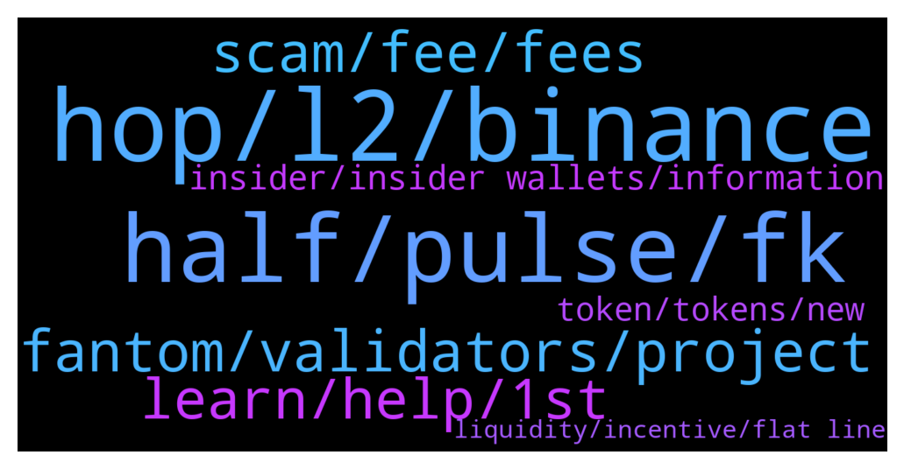

# **@lobsters_chat**
 ## Analysis for **2022-01-13** - **2022-01-14**.

---

## 📊 **Basic Stats**

**n_messages_sent**: 395

---

---

## 🔝 **Top keywords and related messages**

1. **hop, l2, binance**

    @syed_jafri --- *Just tried li.finance, best route for 20 ETH from Ethereum to Arbitrum shows Connext for 19.918 ETH  Your site says hop supported, but using hop directly quotes 20.004* **--->** [TG Discussion](https://t.me/lobsters_chat/315542)

    @syed_jafri --- *—  My favorite bridge idea is: https://www.layerswap.io/  Why? Binance<>Binance transfers are free L2<>L2 TXs are cheap  User sends from their Binance to LayerSwap Binance LayerSwap sends from their L2 account to user's L2 account* **--->** [TG Discussion](https://t.me/lobsters_chat/315543)

    @tufuntu --- *Is there any NFT lending platform running on chain?* **--->** [TG Discussion](https://t.me/lobsters_chat/315616)

    @samkazemian --- *Ya there's been a lot of people saying that the FRAX-FXS pair doesn't always route properly because it is a Uni v2 pair and Uni v3 router misses it. It's a shame because it is a $150m liquid pool https://v2.info.uniswap.org/pair/0xe1573b9d29e2183b1af0e743dc2754979a40d237* **--->** [TG Discussion](https://t.me/lobsters_chat/315030)

    @calchulus --- *so for a lot of chains, i think that getting the EVM compatible module as the onramp to bring on users familiar with those wallets is huge* **--->** [TG Discussion](https://t.me/lobsters_chat/315519)

    @degengineer --- *if they were on L2 most wouldnt care about them* **--->** [TG Discussion](https://t.me/lobsters_chat/315297)

2. **half, pulse, fk**

    @alexandomega --- *Then I'm dumb af. Knowing is half the battle ☺️ Will go back into hiding and look again.* **--->** [TG Discussion](https://t.me/lobsters_chat/315017)

    @ivangbi --- *Anybody had an answer? Might ape* **--->** [TG Discussion](https://t.me/lobsters_chat/315093)

    @ivangbi --- *Crap I missed it Fk I suck sorry @kingjacob ❤️  What do I do more, shill please* **--->** [TG Discussion](https://t.me/lobsters_chat/315202)

    @ivangbi --- *Robin going legal, I think I have seen it all 😕 Ser they are all reptiles, cancel them and redpill. Is the only way. They r all dumb.* **--->** [TG Discussion](https://t.me/lobsters_chat/315250)

    @jefftt --- *i guess pulse chain finally got fucked* **--->** [TG Discussion](https://t.me/lobsters_chat/315374)

    @yic_alex --- *https://twitter.com/lex_node/status/1481664100207927303  Interesting thread. You can feel the frustration while reading it.* **--->** [TG Discussion](https://t.me/lobsters_chat/315328)

3. **fantom, validators, project**

    @vincentweisser --- *great checklist on crypto legal by silke, gc at gnosis  https://docs.google.com/document/d/1GRNrmyuX1Wrs5dOpCeWhz6DdQteouAEMPzRqMFjbjYo/edit* **--->** [TG Discussion](https://t.me/lobsters_chat/315025)

    @PmRiviere --- *Good to see coop between crypto-native startups and payment rails OGs. The two won an important competition in CBDC space recently, and I think consensys even got recognize for two different projects. Bit salty cos my team didn’t make it first but lots of good things going on and heavily influenced by crypto natives. Projects are described here if anyone want to check https://www.mas.gov.sg/-/media/MAS-Media-Library/development/fintech/CBDC/Global-CBDC-Challenge-Report-2021.pdf* **--->** [TG Discussion](https://t.me/lobsters_chat/315325)

    @fiskantes --- *I am not looking for fake assurance nor industry wide caveats…not my first day here, I am avoiding rugs quite well 🙂  just asking if you guys have any assesment about Fantom bridge and validators specifically* **--->** [TG Discussion](https://t.me/lobsters_chat/315226)

    @cryptouf --- *If you know any leader or someone involved in contributors compensation in a project and happy to share the point of view of the project please let me know. WOuld like to write a second part of this article  https://twitter.com/cryptouf/status/1481255998937567232* **--->** [TG Discussion](https://t.me/lobsters_chat/315020)

    @alonelydot --- *Hey all — looking to add more technical resources to this crypto knowledge hub as the new year kicks in. If anyone has authored or read any to propose, feel free to reach out. Thanks! https://immersionden.xyz* **--->** [TG Discussion](https://t.me/lobsters_chat/315590)

    @fiskantes --- *Just asking if there is a security assesment somewhere, who controls the keys, who are the validators 🙂 maybe there is an article written on it? Couldnt find anything googling tho* **--->** [TG Discussion](https://t.me/lobsters_chat/315258)

4. **learn, help, 1st**

    @am0ral --- *U dont learn with Kyber though ))* **--->** [TG Discussion](https://t.me/lobsters_chat/315439)

    @egasdoteth --- *either this or use KyberSwap... :)* **--->** [TG Discussion](https://t.me/lobsters_chat/315436)

    @D41LL --- *Guys, what groups do you still sit in? Where is the normal live communication and responsive community to help with questions for newbies and beyond?* **--->** [TG Discussion](https://t.me/lobsters_chat/315098)

    @farm42 --- *Also suggest reading this study https://www.researchgate.net/publication/221568969_Peer-to-Peer_Communities_Formation_and_Discovery* **--->** [TG Discussion](https://t.me/lobsters_chat/314990)

    @Inevitabilis0x --- *Anyone knows any better resources to learn cairo other than these? Was looking at resources here but seems not really beginner friendly (dun even have a hello world section haha)  Official doc https://www.cairo-lang.org/docs/  Awesome starknet https://github.com/gakonst/awesome-starknet* **--->** [TG Discussion](https://t.me/lobsters_chat/315611)

    @egasdoteth --- *Hence if you want to learn etherscan/web3js this is not the best 1st exercise...* **--->** [TG Discussion](https://t.me/lobsters_chat/315441)

5. **scam, fee, fees**

    @manilp --- *its not fair and clean. CREAM team holds >$60mm they owe people who lost in the hack and they have not even discussed it for months* **--->** [TG Discussion](https://t.me/lobsters_chat/315197)

    @Walkadbout --- *Contract is verified and open for reviews but people calling it a scam already.. please* **--->** [TG Discussion](https://t.me/lobsters_chat/315168)

    @Joel_john --- *you are just mad they didnt give u money* **--->** [TG Discussion](https://t.me/lobsters_chat/315188)

    @Walkadbout --- *How is that a scam honeypot? They decided the tokenomics of their token, that's an arbitrary decision you can pinpoint but calling it straight a "honeypot scam" is misleading at least* **--->** [TG Discussion](https://t.me/lobsters_chat/315177)

    @ivangbi --- *Like actually in the territory of a scam honeypot* **--->** [TG Discussion](https://t.me/lobsters_chat/315165)

    @nickbtts --- *do you not remember KAT (kryptsu automated trading)...so many people done over by 'automated' trading and mex scamwicks over the years* **--->** [TG Discussion](https://t.me/lobsters_chat/315617)

6. **insider, insider wallets, information**

    @alexandomega --- *I wouldn't be so sure that he's tracking insider wallets (and whether there are any "insider wallets" to begin with). Did a thorough analysis of wallet transactions prior to all listings in Nov/Dec and found nothing at all (and doing this retrospectively should be easy, shouldn't it).* **--->** [TG Discussion](https://t.me/lobsters_chat/315012)

    @JoeHav --- *Not the point, that account clearly is tracking some insider wallets buying up coins planned to be listed on coinbase* **--->** [TG Discussion](https://t.me/lobsters_chat/315002)

    @farm42 --- *In addition, a real insider would be enough to mention a couple of times that he has such data to find such a patron, the cooperation with which would make him extemely rich without taking on unnecessary risks. And he wouldn't need to make a Twitter account. Big secrets (as well as big money) don't like publicity IMO.* **--->** [TG Discussion](https://t.me/lobsters_chat/315023)

    @ivangbi --- *Darren share here now you skemmer* **--->** [TG Discussion](https://t.me/lobsters_chat/315078)

    @LilMoonLamboX3 --- *and he shares it on twitter?* **--->** [TG Discussion](https://t.me/lobsters_chat/315004)

    @sourcex --- *Does anyone know if it's possible to find the TheBlock quiz that was shared on Twitter?    Any working links* **--->** [TG Discussion](https://t.me/lobsters_chat/315352)

7. **token, tokens, new**

    @Snowsledge --- *This is more of an index fund than a project token. Supply is uncapped for future bonding.* **--->** [TG Discussion](https://t.me/lobsters_chat/315058)

    @manilp --- *yep, someone put it well in the discord: Rebranding and new token as cover for dilution. Like a sketchy reverse merger* **--->** [TG Discussion](https://t.me/lobsters_chat/315199)

    @admiralape --- *Ain't nobody worried the biggest trustless eth2 staking service (lido) is incentivising sol stakers and giving them loads of dao vote tokens to later control the destiny of eth2? sbf much.* **--->** [TG Discussion](https://t.me/lobsters_chat/315573)

    @WBYmen --- *And I have yet to see their actual use case for the token, they said they are going to develop a dashboard for something. But giving the history of fees.wtf, it doesn't seem very required.* **--->** [TG Discussion](https://t.me/lobsters_chat/315282)

    @ivangbi --- *Haha gold, think @Joel_john made it. Anyway it’s still hard af to make this because you literally have to give new / other tokens to people (like, your own token in case of rabbithole) or people will just go and work/contribute for those DAOs directly. So these become like institutional bodies helping ur corporate nah idk* **--->** [TG Discussion](https://t.me/lobsters_chat/315481)

    @Snowsledge --- *Every token except those allocated to founders and ops team is backed by cards behind it.* **--->** [TG Discussion](https://t.me/lobsters_chat/315059)

