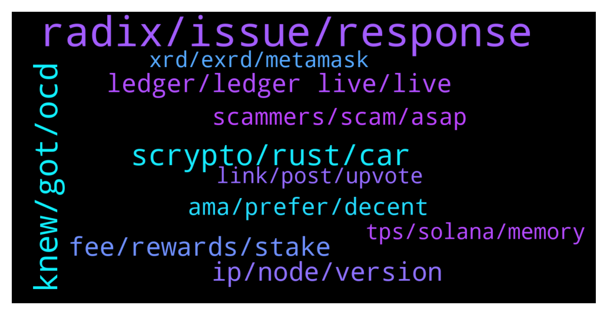

# **@radix_dlt**
 ## Analysis for **2022-01-13** - **2022-01-14**.

---

## 📊 **Basic Stats**

**n_messages_sent**: 504

---

---

## 🔝 **Top keywords and related messages**

1. **radix, issue, response**

    @Lawrence --- *Random question..Ok. How does radix become world known and the utilised ?* **--->** [TG Discussion](https://t.me/radix_dlt/338959)

    @Burns246 --- *Thanks on the website it says Radix is 1000x more scalable but can only do 150 TPS whereas Solana which is in beta can do over 20k TPS. Why is this? Just keen to learn about Redix* **--->** [TG Discussion](https://t.me/radix_dlt/338888)

    @soulkiller7 --- *https://t.me/radix_dlt/336966   Yeah highly suggest you take a look at this. It compares radix to many competitors and explains why radix is in a better position compared to others for the future.  Reading it is a crypto hack👀* **--->** [TG Discussion](https://t.me/radix_dlt/339163)

    @fpieper --- *Probably this is part of the general visoned Radix Babylon wallet. Besides that there is Moniker from Adept DAO https://t.me/RadixDevelopers/18032.  However, I would suggest to develop a naming service on neutral ground supported by the whole community (not part of another project), since the implementation is rather easy and straightforward (and mainly depends on the future capabilities of Babylon https://t.me/RadixDevelopers/16522).  IMHO the best way to achieve a common standard would be to onboard the whole dev community in a shared project (which then could maybe even serve as playground of a Radix core version and could be replaced by that in the long term).* **--->** [TG Discussion](https://t.me/radix_dlt/338727)

    @Radstakes --- *There's a list over on Radix talk here: https://radixtalk.com/t/why-do-i-have-these-weird-tokens-in-my-wallet/128  Also check out radixlist.com* **--->** [TG Discussion](https://t.me/radix_dlt/338801)

    @Burns246 --- *Radix sounds similar to Cardano i.e. more methodical approach to blockchain technology but could be in danger of falling behind if moving too slowly?* **--->** [TG Discussion](https://t.me/radix_dlt/338904)

2. **knew, got, ocd**

    @Shang En --- *Sorry I still don’t know can you explain more thank you* **--->** [TG Discussion](https://t.me/radix_dlt/339224)

    @SpaceClaim --- *It is an issue if I got mild OCD 😂😂* **--->** [TG Discussion](https://t.me/radix_dlt/338653)

    @AboThamer00 --- *Just got this after my question here* **--->** [TG Discussion](https://t.me/radix_dlt/338599)

    @aus87 --- *what if I want another? lol* **--->** [TG Discussion](https://t.me/radix_dlt/339002)

    @danhughes --- *might have started a fight I CBA with right now* **--->** [TG Discussion](https://t.me/radix_dlt/339268)

    @soulkiller7 --- *I knew I couldn’t be the only one..* **--->** [TG Discussion](https://t.me/radix_dlt/338613)

3. **scrypto, rust, car**

    @dpawk --- *I've heard Scrypto is kinda similar to Rust so it will be not too hard to learn it for Solana-based project developers, is it true? I'm not a coder 😜* **--->** [TG Discussion](https://t.me/radix_dlt/338841)

    @fpieper --- *To give you an idea, this should help as entry to Scrypto 😊👍 https://t.me/RadixDevelopers/17184 https://developers.radixdlt.com https://youtu.be/Mu8L-BJFfQM* **--->** [TG Discussion](https://t.me/radix_dlt/338575)

    @Jazzer9F --- *The third instalment in the blog series focusing on our new programming language, Scrypto, is now live on the blog!  https://www.radixdlt.com/post/scrypto-an-asset-oriented-smart-contract-language* **--->** [TG Discussion](https://t.me/radix_dlt/339314)

    @MattToTheMoon --- *@Adam_XRD is there any intellectual property behind Scrypto or is it truely open source? Curious if other projects who are currently in their infancy stages would be able to  integrate it into their own projects and immediately compete with radix (other than radix being the first)* **--->** [TG Discussion](https://t.me/radix_dlt/338933)

    @Blind5ight --- *There are also pre-emptive audits that will happen of new pieces of Scrypto code* **--->** [TG Discussion](https://t.me/radix_dlt/339384)

    @sytherax --- *I only looked at scrypto a bit, it looks like a simpler model.* **--->** [TG Discussion](https://t.me/radix_dlt/338778)

4. **fee, rewards, stake**

    @DiamondDallasHands --- *what is the difference of 100% fee and 1% fee?* **--->** [TG Discussion](https://t.me/radix_dlt/338859)

    @Avaunt --- *You just need to stake 1000XRD+ and you'll get one free!* **--->** [TG Discussion](https://t.me/radix_dlt/338997)

    @Cpt_Charles --- *10-12% depending of the total amount that is staked* **--->** [TG Discussion](https://t.me/radix_dlt/338952)

    @DiamondDallasHands --- *Alright. General guideline is 0.3 below fees. Less than 3% share stake and uptime* **--->** [TG Discussion](https://t.me/radix_dlt/338864)

    @Magal36 --- *You probably need 0.6 XRD in your available balance for the fee, it can't be took from the unstaked amount currently.* **--->** [TG Discussion](https://t.me/radix_dlt/338833)

    @Magal36 --- *about 11% but it varies with the total amount staked* **--->** [TG Discussion](https://t.me/radix_dlt/338953)

5. **ip, node, version**

    @Thalrian --- *ok, appears my IP has been banned* **--->** [TG Discussion](https://t.me/radix_dlt/339014)

    @NotBen --- *says i'm on 2.0 and up to date* **--->** [TG Discussion](https://t.me/radix_dlt/339430)

    @saeglopur10 --- *looks like we need the developer mode on in order to download* **--->** [TG Discussion](https://t.me/radix_dlt/339341)

    @mx471 --- *Is this a recent thing? Maybe your ISP has given you a new IP with which someone has done mischief before. You can try to disconnect your router from the Internet and wait a few minutes until you connect it again and see if you can access the page. Otherwise there is https://www.radixscan.io/ as an alternative.* **--->** [TG Discussion](https://t.me/radix_dlt/338593)

    @Stuart_RadixPool --- *Just click the two buttons together. It's in "Developer Mode" so warns you - but is functional after you confirm.* **--->** [TG Discussion](https://t.me/radix_dlt/339398)

    @Sturlison_98 --- *i even changed the archive node. Will try tomorrow again but today no patience left* **--->** [TG Discussion](https://t.me/radix_dlt/338849)

6. **ledger, ledger live, live**

    @Adam_XRD --- *There is no change from a wallet generated from the side-loaded app to the ledger live version on the same ledger device :)* **--->** [TG Discussion](https://t.me/radix_dlt/339347)

    @NotBen --- *ledger live is hanging on the auto update, will try updating that manually and see if it works* **--->** [TG Discussion](https://t.me/radix_dlt/339435)

    @Stuart_RadixPool --- *@arrrvinnn Enable Developer Mode in Ledger Live - Settings > Experimental Features > Enable Developer Mode* **--->** [TG Discussion](https://t.me/radix_dlt/339394)

    @saeglopur10 --- *I think I figured it out! (not sure why I didn't think of this sooner) If you have ledger live open on your comp, it'll boot you from other wallet applications* **--->** [TG Discussion](https://t.me/radix_dlt/339369)

    @saeglopur10 --- *it's giving me the phrase "pending ledger review" then is booting me from the app on my device when trying to use olympia, just a heads up* **--->** [TG Discussion](https://t.me/radix_dlt/339351)

    @saeglopur10 --- *SO everyone make sure that your ledger live is closed before using olympia!* **--->** [TG Discussion](https://t.me/radix_dlt/339370)

7. **ama, prefer, decent**

    @Alex --- *Yeah did that already thank you! But like to hear sometimes community voices go get different angles😊* **--->** [TG Discussion](https://t.me/radix_dlt/339164)

    @L --- *damnnnnn… will this improve in the future?* **--->** [TG Discussion](https://t.me/radix_dlt/338872)

    @Radstakes --- *Welcome Stefan! 👋 - looking forward to seeing the future community marketing initiatives!* **--->** [TG Discussion](https://t.me/radix_dlt/339226)

    @ITProfligate --- *Very, very good!! >> “My goal is to serve the best interest of the community, and to be as transparent about our current and upcoming activities as possible without creating friction or disruptions with incomplete information or unconfirmed plans. It may take weeks to get where we need to be, and for me to be up to speed fully, but we will get there. In a few weeks or early next month, I will do an AMA but I don't have a date in mind yet.”* **--->** [TG Discussion](https://t.me/radix_dlt/339234)

    @saeglopur10 --- *Nice to meet you! Looking forward to what's to come!* **--->** [TG Discussion](https://t.me/radix_dlt/339229)

    @Jacob_XRD --- *Great response!   And have recorded tour AMA request 🙏* **--->** [TG Discussion](https://t.me/radix_dlt/339049)

8. **scammers, scam, asap**

    @Jacob_XRD --- *When you ask a question in the is channel you will often be DM’d by scammers impersonating moderators, team members or Radix support offering to help solve your problem.  An easy way to tell a scam is will never DM you, and we do not offer support via social media.* **--->** [TG Discussion](https://t.me/radix_dlt/339070)

    @wojtekkalka --- *I would like a spam token protection :P ;)* **--->** [TG Discussion](https://t.me/radix_dlt/339098)

    @Blind5ight --- *For an example, you can read thru this example of a scam: https://t.me/RadixDevelopers/14084* **--->** [TG Discussion](https://t.me/radix_dlt/339386)

    @happyDog44647 --- *@Jacob_XRD  pls block this scammer* **--->** [TG Discussion](https://t.me/radix_dlt/339063)

    @happyDog44647 --- *Lots of scammed groups. Make sure you don't reply to any strange DM.* **--->** [TG Discussion](https://t.me/radix_dlt/338819)

    @Magal36 --- *beware that question might make you a target of scammers* **--->** [TG Discussion](https://t.me/radix_dlt/338808)

9. **tps, solana, memory**

    @undenil --- *"In the speech they said with 5 billion mobile phone connections, and 7 billion mobile devices, when aggregated together you could theoretically achieve the 30B TPS" - from constellation (dag)* **--->** [TG Discussion](https://t.me/radix_dlt/338597)

    @NotBen --- *As far as I know, Solana cannot "do over 20k tps" right now. Solana takes the (IMO misleading) approach of counting system consensus messages as "transactions," a practice that no other L1 follows. This results in significantly inflated TPS claims* **--->** [TG Discussion](https://t.me/radix_dlt/338918)

    @sebcrypto --- *Also, how do you explain solana has such degraded performance, or even downtime, if it's so scalable* **--->** [TG Discussion](https://t.me/radix_dlt/338893)

    @Cpt_Charles --- *#Solana  I did some more research. Solana calls their state "accounts", which is stored on every node (you need to pay for account data over time - called renting). However, the problem is that Solana requires to keep their account database in memory (for fast validation of transactions) and not only on fast SSD disks. Currently, they have around 17.9B transactions (based on their explorer) since mainnet beta launch in March 2020, this results in around 500 TPS on average. Also Solana's state (accounts db) already grown to around 20-30GB (since last year). Overall, using these numbers this would project to 50 GB per 1000 TPS per year. https://discord.com/channels/428295358100013066/838890116386521088/839827675438383104  Based on these two aspects: - 50GB per 1000 TPS yearly accounts db increase (which every node needs to store) - accounts db needs to be in memory on every validator  We can do some projections of required hardware in the future. Currently, Solana is running at around 1000 TPS average (based on their explorer). Without further increase in TPS ("only" 1000 TPS), in 1 year every validator needs to 80GB+ (128GB) memory (RAM). In two years already 130GB+ RAM.  But if we increase the TPS to e.g. 10K TPS, every validator already needs 500GB more memory per year to keep the accounts db (with the state). Already 1TB memory after 2 years. With 65K TPS, every validator needs 3250GB more memory every year. This is 6.5TB memory after 2 years.  Also Solana knows this and already changed their hardware recommendations from 32GB Low, 64GB Medium and 128GB High end to 128GB required, but 256GB suggested: https://web.archive.org/web/20210122150359/https://docs.solana.com/running-validator/validator-reqs https://docs.solana.com/running-validator/validator-reqs   Requiring this huge amounts of memory (like above 3TB ram per year) is not scalable and directly leads to centralisation of validators (only "super computers" will be able to run nodes soon).* **--->** [TG Discussion](https://t.me/radix_dlt/338898)

    @mx471 --- *https://www.radixdlt.com/post/radix-dlt-ceo-piers-ridyard-q-a-with-cryptodiffer-telegram-community DeFi alone would be 20-100M TPS ("layer two scaling solitons" question)  I can't say whether the 30B figure is accurate, but if we lived in a complete IoT world where everything was processed via DLT (instead of Google, Apple, Microsoft etc.), then it could be possible.* **--->** [TG Discussion](https://t.me/radix_dlt/338601)

    @pnj1234 --- *Excellent  thanks. We need to add solana and Elrond there* **--->** [TG Discussion](https://t.me/radix_dlt/339093)

10. **xrd, exrd, metamask**

    @Burchiello --- *And why so few top holders of Exrd?* **--->** [TG Discussion](https://t.me/radix_dlt/338752)

    @SpaceClaim --- *e-XRD is the wrapped XRD on ETH* **--->** [TG Discussion](https://t.me/radix_dlt/338663)

    @official_spport --- *There's e-xrd and xrd on CMC, what's the difference?* **--->** [TG Discussion](https://t.me/radix_dlt/338662)

    @Jacob_XRD --- *You can store eXRD on Metamask. You cannot buy eXRD via Metamask.* **--->** [TG Discussion](https://t.me/radix_dlt/338711)

    @NotBen --- *which is the main stumbling block for new xrd exchanges* **--->** [TG Discussion](https://t.me/radix_dlt/339451)

    @aus87 --- *Probably because most people holding xrd/exrd would rather hold the former and make staking rewards and help secure the network* **--->** [TG Discussion](https://t.me/radix_dlt/338760)

