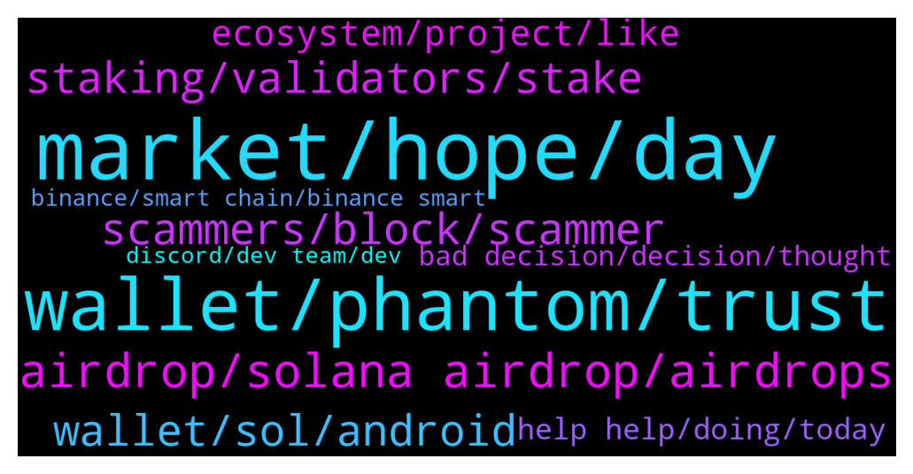

# **@solana**
 ## Analysis for **2022-01-13** - **2022-01-14**.

---

## 📊 **Basic Stats**

**n_messages_sent**: 388

---

---

## 🔝 **Top keywords and related messages**

1. **market, hope, day**

    @Berkant --- *İt's scaring me right now it must stay above 140 😂* **--->** [TG Discussion](https://t.me/solana/902931)

    @Hahayaid --- *You can't beat inflation. But you won't have to fight it when you only have crypto.* **--->** [TG Discussion](https://t.me/solana/901368)

    @lauretta122 --- *It should scare you it is just the market* **--->** [TG Discussion](https://t.me/solana/902935)

    @Farewell_Dai --- *In the current investment environment, maintaining stability is the best choice. You can consider bottoming out under the premise of plummeting, selling high and buying low, so you have quite professional market analysis and unique vision.* **--->** [TG Discussion](https://t.me/solana/901711)

    @Imthemirrorface --- *What will be sol price for this month any prediction ?* **--->** [TG Discussion](https://t.me/solana/900949)

    @qazsd125 --- *Another day has passed, does today's market give you new hope?* **--->** [TG Discussion](https://t.me/solana/901846)

2. **wallet, phantom, trust**

    @Amarjeet --- *Can anyone guide how can I get that back* **--->** [TG Discussion](https://t.me/solana/901520)

    @MustoDogemonGo --- *Some ppl sending Solana NFT to trust wallet* **--->** [TG Discussion](https://t.me/solana/901882)

    @Lait10 --- *How much time does a payment takes to confirm? I’ve been waiting for an hour* **--->** [TG Discussion](https://t.me/solana/901978)

    @Joe --- *ya, smells fake.  wants me to have a trust or metamask wallet.  will ignore* **--->** [TG Discussion](https://t.me/solana/903007)

    @Amarjeet --- *No it was saved on my pc hard disk* **--->** [TG Discussion](https://t.me/solana/901662)

    @Amarjeet --- *Got up today and checked in to phantom, saw all the tokens transferred to other address* **--->** [TG Discussion](https://t.me/solana/901643)

3. **airdrop, solana airdrop, airdrops**

    @Cryptos2king --- *I heard there's Solana Airdrop, true or false?* **--->** [TG Discussion](https://t.me/solana/901782)

    @Innoclevers --- *Hi is there any solana airdrop* **--->** [TG Discussion](https://t.me/solana/900878)

    @aleshiang --- *there is a twitter trend #solanaAirdrop* **--->** [TG Discussion](https://t.me/solana/901025)

    @Arjunsingh058 --- *I only ask because I'm in this group on telegram where I get airdrops on Algorand and others. But somebody message me direct to tell me about Solana airdrop So I come here to ask* **--->** [TG Discussion](https://t.me/solana/901053)

    @KashifJaved0 --- *When solana web. 3 airdrop distribution?* **--->** [TG Discussion](https://t.me/solana/902136)

    @RemaYRN --- *So the SOLANA airdrop is it true??* **--->** [TG Discussion](https://t.me/solana/902115)

4. **scammers, block, scammer**

    @Jerry0282 --- *If anyone here is approached by "Kristin" she is a scammer do not respond* **--->** [TG Discussion](https://t.me/solana/901249)

    @Curly --- *So many bots and scams. Just got like 5  DMs from these scammers. 🤢* **--->** [TG Discussion](https://t.me/solana/901478)

    @Blast2020 --- *Full of scammers. Why do people with name "Solana Support" are trying to contact me?* **--->** [TG Discussion](https://t.me/solana/901264)

    @char_ptr --- *lot's of scammers, I'm seeking for technical details and community help and this what i got :(* **--->** [TG Discussion](https://t.me/solana/901592)

    @Charles_lily --- *You’ve to be careful because of scammers* **--->** [TG Discussion](https://t.me/solana/902360)

    @B_To_The_Izzo --- *Lmao...it's nuts...some of them put some real effort into trying to convince you they aren't scammers* **--->** [TG Discussion](https://t.me/solana/901377)

5. **staking, validators, stake**

    @Baldyo7 --- *whats the advantages of staking your sol on a wallet downloaed from the solana website with validators as apposed to staking on an exchange like binance?* **--->** [TG Discussion](https://t.me/solana/902245)

    @A_wAZ --- *Hi there, please where can i see a list of validators and APY staking rewards in % ? Thanks* **--->** [TG Discussion](https://t.me/solana/902977)

    @mahib45 --- *You will receive your staking rewards every 2-3 days (on every epoch) and it will automatically be added and compounded to your staked amount.* **--->** [TG Discussion](https://t.me/solana/901985)

    @leanlean --- *I have a question related to staking. Why my stake only gave me a few SOL and just that, never again, since like 1 month ago? Is that normal?* **--->** [TG Discussion](https://t.me/solana/901965)

    @pamelacurry --- *Solana has a working smart team so I trust the project very much that’s why I am staking and investing more on it* **--->** [TG Discussion](https://t.me/solana/902582)

    @anto_0789 --- *Where can I stake SHDW at the best apy? Already know about tulip and francium, would like to know if there is any other dapp* **--->** [TG Discussion](https://t.me/solana/902271)

6. **wallet, sol, android**

    @mahib45 --- *Bridge   ❇️ Option 1 : Sollet wallet  Sollet allows you to convert ERC20 to SPL and vice versa using your MetaMask Wallet.  You can deposit ERC20 tokens and convert them to SPL tokens using the convert function of Sollet.io and Metamask (to learn how to convert ERC20 to SPL.  🔗 https://www.sollet.io  How to use: https://solpadfinance.medium.com/convert-usdt-from-erc-20-blockchain-to-solana-blockchain-4871780493af  Telegram : https://t.me/ProjectSerum  ❇️ Option 2: FTX exchange  You can use FTX to deposit tokens (ERC20, XRP, BTC etc) and withdraw from FTX to Sollet.io. FTX will automatically wrap your crypto in an SPL token to be used with the Serum DEX. Please note that to convert wrapped SPL assets back into their native chain, you can deposit into FTX and withdraw the unwrapped assets.  🔗 https://ftx.com  Telegram: https://t.me/FTX_Official  ❇️ Option 3: Wormhole  🔗 www.wormholebridge.com  🔗 https://github.com/certusone/wormhole  Telegram: https://t.me/wormholecrypto  ❇️ Option 4: Allbridge  🔗 https://app.solbridge.io/bridge  Telegram: https://t.me/allbridge_official* **--->** [TG Discussion](https://t.me/solana/902211)

    @John --- *I want to buy SOL please but I don’t know how to go about it* **--->** [TG Discussion](https://t.me/solana/901003)

    @oceantokensfounder --- *Hi 👋, i would really need some help, i am new to solana, and i would like to know how can i add a new market pair with a new token. ( Not responding to pm messages scammers )* **--->** [TG Discussion](https://t.me/solana/902799)

    @oceantokensfounder --- *Ok, i listed a token on solana Blockchain and i would like to know how can i trade him* **--->** [TG Discussion](https://t.me/solana/902338)

    @oceantokensfounder --- *Hi everyone, i really need some help, is there any app that allows you to trade solana tokens?* **--->** [TG Discussion](https://t.me/solana/902327)

    @Folaross --- *List of wallets where SOL is supported.  You can store your Sol tokens in any wallet of your preference below. Make sure you save your Private key or phrase words in a safe place. And don't share your private key or phrase words with anyone.  🖥 Desktop Wallets ▪️ Solflare   • https://www.solflare.com/access-wallet?hardware  Solflare wallet guide using Nano S and X - https://docs.solana.com/wallet-guide/solflare  ▪️phantom wallet  https://phantom.app/download  ▪️Solong chrome extension - https://chrome.google.com/webstore/detail/solong/memijejgibaodndkimcclfapfladdchj  ▪️ Ledger Live   • Ledger Nano S and X      Guide - https://docs.solana.com/wallet-guide/ledger-live  https://support.ledger.com/hc/en-us/articles/360016265659/  ▪️Math wallet    • Chrome extension - https://mathwallet.org/en-us/      🌐 Web Wallets ▪️Solflare    • https://www.solflare.com/create-wallet  ▪️Sollet    • https://www.sollet.io/    ▪️Sollet extension wallet  •https://chrome.google.com/webstore/detail/sollet/fhmfendgdocmcbmfikdcogofphimnkno?hl=en  ▪️Math wallet    • Web Wallet - https://mathwallet.org/en-us/   📱Mobile Wallets ▪️Trust wallet    • Download Trust Wallet app for iOS or Android app and create or import your wallet with multi-coin wallet and press add + button and search for SOL then switch on - https://trustwallet.com/  ▪️Math wallet    • Download Mathwallet app for iOS or Android app - https://mathwallet.org/en-us/  ▪️Coin98 wallet    • Android       https://play.google.com/store/apps/details?id=coin98.crypto.finance.media  • iPhone    https://apps.apple.com/vn/app/coin98-crypto-super-app/id1483029574    https://coin98.net/  ▪️SwipeWallet    • Android       https://play.google.com/store/apps/details?id=com.swipe.wallet     • iPhone          https://apps.apple.com/app/swipe-wallet/id1476726454    https://swipe.io/  https://moonlet.io/  ▪️Exodus  iPhone: https://apps.apple.com/app/apple-store/id1414384820?pt=118366236&ct=download&mt=8  Android: https://play.google.com/store/apps/details?id=exodusmovement.exodus  ▪️Slope Finance slope.finance  iOS: https://apps.apple.com/us/app/slope-wallet/id1574624530  Android: https://play.google.com/store/apps/details?id=com.wd.wallet  Note: Sollet wallet is supporting Erc20 <-> SPL conversion. And Coin98 wallet is supporting Sol and SPL tokens.* **--->** [TG Discussion](https://t.me/solana/902923)

7. **ecosystem, project, like**

    @youngmoneyplug --- *where can i find solana charts?* **--->** [TG Discussion](https://t.me/solana/902020)

    @elizabeth_baker --- *What do you think about the new Sol ecosystem page?* **--->** [TG Discussion](https://t.me/solana/902100)

    @punkkid --- *Hi guys, I'm sorry but, where I can find solana tps history?* **--->** [TG Discussion](https://t.me/solana/903031)

    @if147 --- *Is this the official group of solana?* **--->** [TG Discussion](https://t.me/solana/902198)

    @hallo55332 --- *Is there an networkscanner for solana ? Like ultrasound for ethereum ? where i can monitorize all network activities?* **--->** [TG Discussion](https://t.me/solana/902871)

    @cryptolover1987 --- *Hello! there is no docs or articles that talk about Solana roadmap. Check out docs.solana.com to get knowledge on the future goals and aims of the project.  You can also check out Solana latest releases here -  https://github.com/solana-labs/solana/releases for latest releases.* **--->** [TG Discussion](https://t.me/solana/902534)

8. **help help, doing, today**

    @mahib45 --- *Hello 👋  Check this out   https://twitter.com/SolanaStatus/status/1479126136953053187* **--->** [TG Discussion](https://t.me/solana/902244)

    @mahib45 --- *Hello 👋  What do you mean?* **--->** [TG Discussion](https://t.me/solana/901038)

    @cryptolover1987 --- *Yes how can I help you ?* **--->** [TG Discussion](https://t.me/solana/902651)

    @ruch149 --- *Any @admin to help or you guys get paid not to help* **--->** [TG Discussion](https://t.me/solana/902232)

    @mahib45 --- *Hello 👋 Join here and ask https://t.me/trustwallet* **--->** [TG Discussion](https://t.me/solana/902310)

    @Ade_SL1 --- *Hi guys good morning from here* **--->** [TG Discussion](https://t.me/solana/902574)

9. **bad decision, decision, thought**

    @The Kookaburra --- *We kookaburras prefer the natural order of things* **--->** [TG Discussion](https://t.me/solana/902389)

    @rvnlive --- *I thought so. Thanks for making it 💯* **--->** [TG Discussion](https://t.me/solana/903006)

    @Berkant --- *I know I just made a bad decision 🤦🏻‍♂️* **--->** [TG Discussion](https://t.me/solana/902942)

    @C_Sonita --- *Same thing I was going to say* **--->** [TG Discussion](https://t.me/solana/902448)

    @Anirudh --- *Not forcing you is a choice so don't take personal* **--->** [TG Discussion](https://t.me/solana/902438)

    @Ms_warrior07 --- *I thought so I just wanted to let people know, heads up just in case* **--->** [TG Discussion](https://t.me/solana/902300)

10. **binance, smart chain, binance smart**

    @easin0007 --- *Sir I accidentally send wrapped sol in binance. Now I can't withdraw from binance or trade. Is there any solution of this* **--->** [TG Discussion](https://t.me/solana/903100)

    @cryptolover1987 --- *Hello Kindly reach out to Binance support team for assistance on this* **--->** [TG Discussion](https://t.me/solana/903102)

    @PabloQuintanaCobo --- *Hello, where can i see the $SOL contract in Binance Smart Chain to add to my Metamask…it’s not on coingecko and CoinMarketCap?* **--->** [TG Discussion](https://t.me/solana/902366)

    @easin0007 --- *They reply me this   U have to contact support of that platform. Binance can't  do anything for u* **--->** [TG Discussion](https://t.me/solana/903110)

    @Boragora --- *hi, pls talk to Binance support. If they can do something, they will do for a payment* **--->** [TG Discussion](https://t.me/solana/903101)

    @PabloQuintanaCobo --- *There is a BEP20 token also on Binance Smart Chain…I need the contract* **--->** [TG Discussion](https://t.me/solana/902377)

