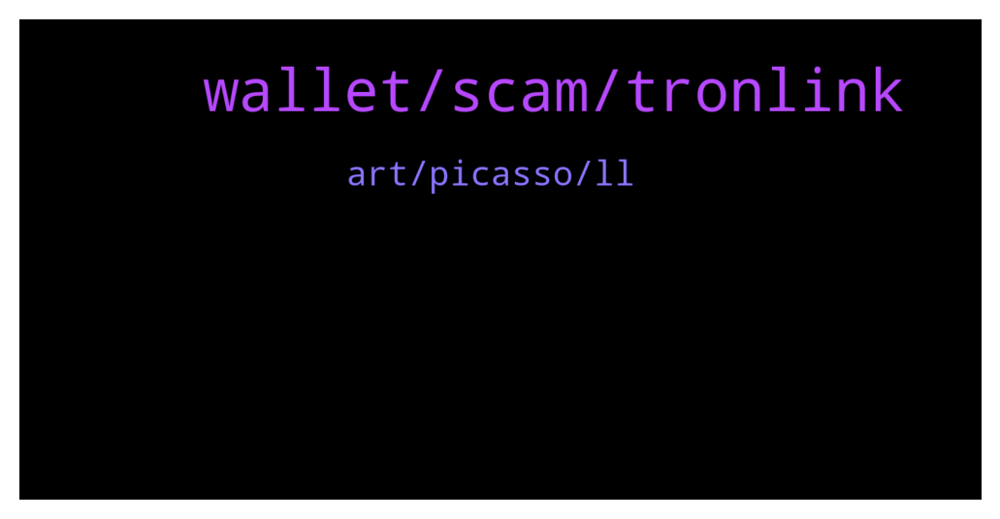

# **@tronnetworkEN**
 ## Analysis for **2022-01-13** - **2022-01-14**.

---

## 📊 **Basic Stats**

**n_messages_sent**: 367

---

---

## 🔝 **Top keywords and related messages**

1. **wallet, scam, tronlink**

    @IamMeeeeeeeeeeeeeeee --- *Don't speak about past! Speak about the future and what will tron do for growing?  Past is related to ancient history!!* **--->** [TG Discussion](https://t.me/tronnetworkEN/3828280)

    @chirrag91 --- *Any update regarding tron24 withdrawal ???* **--->** [TG Discussion](https://t.me/tronnetworkEN/3827381)

    @Olly --- *Where is best place to convert wbtt to btt?* **--->** [TG Discussion](https://t.me/tronnetworkEN/3827380)

    @Diptiranjan --- *Like u said devide by 365 then whats the difference in apy and apr?* **--->** [TG Discussion](https://t.me/tronnetworkEN/3827691)

    @agentpiki --- *You can check prices of different exchanges on   coinmarketcap.com* **--->** [TG Discussion](https://t.me/tronnetworkEN/3830150)

    @ShujaMS --- *I mean I can not click on create wallet button* **--->** [TG Discussion](https://t.me/tronnetworkEN/3829384)

2. **art, picasso, ll**

    @PiterSpain --- *APENFT AMA is coming!  🎁Let's take a tour of the APENFT Foundation's heirloom art treasures worth more than $150 million with @sydney_xiong!   ✅Guest: Syndey Xiong (Chief Art Director of APENFT)   ⏰Time: Jan 14th, 2022 3pm（GMT+8）  👉Live here：https://t.me/tronnetworkEN* **--->** [TG Discussion](https://t.me/tronnetworkEN/3827306)

    @DmG_90 --- *APENFT AMA is coming!  🎁Let's take a tour of the APENFT Foundation's heirloom art treasures worth more than $150 million with @sydney_xiong!   ✅Guest: Syndey Xiong (Chief Art Director of APENFT)   ⏰Time: Jan 14th, 2022 3pm（GMT+8）  👉Live here：https://t.me/tronnetworkEN* **--->** [TG Discussion](https://t.me/tronnetworkEN/3829308)

    @agentpiki --- *What upcoming APENFT Game-Fi? (Next to Win NFT Horse)* **--->** [TG Discussion](https://t.me/tronnetworkEN/3829545)

    @Elodie_He --- *As of today, we have over $150 million worth of art collection and we are the first and leading crossover NFT foundation. We own works by some big names in crypto like Pak, beeple, Fewocious and also  Picasso, Giacommetti, which i'll talk about in more details later.* **--->** [TG Discussion](https://t.me/tronnetworkEN/3829463)

    @Elodie_He --- *Now, we are constantly building our metaverse infrastructure by purchasing land in cryptovoxels and decentralands where we already have or in the near future we’ll have our own art museum in the metaverse. We’ll share our collection to the community in a creative way and I'm very excited about it.* **--->** [TG Discussion](https://t.me/tronnetworkEN/3829487)

    @Elodie_He --- *Happy to answer any questions you have about APENFT and the artworks!* **--->** [TG Discussion](https://t.me/tronnetworkEN/3829536)

