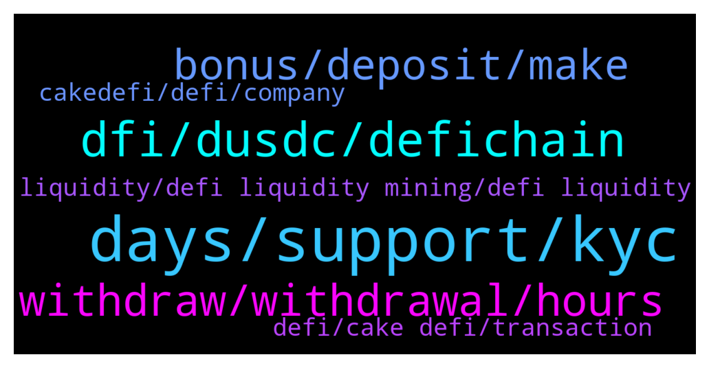

# **@CakeDeFi_EN**
 ## Analysis for **2022-01-14** - **2022-01-15**.

---

## 📊 **Basic Stats**

**n_messages_sent**: 152

---

---

## 🔝 **Top keywords and related messages**

1. **days, support, kyc**

    @mm_phoenix --- *it can last up to 72h mostly within 1h* **--->** [TG Discussion](https://t.me/CakeDeFi_EN/164871)

    @Axcel22 --- *I applied for KYC at 2 PM UTC yesterday. How long would it take to get approved? 😭* **--->** [TG Discussion](https://t.me/CakeDeFi_EN/164833)

    @Josiiiiiiiiiiii --- *I think the lending services are having issues as well. I set my settings to "do not enter following batch" 2 days ago, but it just entered on its own an hour ago* **--->** [TG Discussion](https://t.me/CakeDeFi_EN/164687)

    @larry7860 --- *My kyc pending Since 2 days 😑😑  Please do fast kyc system   People can't wait 😠* **--->** [TG Discussion](https://t.me/CakeDeFi_EN/164988)

    @Josiiiiiiiiiiii --- *do I have to wait 3 working days for it to transact?* **--->** [TG Discussion](https://t.me/CakeDeFi_EN/164630)

    @Michael_Schredl --- *As Kassius already wrote, you need write the official Support - they can fix that in the backend https://cake.zendesk.com/hc/en-us/requests/new* **--->** [TG Discussion](https://t.me/CakeDeFi_EN/164915)

2. **dfi, dusdc, defichain**

    @averagecryptoinvestor --- *Hi Cake Community, recently startet with Liquidity Mining and would also like to add to the USDC Liquidity Pool. However I don’t want to pay 130$ for an Ethereum address. How can I send my USDC via DFI Network?* **--->** [TG Discussion](https://t.me/CakeDeFi_EN/164822)

    @mm_phoenix --- *!DFI you need dUSDC on the defichain. you can only buy them on the defichain dex* **--->** [TG Discussion](https://t.me/CakeDeFi_EN/164823)

    @Juan --- *It only show me dusd or the stocks. Thanks* **--->** [TG Discussion](https://t.me/CakeDeFi_EN/164943)

    @Juan --- *Thanks, do you know if it is possible to send  from the light wallet to kucoin without cake?* **--->** [TG Discussion](https://t.me/CakeDeFi_EN/164948)

    @aemilius89 --- *I can't add to lm with the android app. I can add dusd-dfi but only with simple mode. I can't add any liquidity via the app for decentralized assets like dPLTR or dPBDC. I can do this on the computer though. So it's likely an issue with the android application.* **--->** [TG Discussion](https://t.me/CakeDeFi_EN/164997)

    @DmgBautista --- *Hi! Currently its still not possible, only tokens into DFI or DFI into the native tokenized stocks. The DEX integration is only complete until halfway, on the direct route to acces the ecosystem. In the future, the other way around will also exist, but its something that takes some time and therefore is being integrated step by step.   Therefore and for the time being, you will need to send your DFI to your defichain wallet and convert there into dUSDT. After that, just send it to Cake for unwrap and you can send it after to any exchange you wish :)* **--->** [TG Discussion](https://t.me/CakeDeFi_EN/164947)

3. **withdraw, withdrawal, hours**

    @fabioandreatta --- *A withdrawal can take up to 72-hours* **--->** [TG Discussion](https://t.me/CakeDeFi_EN/164664)

    @Tlgmmz --- *Hi all, I withdrew some BTC to Kucoin a few hours ago, but it does not show up in transaction history. Is there any way to check the status ?* **--->** [TG Discussion](https://t.me/CakeDeFi_EN/165033)

    @GOS13 --- *Wow if I withdraw my eth now, I get it by Tuesday ?* **--->** [TG Discussion](https://t.me/CakeDeFi_EN/164870)

    @yeahright22 --- *Then please tell me what is this.3 days ago 2 withdrawals stucked for 3 days.Yesterday came an email that they've cancceled my withdraw  and my funds are back on cakewallet because of internal error please withdraw again.Yesterday i withdrew again 5 times to separate or not trigger the algorythm, but still didnt get nothing after 4 days now.So its normal to bw asking whats up am i right? So basically we talkin about 6 day withdrawal?* **--->** [TG Discussion](https://t.me/CakeDeFi_EN/164665)

    @dogan_enes --- *I withdraw 6 dfi's and my money still hasn't arrived, it says the check is successful, but it didn't come, wallet address, withdrawal network everything is correct. I don't have any money.* **--->** [TG Discussion](https://t.me/CakeDeFi_EN/164909)

    @busukman --- *I see my rewards ..saturday n sunday.. thre is no holiday ?* **--->** [TG Discussion](https://t.me/CakeDeFi_EN/164986)

4. **bonus, deposit, make**

    @youngbillionaire9009 --- *It didn't say 8 have to make a deposit, before I can get 30$ bonus,, please read the advert posted on Facebook* **--->** [TG Discussion](https://t.me/CakeDeFi_EN/165074)

    @youngbillionaire9009 --- *Hello admin,I have not received the bonus after signing up* **--->** [TG Discussion](https://t.me/CakeDeFi_EN/165070)

    @frnklfrt --- *I have unexpected deposits in my freezer with a one month tenure. Is this an accounting correction related to the recent security exploit or do I likely have something misconfigured that is sending rewards to the freezer automatically?* **--->** [TG Discussion](https://t.me/CakeDeFi_EN/164727)

    @mm_phoenix --- *above the picture it even says "Bonus of 30$ in DFI when you register for the first time and make your first deposit".* **--->** [TG Discussion](https://t.me/CakeDeFi_EN/165077)

    @Dirty220 --- *So if i make another deposit i will get the bonus* **--->** [TG Discussion](https://t.me/CakeDeFi_EN/165003)

    @DmgBautista --- *There is no airdrop. If you are refering to the welcome bonus, you will need to first complete your KYC procedure and make a single deposit equal or bigger than 50$ to receive the welcome bonus. Please mind the welcome bonus will be locked for 180 days gaining interest. Your initial deposit can be withdraw at any time :)* **--->** [TG Discussion](https://t.me/CakeDeFi_EN/164949)

5. **liquidity, defi liquidity mining, defi liquidity**

    @Timurlenk --- *Pls dont write me bots.. i block immediately.. so should i exit liquidity and send the tokens separately or i can send them as a pair* **--->** [TG Discussion](https://t.me/CakeDeFi_EN/164511)

    @redqueenof --- *You can get liquidated if you open in a higher position and price reverse 100x* **--->** [TG Discussion](https://t.me/CakeDeFi_EN/164960)

    @NuckFut --- *Susan Risk is based in the price of the mined asset.  Also APY, lockup periods periods if any* **--->** [TG Discussion](https://t.me/CakeDeFi_EN/164563)

    @Susan --- *I would like to ask you all what you need to pay attention to when doing defi liquidity mining* **--->** [TG Discussion](https://t.me/CakeDeFi_EN/164562)

    @Susan --- *I do all my defi liquidity mining in coinbase wallet* **--->** [TG Discussion](https://t.me/CakeDeFi_EN/164560)

    @Susan --- *Friends where are you all doing defi liquidity mining* **--->** [TG Discussion](https://t.me/CakeDeFi_EN/164554)

6. **defi, cake defi, transaction**

    @Josiiiiiiiiiiii --- *is cake down? my transaction of 0.8dfi is taking forever to go through. it's been more than 10 hours alr* **--->** [TG Discussion](https://t.me/CakeDeFi_EN/164621)

    @GOS13 --- *Bro, you are not very friendly telling me what I should do. I had my funds on defi, and I am forced to use cake to unwrap. I’m already taking it off and that is the problem. Take my complain seriously take a note and maybe devs can do something in the future.* **--->** [TG Discussion](https://t.me/CakeDeFi_EN/164882)

    @enalettin --- *Cake's baking take some time so got some tips to make baking a little faster here it goes  https://www.thekitchn.com/10-tips-to-help-you-cook-faster-tips-from-the-kitchn-219379* **--->** [TG Discussion](https://t.me/CakeDeFi_EN/164879)

    @syahirmustaffa --- *Hi, my cake app doesnt seem to display the latest info. The desktop website is ok. Is there anything wrong with the app?* **--->** [TG Discussion](https://t.me/CakeDeFi_EN/165101)

    @3017 --- *Any problem.with Cake.defi withdrawal. I found tat it stuck there* **--->** [TG Discussion](https://t.me/CakeDeFi_EN/164683)

    @Josiiiiiiiiiiii --- *I transferred 0.8dfi from cake to my mobile wallet* **--->** [TG Discussion](https://t.me/CakeDeFi_EN/164623)

7. **cakedefi, defi, company**

    @GOS13 --- *Do I pay gas to send dEth from defi to cake ?* **--->** [TG Discussion](https://t.me/CakeDeFi_EN/164742)

    @GOS13 --- *Would be nice if cakedefi and defi would be just one platform..* **--->** [TG Discussion](https://t.me/CakeDeFi_EN/164753)

    @Paulius --- *Which one of those is decentralised ?? CAKE DEFI is decentralised right?* **--->** [TG Discussion](https://t.me/CakeDeFi_EN/164777)

    @NuckFut --- *@DmgBautista No worries, I appreciate the thorough response.  That context changes my perspective on why these checks are necessary.  I'm a relatively new CakeDEFI customer and with so much fluff, garbage, hype and scams in the crypto space I always approach things I'm newly exposed to with a high degree of skepticism.  It's refreshing to see that CakeDEFI is both rigorous in its approach and commitment to providing a safe/profitable environment for investors.* **--->** [TG Discussion](https://t.me/CakeDeFi_EN/164835)

    @misterpiggie49 --- *I thought Cake didn't offer leverage?* **--->** [TG Discussion](https://t.me/CakeDeFi_EN/164961)

    @Kassius84 --- *Cake DeFi isn't offering leverage trading 👍* **--->** [TG Discussion](https://t.me/CakeDeFi_EN/164982)

