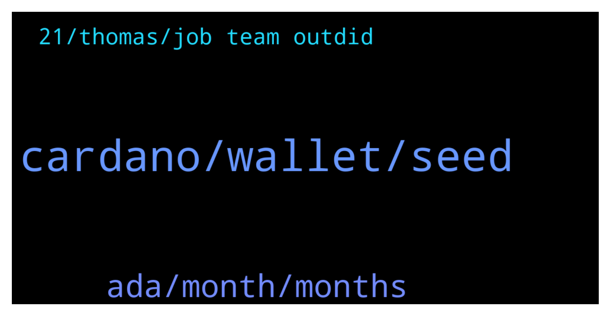

# **@Cardano**
 ## Analysis for **2022-01-14** - **2022-01-15**.

---

## 📊 **Basic Stats**

**n_messages_sent**: 70

---

---

## 🔝 **Top keywords and related messages**

1. **cardano, wallet, seed**

    @engamg --- *What happend to the terravirtua cardano summit nft’s? Have they made an anouncement for when they are minting the nft’s / selecting who gets one of the collected jpg’s minted yet?* **--->** [TG Discussion](https://t.me/Cardano/769075)

    @Juanlot --- *https://twitter.com/VitalikButerin/status/1481737970562789376?t=lvlEkQyRKCN1SRi9jWU4Bw&s=19 and  the winner is cardano* **--->** [TG Discussion](https://t.me/Cardano/768887)

    @acgg007 --- *guys what is the best wallet i can use? that works also on iOS? (i use Ledger Nano X and Trezor)* **--->** [TG Discussion](https://t.me/Cardano/768882)

    @Paradigm7 --- *Thank you. Exodus uses a 12 word seed. Anyway to import Cardano from Exodus and have all others fall into the same? Thx* **--->** [TG Discussion](https://t.me/Cardano/769265)

    @Zyroxa --- *This has nothing to do with Cardano. You probably would have to chat with the Binance support.* **--->** [TG Discussion](https://t.me/Cardano/769329)

    @f96honj7 --- *Cool ！ is there any new platform ? or where can i get the list of all cardona platform ...thanks* **--->** [TG Discussion](https://t.me/Cardano/768971)

2. **ada, month, months**

    @Charis --- *Hi guys I have been staking Ada in binance for two months and today received my capital back… however without the staking rewards.. did this ever happen to anyone?* **--->** [TG Discussion](https://t.me/Cardano/769309)

    @trustfuland --- *Hello. I want to stake my ADA on Daedalus, do I have to keep it open? Or I can close the program once I have my Ada in there?* **--->** [TG Discussion](https://t.me/Cardano/768828)

    @Davidtzadiq --- *Just be careful of someone that impersonates them.* **--->** [TG Discussion](https://t.me/Cardano/769301)

    @cryptocardano12 --- *I have a question about plutus scripts* **--->** [TG Discussion](https://t.me/Cardano/769247)

    @Roland --- *Stop trying to meta scam and get lost* **--->** [TG Discussion](https://t.me/Cardano/769199)

    @Freddie --- *Telling ppl to send and to get a double up. I sent a bunch of Ada since I thought it was a channel I was following (the official channel)* **--->** [TG Discussion](https://t.me/Cardano/769197)

3. **21, thomas, job team outdid**

    @MrBrinker --- *Not sure if posted before but it is a a very informative reading. Disregard the shillings lol* **--->** [TG Discussion](https://t.me/Cardano/769333)

    @Dsch72 --- *Most impressive crypto poll I've seen.* **--->** [TG Discussion](https://t.me/Cardano/769178)

    @Boy_Bensdorp --- *We would have been informed by the end of '21* **--->** [TG Discussion](https://t.me/Cardano/769076)

    @Nftveveoffical --- *Thomas can reply to that better* **--->** [TG Discussion](https://t.me/Cardano/768931)

    @BillionDollarBaller --- *Nice job team. We outdid King Bitcoin!* **--->** [TG Discussion](https://t.me/Cardano/768916)

