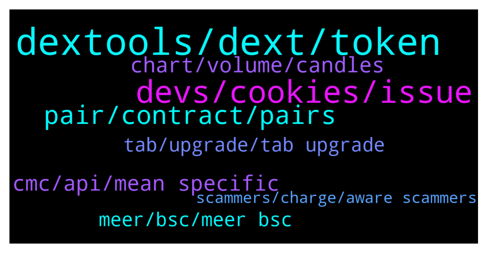

# **@DEXToolsCommunity**
 ## Analysis for **2022-01-13** - **2022-01-15**.

---

## 📊 **Basic Stats**

**n_messages_sent**: 259

---

---

## 🔝 **Top keywords and related messages**

1. **dextools, dext, token**

    @DEXTOOLS34 --- *I want to trend my token on dextools who can I pm* **--->** [TG Discussion](https://t.me/DEXToolsCommunity/324559)

    @stanes --- *You can hold 1k DEXT or pay the monthly membership. For that, connect your wallet to the app and follow instructions: https://www.dextools.io/app/user/account* **--->** [TG Discussion](https://t.me/DEXToolsCommunity/325005)

    @Yokamox --- *How to submit request for update regarding my token ( Jacy ) in dextools?* **--->** [TG Discussion](https://t.me/DEXToolsCommunity/324451)

    @JollyBZ --- *Does anyone know why dextools is reporting the same buy and sell 5 times? Lol* **--->** [TG Discussion](https://t.me/DEXToolsCommunity/324645)

    @GhosTMan96QuelloVeroDal2014 --- *Friend , do you have any other Dextools communities? I don't understand when you talk🥺🥺* **--->** [TG Discussion](https://t.me/DEXToolsCommunity/324364)

    @fastsafe01 --- *How can I add logo from dextools.* **--->** [TG Discussion](https://t.me/DEXToolsCommunity/324891)

2. **devs, cookies, issue**

    @bastardganpunk --- *you got the new coin airdropped into your wallet. you just need to add the contract address and you'll be able to see it 🙂* **--->** [TG Discussion](https://t.me/DEXToolsCommunity/325044)

    @rpoole69 --- *It got me again this morning, then I remembered the issue and just wanted to remind you all* **--->** [TG Discussion](https://t.me/DEXToolsCommunity/324227)

    @bastardganpunk --- *yes, any bugs are great if you report them, that the devs can fix them* **--->** [TG Discussion](https://t.me/DEXToolsCommunity/324624)

    @hmk18990 --- *nope, you should check your browser settings (may be browser cleaning up cookies on exit) or you should check your antivirus (some antiviruses have settings to cleanup cookies) or you should cleanup cookies manually and try again* **--->** [TG Discussion](https://t.me/DEXToolsCommunity/324988)

    @bastardganpunk --- *thank you, the devs are on it 🙂* **--->** [TG Discussion](https://t.me/DEXToolsCommunity/324634)

    @bastardganpunk --- *devs are checking… something is not correct here 😄* **--->** [TG Discussion](https://t.me/DEXToolsCommunity/324612)

3. **pair, contract, pairs**

    @rpoole69 --- *Last time @napascual said they had to restart a backend server and it was updating, bsc/pair-explorer/0x88c9bf5e334e2591c6a866d5e20683e31226be3d and https://www.dextools.io/app/bsc/pair-explorer/0x1c183b23e8d7a8d287606364f741ddbdafec28de were the 2 I was monitoring* **--->** [TG Discussion](https://t.me/DEXToolsCommunity/324808)

    @ATX_987 --- *Are you having issues? At least on of your pairs is about 3 hours behind right now (0xb2ba36ee6ba6113a914f3e8812a0df094dec5994)* **--->** [TG Discussion](https://t.me/DEXToolsCommunity/324546)

    @bastardganpunk --- *this pair has just not been traded* **--->** [TG Discussion](https://t.me/DEXToolsCommunity/324631)

    @stanes --- *DEXT UNISWAP PAIR Chart and trade: https://www.dextools.io/app/uniswap/pair-explorer/0xa29fe6ef9592b5d408cca961d0fb9b1faf497d6d Contract: 0xfb7b4564402e5500db5bb6d63ae671302777c75a  DEXT PANCAKESWAP PAIR Chart and trade: https://www.dextools.io/app/pancakeswap/pair-explorer/0x4b729d5d871057f3a9c424792729217cde72410d Contract: 0xe91a8d2c584ca93c7405f15c22cdfe53c29896e3* **--->** [TG Discussion](https://t.me/DEXToolsCommunity/325009)

    @nate102 --- *I’ve actually noticed the data bug on a few pairs btw do u want me to send in some?* **--->** [TG Discussion](https://t.me/DEXToolsCommunity/324623)

    @stanes --- *Ok, thanks, any specific pair? I don't see any pb with some random ones.* **--->** [TG Discussion](https://t.me/DEXToolsCommunity/324803)

4. **cmc, api, mean specific**

    @Yokamox --- *But it's listed on CMC and tracked there* **--->** [TG Discussion](https://t.me/DEXToolsCommunity/324906)

    @JoeyDieleman --- *You say the CMC data is different.* **--->** [TG Discussion](https://t.me/DEXToolsCommunity/324471)

    @Yokamox --- *But for example the links are not there like CMC* **--->** [TG Discussion](https://t.me/DEXToolsCommunity/324458)

    @stanes --- *What you see on CMC is different than what CMC provides in their api.* **--->** [TG Discussion](https://t.me/DEXToolsCommunity/324908)

    @stanes --- *Oh this one have been reported already, the new contract address is not in the CMC api yet so you will have to wait till they update it.* **--->** [TG Discussion](https://t.me/DEXToolsCommunity/324904)

    @Yokamox --- *Okay could you tell me if I should make a request for CMC to update their API and which one?* **--->** [TG Discussion](https://t.me/DEXToolsCommunity/324912)

5. **chart, volume, candles**

    @nate102 --- *https://www.dextools.io/app/ether/pair-explorer/0x98858a67b3975903b0e77ced4831105262aa7aa0 same story with this one also, however only third and fourth 1 minute candles. (About 200k volume in those 2 candles total and chart makes it appear like theres been 0 volume haha)* **--->** [TG Discussion](https://t.me/DEXToolsCommunity/324627)

    @Undine1 --- *Hi, is there any way to use the 12 hours chart instead? on the price bot* **--->** [TG Discussion](https://t.me/DEXToolsCommunity/324573)

    @rpoole69 --- *@stanes is the backend resyncing? I am getting delays on transaction list and graph* **--->** [TG Discussion](https://t.me/DEXToolsCommunity/324770)

    @nate102 --- *I’ve noticed it on a few eth tokens, but only new pairs and then it fixes itself, I believe the price in the trade history is correct however the visible chart is off. You can see the first 3 minutes look like there’s 0 volume but there’s actually a tens of thousands haha* **--->** [TG Discussion](https://t.me/DEXToolsCommunity/324613)

    @Undine1 --- *The chart the bot is displaying for my token pair looks ugly. The 12 hour chart would look better* **--->** [TG Discussion](https://t.me/DEXToolsCommunity/324576)

    @nate102 --- *https://www.dextools.io/app/ether/pair-explorer/0x7dec9d12a30eebe5c570fa1603a00c5fc705b5a7, I haven't checked if this one is legit either but regardless u can see there is clear volume (around 400k) first 3 minutes and price in trade history first 3 minutes is different on chart. same bug* **--->** [TG Discussion](https://t.me/DEXToolsCommunity/324625)

6. **meer, bsc, meer bsc**

    @su_allah --- *I want to swap MEER for USDT but I need to convert my MEER to MEER bsc  so I can swap MEER for USDT* **--->** [TG Discussion](https://t.me/DEXToolsCommunity/324847)

    @Damon_big_things --- *Anyone know of a faucet for bsc?* **--->** [TG Discussion](https://t.me/DEXToolsCommunity/324937)

    @su_allah --- *I want to swap MEER bsc for USDT but to swap I need to exchange my MEER coin in my Kahf wallet to MEER bsc* **--->** [TG Discussion](https://t.me/DEXToolsCommunity/324851)

    @bastardganpunk --- *you’re asking the same question again and again. please ask in the MEER chat. depending on which chain you have your MEER you need to bridge it. you can check bridge solutions here: https://apeboard.finance/ape-bridge  but you first need to know on which chain you have your MEER. Please ask in their chat for help. Swapping MEER to usdt you can do on the dextools tokenpair page easily.* **--->** [TG Discussion](https://t.me/DEXToolsCommunity/324853)

    @bastardganpunk --- *can you be more specific please? convert MEER to MEER bsc?* **--->** [TG Discussion](https://t.me/DEXToolsCommunity/324849)

    @bastardganpunk --- *for which coin do you want to swap? you said you want to swap MEER for MEER bsc. so I guess you have your coin on another chain?* **--->** [TG Discussion](https://t.me/DEXToolsCommunity/324842)

7. **tab, upgrade, tab upgrade**

    @KDawgPL --- *had to come in and let you know how disgusting the new UI is. thought u would have changed it by now wtf* **--->** [TG Discussion](https://t.me/DEXToolsCommunity/325253)

    @BitSc0tt --- *You've shown me a picture of the different subscriptions, but is there a tab to click on? how does one upgrade?* **--->** [TG Discussion](https://t.me/DEXToolsCommunity/324676)

    @BitSc0tt --- *Where is the tab so i can upgrade?* **--->** [TG Discussion](https://t.me/DEXToolsCommunity/324672)

    @BitSc0tt --- *last month i had a nice tab. Now there is nothing.* **--->** [TG Discussion](https://t.me/DEXToolsCommunity/324666)

    @bastardganpunk --- *there is no tab, you just connect your wallet to use the version* **--->** [TG Discussion](https://t.me/DEXToolsCommunity/324677)

    @rpoole69 --- *Good morning, just curious when you have the site open in  different tabs, the one which doesn't have focus doesn't keep updating. Is there an option to keep it updating?* **--->** [TG Discussion](https://t.me/DEXToolsCommunity/324749)

