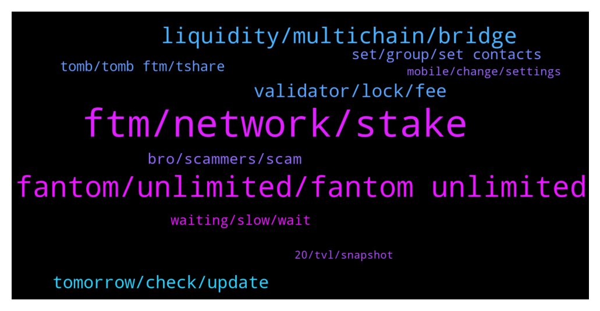

# **@Fantom_English**
 ## Analysis for **2022-01-14** - **2022-01-15**.

---

## 📊 **Basic Stats**

**n_messages_sent**: 320

---

---

## 🔝 **Top keywords and related messages**

1. **ftm, network, stake**

    @HungryCatapilar --- *Can anyone explain how to get FTM tokens on the FTM network. Not on BSC or Eth, but on FTM network. I cant even bridge networks because it costs 1.7 FTM. I would gladly pay that, but I cant even get it in the first place.* **--->** [TG Discussion](https://t.me/Fantom_English/631423)

    @collinyeo --- *how long does it take to bridge ftm from eth to ftm? i did the bridge 6 hours ago but i still do not see ftm in my metamask ftm network* **--->** [TG Discussion](https://t.me/Fantom_English/631702)

    @Joe --- *Where is the best place to stake ftm ( new to ftm )* **--->** [TG Discussion](https://t.me/Fantom_English/630275)

    @Felix --- *how does one takes part in the FTM AirDrop. what exactly do I have to do. your help will be greatly appreciated thanks* **--->** [TG Discussion](https://t.me/Fantom_English/630800)

    @Lolotorga --- *because now in my metamaxk instead of ftm I have splp thank you* **--->** [TG Discussion](https://t.me/Fantom_English/630832)

    @Janevietani --- *we dont have one. you can not stake on Kucoin. you can stake on fwallet if you want* **--->** [TG Discussion](https://t.me/Fantom_English/630198)

2. **fantom, unlimited, fantom unlimited**

    @Janevietani --- *if you wanna bride from BSC then you can bridge BNB token* **--->** [TG Discussion](https://t.me/Fantom_English/631572)

    @gnikits --- *Hi mates. New to fantom and thrilled. What would be a safe way to transfer my funds from BSC to Fantom blockchain? Thank you for your time reading this.* **--->** [TG Discussion](https://t.me/Fantom_English/630793)

    @CryptoBloc365 --- *Hello all! Newbie on fantom… I heard that’s the network is very centralized (less than 100 nodes) also will it have someday a mobile wallet on IOS and Android.  Thanks a lot 🙏* **--->** [TG Discussion](https://t.me/Fantom_English/631310)

    @gabuarabu --- *It's a validator node . It is very important for the stability of the entire project . And you must own 500k ftm to start one . So ....as these nodes will start to appear , AND THEY WILL , more&more people will realise that fantom is making an offer we can not refuse .* **--->** [TG Discussion](https://t.me/Fantom_English/630900)

    @DT20000 --- *Got it. So Fantom does have the ability to increase Total Supply, but currently doesn’t have any plans to do so? Thank you!* **--->** [TG Discussion](https://t.me/Fantom_English/630651)

    @Janevietani --- *i see, maybe swap it LINK for BNB . bridge BNB to Fantom then swap for LINK on spookyswap ? need to check how much fee you will be charged for swapping too* **--->** [TG Discussion](https://t.me/Fantom_English/631576)

3. **liquidity, multichain, bridge**

    @Janevietani --- *hello, multichain bridge doesnt have much liquidity , once more liquidity comes, you will get your funds funds are safe , please do not worried. you can check your tx on anyswap explorer anyswap.net  please use app.multichain.xyz in future* **--->** [TG Discussion](https://t.me/Fantom_English/631024)

    @Janevietani --- *you mean bridge ? dont bridge now. bridge doesnt have liquidity* **--->** [TG Discussion](https://t.me/Fantom_English/631641)

    @JVogez --- *You mentioned we can see liquidity in advance using multichain.org. please can you elaborate as to where this can be seen? i'm about to do a tx on here but can't see where liquidity is specified. thanks* **--->** [TG Discussion](https://t.me/Fantom_English/631750)

    @Janevietani --- *do you mean bridge ?  you can use https://spookyswap.finance/bridge* **--->** [TG Discussion](https://t.me/Fantom_English/631347)

    @JVogez --- *is liquidity low for all tokens? for example if i now wanted to bridge some ICE from ETH to Fantom would that be the same story?* **--->** [TG Discussion](https://t.me/Fantom_English/631646)

    @Janevietani --- *use app.multichain.org FTM ( Router ) on website you can see how much liquidity left  but if you insist bridge it, router will give anyFTM that you can swap it to FTM ( Fantom mainnet where there is liquidity ) or you can bridge it back to ethereum* **--->** [TG Discussion](https://t.me/Fantom_English/631686)

4. **validator, lock, fee**

    @Easiq --- *Ah oké, so apr shown regards all’s validator* **--->** [TG Discussion](https://t.me/Fantom_English/630971)

    @Easiq --- *The site gives an estimation of apr but how do we know which validator this applies to? The validator I got only has 3months lockup* **--->** [TG Discussion](https://t.me/Fantom_English/630968)

    @omega5705 --- *That's not my question. So do FTM validators charge a percentage fee of the return? How can I see what each validator charges?* **--->** [TG Discussion](https://t.me/Fantom_English/630729)

    @omega5705 --- *I see. Everybody charges 15%? I'm assuming different validators can change the % they take correct?* **--->** [TG Discussion](https://t.me/Fantom_English/630732)

    @omega5705 --- *Have a question. Upon delegating FTM to a validator, how can I see what is the % of fee charged?* **--->** [TG Discussion](https://t.me/Fantom_English/630726)

    @m76667 --- *Whats the fee transfering from kucoin to ftm wallet?* **--->** [TG Discussion](https://t.me/Fantom_English/630201)

5. **tomorrow, check, update**

    @Okasian --- *What should i do when i miss gf and i just dropped her off at her place an hour ago?* **--->** [TG Discussion](https://t.me/Fantom_English/630537)

    @Felix --- *I take it I'm in the wrong place. thanks a lot* **--->** [TG Discussion](https://t.me/Fantom_English/630809)

    @Khu_Fu --- *Thank you again for the help ...* **--->** [TG Discussion](https://t.me/Fantom_English/631306)

    @Janevietani --- *i already give you screenshot above* **--->** [TG Discussion](https://t.me/Fantom_English/631754)

    @pajamasfreak --- *I’m sorry I don’t have any.* **--->** [TG Discussion](https://t.me/Fantom_English/630664)

    @JOHprosperity --- *@pajamasfreak please help my friend here sir* **--->** [TG Discussion](https://t.me/Fantom_English/630776)

6. **bro, scammers, scam**

    @robkeast --- *Should have realised what how many spammers would come for me lol* **--->** [TG Discussion](https://t.me/Fantom_English/631163)

    @carpetilla --- *Thanks for your answer take care!A lot of scammers talk to me for stole me* **--->** [TG Discussion](https://t.me/Fantom_English/631328)

    @Nick --- *Who else has received a message about the FREN token?* **--->** [TG Discussion](https://t.me/Fantom_English/631088)

    @N --- *They literally DM’d me from an account that says “will not dm first” and then try call me* **--->** [TG Discussion](https://t.me/Fantom_English/631382)

    @N --- *Some account eith your name just tried calling me* **--->** [TG Discussion](https://t.me/Fantom_English/631377)

    @Khu_Fu --- *man so many scammer here DM* **--->** [TG Discussion](https://t.me/Fantom_English/631295)

7. **set, group, set contacts**

    @Johnnyfantom --- *Please if you would bring the conversation over to the trading channel. Love your enthusiasm but this is not the place thanks. https://t.me/FantomMarines* **--->** [TG Discussion](https://t.me/Fantom_English/631216)

    @arnoldhall --- *Hello, how can I contact for marketing* **--->** [TG Discussion](https://t.me/Fantom_English/631790)

    @iam_MrKrown --- *How do I get started on this ecosystem* **--->** [TG Discussion](https://t.me/Fantom_English/630634)

    @M --- *All admins are in lunch break* **--->** [TG Discussion](https://t.me/Fantom_English/630251)

    @minhtu16 --- *I from IM Community (50k members) , i'd like to invite your project to hold AMA in our community, who can i discuss with?* **--->** [TG Discussion](https://t.me/Fantom_English/631053)

    @SchallerSign --- *I'm the head of the XTstarter campaign at XT Exchange. Regarding the XTStarter event, I would like to briefly chat with you about project cooperation or who can I contact charge of the marketing part?* **--->** [TG Discussion](https://t.me/Fantom_English/630648)

8. **tomb, tomb ftm, tshare**

    @N --- *I’ve got some tshare that I claimed in my wallet, it’s not a lot but it reflects as 0 on tomb when I try deposit it in the masonry* **--->** [TG Discussion](https://t.me/Fantom_English/631371)

    @Janevietani --- *go to spookyswap , swap BOO for TOMB* **--->** [TG Discussion](https://t.me/Fantom_English/630816)

    @Lolotorga --- *hello is there a TOMB FTM pair in farm thank you and* **--->** [TG Discussion](https://t.me/Fantom_English/630806)

    @Lolotorga --- *Hello how can I  sell BOO to buy TOMB thanks* **--->** [TG Discussion](https://t.me/Fantom_English/630814)

    @Janevietani --- *better ask it to TOMB discord* **--->** [TG Discussion](https://t.me/Fantom_English/631375)

    @Andii888 --- *Hello.  Can you please tell me how long it takes for TSHARES rewards to show up on Tomb Finance?  I staked 16 TOMB-FTM into the TOMB-FTM LP more than 30 hrs ago but my TSHARE balance remains at zero.  Is this normal?* **--->** [TG Discussion](https://t.me/Fantom_English/630923)

9. **waiting, slow, wait**

    @fortunatus1314 --- *How long we have to wait? I waiting for 12hrs! Please advise. Thank you!* **--->** [TG Discussion](https://t.me/Fantom_English/631664)

    @Janevietani --- *not everyday. i dont know eta. it will be slow especially during weekends* **--->** [TG Discussion](https://t.me/Fantom_English/631681)

    @pajamasfreak --- *Depends on what are you holding right now* **--->** [TG Discussion](https://t.me/Fantom_English/630798)

    @Janevietani --- *it will be slow, could take days* **--->** [TG Discussion](https://t.me/Fantom_English/631739)

    @JVogez --- *already waited 21 hours here, so i'm thinking could be a while* **--->** [TG Discussion](https://t.me/Fantom_English/631669)

    @Boipelo --- *1 hour ago we are not dumping here* **--->** [TG Discussion](https://t.me/Fantom_English/630730)

10. **mobile, change, settings**

    @believerx --- *but thanks for letting me know its not possible this way - was searching for some time* **--->** [TG Discussion](https://t.me/Fantom_English/631569)

    @carpetilla --- *Can you make on mobile or PC only?* **--->** [TG Discussion](https://t.me/Fantom_English/631360)

    @fortunatus1314 --- *Thanks for the info. How to prevent this in future?* **--->** [TG Discussion](https://t.me/Fantom_English/631684)

    @Janevietani --- *you can use mobile or desktop* **--->** [TG Discussion](https://t.me/Fantom_English/631361)

    @Johnnyfantom --- *change your setting to what is shown here, in settings> Advanced* **--->** [TG Discussion](https://t.me/Fantom_English/631166)

    @Johnnyfantom --- *You have to go into Metamask and change the settings, hang on* **--->** [TG Discussion](https://t.me/Fantom_English/631162)

