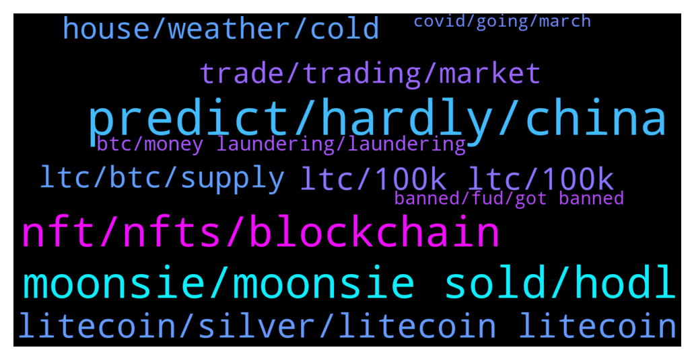

# **@Litecoin**
 ## Analysis for **2022-01-14** - **2022-01-15**.

---

## 📊 **Basic Stats**

**n_messages_sent**: 952

---

---

## 🔝 **Top keywords and related messages**

1. **predict, hardly, china**

    @jrx486 --- *Aren’t they in favour of crypto?* **--->** [TG Discussion](https://t.me/Litecoin/2047547)

    @RorschachTesst --- *How difficult is it to release frequent updates? Isn't crypto  decentralized and community driven? I hardly see any community engagement or even a whiff of what your long term plans are* **--->** [TG Discussion](https://t.me/Litecoin/2046434)

    @RorschachTesst --- *I'm not in Europe and sorry that you're going through this difficult phase but crypto will probably not help. It's too volatile* **--->** [TG Discussion](https://t.me/Litecoin/2047702)

    @moonsie --- *i will just hold on whatever i have left and get out of all crypto if it ever comes close to its former highs* **--->** [TG Discussion](https://t.me/Litecoin/2045885)

    @ck42069 --- *Are you out of your mind China banned crypto they literally forced all mininf activity to stop* **--->** [TG Discussion](https://t.me/Litecoin/2047540)

    @Jim --- *What do you think about cryptos future next months ? Sp500 press cryptos* **--->** [TG Discussion](https://t.me/Litecoin/2046481)

2. **moonsie, moonsie sold, hodl**

    @Pablocality --- *Moonsie please lighten up on the fud* **--->** [TG Discussion](https://t.me/Litecoin/2045730)

    @ck42069 --- *Look at him his profile picture is black. I feel bad for moonsie.* **--->** [TG Discussion](https://t.me/Litecoin/2046126)

    @jrx486 --- *Reason: we can’t moon and have moonsie fud* **--->** [TG Discussion](https://t.me/Litecoin/2047482)

    @Carlos_PRO_Holder --- *Do not do that to moonsie, he is right!* **--->** [TG Discussion](https://t.me/Litecoin/2046307)

    @Zer0fact0r --- *All the negative energy from moonsie and underlings is being absorb.* **--->** [TG Discussion](https://t.me/Litecoin/2046807)

    @ck42069 --- *Yo moonsie what do you say mate* **--->** [TG Discussion](https://t.me/Litecoin/2046104)

3. **nft, nfts, blockchain**

    @RabbitL0v3r --- *NFT is just a hash of a contract address and a token id Without a central authority to say which contract is the real one, it has 0 value* **--->** [TG Discussion](https://t.me/Litecoin/2046870)

    @JohnTheApostle --- *NFT is like Blockchain  Everyone wants it applied to everything but their own version of it* **--->** [TG Discussion](https://t.me/Litecoin/2046833)

    @RorschachTesst --- *Focus on one thing: payment medium and go all out on that shit. No point chasing NFTs, a new trend will emerge in 6 months. Instead try to diversify from PayPal into uber or whatever I don't know. We are meant to be a payment medium nothing else* **--->** [TG Discussion](https://t.me/Litecoin/2046462)

    @jrx486 --- *one day, this will be an NFT on Omnilite* **--->** [TG Discussion](https://t.me/Litecoin/2045895)

    @jrx486 --- *NFTs are basically proof of buying an image which you can actually download for free* **--->** [TG Discussion](https://t.me/Litecoin/2046855)

    @morningzone --- *Every company wanted to implement whatever-blockchain cos it was hyped buzzword. Now same is happening with NFT; all these big companies launching their own "NFTs" which are not even NFTs.* **--->** [TG Discussion](https://t.me/Litecoin/2046843)

4. **litecoin, silver, litecoin litecoin**

    @arnego2 --- *Because the people lack vision. Real use is with Litecoin a reality. Is used to lower fees. A few tools and people can relate.* **--->** [TG Discussion](https://t.me/Litecoin/2046533)

    @fudleur --- *yeah becoase litecoin needs no maintenance window. because no updates ship lololo* **--->** [TG Discussion](https://t.me/Litecoin/2046343)

    @moonsie --- *GARBAGE is what crypto is, and litecoin is the biggest garbage of it all. prime scammer manipulator coin.* **--->** [TG Discussion](https://t.me/Litecoin/2045697)

    @E --- *Litecoin used to be known as bitcoins silver and used as a way to capitalize on bitcoin gains, before stable coins. We no longer have that, we no longer see litecoin marketing.* **--->** [TG Discussion](https://t.me/Litecoin/2045840)

    @arnego2 --- *There are a lot of infos in the forum of Litecoin* **--->** [TG Discussion](https://t.me/Litecoin/2046270)

    @Jim --- *Which language do you use for litecoin?* **--->** [TG Discussion](https://t.me/Litecoin/2046309)

5. **ltc, 100k ltc, 100k**

    @moonsie --- *i had 30000 ltc at one point* **--->** [TG Discussion](https://t.me/Litecoin/2045773)

    @coblee --- *I gave everyone I met some LTC. 🤷‍♂️* **--->** [TG Discussion](https://t.me/Litecoin/2046386)

    @ck42069 --- *Bro if you if you have like less than 100k LTC then you should stop fudding seriously* **--->** [TG Discussion](https://t.me/Litecoin/2046040)

    @moonsie --- *lwho doesnt have less than 100k ltc?* **--->** [TG Discussion](https://t.me/Litecoin/2046041)

    @TonyNakamoto --- *u will leave LTC community freb?* **--->** [TG Discussion](https://t.me/Litecoin/2045988)

    @jrx486 --- *how much ltc do you have left?* **--->** [TG Discussion](https://t.me/Litecoin/2046026)

6. **house, weather, cold**

    @jrx486 --- *if you live in constant cold, some of your body fat is stored differently (google: brown adipose tissue). i occasionally see people walking outside in their t-shirts at 10C/50F.* **--->** [TG Discussion](https://t.me/Litecoin/2047662)

    @bake_Crypto --- *But I will consider, I like Vancouver* **--->** [TG Discussion](https://t.me/Litecoin/2047654)

    @bake_Crypto --- *It makes sense to heat your house while winter is within bull market* **--->** [TG Discussion](https://t.me/Litecoin/2047648)

    @bake_Crypto --- *Sun is important but also their is the theory that could weather makes u more productive* **--->** [TG Discussion](https://t.me/Litecoin/2047657)

    @TonyNakamoto --- *ppl keep extra muns in the bank or imBest in 2nd house or wat?* **--->** [TG Discussion](https://t.me/Litecoin/2045750)

    @RorschachTesst --- *Not freezing weather though. Imagine your car breaking down in a snowstorm.* **--->** [TG Discussion](https://t.me/Litecoin/2047658)

7. **ltc, btc, supply**

    @jrx486 --- *ltc needs to break loose from btc* **--->** [TG Discussion](https://t.me/Litecoin/2046673)

    @coblee --- *LTC always perform worse than BTC except for a few occassions when it blows everything else away.* **--->** [TG Discussion](https://t.me/Litecoin/2046331)

    @TonyNakamoto --- *BTC and LTC r 10+ yrs olB th0* **--->** [TG Discussion](https://t.me/Litecoin/2046255)

    @TonyNakamoto --- *LTC has done far better than most old coins, in fact it's one of the few rly old ones still alive* **--->** [TG Discussion](https://t.me/Litecoin/2046324)

    @saeed_talebi --- *oha,,,, thats why BTC rising. .. LTC touch 152. tomarrow.* **--->** [TG Discussion](https://t.me/Litecoin/2047166)

    @saeed_talebi --- *unusual volume on LTC, it is started rising again. dont miss it* **--->** [TG Discussion](https://t.me/Litecoin/2047026)

8. **trade, trading, market**

    @jrx486 --- *I've been coding in C# since 2009 professionally so making this was like a walk in the park for me. and I know enough math. the real trick is finding a good trading strategy.* **--->** [TG Discussion](https://t.me/Litecoin/2047805)

    @CookieSlayer --- *So why did he wash trade? Too eager to see the price rise? Desperate for cash?* **--->** [TG Discussion](https://t.me/Litecoin/2046077)

    @CoinLoin --- *I thought most of his money was from scamming traders into trading so he got a commission for it?* **--->** [TG Discussion](https://t.me/Litecoin/2045691)

    @RabbitL0v3r --- *Trade against canny if u wanna get rich* **--->** [TG Discussion](https://t.me/Litecoin/2046691)

    @moonsie --- *lost a lot trading, had to sell a lot to survive half a decade of bear market* **--->** [TG Discussion](https://t.me/Litecoin/2045776)

    @saeed_talebi --- *exactly freind. loosing is part of trading...* **--->** [TG Discussion](https://t.me/Litecoin/2047280)

9. **btc, money laundering, laundering**

    @coblee --- *I worked on Bitpay for 3+ years before that happened. It’s the long game for me* **--->** [TG Discussion](https://t.me/Litecoin/2046369)

    @Bigbulz --- *Cz is now asia's richest person.  He has dumped bnb at peak (didn't disclosed) and earning billions from liquidation. Be like cz,don't be like coblee* **--->** [TG Discussion](https://t.me/Litecoin/2045689)

    @Bigbulz --- *Yeah,he is the biggest fraud, even bigger than bitconnect and mtgox saga. Many says he may have become richest person,that's why binance has no international headquarter, no tax,no accountability* **--->** [TG Discussion](https://t.me/Litecoin/2045701)

    @TonyNakamoto --- *yep - historically it has periods where it outperforms BTC briefly but very significantly* **--->** [TG Discussion](https://t.me/Litecoin/2046334)

    @adamozi --- *I mean the blockchain doesn't get stopped for 18hours* **--->** [TG Discussion](https://t.me/Litecoin/2046340)

    @ck42069 --- *Most of the accounts on binance are in loss* **--->** [TG Discussion](https://t.me/Litecoin/2046700)

10. **banned, fud, got banned**

    @ck42069 --- *I got banned for spamming a couple months ago later taken back after a week of waiting ser* **--->** [TG Discussion](https://t.me/Litecoin/2046122)

    @jrx486 --- *you know, moonsie, admins and mods can simply ban you to end the FUD* **--->** [TG Discussion](https://t.me/Litecoin/2046047)

    @moonsie --- *how many times u think i have been banned throughout history* **--->** [TG Discussion](https://t.me/Litecoin/2046051)

    @moonsie --- *i have been banned from every social media site i have ever been part of at least 5 times* **--->** [TG Discussion](https://t.me/Litecoin/2046060)

    @jrx486 --- *you even got banned on tradingview, what did they do to you?* **--->** [TG Discussion](https://t.me/Litecoin/2046057)

    @Jim --- *I know india has been thinking to ban it* **--->** [TG Discussion](https://t.me/Litecoin/2046504)

