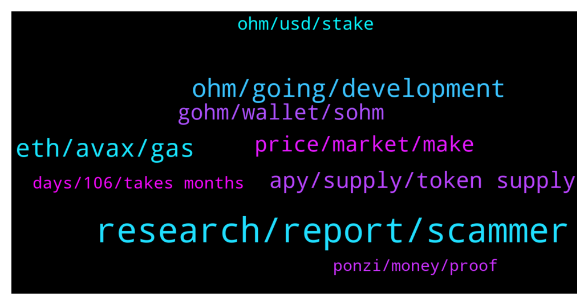

# **@OlympusTG**
 ## Analysis for **2022-01-14** - **2022-01-15**.

---

## 📊 **Basic Stats**

**n_messages_sent**: 615

---

---

## 🔝 **Top keywords and related messages**

1. **research, report, scammer**

    @nfwaple --- *should be quite close, please elaborate* **--->** [TG Discussion](https://t.me/OlympusTG/150589)

    @travisme --- *I know. Im about to research this anyway. Just asked for some overview before i start.* **--->** [TG Discussion](https://t.me/OlympusTG/150853)

    @ocelotquick --- *The answers are all available for you, simp. You just can’t interpret them. Capitulate and be gone 👋* **--->** [TG Discussion](https://t.me/OlympusTG/151013)

    @Kbuxton90 --- *I like how your immediate reaction is to tell people to leave instead of having a discussion. I think I'm done talking to you, you add no value.* **--->** [TG Discussion](https://t.me/OlympusTG/151015)

    @Toddh909 --- *Thats fair. Thank you clearsight for the answers* **--->** [TG Discussion](https://t.me/OlympusTG/150060)

    @ocelotquick --- *No, I just refuse to let you remain smug in your ignorance* **--->** [TG Discussion](https://t.me/OlympusTG/151129)

2. **ohm, going, development**

    @mandingo_0 --- *if you look at the price chart since Oct ohm has just been gradually going down, there has not been one bounce. Is this volatility?  Or is it going to continue going down?* **--->** [TG Discussion](https://t.me/OlympusTG/150871)

    @Kbuxton90 --- *How is OHM going to turn it around?* **--->** [TG Discussion](https://t.me/OlympusTG/151061)

    @niftyspence --- *When will ohm be taken out of circulation or is there no plan on doing that?* **--->** [TG Discussion](https://t.me/OlympusTG/150479)

    @Ap0l1o --- *why should Ohm be taken out of circulation?* **--->** [TG Discussion](https://t.me/OlympusTG/150482)

    @Kbuxton90 --- *That explains it then. Been in it longer and built up more OHMs* **--->** [TG Discussion](https://t.me/OlympusTG/151099)

    @redoitt --- *When we reach 10m ohm we get 1k* **--->** [TG Discussion](https://t.me/OlympusTG/150553)

3. **eth, avax, gas**

    @Mannish_Boy --- *done… the bridging isnt working for me though. Not arbitrum either. Maybe I need to try another browser?* **--->** [TG Discussion](https://t.me/OlympusTG/150397)

    @nfwaple --- *yes you can bridge it to AVAX using the bridge function on the website, but you'd still pay ETH fee for the bridging* **--->** [TG Discussion](https://t.me/OlympusTG/150362)

    @nfwaple --- *ETH may cost you more than $100 in fee, AVAX fee is less than $1* **--->** [TG Discussion](https://t.me/OlympusTG/150739)

    @Mannish_Boy --- *ok, I try again. Bridgeing to avax tokk 10 min without luck..* **--->** [TG Discussion](https://t.me/OlympusTG/150388)

    @nfwaple --- *not for me, it only took at most 2 mins last time I bridged from ETH to Arbitrum* **--->** [TG Discussion](https://t.me/OlympusTG/150381)

    @cdp279 --- *Arbtirum has a lot of promise. But yeah lots of projects moved to arbitrum and the transaction fees have cause them to  move to even cheaper chains* **--->** [TG Discussion](https://t.me/OlympusTG/150450)

4. **apy, supply, token supply**

    @OGCryptoo --- *You should consider that the APY is continuously dropping until it reflects what the protocol is actually earning.* **--->** [TG Discussion](https://t.me/OlympusTG/150255)

    @Ap0l1o --- *read OIP's 18 and 63, you can find more information about the APY decrease there* **--->** [TG Discussion](https://t.me/OlympusTG/150549)

    @Flo (Don't pm) --- *Is there a curve of APY?* **--->** [TG Discussion](https://t.me/OlympusTG/150271)

    @Flo (Don't pm) --- *If anyone is buying.... the supply, market Cap increases and the APY decrease. If anyone unstake and sell what happens with supply and APY?* **--->** [TG Discussion](https://t.me/OlympusTG/150298)

    @Flo (Don't pm) --- *Will the Apy in 1 year still be over 1000%?* **--->** [TG Discussion](https://t.me/OlympusTG/150111)

    @theMagicUnicorn --- *supply slows down with a lower apy* **--->** [TG Discussion](https://t.me/OlympusTG/150652)

5. **gohm, wallet, sohm**

    @nfwaple --- *gohm is v2m wsohm is v1* **--->** [TG Discussion](https://t.me/OlympusTG/150424)

    @liu --- *Does that mean Gohm is better?* **--->** [TG Discussion](https://t.me/OlympusTG/150198)

    @Mine --- *Pls what's the diff with wsOHM and gOHM* **--->** [TG Discussion](https://t.me/OlympusTG/150423)

    @Chriso1970 --- *Are ok, where should i look for a wallet and best place to buy gOHM* **--->** [TG Discussion](https://t.me/OlympusTG/150089)

    @Mine --- *So I ensure I go for gOHM as a newbie right* **--->** [TG Discussion](https://t.me/OlympusTG/150425)

    @onehundredsh0tz --- *No cos I have it in gOHM* **--->** [TG Discussion](https://t.me/OlympusTG/150623)

6. **price, market, make**

    @Cali_millionaire --- *I can understand that That’s why price is equallly important* **--->** [TG Discussion](https://t.me/OlympusTG/151101)

    @safuking --- *i bought 16 at 300$ will leave it for a year lets see what happens* **--->** [TG Discussion](https://t.me/OlympusTG/150232)

    @Ap0l1o --- *Btw, we don’t really care about the price* **--->** [TG Discussion](https://t.me/OlympusTG/151082)

    @Cali_millionaire --- *Lucky u. $300  I’ll buy more soon* **--->** [TG Discussion](https://t.me/OlympusTG/150235)

    @Cali_millionaire --- *I did too but costed me $32k @$1050* **--->** [TG Discussion](https://t.me/OlympusTG/150220)

    @safuking --- *Hoping price goes to atleast 500 when btc is around 50k* **--->** [TG Discussion](https://t.me/OlympusTG/150236)

7. **ohm, usd, stake**

    @Chad --- *Just bought 28.5 OHM and stakes today* **--->** [TG Discussion](https://t.me/OlympusTG/150184)

    @Mine --- *Was there a time it was 1 or 5 or 10 ohm to be staked* **--->** [TG Discussion](https://t.me/OlympusTG/150810)

    @Mine --- *Please what's the min or max I can stake in OHM* **--->** [TG Discussion](https://t.me/OlympusTG/150807)

    @onehundredsh0tz --- *😩😩 are u sure u didn’t mean mean 66 OHM* **--->** [TG Discussion](https://t.me/OlympusTG/150797)

    @CoachLuko --- *Started with 1 Ohm and now I have 30. Niceeeeee* **--->** [TG Discussion](https://t.me/OlympusTG/149954)

    @Cali_millionaire --- *Wait I think it was 56 ohm last when I saw, last month* **--->** [TG Discussion](https://t.me/OlympusTG/150223)

8. **days, 106, takes months**

    @Olympus - Fcuk The Forks --- *at a fixed 1000% it's 106 days* **--->** [TG Discussion](https://t.me/OlympusTG/150838)

    @onehundredsh0tz --- *How many days for 2x currently sir* **--->** [TG Discussion](https://t.me/OlympusTG/150835)

    @travisme --- *Okay got it. So like hypothetically. If i put around 500usd for example for 365 days. How much is it? For 1000percent. I wanna know if my computation is correct. Haha.* **--->** [TG Discussion](https://t.me/OlympusTG/150843)

    @onehundredsh0tz --- *Isit not 2x every 61 days ?* **--->** [TG Discussion](https://t.me/OlympusTG/150831)

    @chitangxxx --- *Day 1 was over 300 days ago* **--->** [TG Discussion](https://t.me/OlympusTG/151107)

    @nfwaple --- *if you take out 1 x on the 2nd month, then at the 4th month you're only 3 x* **--->** [TG Discussion](https://t.me/OlympusTG/150911)

