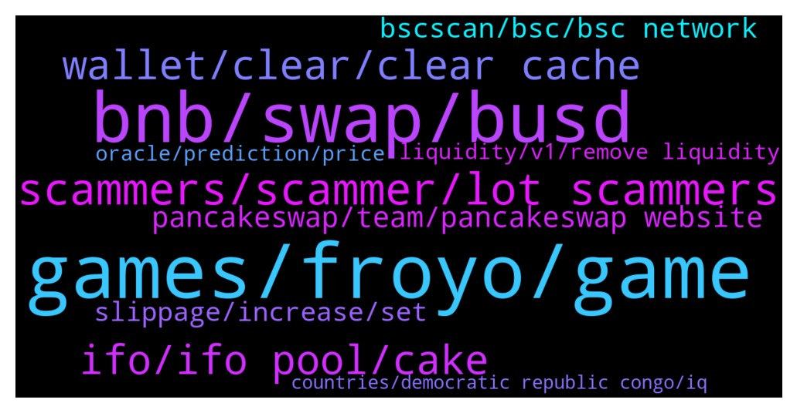

# **@PancakeSwap**
 ## Analysis for **2022-01-14** - **2022-01-15**.

---

## 📊 **Basic Stats**

**n_messages_sent**: 1560

---

---

## 🔝 **Top keywords and related messages**

1. **games, froyo, game**

    @xceterax --- *I posted a question on Twitter earlier asking about how Froyo Games will be different from Gala Games and Elixir Gaming. In relation to that question and referring to Gala Games in particular, would the NFTs that can lead to earning Froyo tokens in Froyo Games be reasonably priced for gamers/participants that do not have extra funds to purchase or would the NFTs for earning be only for those that have “deep pockets”* **--->** [TG Discussion](https://t.me/PancakeSwap/2273153)

    @chef_bun --- *Lastly, what do you think the future of gamefi will be like. And the position of Froyo Games in this future of gamefi.* **--->** [TG Discussion](https://t.me/PancakeSwap/2272623)

    @chef_bun --- *So you guys want to become the Epic Games of blockchain games? 👀* **--->** [TG Discussion](https://t.me/PancakeSwap/2272596)

    @chef_bun --- *First of all @zeroxfroyo, please introduce yourself and your project — Froyo Games to our audience.* **--->** [TG Discussion](https://t.me/PancakeSwap/2272579)

    @ketuart04 --- *Can you share with us how does Froyo Games bridge game developers from indie mobile game designers or maybe game studios? is there a chance for them?* **--->** [TG Discussion](https://t.me/PancakeSwap/2273055)

    @chef_bun --- *Now let’s get to the typical chain topic.   Froyo Games supports ETH and BSC. What are the reasons behind this decision? Why did you pick these two out of so many other blockchains? Are there any plans to expand to some other chains?* **--->** [TG Discussion](https://t.me/PancakeSwap/2272588)

2. **bnb, swap, busd**

    @Aladdin_21 --- *I swapped bnb to safemoon but got safemoondividend instead* **--->** [TG Discussion](https://t.me/PancakeSwap/2270801)

    @adebayo --- *Hi guys can you please  help me I have 2.2 bnb on my trust wallet and I wanted to swap for a token but is telling me insufficient bnb balance for the gas fees. Am totally confused i have 2.2 and I wanted to use only 2* **--->** [TG Discussion](https://t.me/PancakeSwap/2271825)

    @A-one --- *Again someone transferred my bnb from my account to anyother* **--->** [TG Discussion](https://t.me/PancakeSwap/2275222)

    @Aosh1ma --- *First *0 bnb* because Its Smart contract call.* **--->** [TG Discussion](https://t.me/PancakeSwap/2272454)

    @Mang --- *Swap bcoin to BUSD but token like this binance pegged BUSD.* **--->** [TG Discussion](https://t.me/PancakeSwap/2274579)

    @Mang --- *Ah I try to swap BCOIN to BUSD however the BUSD is binance pegged. How can change to BUSD - original or need first to change to BNB to BUSD?* **--->** [TG Discussion](https://t.me/PancakeSwap/2274570)

3. **scammers, scammer, lot scammers**

    @Ebrahim3id --- *They're so many scammers  Calling me and PM me* **--->** [TG Discussion](https://t.me/PancakeSwap/2270918)

    @Kevin_BscDefi --- *So scammers flooding our inbox annoy me very much.* **--->** [TG Discussion](https://t.me/PancakeSwap/2275101)

    @AndrWcrypto --- *Bro I think scammers already called to you and offered their help🤣🤣* **--->** [TG Discussion](https://t.me/PancakeSwap/2274018)

    @batubatu06 --- *too many scammers man what is this* **--->** [TG Discussion](https://t.me/PancakeSwap/2273286)

    @FireEthernal --- *Ty Uuuuf a lot of Scammers write me in one minute, I'm not newbie 😜. They thought ppl are stupid like them. Don't write me in PM Scammers 😝* **--->** [TG Discussion](https://t.me/PancakeSwap/2274413)

    @Kevin_BscDefi --- *yes a lot of scammers now* **--->** [TG Discussion](https://t.me/PancakeSwap/2275089)

4. **wallet, clear, clear cache**

    @HAITIENLK --- *Please explain your issue in detail and as clearly as possible - we can’t read your mind. ⁃ Which wallet are you using? ⁃ Which type of device are you using? ⁃ Which browser are you using? ⁃ What exactly do you need assistance for? ⁃ What error are you getting?* **--->** [TG Discussion](https://t.me/PancakeSwap/2271945)

    @HAITIENLK --- *you need 1.5 cake to creacte profile. try clear cache/ try reinstall app wallet(remember save seephase/private key)/ try other wallet.* **--->** [TG Discussion](https://t.me/PancakeSwap/2274878)

    @HAITIENLK --- *try other wallet/ clear cache/ reinstall app wallet/ wait and try other time. (remember save seephase /private key)* **--->** [TG Discussion](https://t.me/PancakeSwap/2275402)

    @HAITIENLK --- *reinstall app wallet (remember save seephase/private key). / try other time* **--->** [TG Discussion](https://t.me/PancakeSwap/2272352)

    @Ceddi200 --- *-Please change your rpc to best rpc evah; https://binance.ankr.com https://t.me/PancakeSwap/2016376 -Please clear your cache and all browser datas! https://t.me/PancakeSwap/2094482 -Please refresh and reboot your device! -Please use different network (lte or WIFI) -Please be patient, your assets are safu/safe  and for your next transactions, please use moaar gwei/gas limit... +10 gwei is ok  https://t.me/PancakeSwap/2091318* **--->** [TG Discussion](https://t.me/PancakeSwap/2275466)

    @TomorrowlandForLife --- *don't connect anything to that and unistall Please install the wallet from the oficial site  https://metamask.io/* **--->** [TG Discussion](https://t.me/PancakeSwap/2274065)

5. **ifo, ifo pool, cake**

    @Ceddi200 --- *Your cake tokens spent in IFO is your price to get the tokens of the IFO project   So you only get a refund of your unspent fund if there was an overflow plus ifo tokens* **--->** [TG Discussion](https://t.me/PancakeSwap/2273843)

    @HAITIENLK --- *no sir, if you use cake in pool IFO, 18/1 you need unstake and commit cake to join IFO sale. pls read* **--->** [TG Discussion](https://t.me/PancakeSwap/2271788)

    @Paulchidex --- *Hello PancakeSwap Admin i have a problem,  My IFO Credit has been constant since the start of the calculation period, Even after adding more cake today to the IFO pool my IFO Credit is still not increasing. It has been on 501.26964 cake from the day the calculation period started.* **--->** [TG Discussion](https://t.me/PancakeSwap/2274885)

    @Zuker --- *Hi guys , i have a question pls about Froyo İFO. When can i unstake my Cake's, without breaking the İFO credit.* **--->** [TG Discussion](https://t.me/PancakeSwap/2275541)

    @Paulchidex --- *But it has been on 501.26964 since the start of the calculation period, I thought it would be increasing gradually like the previous calculation for DPT IFO until it calculates the total balance staked in the IFO Pool* **--->** [TG Discussion](https://t.me/PancakeSwap/2274891)

    @Emmyology --- *Hello admin..  If I unstake my cake before the IFO date..  Are they going still to remove 1cakes as transaction fees* **--->** [TG Discussion](https://t.me/PancakeSwap/2271549)

6. **pancakeswap, team, pancakeswap website**

    @Jeff --- *The app is calle Muffin by Pancakeswap on the Apple Store* **--->** [TG Discussion](https://t.me/PancakeSwap/2274159)

    @RangerApos --- *Ale transaction on pancakeswap will always be like this in bep20 format* **--->** [TG Discussion](https://t.me/PancakeSwap/2274581)

    @Tina --- *Maybe the problem is with PancakeSwap!* **--->** [TG Discussion](https://t.me/PancakeSwap/2271617)

    @Shawn_I_am --- *CLear cache works. But additionally, you have to close nd reopen pancakeswap. All well now* **--->** [TG Discussion](https://t.me/PancakeSwap/2275829)

    @M --- *Hello dears , how are you ?! , sorry for bothering you , I have an issue and I don’t know communicate with who to fix it , I can not go to the web of pancakeswap from morning and its give error 2010 and after searching for solutions its say you need to talk to the owner of the website ?! Can you please help me ?!* **--->** [TG Discussion](https://t.me/PancakeSwap/2273233)

    @WatanabeKika --- *Is there any way to reduce impermanentlosses on pancakes* **--->** [TG Discussion](https://t.me/PancakeSwap/2273482)

7. **bscscan, bsc, bsc network**

    @vladpronin --- *You can find it on bscscan.com* **--->** [TG Discussion](https://t.me/PancakeSwap/2270711)

    @Ceddi200 --- *bscscan.com is a useful resource for all BSC Network users to track transactions, check smart contracts, find out stats, and generally stay on top of what is happening in the blockchain.* **--->** [TG Discussion](https://t.me/PancakeSwap/2275678)

    @Ceddi200 --- *You don’t just post without proof from bscscan.com* **--->** [TG Discussion](https://t.me/PancakeSwap/2275508)

    @CLD_Callum --- *Using BscScan is probably easiest, look at the Contract tab and the Write section* **--->** [TG Discussion](https://t.me/PancakeSwap/2275436)

    @QV_zz --- *you can look up your address on bscscan.com to see whats going on* **--->** [TG Discussion](https://t.me/PancakeSwap/2275034)

    @AU_sam123 --- *Is the MOOR powered by BSC or its own blockchain?* **--->** [TG Discussion](https://t.me/PancakeSwap/2273891)

8. **slippage, increase, set**

    @ShawnSheeran --- *Due to the slippage you chose* **--->** [TG Discussion](https://t.me/PancakeSwap/2270696)

    @HAITIENLK --- *it's slipage, pls read more about that.* **--->** [TG Discussion](https://t.me/PancakeSwap/2271295)

    @QV_zz --- *you can sell/buy in smaller amounts with your slippage set higher than whatever the price impact is* **--->** [TG Discussion](https://t.me/PancakeSwap/2271637)

    @Yuvraj --- *Any document for learning more about slipage?* **--->** [TG Discussion](https://t.me/PancakeSwap/2271316)

    @HDH17 --- *Is there any article about slippage and frontrun I can read to understand what it means?* **--->** [TG Discussion](https://t.me/PancakeSwap/2271619)

    @HDH17 --- *Btw is there a article about frontrunning slippage I can read?* **--->** [TG Discussion](https://t.me/PancakeSwap/2272078)

9. **liquidity, v1, remove liquidity**

    @Yulogi --- *Not working, and in my Chrome browser it says liquidity pool doesnt exists* **--->** [TG Discussion](https://t.me/PancakeSwap/2270176)

    @Yulogi --- *hello i cant take out my liquidity* **--->** [TG Discussion](https://t.me/PancakeSwap/2270172)

    @albertcarloss --- *Hello admin,  I can't remove liquidity, I can't confirm, stuck* **--->** [TG Discussion](https://t.me/PancakeSwap/2275527)

    @TomorrowlandForLife --- *First press there (V1) and the follow the steps of removing liquidity* **--->** [TG Discussion](https://t.me/PancakeSwap/2274692)

    @oooh_oooooh --- *This is the problem I discovered after I provided liquidity* **--->** [TG Discussion](https://t.me/PancakeSwap/2273475)

    @albertcarloss --- *I am a token owner, my smart contract has a problem, I want to remove liquidity, why can't I?  stuck in the confirm section* **--->** [TG Discussion](https://t.me/PancakeSwap/2275586)

10. **oracle, prediction, price**

    @Leinad_Miroma --- *not much value... like 50usd but anyway its not cool! Thanks for the help mate!* **--->** [TG Discussion](https://t.me/PancakeSwap/2275339)

    @Ro --- *What chart on trading view should we load to get Oracle pricing same as what PS uses???* **--->** [TG Discussion](https://t.me/PancakeSwap/2273593)

    @Ro --- *Ok that doesn't help can I see any Oracle charts on TV?* **--->** [TG Discussion](https://t.me/PancakeSwap/2273597)

    @jenlianl --- *so ivw been doing the bet thing and like my tx totally won over the what was shown lol* **--->** [TG Discussion](https://t.me/PancakeSwap/2275979)

    @jenlianl --- *im not trying to complain about losing but just want to know how u guys deal w ties haha* **--->** [TG Discussion](https://t.me/PancakeSwap/2276022)

    @jenlianl --- *The game is fun but chainlink oracle is trashhh why cant u guys do like an average of exchange pricing or somehing averaged w chainlink oracle maybe.. that would be more fair im my opinion* **--->** [TG Discussion](https://t.me/PancakeSwap/2276033)

