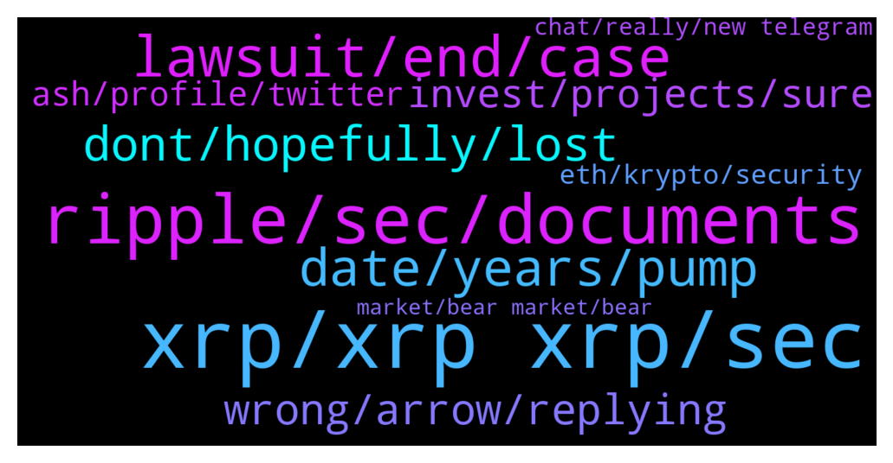

# **@Ripple**
 ## Analysis for **2022-01-14** - **2022-01-15**.

---

## 📊 **Basic Stats**

**n_messages_sent**: 320

---

---

## 🔝 **Top keywords and related messages**

1. **xrp, xrp xrp, sec**

    @triplet45 --- *Do u guys think xrp will cross 100$ mark?* **--->** [TG Discussion](https://t.me/Ripple/3040195)

    @erik_sz91 --- *MoonLambp uploaded a video; XRP will continue till september 2020 (or even more)* **--->** [TG Discussion](https://t.me/Ripple/3040773)

    @Sathvikgowdaa --- *What is next biggest plan of xrp* **--->** [TG Discussion](https://t.me/Ripple/3040765)

    @Josefa29 --- *This year or next year there will be currencies that will be much more advanced, faster and cheaper than xrp, and the world will no longer look at us.  sec wants to play this game with xrp.😠* **--->** [TG Discussion](https://t.me/Ripple/3040697)

    @gerrymchugh --- *Yeah, definitely - I stick mainly to XRP and Solo* **--->** [TG Discussion](https://t.me/Ripple/3039840)

    @ReaLPhoon --- *So when is XRP gonna be listed on coinbase again so we can buy 😌* **--->** [TG Discussion](https://t.me/Ripple/3040683)

2. **ripple, sec, documents**

    @Rektallstar --- *I think we will see an agreement favorable to Ripple before the year is over. It won't be a "win" in the court records, but for Ripple and for us it will be a win.* **--->** [TG Discussion](https://t.me/Ripple/3040129)

    @Voltaire123 --- *Do you think sec will give those docs with evidence? The will delete the important things i guess.* **--->** [TG Discussion](https://t.me/Ripple/3040618)

    @Top_of_mind --- *SEC Must Surrender Hinman Email on Ether to Ripple, Judge Rules https://www.coindesk.com/policy/2022/01/14/sec-must-surrender-hinman-email-on-ether-to-ripple-judge-rules/* **--->** [TG Discussion](https://t.me/Ripple/3040016)

    @JustNNM --- *Lets first see if those docs Ripple get access to(once they are actually handed over) and than used in the experts depositions(guessing) to provide some pressure on both sides to meet in the middle.* **--->** [TG Discussion](https://t.me/Ripple/3040614)

    @yujero2 --- *Ripple will not rise, bcoz its role by bank company.. They controlled everything* **--->** [TG Discussion](https://t.me/Ripple/3040512)

    @saca_rolhas --- *For that to happen, Ripple would need to be willing to increase burning rate. Maintaining cheap and fast transactions* **--->** [TG Discussion](https://t.me/Ripple/3040214)

3. **lawsuit, end, case**

    @jarilitmanen1 --- *That’s if it goes to trial. It won’t tho* **--->** [TG Discussion](https://t.me/Ripple/3040225)

    @DhCryptoGroup --- *Good luck bro! Hogan just mentioned that case will get resolved in aug/sept. But again we run 8x with lawsuit intact before so still i say $5 is doable 🤞* **--->** [TG Discussion](https://t.me/Ripple/3039867)

    @philip_218 --- *It is already extended to feb 28 and court decision will delay to aug or sept 2022 according to hogan* **--->** [TG Discussion](https://t.me/Ripple/3039800)

    @ibrahimda35 --- *How can I do that when I don’t see any future except delaying the court?* **--->** [TG Discussion](https://t.me/Ripple/3040587)

    @Voltaire123 --- *This lawsuit takes to long. Cant believe it will end this year but sad they will believe us it will end before sept 22. Sad* **--->** [TG Discussion](https://t.me/Ripple/3040796)

    @Voltaire123 --- *Hope you right. I want this lawsuit end soon!* **--->** [TG Discussion](https://t.me/Ripple/3040630)

4. **date, years, pump**

    @Akshay059 --- *Why everyone wait 14 to 19 January date from last 2 months* **--->** [TG Discussion](https://t.me/Ripple/3040528)

    @Rektallstar --- *And even then there isn't likely to be a conclusion on that date* **--->** [TG Discussion](https://t.me/Ripple/3039702)

    @marianmp --- *When moon - soon  When 1$ - soon When win case - soon  When 100 $ - this lifetime* **--->** [TG Discussion](https://t.me/Ripple/3040079)

    @EML1993 --- *That’s like asking “wen moon?” So the answer is easy. Soon. Lol.* **--->** [TG Discussion](https://t.me/Ripple/3040685)

    @esmocodecom --- *do you know when is the last date for the desicion ?* **--->** [TG Discussion](https://t.me/Ripple/3039705)

    @Voltaire123 --- *Yes if i read all the interviews here in this group i think years.* **--->** [TG Discussion](https://t.me/Ripple/3040279)

5. **dont, hopefully, lost**

    @cckadillo --- *Yeah I’m understanding that now. It lucky I was willing to lose it but just a massive kick in the guts* **--->** [TG Discussion](https://t.me/Ripple/3040477)

    @BB5518 --- *Dont know how much you lost, but I came back stronger with a bigger bag now* **--->** [TG Discussion](https://t.me/Ripple/3040467)

    @cckadillo --- *I just sat and held tears back after my bad luck that’s all I needed* **--->** [TG Discussion](https://t.me/Ripple/3040456)

    @cckadillo --- *Oh really it’s a shit feeling.* **--->** [TG Discussion](https://t.me/Ripple/3040463)

    @Zakkah --- *Hopefully you haven't lost too much my friend and hopefully it was a cheap lesson! 🙏* **--->** [TG Discussion](https://t.me/Ripple/3040472)

    @cckadillo --- *Yep I got burned lost everything* **--->** [TG Discussion](https://t.me/Ripple/3040447)

6. **wrong, arrow, replying**

    @Akshay059 --- *Is it joke If some seriously ask Why always all wrong replying there* **--->** [TG Discussion](https://t.me/Ripple/3040091)

    @EML1993 --- *What? And give up all the perks? Lol.* **--->** [TG Discussion](https://t.me/Ripple/3040574)

    @BB5518 --- *Doing nothing wont help anything, at least for me* **--->** [TG Discussion](https://t.me/Ripple/3040479)

    @Kingbtc1234 --- *We think what ever we want* **--->** [TG Discussion](https://t.me/Ripple/3040199)

    @marianmp --- *Everyone wants ther "piece of the pie* **--->** [TG Discussion](https://t.me/Ripple/3040012)

    @SirCuanist --- *Whatever way do we look, nothing bearish here* **--->** [TG Discussion](https://t.me/Ripple/3039925)

7. **invest, projects, sure**

    @JustNNM --- *I have nothing against anyone. Just keeping the chat flowing in the right direction.   Also discussing how much you holding or in your portfolio is just inviting scammers to you. That why we advise members not to talk about what they hold.* **--->** [TG Discussion](https://t.me/Ripple/3040663)

    @anuj90322 --- *Ok fine, it is talking about portfolio but u seem to always have something against me* **--->** [TG Discussion](https://t.me/Ripple/3040662)

    @BB5518 --- *Any giveaways are basically scams, remember that. Everything that sounds to good to be true are most likely scams. Always ask people first and do some research before you invest, and invest with money you are willing to lose.* **--->** [TG Discussion](https://t.me/Ripple/3040475)

    @aneesa_t --- *You should focus more on the goals and dev of this amazing project* **--->** [TG Discussion](https://t.me/Ripple/3040438)

    @Florian --- *Just be aware of scam projects - before investing - look at the fundamentals first* **--->** [TG Discussion](https://t.me/Ripple/3039838)

    @king_ripple --- *What is your problem? Can you just picture a good future* **--->** [TG Discussion](https://t.me/Ripple/3040586)

8. **ash, profile, twitter**

    @specialpatrolgroup --- *I will quit my admin role if it does.* **--->** [TG Discussion](https://t.me/Ripple/3040561)

    @Tinkabellagal --- *Ash Set a profile image image Set an @username  Also you can go to @xrplorer on twitter  They might be able to help Also @Silkjaer may be of help (he’s on Twitter too)* **--->** [TG Discussion](https://t.me/Ripple/3040459)

    @Tinkabellagal --- *Sorry to hear that Ash! Do as James says Also adjust your privacy settings so you can’t get added to groups without your consent* **--->** [TG Discussion](https://t.me/Ripple/3040458)

    @JesusJames --- *change your settings to not allow them to add you* **--->** [TG Discussion](https://t.me/Ripple/3040429)

    @theblokchainbaker --- *They delete them. Admins don't like audio in here* **--->** [TG Discussion](https://t.me/Ripple/3040355)

    @JustNNM --- *@XRPTraders Please read that group rules carefully before posting in it.* **--->** [TG Discussion](https://t.me/Ripple/3040047)

9. **eth, krypto, security**

    @Cezto --- *To beat eth and secure rank 2* **--->** [TG Discussion](https://t.me/Ripple/3040768)

    @anuj90322 --- *It is preferred by the elites apparently* **--->** [TG Discussion](https://t.me/Ripple/3040705)

    @marianmp --- *Most of people in krypto today have no idee what they do 🤣* **--->** [TG Discussion](https://t.me/Ripple/3040005)

    @marianmp --- *They new Eth was a security but they willingy accept that ,they diped their toes deep and filled there pocket s* **--->** [TG Discussion](https://t.me/Ripple/3039887)

    @marianmp --- *I belive it has something to do with ETH...* **--->** [TG Discussion](https://t.me/Ripple/3039885)

    @marianmp --- *Only reason people like Eth is that it has good security ...  Not because of the enormous fee's or because is better then xrp or any other krypto* **--->** [TG Discussion](https://t.me/Ripple/3040013)

10. **chat, really, new telegram**

    @cckadillo --- *Yeah I lost very similar. And I’m new to telegram and everything. Probably trust to much haha when you see groups like gala doing promos I just assumed XRP was* **--->** [TG Discussion](https://t.me/Ripple/3040468)

    @cckadillo --- *It was a group with similar members, and it was a well done site, made it look like a real promo sale* **--->** [TG Discussion](https://t.me/Ripple/3040455)

    @JesusJames --- *@Cordelll read the chat and or pinned messages* **--->** [TG Discussion](https://t.me/Ripple/3040729)

    @XRPMUSTMOON --- *I think they are talking in backyard. Find the best solution for both.* **--->** [TG Discussion](https://t.me/Ripple/3040588)

    @Meowssss1 --- *Are devs in this chat or a secret chat* **--->** [TG Discussion](https://t.me/Ripple/3040439)

    @kramercrypto --- *Yeah, normally they are so obvious but that chat got me really good with all the screenshots people were posting. Obv all bots, but they did a really good job. Hope not too many people got burnt* **--->** [TG Discussion](https://t.me/Ripple/3040433)

