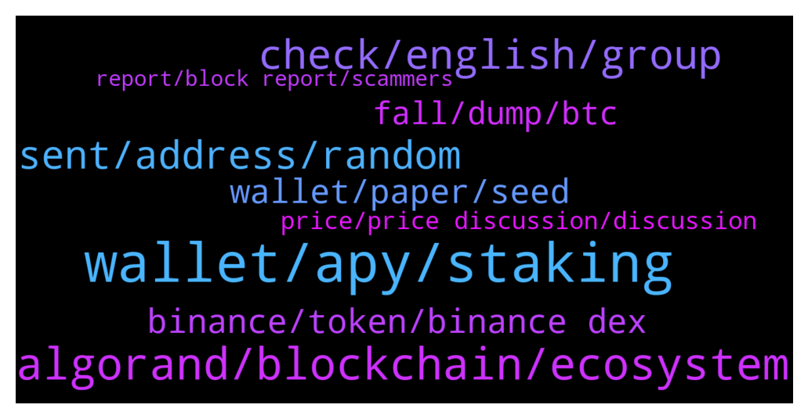

# **@algorand**
 ## Analysis for **2022-01-14** - **2022-01-15**.

---

## 📊 **Basic Stats**

**n_messages_sent**: 146

---

---

## 🔝 **Top keywords and related messages**

1. **wallet, apy, staking**

    @Raghav --- *Hi  What’s the reward rate for storing also in algo wallet as of now . I have it on Coinbase and want to move it to algo wallet* **--->** [TG Discussion](https://t.me/algorand/332724)

    @MackDenver --- *Hello there, you can simply hold Algo in official wallets to get staking rewards.* **--->** [TG Discussion](https://t.me/algorand/332547)

    @MackDenver --- *Download My Algo wallet, deposit Algo on it and hold them. You will get staking rewards automatically.* **--->** [TG Discussion](https://t.me/algorand/332556)

    @MackDenver --- *If you are asking for the minimum balance requirements, it depends on the amount of ASA you added in your wallet* **--->** [TG Discussion](https://t.me/algorand/332525)

    @SonTrab --- *how much APY, i  never used it* **--->** [TG Discussion](https://t.me/algorand/332559)

    @KAPIBAYSIDE --- *What is the min amount of algo I need to have in my algo wallet ?* **--->** [TG Discussion](https://t.me/algorand/332424)

2. **algorand, blockchain, ecosystem**

    @Vytek --- *Algorand Italia 🇮🇹 Algorand fondato da Silvio Micali insieme a un rinomato team di luminari accademici. Algorand sta costruendo un futuro senza confini e definendo lo standard per la tecnologia blockchain. algorand.com  #algo #ita #algoita #algoitalia #algoranditalia https://t.me/AlgorandItalia* **--->** [TG Discussion](https://t.me/algorand/332757)

    @OARTSRCTEY --- *Good day, Algopad is really the first launchpad platform in your ecosystem, or do you have nothing in common?* **--->** [TG Discussion](https://t.me/algorand/332314)

    @aplszczykowski --- *hello, which best swap for algorland?* **--->** [TG Discussion](https://t.me/algorand/332738)

    @mcmaxims --- *I am fine, thanks. Just woke up and continued working on a new kind of dex for Algorand. Didn't release the information yet, but it will be a new tech with unknown features yet ^^ The whitepaper will be released in the following days. I hope you guys like the innovation. How are you?* **--->** [TG Discussion](https://t.me/algorand/332663)

    @silverotoi --- *hi, is there a bridge to algorand from other ecosystem?* **--->** [TG Discussion](https://t.me/algorand/332578)

    @mcmaxims --- *Algorand is a blockchain, not a contract* **--->** [TG Discussion](https://t.me/algorand/332684)

3. **check, english, group**

    @达康书记 --- *Is there a Chinese exchange group?* **--->** [TG Discussion](https://t.me/algorand/332381)

    @MackDenver --- *Hey Maxim,  Glad to see you today. How are you doing?* **--->** [TG Discussion](https://t.me/algorand/332661)

    @NightAlgorand --- *Hi there, you can check below link 👇 https://algorand.foundation/art-nfts* **--->** [TG Discussion](https://t.me/algorand/332474)

    @NightAlgorand --- *Hi there, you can check here for Chinese channel 👉 https://t.me/AlgorandFoundationCN* **--->** [TG Discussion](https://t.me/algorand/332382)

    @NightAlgorand --- *Hi there, you can check it here 🙂 https://t.me/AlgorandItalia* **--->** [TG Discussion](https://t.me/algorand/332425)

    @MackDenver --- *Hello go, Please ask it over their social channels.* **--->** [TG Discussion](https://t.me/algorand/332549)

4. **sent, address, random**

    @RalphCraig --- *You may have malware that replaces addresses when you cut and paste.  Try cutting and pasting an Algo address into a notepad and see what happens.  If it occurred without you sending anything perhaps your seed phrase was compromised.  Did you store it electronically at all?  Perhaps as a screenshot?* **--->** [TG Discussion](https://t.me/algorand/332500)

    @studentoflife --- *I just sent some Yieldly from my algo wallet and it went to a random address i never even typed in. Can someone please help me by looking at my transaction to see whats goig on?* **--->** [TG Discussion](https://t.me/algorand/332433)

    @studentoflife --- *Never ever copied the address that it sent to* **--->** [TG Discussion](https://t.me/algorand/332451)

    @studentoflife --- *And then it just sent to some random address* **--->** [TG Discussion](https://t.me/algorand/332448)

    @studentoflife --- *It was in there for the past 10 days, then the second i try to send it goes to a random spot* **--->** [TG Discussion](https://t.me/algorand/332441)

    @studentoflife --- *then i sent more algo to the wallet and it was sent to this random place* **--->** [TG Discussion](https://t.me/algorand/332435)

5. **binance, token, binance dex**

    @SonTrab --- *how, i buy token on binance dex* **--->** [TG Discussion](https://t.me/algorand/332554)

    @BANTONIX --- *How can I get this token please* **--->** [TG Discussion](https://t.me/algorand/332520)

    @SonTrab --- *does this token have burn mode?, 10 billion tokens is too much for ico price 2.4 USDC* **--->** [TG Discussion](https://t.me/algorand/332571)

    @aplszczykowski --- *where can i add legit id for tokens?* **--->** [TG Discussion](https://t.me/algorand/332741)

    @SonTrab --- *wwhy, the token list on binance ?* **--->** [TG Discussion](https://t.me/algorand/332562)

    @MackDenver --- *You can't buy it on binance dex.* **--->** [TG Discussion](https://t.me/algorand/332560)

6. **wallet, paper, seed**

    @RalphCraig --- *Ouch.  There is malware that searches camera rolls for seed phrases.  People often think this is safe safe because it is an image but not text, but it's not.* **--->** [TG Discussion](https://t.me/algorand/332591)

    @NightAlgorand --- *Hi there, it seems nothing is wrong with the wallet, please try to type your seed exactly the same 🙂* **--->** [TG Discussion](https://t.me/algorand/332401)

    @studentoflife --- *It worked up until last month. Is something wrong with the wallet?* **--->** [TG Discussion](https://t.me/algorand/332397)

    @defirlkp --- *your seed phrase could have been compromised and someone else is making those transactions* **--->** [TG Discussion](https://t.me/algorand/332436)

    @studentoflife --- *Hey guys, i have been trying to access my algorand wallet for a while and my seed phrase is not working on it* **--->** [TG Discussion](https://t.me/algorand/332396)

    @RalphCraig --- *That wallet is compromised.  Create a new one and start fresh.  Never store the seed phrase in any electronic format.  Write it on paper.  Divide the words into three parts, A, B, and C.  Write the words from groups A and B onto one piece of paper.  Write the words from groups B and C onto another piece of paper.  Write the words from groups A and C onto a third.  Store the three pieces of paper in different structures.  In case fire or other disaster you can restore the phrase from any two of the three pieces of paper.  A thief who gets only one piece will not have enough information to access the wallet.* **--->** [TG Discussion](https://t.me/algorand/332594)

7. **fall, dump, btc**

    @cryptocomicc --- *looks like we'll hit 20 million wallets tongihts* **--->** [TG Discussion](https://t.me/algorand/332346)

    @K --- *yaa us is suffering from huge covid cases* **--->** [TG Discussion](https://t.me/algorand/332319)

    @phantompatriot1 --- *Man are we ever getting hammered.* **--->** [TG Discussion](https://t.me/algorand/332479)

    @J --- *US stocks dump, BTC dump, algo fall* **--->** [TG Discussion](https://t.me/algorand/332317)

    @Brightmoon23 --- *I hope so ,I am really disappointed, I was so excited for 2022* **--->** [TG Discussion](https://t.me/algorand/332569)

    @aneesa_t --- *Only time will tell, everything said now is speculative* **--->** [TG Discussion](https://t.me/algorand/332483)

8. **price, price discussion, discussion**

    @KAPIBAYSIDE --- *Where has the most accurate prices on ASAs because tiny chart and the commandbot  seem to be in accurate* **--->** [TG Discussion](https://t.me/algorand/332614)

    @MackDenver --- *There is Timyman however, Tinyman is currently in the repair phase. You will need to wait for it to be fixed. A few other DEXs are already in the works* **--->** [TG Discussion](https://t.me/algorand/332739)

    @NightAlgorand --- *Please refrain from price discussion here. There is a price discussion group Here is the price discussion group-   https://t.me/algorand_price* **--->** [TG Discussion](https://t.me/algorand/332326)

    @jumpfetus --- *in other words, there's nowhere to draw price information from* **--->** [TG Discussion](https://t.me/algorand/332617)

    @jumpfetus --- *there are no prices because there's no exchange for most of them with tinyman down* **--->** [TG Discussion](https://t.me/algorand/332616)

    @cryptocomicc --- *Didn’t have anything to do with price* **--->** [TG Discussion](https://t.me/algorand/332350)

9. **report, block report, scammers**

    @C --- *On here no more than ten minutes before the scammers start messaging :( Any who, love the project, keep it up all.* **--->** [TG Discussion](https://t.me/algorand/332604)

    @studentoflife --- *don't try messaging me scammers. i know any DM's are false* **--->** [TG Discussion](https://t.me/algorand/332398)

    @Whateverrrrlahhhh --- *jsut block and report. Nobody will dm you LOL!* **--->** [TG Discussion](https://t.me/algorand/332376)

    @khunpon --- *ask him for 24 word seed. proof that he honest.   No, block and then report him to Admin* **--->** [TG Discussion](https://t.me/algorand/332375)

    @NightAlgorand --- *Yes please, report him here @notoscam 🙂* **--->** [TG Discussion](https://t.me/algorand/332369)

    @MackDenver --- *Can you send the scamming proof in my pm?* **--->** [TG Discussion](https://t.me/algorand/332733)

