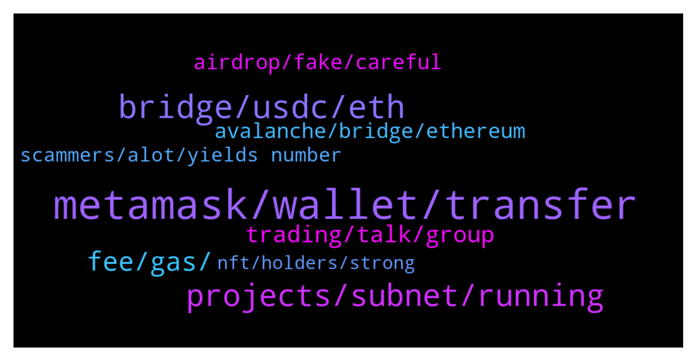

# **@avalancheavax**
 ## Analysis for **2022-01-14** - **2022-01-15**.

---

## 📊 **Basic Stats**

**n_messages_sent**: 156

---

---

## 🔝 **Top keywords and related messages**

1. **metamask, wallet, transfer**

    @caligula_0 --- *Is AVAX a scam? Many people are saying this.* **--->** [TG Discussion](https://t.me/avalancheavax/322336)

    @jenlianl --- *Does it have to be metamask? Im trying to use it within my hardware that isnt metamask compstible the way ledger and trezor are i think* **--->** [TG Discussion](https://t.me/avalancheavax/322395)

    @Nicolas_A --- *The one you like the most* **--->** [TG Discussion](https://t.me/avalancheavax/322368)

    @Victoredd --- *What is the best game on AVAX right now? Suggestions? I mean a JEWEL level game* **--->** [TG Discussion](https://t.me/avalancheavax/322204)

    @oathtobarbatos --- *That's weird. Try restarting your Metamask account or double-check if you have enough AVAX for fees* **--->** [TG Discussion](https://t.me/avalancheavax/322389)

    @Hasan --- *My 1630 Avax was stolen. 24 words were stolen. Just scammers with me. Who wear my loss. Everyone to everyone. accident victim.* **--->** [TG Discussion](https://t.me/avalancheavax/322396)

2. **bridge, usdc, eth**

    @Pedro --- *Hi, I'm trying to bridge USDC from avalanche to ethereum but I can't see it on the token list.* **--->** [TG Discussion](https://t.me/avalancheavax/322157)

    @AceInTheHat --- *Can you bridge BSC USDC to AVAX USDC.e?* **--->** [TG Discussion](https://t.me/avalancheavax/322465)

    @Nicolas_A --- *Yes using the bridge I just mentioned above* **--->** [TG Discussion](https://t.me/avalancheavax/322468)

    @GMfrensWAGMI --- *Thank you. How to wrap ETH into WETH? UniSwap (on Ethereum)?* **--->** [TG Discussion](https://t.me/avalancheavax/322372)

    @greatday888 --- *Hi, If I bridge USDT in Wormhole from Polygon to Avax Network, can I get the same USDT.e?* **--->** [TG Discussion](https://t.me/avalancheavax/322455)

    @mariettahelena --- *Ok, but when do you bridge the tokens ? Before sending them on ETH wallet or once they are on ETH wallet ?* **--->** [TG Discussion](https://t.me/avalancheavax/322310)

3. **projects, subnet, running**

    @itamarcps --- *AVME, not yet running in subnets but we are building prototypes already* **--->** [TG Discussion](https://t.me/avalancheavax/322431)

    @Nicolas_A --- *For dev questions ask on Discord please chat.avax.network* **--->** [TG Discussion](https://t.me/avalancheavax/322156)

    @pokerfinance --- *do we know any project already running on Avax subnet?* **--->** [TG Discussion](https://t.me/avalancheavax/322429)

    @Mell19976 --- *Where can I check the upcoming avax projects?* **--->** [TG Discussion](https://t.me/avalancheavax/322135)

    @SnowslideV --- *Oh yeah! "Interact with EVM", right? I feel dumb, LoL! Thank you so much! 😆* **--->** [TG Discussion](https://t.me/avalancheavax/322521)

    @li --- *All of those projects are deploy on C-chain* **--->** [TG Discussion](https://t.me/avalancheavax/322441)

4. **fee, gas, **

    @Nicolas_A --- *Not sure. I know Synapse / Celer network give you the right one* **--->** [TG Discussion](https://t.me/avalancheavax/322463)

    @oathtobarbatos --- *It depends on the contract, as far as I know. A swap should cost less than a dollar and, the current med gas price is $0.05 (25 nAVAX)* **--->** [TG Discussion](https://t.me/avalancheavax/322385)

    @jenlianl --- *Just tried swapping but keep getting msg not enough gas fee or aomething* **--->** [TG Discussion](https://t.me/avalancheavax/322383)

    @AceInTheHat --- *Do you know the fee to use synapse?* **--->** [TG Discussion](https://t.me/avalancheavax/322471)

    @jenlianl --- *Ive been trying to swap on joe w the avax i have on c chain but keeps saying i have no gas for some reason   Lol literally after sending the help me message  i gte like 7 msg lol* **--->** [TG Discussion](https://t.me/avalancheavax/322388)

    @jenlianl --- *So its just a bug maybe? I def do have enough i only tried swappi g like not even 5% of my total holding* **--->** [TG Discussion](https://t.me/avalancheavax/322391)

5. **trading, talk, group**

    @hayshanaba --- *Hey hun,Not to waste your precious time, because I believe you’re a very busy person. I’ll like to talk to you about something. Can I proceed?💫 I’ll like to talk to you about crypto currency investment I’m a professional in crypto and forex trading, I have been trading for quite some time now. I trade and manage accounts for my clients  and also make them good profits weekly.* **--->** [TG Discussion](https://t.me/avalancheavax/322209)

    @Magnetix --- *hello, who can add some reputation? I want to do tasks for twitter. My nickname is Magnetix.* **--->** [TG Discussion](https://t.me/avalancheavax/322418)

    @Jinjian --- *Is there a Chinese group? Can you add it* **--->** [TG Discussion](https://t.me/avalancheavax/322256)

    @oathtobarbatos --- *This is a chat group, there is a trading group too* **--->** [TG Discussion](https://t.me/avalancheavax/322212)

    @oathtobarbatos --- *Chikn. Take a look at it on Twitter* **--->** [TG Discussion](https://t.me/avalancheavax/322207)

    @bluelight184527 --- *Dear everyone Nice to meet you. I am Hisamitsu from Japan and I am a Senior Fullstack | Blockchain Developer. I am looking for a new job now. If you have any roles for me, then please DM me. Best Regards.* **--->** [TG Discussion](https://t.me/avalancheavax/322133)

6. **airdrop, fake, careful**

    @roadrunnergame1 --- *are creating airdrop with fake channel here on telegram, be careful* **--->** [TG Discussion](https://t.me/avalancheavax/322553)

    @TheSEOdude --- *You need to claim them directly from airdrop page. There you can see.* **--->** [TG Discussion](https://t.me/avalancheavax/322333)

    @EnduroV1 --- *Seems another fake Avalanche Official group popped up with another airdrop.... careful guys* **--->** [TG Discussion](https://t.me/avalancheavax/322242)

    @Milly --- *Users will be airdropped up to 0.1 AVAX when they transfer more than $75  of a token from Ethereum to Avalanche.* **--->** [TG Discussion](https://t.me/avalancheavax/322128)

    @roadrunnergame1 --- *are creating airdrop with fake channel here on discord, be careful* **--->** [TG Discussion](https://t.me/avalancheavax/322537)

    @marty_mac_fly --- *Hello admin what about airdrop of avax bridge users??* **--->** [TG Discussion](https://t.me/avalancheavax/322121)

7. **avalanche, bridge, ethereum**

    @mkchaves --- *Use Avalanche C-Chain instead of Mainnet* **--->** [TG Discussion](https://t.me/avalancheavax/322520)

    @GMfrensWAGMI --- *I want to buy TIME on Avalanche and I have ETH on Ethereum - how best to accomplish?* **--->** [TG Discussion](https://t.me/avalancheavax/322362)

    @Nicolas_A --- *Bridge.avax.network wrap your eth into WETH and then bridge it to Avalanche. Use a dex such as Pangolin or TraderJoe to buy TIME* **--->** [TG Discussion](https://t.me/avalancheavax/322366)

    @oathtobarbatos --- *I've never heard about that one and, seems like it's not compatible with Avalanche swaps https://safepal.io/coin/lists I think* **--->** [TG Discussion](https://t.me/avalancheavax/322402)

    @bestcoderna --- *Join us for our Avalanche Weekly Wrapup  https://twitter.com/i/spaces/1lPJqmlyYdQJb* **--->** [TG Discussion](https://t.me/avalancheavax/322381)

    @one_boy_like_dat --- *I don’t know on avalanche but I do know a play to earn that could earn you cool $* **--->** [TG Discussion](https://t.me/avalancheavax/322208)

8. **scammers, alot, yields number**

    @jenlianl --- *Lol wow the scammers here are alot hahah* **--->** [TG Discussion](https://t.me/avalancheavax/322386)

    @jenlianl --- *I know ppl dont like to help that much lol wish someone made a crypto that yields by the number of scammers theyve turned in or something lol* **--->** [TG Discussion](https://t.me/avalancheavax/322390)

    @Nicolas_A --- *People who have all their money in another L1 are going to say all other projects are scams. Doesn’t mean it’s true* **--->** [TG Discussion](https://t.me/avalancheavax/322343)

    @Pedro --- *the scammers make me laugh, they are so polite* **--->** [TG Discussion](https://t.me/avalancheavax/322160)

    @Nicolas_A --- *Was just a scam don’t over think it* **--->** [TG Discussion](https://t.me/avalancheavax/322532)

    @Nicolas_A --- *Arguments for claims that it’s shady and scammy ? Proofs ? Or just fudding ?* **--->** [TG Discussion](https://t.me/avalancheavax/322342)

9. **nft, holders, strong**

    @mariettahelena --- *Hi there … I am new here but an ‘old’ investor in this HUGE project.* **--->** [TG Discussion](https://t.me/avalancheavax/322306)

    @wanderellaco --- *We have a profit sharing model. 25% of our sales will be reinvested in other NFTs (can be suggested by holders). After sold, profits will be split to all holders. We also donate 5% to 2 big charities 😊* **--->** [TG Discussion](https://t.me/avalancheavax/322252)

    @sahara_blend --- *I use Kalao personally strong team and strong investors* **--->** [TG Discussion](https://t.me/avalancheavax/322197)

    @Henrique --- *to highlight the low carbon advantage over other cryptoassets, I suggest creating commemorative stamps on NFT’s for environmental organizations (Greenpeace, WWF, SeaShepherd,…) to present to their biggest donors!* **--->** [TG Discussion](https://t.me/avalancheavax/322187)

    @Henrique --- *seek to make agreements to make NFT's based on POP culture!  An exclusive NFT made in partnership with Marvel with the signature of an actor who participated in a movie can bring enormous visibility to the platform!* **--->** [TG Discussion](https://t.me/avalancheavax/322186)

    @Henrique --- *think of NFT’s as additional prizes in competitions (like the Superbowl, the Oscars, the CS:GO championships,…)* **--->** [TG Discussion](https://t.me/avalancheavax/322185)

