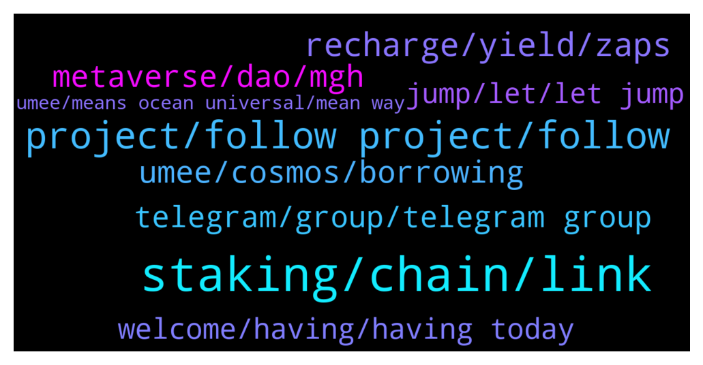

# **@chainlinkofficial**
 ## Analysis for **2022-01-14** - **2022-01-15**.

---

## 📊 **Basic Stats**

**n_messages_sent**: 209

---

---

## 🔝 **Top keywords and related messages**

1. **staking, chain, link**

    @Luckygirlkate --- *We plan on having a long and healthy relationship with Chainlink.* **--->** [TG Discussion](https://t.me/chainlinkofficial/364691)

    @elizabeth_baker --- *Hi admin. Can I use Chainlink keepers to automatically trigger the minting of Nft assets? 💆‍♀* **--->** [TG Discussion](https://t.me/chainlinkofficial/364868)

    @H --- *Why chainlink don't have own Blockchain 🤔* **--->** [TG Discussion](https://t.me/chainlinkofficial/364738)

    @Walter --- *Hello my fellow chainlist members. I have a quick question regarding partners. Does anyone know Metaplace finance and are they partnered with chainlink? Because we are investigating a scam. Thank you for you response❤️* **--->** [TG Discussion](https://t.me/chainlinkofficial/364320)

    @moscowberkay --- *Hi guys just question, there s a way to stake link on Binance? When check on binance stake for link always sold out and lock* **--->** [TG Discussion](https://t.me/chainlinkofficial/364354)

    @thenicolasweber --- *Chainlink bot is tougher than bouncer at club 😃* **--->** [TG Discussion](https://t.me/chainlinkofficial/364450)

2. **project, follow project, follow**

    @Linkederic --- *This is a great overview https://blog.chain.link/levels-of-data-aggregation-in-chainlink-price-feeds/* **--->** [TG Discussion](https://t.me/chainlinkofficial/364889)

    @mcrisk58 --- *An itibari ile 670 bin içerideyim* **--->** [TG Discussion](https://t.me/chainlinkofficial/364083)

    @Remzi --- *What are the short, medium and long term goals? so any guesses?* **--->** [TG Discussion](https://t.me/chainlinkofficial/364070)

    @PolivodaTatiana --- *Where can the audience follow you and your project?* **--->** [TG Discussion](https://t.me/chainlinkofficial/364610)

    @Luckygirlkate --- *Indeed! We are a very in depth project.* **--->** [TG Discussion](https://t.me/chainlinkofficial/364680)

    @marcromeron --- *What’s next on your project’s roadmap?* **--->** [TG Discussion](https://t.me/chainlinkofficial/364707)

3. **recharge, yield, zaps**

    @Luckygirlkate --- *Further along the road, we’ll be releasing among other features:  Support for more chains, Polygon, MultiVac, Ethereum of course and more.  A bond market, a reactor-powered secondary market to purchase Recharge tokens at a discount, funding a yield-earning treasury that increases the protocol yield.* **--->** [TG Discussion](https://t.me/chainlinkofficial/364712)

    @m0crypto --- *Entering a Zap giveaway is a great way to get involved at no cost. Users can also purchase Recharge tokens via PancakeSwap. Community members/token holders can create proposals and vote on them via our community snapshot voting program.* **--->** [TG Discussion](https://t.me/chainlinkofficial/364696)

    @Luckygirlkate --- *Currently we use Chainlink’s VRF to pick random winners from our Zaps, as we expand across additional chains, VRF will be used for native Zaps on each one.* **--->** [TG Discussion](https://t.me/chainlinkofficial/364689)

    @m0crypto --- *We're building an entire economy based on decentralized taxation and decentralized, unbiased distribution with no middle-man. A fair and rewarding tax economy with a variety of financial products vs a token only focused on the economy of attention.* **--->** [TG Discussion](https://t.me/chainlinkofficial/364684)

    @Luckygirlkate --- *This is a bit of a long answer, but well detailed for the communities.   Recharge is a cross-chain ecosystem built around the idea of working together as a community for mutual benefit. The DeFi space is exciting but extremely fragmented across multiple chains with thousands of tokens, each requiring constant staking, unstaking and bridging to benefit from. We’re doing away with all of that with a token that builds value directly in your wallet on any supported blockchain.  With Recharge, there are no extra steps, no staking or lockups, it just works and because of this, is instantly available for use and can be stored in any type of wallet. Being in possession of your tokens at all times reduces risks by limiting the number of contracts you need to interact with while offering completely passive yield similar to a traditional savings account.  The Recharge token is the just tip of the iceberg, with our native bridge we can expand seamlessly across supported chains and fairly distribute the yield across them. Recharge Assets will enable the same seamless and passive yield on stable, wrapped assets, again seamlessly on multiple chains.  Another interesting feature, our Reactors—a mutualized yield pool where the yield is redirected and powers custom contracts and different reward mechanisms. Developers can implement their own contracts and get voted in to draw from this yield. Recharge holders can swap for RCORE, effectively donating their yield to the reactor in exchange for various rewards.  Our first Chainlink integration is actually powered by one of the reactors, Recharge Zaps draw yield from it and distribute it through giveaways secured by Chainlink’s VRF. Thanks to the passive yield generation the zaps are funded at no cost and allow anyone to enter with no financial barriers as part of our commitment to bring more people to decentralized finance as a member of the GoodFi movement* **--->** [TG Discussion](https://t.me/chainlinkofficial/364677)

    @m0crypto --- *Any developer can hook into our reactor contracts to create extensions of the Recharge ecosystem for any purpose, drawing on existing token yield pools to fund the extensible protocols.* **--->** [TG Discussion](https://t.me/chainlinkofficial/364697)

4. **metaverse, dao, mgh**

    @marcromeron --- *Nicolas {Beware of Impersonators}: for this we have set up the various working groups which each can then subsequently apply for grants from the MGH DAO Treasury on a periodic basis to support the ecosystem growth. the working group application form is you path and after filling it out the DAO and respective working groups vote on new applicants. https://forms.gle/A6vCq2kxQpsdqp2o8 (here is the from)* **--->** [TG Discussion](https://t.me/chainlinkofficial/364470)

    @marcromeron --- *DeFi, Data and Metaverse sounds really interesting.* **--->** [TG Discussion](https://t.me/chainlinkofficial/364425)

    @thenicolasweber --- *At MetaGameHub DAO we focus on the convergence of DeFi, Data and the Metaverse. As the Metaverse is currently hyped a lot, we believe that the next hype within the Metaverse will be applications on top and directly integrated within the Metaverse. Our core principle is “Navigating through the Open Metaverse together”. We do this with the following two aspects:   Building a decentralized “state” in the Open Metaverse by acquiring and managing LANDs across various Metaverses such as The Sandbox, Decentraland and many more which our community governs and thus monetised via e.g. GameFi applications, event venues, art galleries and more. Building intuitive tools such as our evaluation tool for finding the fair price for your The Sandbox LAND and leveraging the data we have from an algorithm we developed to generate further revenue via our collaborations with Chainlink and Ocean Protocol to sell this NFT pricing data on their marketplaces. You can check out the tool in our dApp! The idea behind MGH DAO originated from 1) the fact that we want to onboard “the masses” via decentralized governance and monetization of LANDs as typically LAND in the Metaverse is owned by centralized parties and 2) we discovered that many Metaverse assets are lacking a fair and transparent pricing and therefore started developing the pricing algorithm.* **--->** [TG Discussion](https://t.me/chainlinkofficial/364419)

    @marcromeron --- *Nicolas {Beware of Impersonators}: The best way to be engaged with is 1) joining our community channels on TG(https://t.me/metagamehub_dao), Discord (https://discord.gg/8WJVMDXZwH) and following us on Twitter (https://twitter.com/MGH_DAO) while 2) you can become part of the Working Groups where you can apply to via the application form:https://forms.gle/A6vCq2kxQpsdqp2o8 - here we have an Operations WG, Data/Algo WG, Tech WG, Awareness/Marketing WG, Legal WG and Metaverse Development WG with our collab that we foster with University of Applied Sciences Aachen 🙂 Generally I invite everyone to join us on our mission to accelerate decentralization and transparency within the Open Metaverse. 🙏 Lastly, you can of course contact us directly via TG or Twitter: https://twitter.com/thenicolasweber* **--->** [TG Discussion](https://t.me/chainlinkofficial/364488)

    @marcromeron --- *How is MetaGame Hub DAO converging metaverse - dataverse?* **--->** [TG Discussion](https://t.me/chainlinkofficial/364472)

    @thenicolasweber --- *excited to speak about the convergence of the dataverse with the Open Metaverse via on chain data 🙂* **--->** [TG Discussion](https://t.me/chainlinkofficial/364396)

5. **umee, cosmos, borrowing**

    @bond_dog_51 --- *2022 February: Umee Base Functionality Deployment on Mainnet and Token Launch 2022 March: Umee Lending Facility Upgrades  2022 April - Onward: -Protocol developments on top of Umee: meTokens, staking curves, defi debt protocols -Umee Polygon Lending and Borrowing Application -Umee Arbitrum Lending and Borrowing Application -Umee Optimism Lending and Borrowing Application -Umee Solana Lending and Borrowing Application -Umee Binance Smart Chain Lending and Borrowing Application *Disclaimer - timeline is subject to change** **--->** [TG Discussion](https://t.me/chainlinkofficial/364605)

    @bond_dog_51 --- *Of course - Umee will be connected via IBC with close 30-40 other Cosmos based blockchains. These networks account for close to $80-100bn worth of crypto assets.  Umee intends to be a gateway for onboarding these assets into Ethereum DeFi via Chainlink oracles.* **--->** [TG Discussion](https://t.me/chainlinkofficial/364585)

    @bond_dog_51 --- *Umee will be connected with over 40 other blockchain networks and we are very much focused on EVM compatibility between the different networks.* **--->** [TG Discussion](https://t.me/chainlinkofficial/364582)

    @bond_dog_51 --- *Yes that is correct - Umee is powered by a network of validators that run proof of stake consensus* **--->** [TG Discussion](https://t.me/chainlinkofficial/364572)

    @bond_dog_51 --- *Of course - Umee is a blockchain that is powered by Tendermint BFT Consensus. The Umee blockchain itself is a base layer protocol upon which lots of DeFi apps can be built. We're expecting many borrowing and lending type platforms to be built on top of the Umee blockchain.* **--->** [TG Discussion](https://t.me/chainlinkofficial/364570)

    @bond_dog_51 --- *For folks who want to Run validators, we have various testnets for people to practice setting up a node for the Umee mainnet.* **--->** [TG Discussion](https://t.me/chainlinkofficial/364596)

6. **telegram, group, telegram group**

    @deadduck1000 --- *Hi, do we have an announcement group?* **--->** [TG Discussion](https://t.me/chainlinkofficial/364321)

    @RomainSwitzerland --- *China has a telegram group, it’s called @chainlinkfans (unofficial) and please also feel free to check out our Chinese communities (official) here:  https://blog.chain.link/chainlink-chinese-communities/* **--->** [TG Discussion](https://t.me/chainlinkofficial/364806)

    @Sylvarantt --- *China has a telegram group, it’s called @chainlinkfans (unofficial) and please also feel free to check out our Chinese communities (official) here:  https://blog.chain.link/chainlink-chinese-communities/* **--->** [TG Discussion](https://t.me/chainlinkofficial/364789)

    @m0crypto --- *People can follow us right here on Telegram  https://t.me/rechargefinance* **--->** [TG Discussion](https://t.me/chainlinkofficial/364719)

    @PolivodaTatiana --- *And this is our official telegram group for Russian speaking community: https://t.me/ChainlinkRussia* **--->** [TG Discussion](https://t.me/chainlinkofficial/364190)

    @m0crypto --- *We  also post announcements and other news on Twitter: https://twitter.com/@RechargeFinance* **--->** [TG Discussion](https://t.me/chainlinkofficial/364721)

7. **welcome, having, having today**

    @Luckygirlkate --- *Thank you so much for having us today Marc!* **--->** [TG Discussion](https://t.me/chainlinkofficial/364729)

    @PolivodaTatiana --- *and as always, thanks a lot to our members for participating* **--->** [TG Discussion](https://t.me/chainlinkofficial/364620)

    @ming0duan --- *Thank you so much for having us today!!!❤️🌊🏄‍♂️* **--->** [TG Discussion](https://t.me/chainlinkofficial/364568)

    @enes_akin --- *welcome mr kenny, we're on your way* **--->** [TG Discussion](https://t.me/chainlinkofficial/364564)

    @marcromeron --- *Joining us from the MetaGameHub DAO team, we have Nicolas, Phil and Santiago. Welcome and thank you for your time today.* **--->** [TG Discussion](https://t.me/chainlinkofficial/364404)

    @m0crypto --- *Hi everyone, thanks for having us here!* **--->** [TG Discussion](https://t.me/chainlinkofficial/364665)

8. **jump, let, let jump**

    @marcromeron --- *Let's jump for the final one and more important...* **--->** [TG Discussion](https://t.me/chainlinkofficial/364717)

    @marcromeron --- *Let's jump to the first question...* **--->** [TG Discussion](https://t.me/chainlinkofficial/364675)

    @PolivodaTatiana --- *before we begin, please introcude yourselves, guys* **--->** [TG Discussion](https://t.me/chainlinkofficial/364558)

    @marcromeron --- *After this amazing technical explanation, let's go for another one...* **--->** [TG Discussion](https://t.me/chainlinkofficial/364445)

    @marcromeron --- *Let's jump into our first question...* **--->** [TG Discussion](https://t.me/chainlinkofficial/364415)

    @marcromeron --- *This is one of the most interesting questions from our Community members....* **--->** [TG Discussion](https://t.me/chainlinkofficial/364432)

9. **umee, means ocean universal, mean way**

    @kennynajarr0 --- *For all official Umee links - Twitter, Discord, Medium, Telegram, etc. - please go to our linktree: https://linktr.ee/UmeeCrossChain* **--->** [TG Discussion](https://t.me/chainlinkofficial/364611)

    @mustafa_aksoz --- *It was amazing to follow and learn more about Umee, Thank you so much* **--->** [TG Discussion](https://t.me/chainlinkofficial/364637)

    @PolivodaTatiana --- *Thank you so much for your time today and best of luck with launching UMEE!* **--->** [TG Discussion](https://t.me/chainlinkofficial/364618)

    @PolivodaTatiana --- *What does UMEE mean, by the way? a very intriguing name* **--->** [TG Discussion](https://t.me/chainlinkofficial/364615)

    @enes_akin --- *Umee fans, the question and answer event is starting here soon* **--->** [TG Discussion](https://t.me/chainlinkofficial/364530)

    @bond_dog_51 --- *Of course - Umee means Ocean. Also a universal connection between U and Me :)   Umee is also derived from the Japanese word for delicious, which is a nice node to all of the food tokens from back in the day: Sushi, Cream, Pickle, Pancake, Uni etc etc.* **--->** [TG Discussion](https://t.me/chainlinkofficial/364616)

