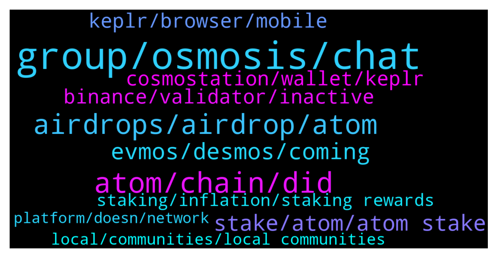

# **@cosmosproject**
 ## Analysis for **2022-01-14** - **2022-01-15**.

---

## 📊 **Basic Stats**

**n_messages_sent**: 371

---

---

## 🔝 **Top keywords and related messages**

1. **group, osmosis, chat**

    @AtomJazz --- *You're not even banned. At least I can't find you on the list* **--->** [TG Discussion](https://t.me/cosmosproject/473958)

    @ZoltanAtom --- *@IsaacEssuman21 did prepare a tricky quiz😎* **--->** [TG Discussion](https://t.me/cosmosproject/474368)

    @TicoJohnny --- *I am not sure, it looks like they stopped producing blocks for Iris ten months ago* **--->** [TG Discussion](https://t.me/cosmosproject/474588)

    @G45788 --- *Thanks for your help.We need to create a new group for price trading if I cannot enter it:)))* **--->** [TG Discussion](https://t.me/cosmosproject/473970)

    @AtomJazz --- *We have many other groups you can join. Airdrop chat, cosmosnauts chat, cosmos ecosystem chat etc.* **--->** [TG Discussion](https://t.me/cosmosproject/473972)

    @JasonOfArgonaut --- *Did they complete the captcha when joined? If not leave and rejoin.* **--->** [TG Discussion](https://t.me/cosmosproject/473973)

2. **atom, chain, did**

    @nickyyyjj --- *wondered if $ATOM is in smth like this https://medium.com/dehive/what-is-a-crypto-index-and-how-is-it-better-than-regular-cryptocurrencies-f25eb61818f7* **--->** [TG Discussion](https://t.me/cosmosproject/473948)

    @TicoJohnny --- *No you don’t need atom to start a new chain* **--->** [TG Discussion](https://t.me/cosmosproject/474667)

    @Jonathan --- *hello, new to the atom ecosystem.  what are your favorite projects inside atom 🙂* **--->** [TG Discussion](https://t.me/cosmosproject/474405)

    @Curtis --- *Can anyone walk me through moving my atom off binance.us* **--->** [TG Discussion](https://t.me/cosmosproject/474572)

    @trabzonizm61 --- *Thx for answer.  İ did send atom to mxc . But it didnt come to my account* **--->** [TG Discussion](https://t.me/cosmosproject/474398)

    @KosukiOdenn --- *I have some Questions about $Atom Cosmos IBC is growing up but $Atom got noting. So how Atom grow up?* **--->** [TG Discussion](https://t.me/cosmosproject/474932)

3. **airdrops, airdrop, atom**

    @Ron --- *Question. Do most of the airdrops go to Keplr wallet users as opposed to staking from the ledger? Anyone know cause there are some airdrops I didn’t receive* **--->** [TG Discussion](https://t.me/cosmosproject/475005)

    @ZoltanAtom --- *Hello,All you need to do is stake your Atom. Eventually you will need to use Keplr wallet to claim your airdrops.   Couple of important point you need to know that do not stake your Atom with exchange validators and validators which offers 0 commission.* **--->** [TG Discussion](https://t.me/cosmosproject/474350)

    @faisalsahi --- *And what valideter is racommended for airdrop???* **--->** [TG Discussion](https://t.me/cosmosproject/475018)

    @GSn0w --- *Are there gonna be frecuently airdrops in the future?* **--->** [TG Discussion](https://t.me/cosmosproject/474532)

    @AtomJazz --- *As far as airdrops go, there's no one rule, usually the more you have staked the bigger airdrop you receive* **--->** [TG Discussion](https://t.me/cosmosproject/474530)

    @ltunited --- *I have staked: 140 atoms, 50 Osmo and 20 Juno. What do you think, should I rebalance a bit, maybe swap some atoms to get at least 50 juno? In order to have more Chance for airdrops? As I ran out of cash.* **--->** [TG Discussion](https://t.me/cosmosproject/474582)

4. **evmos, desmos, coming**

    @Nick --- *How does evmos differ from polygon* **--->** [TG Discussion](https://t.me/cosmosproject/474960)

    @DrDaxx --- *Which new coin has best potential between lum, comdex, desmos* **--->** [TG Discussion](https://t.me/cosmosproject/474439)

    @AtomJazz --- *For specifics pls join Evmos channel* **--->** [TG Discussion](https://t.me/cosmosproject/474972)

    @TicoJohnny --- *We have cheqd, stargaze, lum, desmos, comdex recently* **--->** [TG Discussion](https://t.me/cosmosproject/474610)

    @pokbluff12 --- *Hello, where I can get info about desmos?* **--->** [TG Discussion](https://t.me/cosmosproject/474256)

    @lewysti --- *Where i can check How many evmos they give me?* **--->** [TG Discussion](https://t.me/cosmosproject/474418)

5. **stake, atom, atom stake**

    @mavr1k --- *where do you recommend to stake atom?* **--->** [TG Discussion](https://t.me/cosmosproject/475090)

    @MaxxKrypto --- *What’s the best way to get the most value out of a bag of $ATOM. Stake or use in liquidity pool (if so, which LP)? 😖😖* **--->** [TG Discussion](https://t.me/cosmosproject/475080)

    @ZoltanAtom --- *Hello,you earn stake rewards every ~7 second.   Would you like to see how much will you earn if you stake your Atoms ? Like monthly ? Daily ?* **--->** [TG Discussion](https://t.me/cosmosproject/474410)

    @LeBastian7 --- *Can I stake TERRA LUNA within the COSMOSVERSE?* **--->** [TG Discussion](https://t.me/cosmosproject/474046)

    @ursubear --- *you can also stake at  https://quickstake.itastakers.com/ or https://juno.disperze.network/* **--->** [TG Discussion](https://t.me/cosmosproject/474959)

    @filipcristian --- *Hi there , is keplr reliable for staking ATOM , just purchased 10,000 ATOM* **--->** [TG Discussion](https://t.me/cosmosproject/474225)

6. **binance, validator, inactive**

    @Ft79vop --- *its not on binance the exchange, its staked to the binance validator from keplr wallet* **--->** [TG Discussion](https://t.me/cosmosproject/474846)

    @TicoJohnny --- *You don't want to delegate to binance* **--->** [TG Discussion](https://t.me/cosmosproject/474624)

    @Prometheus_Zeus --- *I can’t find Binance under the validators anymore. Have they renamed? Or did they unstaked?* **--->** [TG Discussion](https://t.me/cosmosproject/475073)

    @jorgetuli --- *Ok so should I reach out to Binance support?* **--->** [TG Discussion](https://t.me/cosmosproject/474503)

    @atom2024 --- *I cannot see Binance on atom Validator list.* **--->** [TG Discussion](https://t.me/cosmosproject/474622)

    @Pahini2 --- *Anyone tell me when Blockpool  was jailed?* **--->** [TG Discussion](https://t.me/cosmosproject/474586)

7. **cosmostation, wallet, keplr**

    @RITEMED --- *Is it ok to use the metamask wallet ??* **--->** [TG Discussion](https://t.me/cosmosproject/474344)

    @matthew4you --- *Just to confirm that all cosmos project tokens would use the same kelpr wallet address?* **--->** [TG Discussion](https://t.me/cosmosproject/474324)

    @JD_Lorax --- *Keplr wallet (desktop and mobile) or Cosmostation (primarily mobile).* **--->** [TG Discussion](https://t.me/cosmosproject/475091)

    @ZoltanAtom --- *Cosmostation and Keplr are the most recommended wallets.At this moment Keplr mobile app is supported by only 4 chains, Cosmostation app is supported almost all Cosmos chains. Links are at the #3 pinned message.* **--->** [TG Discussion](https://t.me/cosmosproject/474827)

    @OctoberXIV --- *Are you familiar with crypto wallets? (seed phrase, hardware vs software and so on?)* **--->** [TG Discussion](https://t.me/cosmosproject/474578)

    @AtomJazz --- *Yes, it's the best Cosmos wallet* **--->** [TG Discussion](https://t.me/cosmosproject/474226)

8. **staking, inflation, staking rewards**

    @AtomJazz --- *Ah ok I understand. People are unstaking due to other opportunities (LPing on Osmosis) but it's not a problem since liquid staking is coming with the next upgrade (theta)* **--->** [TG Discussion](https://t.me/cosmosproject/474915)

    @David_H99 --- *Thank you no, I was already staking - I wanted to know whether it was possible to see )and download the staking rewards listed as they they occurred* **--->** [TG Discussion](https://t.me/cosmosproject/474425)

    @KellySlaterKook --- *When more ppl unstaking inflation get higher, so if there is inflation mechanism that is health we need also deflation mechanism, no?* **--->** [TG Discussion](https://t.me/cosmosproject/474918)

    @KellySlaterKook --- *Staking percentage went from 62% last month to 58% today, is there burn mechanism on ibc transaction s to fight that inflation?* **--->** [TG Discussion](https://t.me/cosmosproject/474904)

    @David_H99 --- *Good afternoon I have a question which I would appreciate some help and advice with -  Is there a cosmos explorer that will show when staking rewards are earned ? When I look at mintscan I can only see transactions when I receive and send or stake and unstake - but I cannot see the build of staking rewards over time?  Thanks in advance* **--->** [TG Discussion](https://t.me/cosmosproject/474407)

    @Xahriwi --- *Only in crypto can $5 to $40 in about a year be considered stagnant* **--->** [TG Discussion](https://t.me/cosmosproject/474939)

9. **keplr, browser, mobile**

    @DAD_DEFI --- *is Keplr Team here on this TG? Keplr Mobile app on android not working. i am accessing my funds via browser extension* **--->** [TG Discussion](https://t.me/cosmosproject/475031)

    @oldyouth1 --- *IBC withdrawal from OSMO DEX to Keplr* **--->** [TG Discussion](https://t.me/cosmosproject/474457)

    @Buri7xxx --- *And how I can install keplr safeful* **--->** [TG Discussion](https://t.me/cosmosproject/474370)

    @AtomJazz --- *You should import your mnemonic code to Keplr wallet and redelegate from there.* **--->** [TG Discussion](https://t.me/cosmosproject/474854)

    @AtomJazz --- *Juno is not supported on Keplr mobile yet* **--->** [TG Discussion](https://t.me/cosmosproject/474524)

    @cattaccat --- *Chrome, and I contacted Keplr manager* **--->** [TG Discussion](https://t.me/cosmosproject/474187)

10. **local, communities, local communities**

    @Niko --- *Hi guys, what exactly makes you so excited about Cosmos* **--->** [TG Discussion](https://t.me/cosmosproject/475102)

    @ZoltanAtom --- *👩🏻‍🚀👨🏽‍🚀 Cosmonauts,  Reminding you that Cosmos has many “Local Community Groups.”  Join Our Local Communities and support your fellows!  ⚛️ Our Local Communities ⚛️ 🇰🇷 @Cosmos_Korea 🇨🇳@CosmosNetworkChina 🇷🇺 @CosmosprojectRu 🇯🇵 @cosmos_japan 🇹🇷 @cosmosturkeycommunity 🇮🇳 @cosmosindia 🇭🇷 @CosmosCroatia 🇸🇬 @cosmosSG 🇵🇭 @cosmosPH 🇮🇩 @CosmosID 🇪🇸 @Cosmos_Network_ES 🇩🇪 @cosmosDE 🇫🇷 @CosmosFrance 🇧🇷 @cosmosnetworkbrasil* **--->** [TG Discussion](https://t.me/cosmosproject/474346)

    @AtomJazz --- *Cosmos will overtake Ethereum soon 😉* **--->** [TG Discussion](https://t.me/cosmosproject/474011)

    @JCFishing --- *This is why I like cosmos a lot.  Have to admit, I’m still learning the eco-system.  Polkadot, I know like the back of my hand.* **--->** [TG Discussion](https://t.me/cosmosproject/474716)

    @badcapitan02 --- *I have cosmos for 1 year and i am satisfy from it ❤️❤️❤️* **--->** [TG Discussion](https://t.me/cosmosproject/474543)

    @MPLD35 --- *I have read 100 medium  articles about #cosmos and I feel like a dump ass.* **--->** [TG Discussion](https://t.me/cosmosproject/474013)

