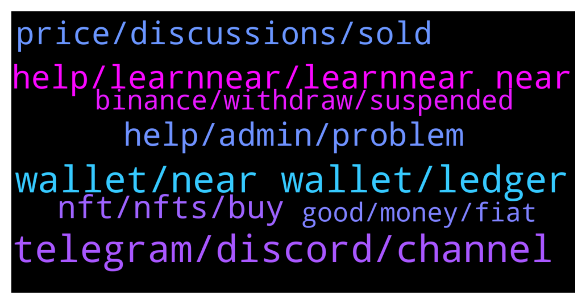

# **@cryptonear**
 ## Analysis for **2022-01-14** - **2022-01-15**.

---

## 📊 **Basic Stats**

**n_messages_sent**: 1045

---

---

## 🔝 **Top keywords and related messages**

1. **telegram, discord, channel**

    @bailey_12 --- *Haha, you should see me back in the day when I technically lived on Near telegram channel* **--->** [TG Discussion](https://t.me/cryptonear/286567)

    @spectre011 --- *You know of any idea we can get the telegram link to more people ?* **--->** [TG Discussion](https://t.me/cryptonear/286229)

    @elizabeth_baker --- *Can users follow Near's townhall on the 20th via Telegram?* **--->** [TG Discussion](https://t.me/cryptonear/287352)

    @a1sunny --- *Telegram group for meta pool please?* **--->** [TG Discussion](https://t.me/cryptonear/287027)

    @iamkemoo --- *they are currently only on Discord: https://discord.gg/d8FyWSvz* **--->** [TG Discussion](https://t.me/cryptonear/287042)

    @spectre011 --- *I am a mod from fusotao protocol  I want to request permission to drop a link of the telegram group here* **--->** [TG Discussion](https://t.me/cryptonear/286203)

2. **wallet, near wallet, ledger**

    @Drippy89 --- *Dumb question but will there be a near wallet app anytime soon?* **--->** [TG Discussion](https://t.me/cryptonear/286079)

    @ieatapple --- *hello - quick check, is there a chrome extension for NEAR wallet?* **--->** [TG Discussion](https://t.me/cryptonear/285203)

    @TheGo1denBull --- *Test NEAR or something else? You get free test NEAR when you create the wallet* **--->** [TG Discussion](https://t.me/cryptonear/284766)

    @ieatapple --- *Not dumb. I asked similar question earlier. Doubt there’s an official wallet app yet, but seems like there’s a 3rd party one available.* **--->** [TG Discussion](https://t.me/cryptonear/286080)

    @iamkemoo --- *depends on your preferences.   currently there are few options to hold your $near  - wallet.near.org - narwallet v3 chrom extension - iOS/Androis apps like TrustWallet, Moonwallet* **--->** [TG Discussion](https://t.me/cryptonear/287200)

    @ggwashinton1 --- *Man thank u this wallet is nice.  Just what i was looking for* **--->** [TG Discussion](https://t.me/cryptonear/285270)

3. **help, learnnear, learnnear near**

    @kuezphan --- *Hi all, Can someone help to give me a link for learning NEAR. Thanks* **--->** [TG Discussion](https://t.me/cryptonear/286967)

    @iforbusiness2 --- *hey mate you can visit https://awesomenear.com/categories/education/ to get all the learning resource* **--->** [TG Discussion](https://t.me/cryptonear/286969)

    @tungagribank --- *have you changed learnnear to near yet? show me how please* **--->** [TG Discussion](https://t.me/cryptonear/287404)

    @SymboliahELENA --- *Just got pm from a NEAR  support, telling me welcome.. lol these dumb heads don’t give up* **--->** [TG Discussion](https://t.me/cryptonear/286596)

    @tungagribank --- *I can change learningnear at the current point at not?* **--->** [TG Discussion](https://t.me/cryptonear/287370)

    @iamkemoo --- *Check this article: https://near.org/blog/near-launches-simple-nightshade-the-first-step-towards-a-sharded-blockchain/ to learn more.* **--->** [TG Discussion](https://t.me/cryptonear/285685)

4. **help, admin, problem**

    @wardlaw --- *Admini should have a better answer* **--->** [TG Discussion](https://t.me/cryptonear/284534)

    @mv_the_realone --- *I can dm you and send details* **--->** [TG Discussion](https://t.me/cryptonear/285543)

    @mv_the_realone --- *Are you admin? Can I dm?* **--->** [TG Discussion](https://t.me/cryptonear/285529)

    @bailey_12 --- *Hi,  What is your problems and how can I help you?* **--->** [TG Discussion](https://t.me/cryptonear/286705)

    @Cryptomarketing35 --- *hi. i have 250k instagram and 1.5k youtube crypto audience followers. please contact me if you need.* **--->** [TG Discussion](https://t.me/cryptonear/287320)

    @kv9990 --- *Hehe was expected 🥲 DM me then 😅* **--->** [TG Discussion](https://t.me/cryptonear/285470)

5. **price, discussions, sold**

    @Kripto_Raptor --- *i think we already told you many times that we dont talk about the price here. please respect the community rules 😉* **--->** [TG Discussion](https://t.me/cryptonear/286615)

    @HODL_R --- *On what and for how much* **--->** [TG Discussion](https://t.me/cryptonear/287451)

    @vsx007 --- *But now, I'm on a different level. From 200$ to 20k $* **--->** [TG Discussion](https://t.me/cryptonear/284647)

    @GeorgePro1 --- *Maybe you love talking about price. You can join the unofficial price chat for that: https://t.me/merchantsofnear* **--->** [TG Discussion](https://t.me/cryptonear/285837)

    @Blencha --- *That's good. Near will mke us richer* **--->** [TG Discussion](https://t.me/cryptonear/284695)

    @Imniti --- *Guys how much price near can reach?* **--->** [TG Discussion](https://t.me/cryptonear/285055)

6. **nft, nfts, buy**

    @vsx007 --- *@TheGo1denBull I like the expensive NFT in your profile btw ☺️* **--->** [TG Discussion](https://t.me/cryptonear/284700)

    @TheGo1denBull --- *Which one is that? I don't have anything expensive in NFTs* **--->** [TG Discussion](https://t.me/cryptonear/284702)

    @Blencha --- *I don't knw y people buy nft* **--->** [TG Discussion](https://t.me/cryptonear/284708)

    @vsx007 --- *Yes. So they buy NFT due to two things.* **--->** [TG Discussion](https://t.me/cryptonear/284713)

    @HODL_R --- *Could be too late for the Near NFT I was going to buy with it though 🤷* **--->** [TG Discussion](https://t.me/cryptonear/287004)

    @Blencha --- *You can create those nft it's easy. I don't knw y people lik that stuff* **--->** [TG Discussion](https://t.me/cryptonear/284704)

7. **binance, withdraw, suspended**

    @isaacmendex --- *Near protocol network is temporarily suspended on binance at the moment* **--->** [TG Discussion](https://t.me/cryptonear/285391)

    @Lloyd75 --- *Guys do you know if withdraw from binance will be soon available again ? I try to set up my wallet but I can't withdraw* **--->** [TG Discussion](https://t.me/cryptonear/285520)

    @bromida --- *I've just setup near wallet. But withdrawal in binance is suspended, cant make first deposit. Is there any way to withdraw from binance? Via bridge maybe? Thx b4* **--->** [TG Discussion](https://t.me/cryptonear/286456)

    @cero --- *NEAR withdrawal on Binance is suspended. One way to work around that issue, I need to use ethereum bridge, however it needs initial deposit 0.1 $NEAR for creating a wallet.* **--->** [TG Discussion](https://t.me/cryptonear/286710)

    @HODL_R --- *looking to buy NEAR punks but the place I am buying new NEAR for them only allows withdrawal to BSC. Is it still the only way to get them back on NEAR chain via Binance withdrawal? But Binance isn’t allowing NEAR withdrawal just now?* **--->** [TG Discussion](https://t.me/cryptonear/286185)

    @masstahcoiner --- *don't have bank anymore, don't have $ on acc anymore  money is scam   ALL IN near wallet and on shitty centralized binance    must withdraw all to privat wallet* **--->** [TG Discussion](https://t.me/cryptonear/284505)

