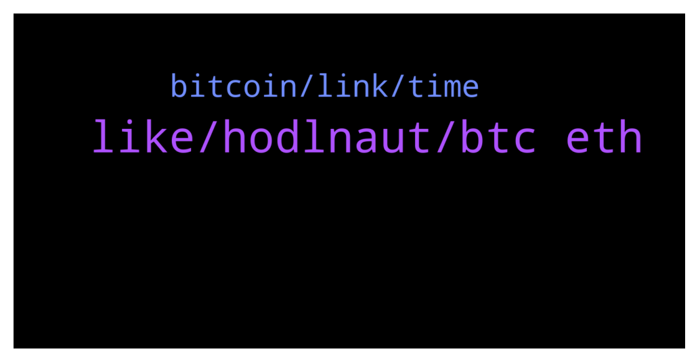

# **@de_fi**
 ## Analysis for **2022-01-14** - **2022-01-15**.

---

## 📊 **Basic Stats**

**n_messages_sent**: 32

---

---

## 🔝 **Top keywords and related messages**

1. **like, hodlnaut, btc eth**

    @dereksilva --- *This depends on the jurisdiction. I think most are now registering DAOs in Wyoming, foundations in crypto friendly countries, or corporations in exotic locales like British Virgin Islands or the Canary Islands. That entity holds funds AMA can pay contractors via invoice.   Or you go full decentralization and don’t register a thing. The contractors are solely responsible for their personal taxes.* **--->** [TG Discussion](https://t.me/de_fi/234156)

    @SamAlgo1 --- *Well, be a holder. It's easy and low risk.* **--->** [TG Discussion](https://t.me/de_fi/234245)

    @MarioOz1 --- *Hodlnaut offer good rates 12.73% for stables. 6.2% for BTC 5.2% for ETH* **--->** [TG Discussion](https://t.me/de_fi/234270)

    @SamAlgo1 --- *It would be green next week but we need to retest 40k then 53k and finally new ATH.* **--->** [TG Discussion](https://t.me/de_fi/234241)

    @JustQueenThings --- *Not bad if you mention again dude* **--->** [TG Discussion](https://t.me/de_fi/234268)

    @JJ_was_here --- *Blocknative is stoked to ship Transction Preview on Ethereum Mainnet to improve the safety and reliability of transfers https://twitter.com/blocknative/status/1481772322922975232 😎* **--->** [TG Discussion](https://t.me/de_fi/234187)

2. **bitcoin, link, time**

    @MarioOz1 --- *How can I buy if I don't have money to buy anymore 😁* **--->** [TG Discussion](https://t.me/de_fi/234244)

    @SamAlgo1 --- *Selling what? Bitcoin? I'm never selling my bitcoin. No matter what, just accumulate more.* **--->** [TG Discussion](https://t.me/de_fi/234243)

    @ShunoPR --- *BlackChart   SUPER DEGEN!!   Micro micro cap- $267 MC  Could be a good play, max wallet worth $4!!  DYOR, NFA!!   https://poocoin.app/tokens/0xbcd902cf95d8a2ae48068f4c0ac43b9b53e87248  *PAID PROMO*  https://t.me/BlackChartToken* **--->** [TG Discussion](https://t.me/de_fi/234298)

    @MariaGaller --- *Do you think it's a good time to sell?* **--->** [TG Discussion](https://t.me/de_fi/234242)

    @MariaGaller --- *What do you think about lending bitcoin or ether?* **--->** [TG Discussion](https://t.me/de_fi/234246)

    @PierreKabet --- *Hi guys, I just found an early NFT project with real utility, owning one of their NFTs gives you access to a community of experienced traders. I think there is a big potential, what do you think?  I'll leave you the discord link so you can check it out https://discord.gg/u4NyfZKHme* **--->** [TG Discussion](https://t.me/de_fi/234274)

