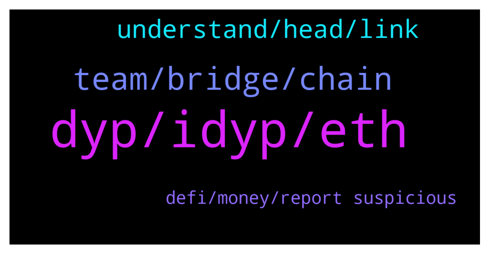

# **@dypfinance**
 ## Analysis for **2022-01-14** - **2022-01-15**.

---

## 📊 **Basic Stats**

**n_messages_sent**: 129

---

---

## 🔝 **Top keywords and related messages**

1. **dyp, idyp, eth**

    @DhoniMSD516 --- *Ok in Farming you can deposit assets like ETH, BNB, USDT, AVAX etc, and these asset you deposited is converted 75% to LP pair on which you earn rewards WBNB/WETH/WAVAXX and 25% is converted to DYP on which you earn DYP as rewards https://dyp.finance/farmv2 Farming is available on ETH, BSC and AVAXX chains* **--->** [TG Discussion](https://t.me/dypfinance/239672)

    @DhoniMSD516 --- *Yes it only integrated with Pangolin, also no need for you to do that, when you deposit asset the mart contract doe all that job for you watch this tutorial https://www.youtube.com/watch?v=b-WHRSgFn-k* **--->** [TG Discussion](https://t.me/dypfinance/239789)

    @DhoniMSD516 --- *https://www.youtube.com/c/DeFiYieldProtocol/videos You can find tutorial here to setup wallets and using DYP products* **--->** [TG Discussion](https://t.me/dypfinance/239678)

    @Paulus --- *How can i check the APY for DYP in farming?* **--->** [TG Discussion](https://t.me/dypfinance/239687)

    @hemanrock --- *FARMS work this way. please check this   Ex: Consider a scenario wherein you deposit WETH $1000, the smart contract will split the WETH $1000 in two parts: WETH $750 is added to Uniswap ETH/iDYP LP and WETH $250 is sent to DYP Staking with 200% APY.   you can read more about it from here https://dypfinance.medium.com/staking-farming-and-buyback-v2-is-live-on-ethereum-c08cb2fa11cd* **--->** [TG Discussion](https://t.me/dypfinance/239480)

    @DhoniMSD516 --- *This APY is based on Staking APY, so you can check Staking APY's* **--->** [TG Discussion](https://t.me/dypfinance/239693)

2. **team, bridge, chain**

    @alvindrajw --- *Can we expect listing before jan 31...* **--->** [TG Discussion](https://t.me/dypfinance/239578)

    @nkemboxoffice --- *Is the NFt minting still scheduled for 17th jan?* **--->** [TG Discussion](https://t.me/dypfinance/239942)

    @MJMuppet_JayJay --- *So since the vote seems to be going to pass, will the bridge launch today?* **--->** [TG Discussion](https://t.me/dypfinance/239829)

    @iamJubi --- *Hello. No exact date for minting yet. Please stay tuned for announcement. https://t.me/dypannouncements* **--->** [TG Discussion](https://t.me/dypfinance/239944)

    @iamJubi --- *We love to listen to our community so the Governance proposal for the launch of the iDYP Bridge is now available multi-chain for all the users.  Binance Smart Chain Proposal https://gov-bsc.dyp.finance/proposals/7  Ethereum Chain Proposal https://gov.dyp.finance/proposals/15  Avalanche Chain Proposal https://gov-avax.dyp.finance/proposals/3  At the end of the vote, we will sum up all the votes across all the chains. Don't forget, that we need your vote regarding the #iDYP Bridge Launch!* **--->** [TG Discussion](https://t.me/dypfinance/239625)

    @DhoniMSD516 --- *Yes it should be today or tmrw  Will be announced whatever the next steps are :)* **--->** [TG Discussion](https://t.me/dypfinance/239830)

3. **understand, head, link**

    @DhoniMSD516 --- *Sure you can head here https://t.me/dypfinance/229271 this message include all our products and explains how they work* **--->** [TG Discussion](https://t.me/dypfinance/239666)

    @monstar126 --- *Please share me the Vedio so that i can understand it* **--->** [TG Discussion](https://t.me/dypfinance/239680)

    @monstar126 --- *But not understand properly can you please explain it in short words* **--->** [TG Discussion](https://t.me/dypfinance/239669)

    @monstar126 --- *I m new So i want to know about this* **--->** [TG Discussion](https://t.me/dypfinance/239665)

    @hemanrock --- *please check this https://t.me/dypfinance/229271 also youtube tutorials https://www.youtube.com/c/DeFiYieldProtocol/videos* **--->** [TG Discussion](https://t.me/dypfinance/239503)

    @nkemboxoffice --- *So something different on your website* **--->** [TG Discussion](https://t.me/dypfinance/239943)

4. **defi, money, report suspicious**

    @Nico_Gan --- *Hi guys, i m new in “defi protocols”  Thanks for this group🙋‍♂️* **--->** [TG Discussion](https://t.me/dypfinance/239990)

    @aaadminn1 --- *Hi! I am have a proposal, where should i send DM? 📩* **--->** [TG Discussion](https://t.me/dypfinance/239852)

    @DhoniMSD516 --- *DEFI YIELD PROTOCOL ADMINS WILL NEVER DM YOU FIRST, NOR WILL THEY ASK YOU FOR MONEY. PLEASE BEWARE OF SCAMS, AND BLOCK/REPORT SUSPICIOUS ACCOUNTS.* **--->** [TG Discussion](https://t.me/dypfinance/239636)

    @DhoniMSD516 --- *Pls dm me your wallet address* **--->** [TG Discussion](https://t.me/dypfinance/239635)

    @DhoniMSD516 --- *Hey please email your proposal to contact@dyp.finance* **--->** [TG Discussion](https://t.me/dypfinance/239616)

