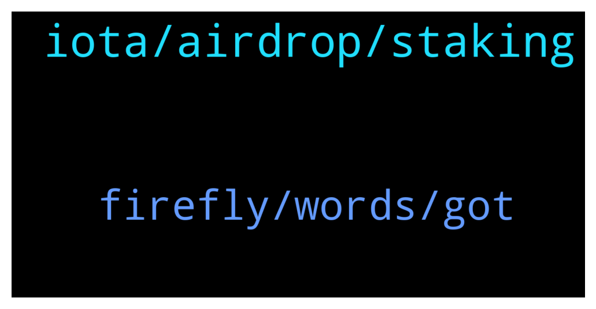

# **@iotatangle**
 ## Analysis for **2022-01-14** - **2022-01-15**.

---

## 📊 **Basic Stats**

**n_messages_sent**: 65

---

---

## 🔝 **Top keywords and related messages**

1. **iota, airdrop, staking**

    @xyogazen --- *Just like I was delete in another IOTA Tech Airdrop group* **--->** [TG Discussion](https://t.me/iotatangle/306869)

    @xyogazen --- *Is this group in any connection to IOTA Tech Airdrop group ?* **--->** [TG Discussion](https://t.me/iotatangle/306861)

    @Tahmis --- *Staking "airdrop" is active right now* **--->** [TG Discussion](https://t.me/iotatangle/306779)

    @⠠⠵ Lucas! --- *You likely buyed wrapped IOTAs, which are not IOTAs* **--->** [TG Discussion](https://t.me/iotatangle/306901)

    @YomanTt --- *What news you wanna hear? Guess there will be some near the end of staking period about dates of mainnet launch* **--->** [TG Discussion](https://t.me/iotatangle/306845)

    @⠠⠵ Lucas! --- *That is not an IOTA address* **--->** [TG Discussion](https://t.me/iotatangle/306899)

2. **firefly, words, got**

    @holdencf --- *Obviously I would need to give him a private key, right?  But how do I do that with firefly* **--->** [TG Discussion](https://t.me/iotatangle/306835)

    @KoolN --- *I was unable to send to that address…it would not let me. I thought it was a user error* **--->** [TG Discussion](https://t.me/iotatangle/306902)

    @Incog --- *Get their address and send 😂* **--->** [TG Discussion](https://t.me/iotatangle/306833)

    @KoolN --- *Damn, okay I was trying to  avoid using firefly but it looks like it’s my only option…dcent is way easier to use for me* **--->** [TG Discussion](https://t.me/iotatangle/306900)

    @xyogazen --- *Why can’t I send pic here?* **--->** [TG Discussion](https://t.me/iotatangle/306862)

    @holdencf --- *how would one go about donating/gifting 50 miotas to someone ?* **--->** [TG Discussion](https://t.me/iotatangle/306831)

