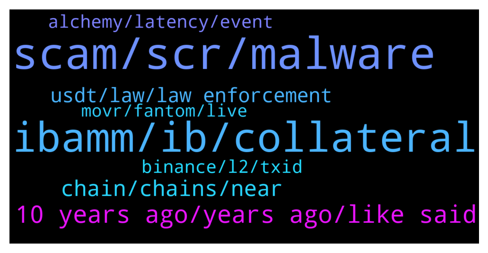

# **@lobsters_chat**
 ## Analysis for **2022-01-14** - **2022-01-15**.

---

## 📊 **Basic Stats**

**n_messages_sent**: 291

---

---

## 🔝 **Top keywords and related messages**

1. **scam, scr, malware**

    @yic_alex --- *Prime example of something that should never have gotten a token. fees.wtf was perfectly fine in the simple way it originally got released. Turning it into a ponzi is kind lazy / greedy on the part of the creators imho. (I know its not cool to point this out these days but eventually people have to calm down with this airdrop/staking/ponzi stuff. There must be better ways to monetize a brand.)* **--->** [TG Discussion](https://t.me/lobsters_chat/315794)

    @PmRiviere --- *Wow. Is the mayor a populist clown like Bukele or a serious dude? feels much more disrutive of a news than El Salvador adopting BTC https://twitter.com/zhusu/status/1481943572203012096* **--->** [TG Discussion](https://t.me/lobsters_chat/315567)

    @tesslerc --- *They are geniuses, it's a pretty smart scam model.  Make public scam, dismiss all community warnings as fud, launch and scam many people, write post mortem about how sad you are, keep scammed funds.* **--->** [TG Discussion](https://t.me/lobsters_chat/315797)

    @banteg --- *scr is the same as exe, it's probably a virus* **--->** [TG Discussion](https://t.me/lobsters_chat/315357)

    @calchulus --- *self shill here for impossible.finance 🙂* **--->** [TG Discussion](https://t.me/lobsters_chat/315495)

    @nickbtts --- *do you not remember KAT (kryptsu automated trading)...so many people done over by 'automated' trading and mex scamwicks over the years* **--->** [TG Discussion](https://t.me/lobsters_chat/315617)

2. **ibamm, ib, collateral**

    @PmRiviere --- *actually how are the ib* streamed back to Iron Bank? When / on what trigger does ibAMM repay the debt ? Not sure I understand what is “monitored” and by who* **--->** [TG Discussion](https://t.me/lobsters_chat/315746)

    @PmRiviere --- *Could someone ELI5 what’s happening under the hood when swapping on ibAMM? Eg this (random) swap tx 1/ User swaps in ibAMM, sending his $MIM to Keep3r proxy contract 2/ Keep3r do some work (do what?)  3/ ibAMM borrows ibEUR from Yearn ibEUR vault 4/ ibAMM transfers ibEUR to user (EUR/MIM market rate)  Also two Qs: Does ibAMM has special rights to borrow from Iron Bank at just 100% collateral (instead of over-collateralized)? Who’s paying the interest on the loan here?* **--->** [TG Discussion](https://t.me/lobsters_chat/315729)

    @andrecronje --- *Same as any other IB loan, when required, no different than ib<>alpha, or ib<>yearn, or ib<>pleasrdao, or ib<>rune* **--->** [TG Discussion](https://t.me/lobsters_chat/315751)

    @andrecronje --- *Same tools as any debt based position, you're overthinking it, its just an standard IB loan* **--->** [TG Discussion](https://t.me/lobsters_chat/315749)

    @xRugMe --- *Leverage PLP position an abra or borrow MIM* **--->** [TG Discussion](https://t.me/lobsters_chat/315777)

    @danrobinson010 --- *In the special case where the asset being borrowed is one of the tokens in the position (for example, USDC being borrowed against an ETH/USDC position) what I’d do is simulate a 150% (say) price shock in ETH/USDC in either direction, and see if the position would still be solvent at that point. If not, liquidate now* **--->** [TG Discussion](https://t.me/lobsters_chat/315824)

3. **10 years ago, years ago, like said**

    @LilMoonLamboX3 --- *it's natural to compare something new to something previous* **--->** [TG Discussion](https://t.me/lobsters_chat/315692)

    @rasikhmorani --- *The comments were made in 13-14 right, I feel like this is an overreaction for someone being dumb 10 years ago* **--->** [TG Discussion](https://t.me/lobsters_chat/315662)

    @Joel_john --- *these games are becoming a little too obvious now* **--->** [TG Discussion](https://t.me/lobsters_chat/315683)

    @ivangbi --- *Wait it was them or different? Wow* **--->** [TG Discussion](https://t.me/lobsters_chat/315618)

    @Sunny --- *I suppose things will always get taken name wise but shit there are so many words out there, just pick another* **--->** [TG Discussion](https://t.me/lobsters_chat/315653)

    @LilMoonLamboX3 --- *like you said the game is becoming obvious now* **--->** [TG Discussion](https://t.me/lobsters_chat/315701)

4. **chain, chains, near**

    @LilMoonLamboX3 --- *near is what everyone thought solana was gonna be* **--->** [TG Discussion](https://t.me/lobsters_chat/315681)

    @mrdark --- *can't even afford rope - https://etherscan.io/tx/0x0c1005a356c8bc6b48529ae9dd048124e89e472d3795fbdafe903ee5b584793c* **--->** [TG Discussion](https://t.me/lobsters_chat/315396)

    @jefftt --- *i guess pulse chain finally got fucked* **--->** [TG Discussion](https://t.me/lobsters_chat/315374)

    @JackGate --- *Hey guys ,does anyone knows the team from Liquity(LQTY)* **--->** [TG Discussion](https://t.me/lobsters_chat/315430)

    @andrecronje --- *Happens to everyone, all new chains go through stress test situations, they'll come out stronger* **--->** [TG Discussion](https://t.me/lobsters_chat/315579)

    @phil_muhbags --- *Fyi harmony seems to have imploded* **--->** [TG Discussion](https://t.me/lobsters_chat/315577)

5. **usdt, law, law enforcement**

    @jefftt --- *ah - law enforcement related https://www.coindesk.com/markets/2022/01/13/tether-freezes-160m-of-usdt-stablecoin-on-ethereum-blockchain/* **--->** [TG Discussion](https://t.me/lobsters_chat/315372)

    @sonicblend --- *Why did CoinGecko stop doing direct links to Uniswap trade pairs 🤔* **--->** [TG Discussion](https://t.me/lobsters_chat/315740)

    @jefftt --- *i know, i said "i'm assuming"  no other good reason for 160mil of USDT to be frozen at the request of law enforcement* **--->** [TG Discussion](https://t.me/lobsters_chat/315383)

    @magnush --- *Problem is copperlaunch seems to break from time to time during on-going sales 😂* **--->** [TG Discussion](https://t.me/lobsters_chat/315493)

    @cactushoes --- *I assume there is always a court order required for Tether to freeze in the first place, and that they cannot just freeze suspicious accounts and burn the USDT from their books, thereby assuming its accounted for have freed up USD on their own books...* **--->** [TG Discussion](https://t.me/lobsters_chat/315391)

    @PmRiviere --- *Crazy. Any comment from the federal government?* **--->** [TG Discussion](https://t.me/lobsters_chat/315575)

6. **binance, l2, txid**

    @jefftt --- *https://etherscan.io/address/0x661be0562b31e9e8ddc2a7c93803005a1c71d749  i'm assuming given the txs (pulsechaindotcom.eth ens registered) https://etherscan.io/address/0x661be0562b31e9e8ddc2a7c93803005a1c71d749  if you look at the ENS-registered address, it also sends to an address that's tagged PulseChain: Sacrifice* **--->** [TG Discussion](https://t.me/lobsters_chat/315378)

    @sonicblend --- *Likely unrelated but I found a bug with Binance's Arweave integration, where they were ignoring deposits that contained dashes in the txID since they didn't realize dashes were valid, as per their spec 😅* **--->** [TG Discussion](https://t.me/lobsters_chat/315725)

    @adamphan --- *anyone having issue that ROSE deposit has not been credited to binance wallet. Sent from Oasis wallet by Paratimes to Consensus. 3 out of 4 deposits were credited, but missing one and binance's CS is asking me to provide txid of transactions, but i only found paratimes/transaction on Oasisscan.* **--->** [TG Discussion](https://t.me/lobsters_chat/315721)

    @TrashBagsCash --- *Sacrifice addresses: 0x9Cd83BE15a79646A3D22B81fc8dDf7B7240a62cB 0x075e72a5eDf65F0A5f44699c7654C1a76941Ddc8  https://dune.xyz/phabc/usdt---banned-addresses https://dune.xyz/phabc/usdc-banned-addresses  neither of them are frozen* **--->** [TG Discussion](https://t.me/lobsters_chat/315414)

    @syed_jafri --- *—  My favorite bridge idea is: https://www.layerswap.io/  Why? Binance<>Binance transfers are free L2<>L2 TXs are cheap  User sends from their Binance to LayerSwap Binance LayerSwap sends from their L2 account to user's L2 account* **--->** [TG Discussion](https://t.me/lobsters_chat/315543)

    @adamphan --- *yeah i was able to tell the CS there is no different on the txid, they are processing fund now. New chain so they're not familiar with it* **--->** [TG Discussion](https://t.me/lobsters_chat/315726)

7. **alchemy, latency, event**

    @naps62 --- *speaking of infura vs alchemy: I have one event listener currently connected to Alchemy. but based on some sampling, it seems I'm being notified of some events with some delay comparatively to the tx timestamp on etherscan (sometimes up to 8 minutes delay) is there an approach, or a specific service I could use, if my aim was to minimize this latency?* **--->** [TG Discussion](https://t.me/lobsters_chat/315332)

    @am0ral --- *U dont learn with Kyber though ))* **--->** [TG Discussion](https://t.me/lobsters_chat/315439)

    @egasdoteth --- *either this or use KyberSwap... :)* **--->** [TG Discussion](https://t.me/lobsters_chat/315436)

    @easeev --- *You can try Chainstack, we provide pretty much direct access to nodes without pre-processing* **--->** [TG Discussion](https://t.me/lobsters_chat/315336)

    @dandecrypt --- *hi LobsterDAO! excuse this event plug, but something to put on your calendars! https://decrypt.co/90451/ethereal-summit-2022-jackson-hole-wyoming-march-9-to-11* **--->** [TG Discussion](https://t.me/lobsters_chat/315667)

    @egasdoteth --- *Hence if you want to learn etherscan/web3js this is not the best 1st exercise...* **--->** [TG Discussion](https://t.me/lobsters_chat/315441)

