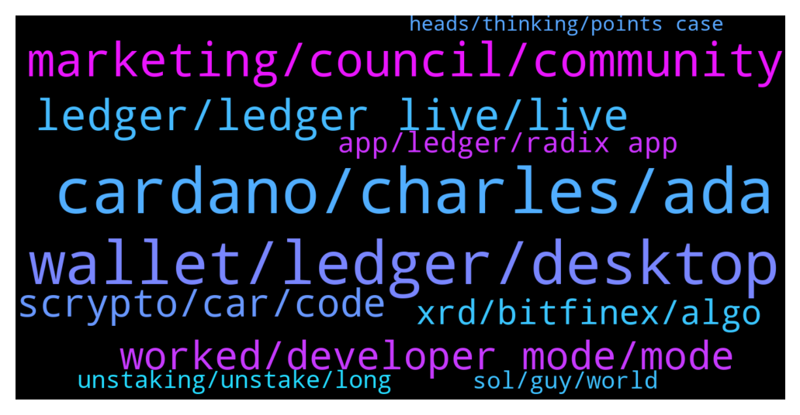

# **@radix_dlt**
 ## Analysis for **2022-01-14** - **2022-01-15**.

---

## 📊 **Basic Stats**

**n_messages_sent**: 691

---

---

## 🔝 **Top keywords and related messages**

1. **cardano, charles, ada**

    @Null_v0id --- *Casually carrying on @danhughes ‘s fight just cos it’s fun. Blooming ADA Fan boi’s: https://twitter.com/v0idxbt/status/1482100841544929287?s=21* **--->** [TG Discussion](https://t.me/radix_dlt/339563)

    @happyDog44647 --- *yes, Cardano now is living off Ergo’s ability, both are using eUTXO models. There must be some reasons Kushti left Cardano to create Ergo, I guess 🙂    https://twitter.com/RichardMcCrackn/status/1480945016336154624* **--->** [TG Discussion](https://t.me/radix_dlt/339768)

    @dopermon12 --- *Ive never heard of anyone using cardano's network. How is that guy saying 1.2m people use it* **--->** [TG Discussion](https://t.me/radix_dlt/339590)

    @danhughes --- *I'd love a head to head AMA or something with Charles* **--->** [TG Discussion](https://t.me/radix_dlt/339814)

    @TheWarOnDrugs --- *I've held a significant amount of ADA since their ICO, and at no point since 2017 has ADA ever had a strong, intelligent community. There has never been a solid community to fit myself into. They went from small and toxic to large, cult-like, and extra toxic. I'd almost argue engaging with them is a waste of time, they aren't looking for knowledge or to debate, they're looking to grow the cult.* **--->** [TG Discussion](https://t.me/radix_dlt/339568)

    @TheWarOnDrugs --- *hope he's ready for the cardano cult* **--->** [TG Discussion](https://t.me/radix_dlt/339564)

2. **wallet, ledger, desktop**

    @radixmatt --- *I don't expect there will be any mass unstaking. From what we've seen, most holders who like to use a Ledger are already staking from a side-loaded app (and can move to a Ledger Live-loaded app if they want without changing address or unstaking).* **--->** [TG Discussion](https://t.me/radix_dlt/339362)

    @WAGMI --- *Bhr it looks like you have to transfer all your xrd to that address which is annoying* **--->** [TG Discussion](https://t.me/radix_dlt/339517)

    @thegenuineOMG --- *In another channel, people who are already staking said that the HW wallet has a different address than the desktop wallet. Is that an issue. Or is the Ledger App only there to serve as the PK for the Desktop wallet. Still a bit confused about that.* **--->** [TG Discussion](https://t.me/radix_dlt/339881)

    @Zloliver --- *It tells me when my password is incorrect, but nothing happens if it's correct.* **--->** [TG Discussion](https://t.me/radix_dlt/339613)

    @WAGMI --- *Nab sorry for all the questions they were dumb it just makes a new address for the hardware wallet* **--->** [TG Discussion](https://t.me/radix_dlt/339516)

    @aus87 --- *just for any funds in the desktop wallet, will have nothing to do with your ledger wallet* **--->** [TG Discussion](https://t.me/radix_dlt/339474)

3. **marketing, council, community**

    @StefanPersson --- *Hey, I'm Stefan, Head of Marketing at the Radix Marketing Council. I'm excited to be part of, and to help grow this community. The reason why I've been lurking till now is I'm a fan of under-promising and overdelivering 😁   I joined on Monday this week, and so far I've been working on tightening our messaging, getting a plan in place for how we will use the getradix website as our anchor for community marketing initiatives, establishing measurement processes and baselines so we will be able to better determine what initiatives work best. This will allow us to run more initiatives in parallel in the future and to have a clear decision making process that is driven by data. I've also been working on a plan of action for how we want to market in the next few months to gear up and build excitement around Babylon, but this is still in process. I can tell you that it centers around reaching more developers to build the community and to grow the number of people using Scrypto in beta, and to create content that we can promote that is simple to understand and simple to share with others. Also, part of what we will achieve is a clear distinction between the community support function that we fulfil and that of the main company, so that community driven initiatives are visually distinct and are completely autonomous.   I'm really looking forward to all that we can achieve together. We all in the community all believe in the same thing: Radix is the future, because we have the best technology and vision and the only solution that enables the future scale and needs of DeFi, and Radix + Scrypto has the power to unlock use-cases that haven't been dreamt of yet. I know this, you know this, and the biggest challenge that we face as a community is that not enough people know this yet. Our goal is to change this as fast as we can and as efficiently as possible so that we can get the best performance out of our marketing investment.  My goal is to serve the best interest of the community, and to be as transparent about our current and upcoming activities as possible without creating friction or disruptions with incomplete information or unconfirmed plans. It may take weeks to get where we need to be, and for me to be up to speed fully, but we will get there. In a few weeks or early next month, I will do an AMA but I don't have a date in mind yet.* **--->** [TG Discussion](https://t.me/radix_dlt/339225)

    @DefiYields --- *Very excited to announce Stefan Persson as Radix Marketing Council's new Head of Marketing  @stefanpersson brings a wealth of experience to the role and we can't wait to see his work driving Radix $XRD to the next levels of awareness and recognition!  Welcome aboard, Stefan!* **--->** [TG Discussion](https://t.me/radix_dlt/339112)

    @tesslerc --- *There's a community initiative to do some additional marketing activities. We've been active since Radix has launched as an ERC20 and have recently ramped up activities when we brought on Stefan 🙂  You can read more in the other channels, but I think we're going to do super cool stuff together 🙂 I believe we'll see the tube red-orange-yellow colors a lot more (https://getradix.com/) as a way to represent community initiatives going forward (and differentiate from the core team activities).* **--->** [TG Discussion](https://t.me/radix_dlt/339908)

    @sonotopia --- *have the winners of this marketing tweet from the radix marketing council ever been drawn? https://twitter.com/BuyXRD/status/1470593444196196352?s=20* **--->** [TG Discussion](https://t.me/radix_dlt/339192)

    @sebastianmaass --- *How much budget will Stefan Persson get?* **--->** [TG Discussion](https://t.me/radix_dlt/339119)

    @CryptoBoss23 --- *He's not hired by RDX works. He's part of the council that is run 100% by the community* **--->** [TG Discussion](https://t.me/radix_dlt/339116)

4. **ledger, ledger live, live**

    @Stuart_RadixPool --- *@arrrvinnn Enable Developer Mode in Ledger Live - Settings > Experimental Features > Enable Developer Mode* **--->** [TG Discussion](https://t.me/radix_dlt/339394)

    @NotBen --- *ledger live is hanging on the auto update, will try updating that manually and see if it works* **--->** [TG Discussion](https://t.me/radix_dlt/339435)

    @Adam_XRD --- *There is no change from a wallet generated from the side-loaded app to the ledger live version on the same ledger device :)* **--->** [TG Discussion](https://t.me/radix_dlt/339347)

    @NotBen --- *looks like the issue for me was that ledger live was failing its auto update* **--->** [TG Discussion](https://t.me/radix_dlt/339443)

    @Adam_XRD --- *Correct, that is normal for apps added to ledger live* **--->** [TG Discussion](https://t.me/radix_dlt/339342)

    @RavesCrypto --- *so now we can install it directly from ledger live? really? 😃* **--->** [TG Discussion](https://t.me/radix_dlt/339497)

5. **worked, developer mode, mode**

    @NotBen --- *says i'm on 2.0 and up to date* **--->** [TG Discussion](https://t.me/radix_dlt/339430)

    @saeglopur10 --- *looks like we need the developer mode on in order to download* **--->** [TG Discussion](https://t.me/radix_dlt/339341)

    @Stuart_RadixPool --- *Just click the two buttons together. It's in "Developer Mode" so warns you - but is functional after you confirm.* **--->** [TG Discussion](https://t.me/radix_dlt/339398)

    @Cpt_Charles --- *Hmm, that fixed it for me 🤔* **--->** [TG Discussion](https://t.me/radix_dlt/339621)

    @ChrisB_telegram --- *Worked like a charm with X (so now I can finally stop having to swap out apps on the S every few days)* **--->** [TG Discussion](https://t.me/radix_dlt/339932)

    @Magal36 --- *You need to update to the latest version 1.2.6* **--->** [TG Discussion](https://t.me/radix_dlt/339029)

6. **scrypto, car, code**

    @MattToTheMoon --- *@Adam_XRD is there any intellectual property behind Scrypto or is it truely open source? Curious if other projects who are currently in their infancy stages would be able to  integrate it into their own projects and immediately compete with radix (other than radix being the first)* **--->** [TG Discussion](https://t.me/radix_dlt/338933)

    @Blind5ight --- *There are also pre-emptive audits that will happen of new pieces of Scrypto code* **--->** [TG Discussion](https://t.me/radix_dlt/339384)

    @Magal36 --- *Scrypto leverage Radix Engine's capacity, I don't think it can be copied unless you copy the whole architechture* **--->** [TG Discussion](https://t.me/radix_dlt/338934)

    @Jazzer9F --- *The third instalment in the blog series focusing on our new programming language, Scrypto, is now live on the blog!  https://www.radixdlt.com/post/scrypto-an-asset-oriented-smart-contract-language* **--->** [TG Discussion](https://t.me/radix_dlt/339314)

    @Jazzer9F --- *The November Radix Roundtable is now live.   Catch up with Piers, Russell, Matt, & Adam from RDX Works as they talk about:  🖥 The Scrypto Debut ✅ Community Scrypto code examples 🛠 Radix API refactor 📣 2022 marketing plans & more!  Watch now: https://youtu.be/HUTBCoz5esE* **--->** [TG Discussion](https://t.me/radix_dlt/339915)

    @Jazzer9F --- *We’re pleased to announce that Radix Alexandria has launched!  Scrypto is a game-changer for DeFi, developers, you can get started with Scrypto now.  Full Announcement: https://www.radixdlt.com/post/alexandria-scrypto-is-here* **--->** [TG Discussion](https://t.me/radix_dlt/340021)

7. **xrd, bitfinex, algo**

    @Cpt_Charles --- *The bitfinex XRD pair is with USD, not USDt; just a heads up* **--->** [TG Discussion](https://t.me/radix_dlt/339849)

    @happyDog44647 --- *trade Algo for usdt, use that to buy XRD.* **--->** [TG Discussion](https://t.me/radix_dlt/339847)

    @teslr --- *is there a reason why swapping eXrd —> XRD via instabridge takes so long? I have been waiting over an hour now and the XRD have not arrived in my radix wallet and instabridge says the transaction is "In Flight"  I don't think I have exceeded my KYC limits because when initiating a transfer instabridge limits you to the "maximum allowed" transfer* **--->** [TG Discussion](https://t.me/radix_dlt/339649)

    @pixxaz0 --- *Is there any downside from trading Bitcoin to XRD on Bitfinex? Instead of doing it with USD?* **--->** [TG Discussion](https://t.me/radix_dlt/339920)

    @pixxaz0 --- *Where would you buy the Algo? With fiat on Binance?* **--->** [TG Discussion](https://t.me/radix_dlt/339844)

    @acgirl95 --- *Trading with USD in Bitfinex is fine. It’s just depositing/withdrawing fiat/stablecoins* **--->** [TG Discussion](https://t.me/radix_dlt/339925)

8. **app, ledger, radix app**

    @Adam_XRD --- *Everyone got the Ledger Live version of the Radix app running soonth?* **--->** [TG Discussion](https://t.me/radix_dlt/339870)

    @Stuart_RadixPool --- *A Radix Ledger app FAQ is being constantly updated here: https://radixtalk.com/t/frequently-asked-questions-about-the-radix-ledger-app-from-ledger-live/235* **--->** [TG Discussion](https://t.me/radix_dlt/339428)

    @Stuart_RadixPool --- *The Radix Ledger app is available now in Developer Mode on Ledger Live.* **--->** [TG Discussion](https://t.me/radix_dlt/339421)

    @art4xis --- *to see Radix app in Ledger Live you need to turn on "Developer mode" first if anyone wondering where it is* **--->** [TG Discussion](https://t.me/radix_dlt/339496)

    @radixmatt --- *Everyone please be aware that with the release of Ledger Live support, there are a large number of scammers sending PMs claiming to be support. Radix team members will never PM you.* **--->** [TG Discussion](https://t.me/radix_dlt/339387)

    @Adam_XRD --- *Awesome. Glad it is working well :) Make sure to thank Ledger on twitter etc for getting it reviewed and added. Support those that support Radix :)* **--->** [TG Discussion](https://t.me/radix_dlt/339933)

9. **unstaking, unstake, long**

    @RLLRRL666 --- *How long unstake? Been 11 days* **--->** [TG Discussion](https://t.me/radix_dlt/338946)

    @gpel33 --- *Thanks! What happens if there's a "mass unstaking" over the next couple of week? Any issues there for the dPoS system?* **--->** [TG Discussion](https://t.me/radix_dlt/339358)

    @Null_v0id --- *WTF!!?!? A day or longer?!!! That’s arb city surely?* **--->** [TG Discussion](https://t.me/radix_dlt/339627)

    @yr12345678 --- *You can use https://www.radixscan.io/StakerDashboard.shtml to see the status of your unstake* **--->** [TG Discussion](https://t.me/radix_dlt/338949)

    @Shebeaa --- *I think it can take up do 24 hours* **--->** [TG Discussion](https://t.me/radix_dlt/339654)

    @fpieper --- *It is roughly 12 days from the time of unstaking (which you know based on your unstaking action in your history)* **--->** [TG Discussion](https://t.me/radix_dlt/339614)

10. **sol, guy, world**

    @Lawrence --- *Random question..Ok. How does radix become world known and the utilised ?* **--->** [TG Discussion](https://t.me/radix_dlt/338959)

    @happyDog44647 --- *Just went through Radix whitepaper, as a non-tech guy it got me dizzy. Barely understand anything. Can anyone summarize or have a explainnation video?* **--->** [TG Discussion](https://t.me/radix_dlt/339746)

    @Alex --- *Hey everyone what do you think about SOL and why Radix will win against it? Is there no way that SOL and ETH evolve to a point, that Radix will never gain traction because it is simply not needed anymore?* **--->** [TG Discussion](https://t.me/radix_dlt/339136)

    @Cpt_Charles --- *I wonder how big Radix number would be if u counted all the votes within each Vertex lol 😂* **--->** [TG Discussion](https://t.me/radix_dlt/338919)

    @Shang En --- *So how’s the solution radix give us?* **--->** [TG Discussion](https://t.me/radix_dlt/339380)

    @mx471 --- *Didn't someone ask in an AMA the other day and they didn't know what radix was?* **--->** [TG Discussion](https://t.me/radix_dlt/339323)

