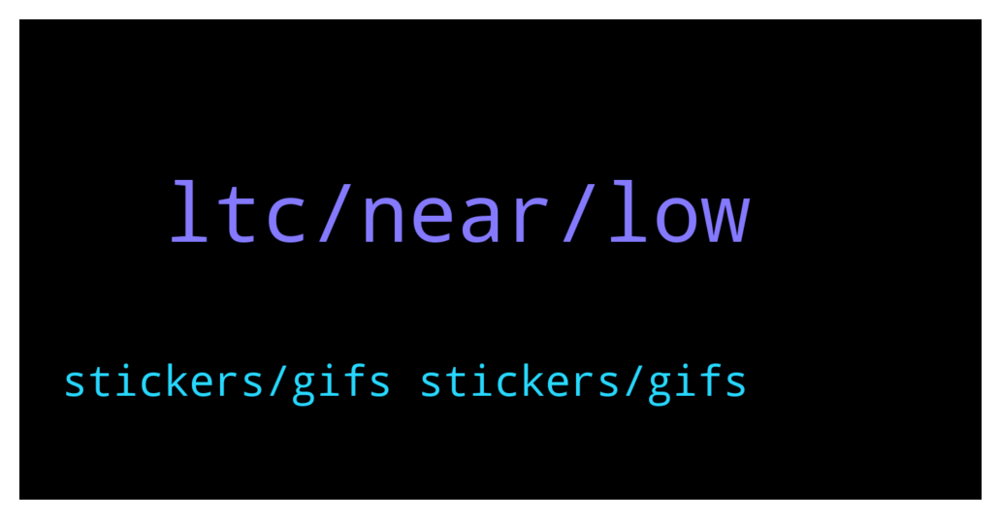

# **@shitpool**
 ## Analysis for **2022-01-14** - **2022-01-15**.

---

## 📊 **Basic Stats**

**n_messages_sent**: 186

---

---

## 🔝 **Top keywords and related messages**

1. **ltc, near, low**

    @CookieSlayer --- *Any LTC maxi's here? I have... A lot... And felt everything was FUD being spread for several years, but then someone actually shared real data: https://www.cftc.gov/PressRoom/PressReleases/8369-21  So Charlie did wash trade LTC!? Ugh. Just waiting for a better exit 😔 such good fundamentals. Why couldn't he just let the coin speak for itself.* **--->** [TG Discussion](https://t.me/shitpool/716548)

    @kuntpuncher --- *Dunno man, you are the one here 24 hrs a day hehehe.* **--->** [TG Discussion](https://t.me/shitpool/716614)

    @CookieSlayer --- *I do find it damn sad that LTC was directly manipulated. Really nifty hash code, and no pre-mine. Literally just turned the other way seeing fud since last year thinking people were following hyped shit. Thought I was being clever. Couple of days ago I started digging, finally found the press release on the wash trade... 🤦‍♀* **--->** [TG Discussion](https://t.me/shitpool/716575)

    @besselBeat --- *Dominance of Alts excluding ETH: https://www.tradingview.com/x/koStx2UX/* **--->** [TG Discussion](https://t.me/shitpool/716698)

    @czglory --- *Update: The network suffered a block propagation issue due to heavy spam traffic.  We’ll have a post-mortem announcement to share with the community once the issue is resolved. The solution is applied but will need a couple more hours to fully recover.   That said, being this was caused by heavy spam traffic, our upcoming PR to increase minimum gas should prevent this moving forward and greatly improve overall performance.  PR for minimum gas increase to 30 gwei: https://github.com/harmony-one/harmony/pull/3960  Update Comment: https://talk.harmony.one/t/state-of-the-network-jan-2022-thread-2/9117/4?u=dpagan-harmony* **--->** [TG Discussion](https://t.me/shitpool/716770)

    @Gregoranus --- *When times are hard, reading this helps.  https://t.me/rektplebs* **--->** [TG Discussion](https://t.me/shitpool/716593)

2. **stickers, gifs stickers, gifs**

    @Gregoranus --- *That would be epic, create a channel where everyone only has rights to paste stickers.* **--->** [TG Discussion](https://t.me/shitpool/716864)

    @R0mster --- *Like crypto gifs but stickers only. Would be epic.* **--->** [TG Discussion](https://t.me/shitpool/716866)

    @spekulationist --- *we can almost communicate just with gifs/stickers* **--->** [TG Discussion](https://t.me/shitpool/716801)

    @spekulationist --- *expressions of thoughts/feelings in stickers is great* **--->** [TG Discussion](https://t.me/shitpool/716800)

    @R0mster --- *If you send me a gif I can make anything reality.* **--->** [TG Discussion](https://t.me/shitpool/716704)

    @gonubie --- *go on, choose a sticker, make my day* **--->** [TG Discussion](https://t.me/shitpool/716798)

