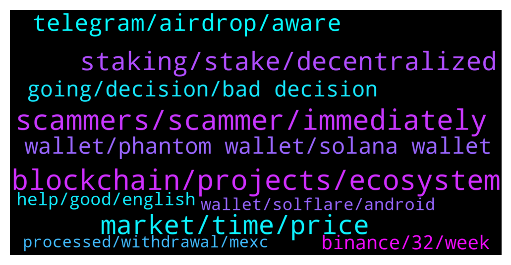

# **@solana**
 ## Analysis for **2022-01-14** - **2022-01-15**.

---

## 📊 **Basic Stats**

**n_messages_sent**: 413

---

---

## 🔝 **Top keywords and related messages**

1. **blockchain, projects, ecosystem**

    @sridhar --- *do you have good articles about solona* **--->** [TG Discussion](https://t.me/solana/903918)

    @Soltopfan --- *I'm a big fan of Solana blockchain* **--->** [TG Discussion](https://t.me/solana/902670)

    @tenzhackk_official --- *Anyone heard of a new blockchain called impulse* **--->** [TG Discussion](https://t.me/solana/902797)

    @RVAndrian02 --- *Anyone know a website can i farming solana?* **--->** [TG Discussion](https://t.me/solana/903955)

    @UnknownIdentity --- *Admin please made a post in twitter about solana projects and its strength with fund raisers details. So it will get people to look into it to invest better* **--->** [TG Discussion](https://t.me/solana/903951)

    @elizabeth_baker --- *What do you think about the new Sol ecosystem page?* **--->** [TG Discussion](https://t.me/solana/902100)

2. **scammers, scammer, immediately**

    @Karthik --- *I got msg from @Monterrey_Rice  And many PPL for just asking a query* **--->** [TG Discussion](https://t.me/solana/903073)

    @Joyner --- *How do you know it’s scammers if you’ve not been scammed ?* **--->** [TG Discussion](https://t.me/solana/903433)

    @Charles_lily --- *You’ve to be careful because of scammers* **--->** [TG Discussion](https://t.me/solana/902360)

    @Morpheus369 --- *only a scammer would reply to this* **--->** [TG Discussion](https://t.me/solana/904214)

    @Soltopfan --- *Many scammers here, be careful people* **--->** [TG Discussion](https://t.me/solana/902762)

    @HellfireAndFury --- *So many scammers. Throwing around qr codes and dapp sites* **--->** [TG Discussion](https://t.me/solana/903389)

3. **market, time, price**

    @Berkant --- *İt's scaring me right now it must stay above 140 😂* **--->** [TG Discussion](https://t.me/solana/902931)

    @lauretta122 --- *It should scare you it is just the market* **--->** [TG Discussion](https://t.me/solana/902935)

    @morrisvseslav --- *what is the forecast in five months?* **--->** [TG Discussion](https://t.me/solana/903365)

    @kaktza --- *Haven’t followed this chat for long time. Any suggestion for the price that has stuck into that level ?* **--->** [TG Discussion](https://t.me/solana/903266)

    @loverDaisy --- *When do you think SOL will be back to 200?* **--->** [TG Discussion](https://t.me/solana/902142)

    @Javier --- *What do you mean suggestion for the price? What’s your timeline for this coin? The whole crypto market is still trading lower due to latest fed news and inflation report* **--->** [TG Discussion](https://t.me/solana/903300)

4. **staking, stake, decentralized**

    @Karthik --- *Hello all..Which platform is giving the best APY for SOL to stake?* **--->** [TG Discussion](https://t.me/solana/903487)

    @mahib45 --- *Helllo!  Please read this article to know everything about Solana staking system  📎https://solana.com/staking  👇🏻Check this out for APY👇🏻  1️⃣ Solana validators list 📎 https://solanabeach.io/validators  2️⃣ Staking reward(%) 📎 https://www.stakingrewards.com/earn/solana/providers?sort=balance_DESC  3️⃣ Solana validators performance ranking 📎 https://stakeview.app/* **--->** [TG Discussion](https://t.me/solana/902978)

    @GabrielaTarabuta --- *Hi guys! 😊 If you want to find out more about staking versus trading, we've written an article on this topic. You can check it out here 👇  Check it out here: https://stake2earn.medium.com/staking-or-trading-what-do-you-choose-f5f6ade01669* **--->** [TG Discussion](https://t.me/solana/903995)

    @GabrielaTarabuta --- *In centralized validators, staking apy varies based on what they want. If you make the average per an year you might see that you didn’t earn as much as you could with a decentralized validator. Also, if you want to redeem earlier your amount you cannot or you can but you loose what you earned so far. This is not happening in decentralized environment* **--->** [TG Discussion](https://t.me/solana/903677)

    @Adel --- *Your points ain't Centralized or validated still though 😂😂✌️.  With flexible savings on any exchange, you can withdraw anytime.. Locked staking and Fixed staking requires a day before redemption once you request for your funds* **--->** [TG Discussion](https://t.me/solana/903680)

    @A_wAZ --- *Hi there, please where can i see a list of validators and APY staking rewards in % ? Thanks* **--->** [TG Discussion](https://t.me/solana/902977)

5. **telegram, airdrop, aware**

    @Joe --- *fake?  Solana Support (with Solana logo): "Hello user Welcome to Solana official community Have you received your bonus reward?"* **--->** [TG Discussion](https://t.me/solana/902999)

    @Ayham --- *Hey guys just wanna make sure there is an airdrop of sol going on with a telegram bot right* **--->** [TG Discussion](https://t.me/solana/904204)

    @Nadine --- *Hmm 1 fake solana sent a DM* **--->** [TG Discussion](https://t.me/solana/902916)

    @rvnlive --- *Hey Guys, is Solana Support exists on Telegram and if so, is there any reward? (Just been contacted)* **--->** [TG Discussion](https://t.me/solana/903000)

    @RemaYRN --- *So the SOLANA airdrop is it true??* **--->** [TG Discussion](https://t.me/solana/902115)

    @KashifJaved0 --- *When solana web. 3 airdrop distribution?* **--->** [TG Discussion](https://t.me/solana/902136)

6. **wallet, phantom wallet, solana wallet**

    @Nadine --- *May i know which wallet works with solana?* **--->** [TG Discussion](https://t.me/solana/902911)

    @CoinTrenzBot --- *What do I do ? My wallet has been compromised* **--->** [TG Discussion](https://t.me/solana/903124)

    @Henworldm --- *what is the best solana wallet I can use? My first time using solana. Any one here to help me out?* **--->** [TG Discussion](https://t.me/solana/903755)

    @C_Sonita --- *Please who uses trust wallet here. I have a question* **--->** [TG Discussion](https://t.me/solana/902308)

    @Salman --- *I downloaded phantom wallet from playstore.  I logged into my wallet using my key phrase. It said its under maintenance and i need to come back later.  I opened my phantom wallet on chrome extension and all my tokens have been sent to another wallet.  Please tell me i just didn't get hacked* **--->** [TG Discussion](https://t.me/solana/903848)

    @Joe --- *ya, smells fake.  wants me to have a trust or metamask wallet.  will ignore* **--->** [TG Discussion](https://t.me/solana/903007)

7. **going, decision, bad decision**

    @CrypTippiToe --- *it's been 20 minutes already, is that ok?* **--->** [TG Discussion](https://t.me/solana/904256)

    @nixanu --- *Actually, it was a recommendation 🥲* **--->** [TG Discussion](https://t.me/solana/904168)

    @Ms_warrior07 --- *I thought so I just wanted to let people know, heads up just in case* **--->** [TG Discussion](https://t.me/solana/902300)

    @C_Sonita --- *Same thing I was going to say* **--->** [TG Discussion](https://t.me/solana/902448)

    @sridhar --- *that was a nice clue Rahul* **--->** [TG Discussion](https://t.me/solana/903937)

    @Berkant --- *I know I just made a bad decision 🤦🏻‍♂️* **--->** [TG Discussion](https://t.me/solana/902942)

8. **binance, 32, week**

    @cryptolover1987 --- *Hello Kindly reach out to Binance support team for assistance on this* **--->** [TG Discussion](https://t.me/solana/903102)

    @Karthik --- *I have staked right now in binance,last week binance gave me 32% now they have reduced to9.25%.* **--->** [TG Discussion](https://t.me/solana/903571)

    @Adel --- *Binance.. 9.25 % APY  60 days duration* **--->** [TG Discussion](https://t.me/solana/903496)

    @easin0007 --- *Sir I accidentally send wrapped sol in binance. Now I can't withdraw from binance or trade. Is there any solution of this* **--->** [TG Discussion](https://t.me/solana/903100)

    @FendiOff --- *does anyone have a bot for binance? I bought it, I can't set it up.* **--->** [TG Discussion](https://t.me/solana/904121)

    @vit_park --- *network is working just fine, os it’s binance issues* **--->** [TG Discussion](https://t.me/solana/903826)

9. **help, good, english**

    @mahib45 --- *Hello 👋  Check this out   https://twitter.com/SolanaStatus/status/1479126136953053187* **--->** [TG Discussion](https://t.me/solana/902244)

    @Izzysss --- *English: Someone with a good heart please I need a help I have a problem debt of 150$ and I must pay urgently someone could help me with some money 25 or 30$ or whatever they can this is real I do not lie🙏😢* **--->** [TG Discussion](https://t.me/solana/904122)

    @mahib45 --- *Please use English for proper understanding or you join your local community* **--->** [TG Discussion](https://t.me/solana/903291)

    @mahib45 --- *Hello 👋 Join here and ask https://t.me/trustwallet* **--->** [TG Discussion](https://t.me/solana/902310)

    @cryptolover1987 --- *Yes how can I help you ?* **--->** [TG Discussion](https://t.me/solana/902651)

    @ruch149 --- *Any @admin to help or you guys get paid not to help* **--->** [TG Discussion](https://t.me/solana/902232)

10. **wallet, solflare, android**

    @mahib45 --- *○ There are ten 🔟 options to stake your SOL token ! 📒 https://docs.solana.com/staking 1️⃣ Phantom App  https://phantom.app/blog/solana-staking-in-just-3-clicks Tutorial: https://twitter.com/stakefish/status/1428924822424363015   2️⃣ SOLFLARE  》Stake SOL token on solflare without ledger:   🎦 Video guide : https://www.youtube.com/watch?v=5Tf0os-JRcs  📝 Article guide: https://medium.com/@stakingfac/how-to-stake-on-solana-with-solflare-a-keystore-file-9f7cd5fba169  Staking SOL with Solflare Crypto-Wallet” by Víctor | melea:  https://link.medium.com/q872cfJqLab  》 Stake SOL token using solflare and ledger Nano S:  🎦 Video guide: https://www.youtube.com/watch?v=EAWJ12Y4v_M  📝 Article guide : https://medium.com/@stakingfac/how-to-stake-on-solana-with-solflare-a-ledger-nano-s-bdcc90d769c7  Website: https://solflare.com Telegram: @SolFlare_Wallet  ➖➖➖➖➖➖➖➖➖➖➖➖➖➖➖➖➖➖➖➖➖  3️⃣ ON LEDGER  》Stake SOL token using Command Line Interface (CLI) and Ledger Nano S  🎦 Video Guide : https://youtu.be/jg2WQcfAXHo  📝 Article Guide: (On ledger Nano X & S) https://link.medium.com/duLh90X9pab  📋https://docs.solana.com/cli/delegate-stake  📖  More tutorials are available :   https://stake2earn.com/how-to-stake-solana-with-ledger-nano-x.html   https://stake2earn.com/how-to-stake-solana-with-keystore-file.html ➖➖➖➖➖➖➖➖➖➖➖➖➖➖➖  4️⃣ Moonlet  https://bit.ly/2MV4muZ  5️⃣  FTX http://ftx.com/staking  6️⃣ Binance  https://www.binance.com/en/support/announcement/a5c507485f7843d8b3a3800fee3c1f84  7️⃣ Exodus https://www.exodus.com/blog/how-to-stake-solana-on-exodus/  8️⃣ Atomic wallet  https://atomicwallet.io/solana-staking 9️⃣ Kraken  https://www.kraken.com/u/funding/staking  🔟 OKex  https://www.okex.com/earn/announce* **--->** [TG Discussion](https://t.me/solana/904075)

    @mahib45 --- *Bridge   ❇️ Option 1 : Sollet wallet  Sollet allows you to convert ERC20 to SPL and vice versa using your MetaMask Wallet.  You can deposit ERC20 tokens and convert them to SPL tokens using the convert function of Sollet.io and Metamask (to learn how to convert ERC20 to SPL.  🔗 https://www.sollet.io  How to use: https://solpadfinance.medium.com/convert-usdt-from-erc-20-blockchain-to-solana-blockchain-4871780493af  Telegram : https://t.me/ProjectSerum  ❇️ Option 2: FTX exchange  You can use FTX to deposit tokens (ERC20, XRP, BTC etc) and withdraw from FTX to Sollet.io. FTX will automatically wrap your crypto in an SPL token to be used with the Serum DEX. Please note that to convert wrapped SPL assets back into their native chain, you can deposit into FTX and withdraw the unwrapped assets.  🔗 https://ftx.com  Telegram: https://t.me/FTX_Official  ❇️ Option 3: Wormhole  🔗 www.wormholebridge.com  🔗 https://github.com/certusone/wormhole  Telegram: https://t.me/wormholecrypto  ❇️ Option 4: Allbridge  🔗 https://app.solbridge.io/bridge  Telegram: https://t.me/allbridge_official* **--->** [TG Discussion](https://t.me/solana/902211)

    @HellfireAndFury --- *Question. Had some coin in gate dot io . traded to Sol and was going to deposit in Coinbase. Used Sol address in coinbase. Sol explorer says address doesn't exist. Coin has been in limbo for weeks. Is it just gone?* **--->** [TG Discussion](https://t.me/solana/903288)

    @boka340 --- *Hi can i transfer my solana nfts to ledger nano s?* **--->** [TG Discussion](https://t.me/solana/903019)

    @Folaross --- *List of wallets where SOL is supported.  You can store your Sol tokens in any wallet of your preference below. Make sure you save your Private key or phrase words in a safe place. And don't share your private key or phrase words with anyone.  🖥 Desktop Wallets ▪️ Solflare   • https://www.solflare.com/access-wallet?hardware  Solflare wallet guide using Nano S and X - https://docs.solana.com/wallet-guide/solflare  ▪️phantom wallet  https://phantom.app/download  ▪️Solong chrome extension - https://chrome.google.com/webstore/detail/solong/memijejgibaodndkimcclfapfladdchj  ▪️ Ledger Live   • Ledger Nano S and X      Guide - https://docs.solana.com/wallet-guide/ledger-live  https://support.ledger.com/hc/en-us/articles/360016265659/  ▪️Math wallet    • Chrome extension - https://mathwallet.org/en-us/      🌐 Web Wallets ▪️Solflare    • https://www.solflare.com/create-wallet  ▪️Sollet    • https://www.sollet.io/    ▪️Sollet extension wallet  •https://chrome.google.com/webstore/detail/sollet/fhmfendgdocmcbmfikdcogofphimnkno?hl=en  ▪️Math wallet    • Web Wallet - https://mathwallet.org/en-us/   📱Mobile Wallets ▪️Trust wallet    • Download Trust Wallet app for iOS or Android app and create or import your wallet with multi-coin wallet and press add + button and search for SOL then switch on - https://trustwallet.com/  ▪️Math wallet    • Download Mathwallet app for iOS or Android app - https://mathwallet.org/en-us/  ▪️Coin98 wallet    • Android       https://play.google.com/store/apps/details?id=coin98.crypto.finance.media  • iPhone    https://apps.apple.com/vn/app/coin98-crypto-super-app/id1483029574    https://coin98.net/  ▪️SwipeWallet    • Android       https://play.google.com/store/apps/details?id=com.swipe.wallet     • iPhone          https://apps.apple.com/app/swipe-wallet/id1476726454    https://swipe.io/  https://moonlet.io/  ▪️Exodus  iPhone: https://apps.apple.com/app/apple-store/id1414384820?pt=118366236&ct=download&mt=8  Android: https://play.google.com/store/apps/details?id=exodusmovement.exodus  ▪️Slope Finance slope.finance  iOS: https://apps.apple.com/us/app/slope-wallet/id1574624530  Android: https://play.google.com/store/apps/details?id=com.wd.wallet  Note: Sollet wallet is supporting Erc20 <-> SPL conversion. And Coin98 wallet is supporting Sol and SPL tokens.* **--->** [TG Discussion](https://t.me/solana/902923)

    @mahib45 --- *List of wallets where SOL is supported.  You can store your Sol tokens in any wallet of your preference below. Make sure you save your Private key or phrase words in a safe place. And don't share your private key or phrase words with anyone.  🖥 Desktop Wallets ▪️ Solflare   • https://www.solflare.com/access-wallet?hardware  Solflare wallet guide using Nano S and X - https://docs.solana.com/wallet-guide/solflare  ▪️phantom wallet  https://phantom.app/download  ▪️Solong chrome extension - https://chrome.google.com/webstore/detail/solong/memijejgibaodndkimcclfapfladdchj  ▪️ Ledger Live   • Ledger Nano S and X      Guide - https://docs.solana.com/wallet-guide/ledger-live  https://support.ledger.com/hc/en-us/articles/360016265659/  ▪️Math wallet    • Chrome extension - https://mathwallet.org/en-us/      🌐 Web Wallets ▪️Solflare    • https://www.solflare.com/create-wallet  ▪️Sollet    • https://www.sollet.io/    ▪️Sollet extension wallet  •https://chrome.google.com/webstore/detail/sollet/fhmfendgdocmcbmfikdcogofphimnkno?hl=en  ▪️Math wallet    • Web Wallet - https://mathwallet.org/en-us/   📱Mobile Wallets ▪️Trust wallet    • Download Trust Wallet app for iOS or Android app and create or import your wallet with multi-coin wallet and press add + button and search for SOL then switch on - https://trustwallet.com/  ▪️Math wallet    • Download Mathwallet app for iOS or Android app - https://mathwallet.org/en-us/  ▪️Coin98 wallet    • Android       https://play.google.com/store/apps/details?id=coin98.crypto.finance.media  • iPhone    https://apps.apple.com/vn/app/coin98-crypto-super-app/id1483029574    https://coin98.net/  ▪️SwipeWallet    • Android       https://play.google.com/store/apps/details?id=com.swipe.wallet     • iPhone          https://apps.apple.com/app/swipe-wallet/id1476726454    https://swipe.io/  https://moonlet.io/  ▪️Exodus  iPhone: https://apps.apple.com/app/apple-store/id1414384820?pt=118366236&ct=download&mt=8  Android: https://play.google.com/store/apps/details?id=exodusmovement.exodus  ▪️Slope Finance slope.finance  iOS: https://apps.apple.com/us/app/slope-wallet/id1574624530  Android: https://play.google.com/store/apps/details?id=com.wd.wallet  Note: Sollet wallet is supporting Erc20 <-> SPL conversion. And Coin98 wallet is supporting Sol and SPL tokens.* **--->** [TG Discussion](https://t.me/solana/902337)

