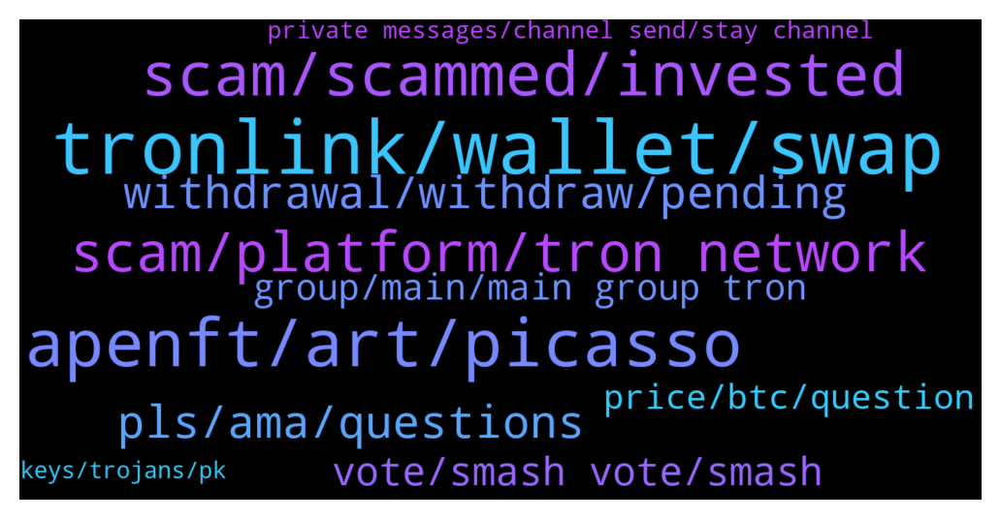

# **@tronnetworkEN**
 ## Analysis for **2022-01-14** - **2022-01-15**.

---

## 📊 **Basic Stats**

**n_messages_sent**: 470

---

---

## 🔝 **Top keywords and related messages**

1. **tronlink, wallet, swap**

    @a13x007 --- *i did swap btween nft and trn* **--->** [TG Discussion](https://t.me/tronnetworkEN/3831979)

    @B1_89 --- *Hi guys...wich is the best trx wallet for pc?* **--->** [TG Discussion](https://t.me/tronnetworkEN/3830436)

    @Amiola --- *So you recommend TronLink for swapping* **--->** [TG Discussion](https://t.me/tronnetworkEN/3828202)

    @agentpiki --- *Tronlink is go-to wallet of tronics* **--->** [TG Discussion](https://t.me/tronnetworkEN/3832028)

    @taotao2529 --- *Thk, which site is best to swap in your opinion* **--->** [TG Discussion](https://t.me/tronnetworkEN/3831854)

    @FA --- *TronLink wallet. I clicked on trx and hit deposit.* **--->** [TG Discussion](https://t.me/tronnetworkEN/3831932)

2. **apenft, art, picasso**

    @DmG_90 --- *APENFT AMA is coming!  🎁Let's take a tour of the APENFT Foundation's heirloom art treasures worth more than $150 million with @sydney_xiong!   ✅Guest: Syndey Xiong (Chief Art Director of APENFT)   ⏰Time: Jan 14th, 2022 3pm（GMT+8）  👉Live here：https://t.me/tronnetworkEN* **--->** [TG Discussion](https://t.me/tronnetworkEN/3829308)

    @DuolaA梦 --- *Can we have some nft of these famous artworks？ I want to buy even some pieces，haha* **--->** [TG Discussion](https://t.me/tronnetworkEN/3829568)

    @Elodie_He --- *Happy to answer any questions you have about APENFT and the artworks!* **--->** [TG Discussion](https://t.me/tronnetworkEN/3829536)

    @Elodie_He --- *NFTsI think APENFT has already well established and positioned itself in the space because we are the only foundation dedicated to crossover partnerships between the physical and digital, with the aim to bridge the traditional art and the NFT art.* **--->** [TG Discussion](https://t.me/tronnetworkEN/3829481)

    @agentpiki --- *What upcoming APENFT Game-Fi? (Next to Win NFT Horse)* **--->** [TG Discussion](https://t.me/tronnetworkEN/3829545)

    @Elodie_He --- *As of today, we have over $150 million worth of art collection and we are the first and leading crossover NFT foundation. We own works by some big names in crypto like Pak, beeple, Fewocious and also  Picasso, Giacommetti, which i'll talk about in more details later.* **--->** [TG Discussion](https://t.me/tronnetworkEN/3829463)

3. **scam, scammed, invested**

    @agentpiki --- *Maybe pinned message or guardian bot telling that these scam platforms are scams is needed* **--->** [TG Discussion](https://t.me/tronnetworkEN/3833038)

    @Nguyễn Hưng Phong --- *If you say so cause I know nothing about the scammer or scam format* **--->** [TG Discussion](https://t.me/tronnetworkEN/3832203)

    @Surajzero --- *Scammers are really clever they use their username as admin 😢* **--->** [TG Discussion](https://t.me/tronnetworkEN/3832316)

    @simon866 --- *Some scam platform that has nothing to do with us 😂* **--->** [TG Discussion](https://t.me/tronnetworkEN/3833033)

    @agentpiki --- *Is scam sir  and you got scammed sir* **--->** [TG Discussion](https://t.me/tronnetworkEN/3829785)

    @Nguyễn Hưng Phong --- *How do you know it's a scam?* **--->** [TG Discussion](https://t.me/tronnetworkEN/3832195)

4. **scam, platform, tron network**

    @Jean Baptiste --- *This group is for warning us to stop from investing in tron24 then. What is the purpose of this grp?* **--->** [TG Discussion](https://t.me/tronnetworkEN/3830762)

    @agentpiki --- *You invested in scam.  Tron withdrawal in legit platform is instant* **--->** [TG Discussion](https://t.me/tronnetworkEN/3829764)

    @Makaveli46 --- *Everybody knows its a scam, if you follow this channel then you know, bicouse this channel is only one official for Tron and TRX... it was mentioned 1000 times that tron24 is a scam* **--->** [TG Discussion](https://t.me/tronnetworkEN/3832200)

    @waynekan --- *how many of you have your TRX and TRC10/TRC20 Assets with PoloniDEX (Poloniex bought over Tron.Market) and could not get back your tokens?  They did not made any announcement in the platform banner but just some obscure Twitter post which user was unaware.  Do you feel scammed by Poloniex and PoloniDEX ?   They seem to ignore all our request and refuse to return our assets with their exchange. Anyway that Tron Foundation could help Tron community to recover our assets that they lock in their PoloniDEX exchange?* **--->** [TG Discussion](https://t.me/tronnetworkEN/3829287)

    @agentpiki --- *The word is not "shill". Shilling is only for shitcoins.  We tronics promote tron in whatever way possible* **--->** [TG Discussion](https://t.me/tronnetworkEN/3832729)

    @Guillaume --- *tron trx bot is that not fake ?* **--->** [TG Discussion](https://t.me/tronnetworkEN/3831078)

5. **pls, ama, questions**

    @xizhizh --- *5 mins left for our APENFT AMA in tron, pls look forward to it. and during the ama, we will mute the channel, so pls dont panic or worried. You can ask questions in the second part and enjoy the AMA, everyone!😊* **--->** [TG Discussion](https://t.me/tronnetworkEN/3829430)

    @together1_q --- *Hello I am new here ?* **--->** [TG Discussion](https://t.me/tronnetworkEN/3832744)

    @Apharoj --- *So what are u doing hear...?* **--->** [TG Discussion](https://t.me/tronnetworkEN/3829107)

    @xizhizh --- *And we will have other ama as well. pls stay intuned! thx!* **--->** [TG Discussion](https://t.me/tronnetworkEN/3829596)

    @Phan --- *Hi everyone,i new member ,hope to learn all friend much. Thanks* **--->** [TG Discussion](https://t.me/tronnetworkEN/3832813)

    @xizhizh --- *Now, pls ask questions you wanna know!* **--->** [TG Discussion](https://t.me/tronnetworkEN/3829543)

6. **withdrawal, withdraw, pending**

    @Gurvinder --- *My withdrawal is pending till from yesterday evening* **--->** [TG Discussion](https://t.me/tronnetworkEN/3832345)

    @Apharoj --- *How much time after we get our pending withdrawal sir mem* **--->** [TG Discussion](https://t.me/tronnetworkEN/3829759)

    @Ramakrishna --- *from two days withdrawal status shoowing pending . any admin pls respond* **--->** [TG Discussion](https://t.me/tronnetworkEN/3830144)

    @Gurvinder --- *I withdrawal many time from this* **--->** [TG Discussion](https://t.me/tronnetworkEN/3832373)

    @Ayush Raj --- *Can u tell me when this Tron withdrawal normal* **--->** [TG Discussion](https://t.me/tronnetworkEN/3829857)

    @Jaydeep0097 --- *Any one solve a withdrawal process fron tron minning to tron link* **--->** [TG Discussion](https://t.me/tronnetworkEN/3833071)

7. **vote, smash vote, smash**

    @WazalendoK --- *😂😂You mean this TRON24 is a SCAM😳🙆‍♂️ many people will cry 😭😭* **--->** [TG Discussion](https://t.me/tronnetworkEN/3829064)

    @Carlos_TRX --- *but you wouldn't have been able to participate in TRON events for 4 years. 😍 you have to see the positive way mate XD* **--->** [TG Discussion](https://t.me/tronnetworkEN/3832961)

    @simon866 --- *📢 We just keep winning these votes 🤷‍♂️ think its about time everyone realizes how strong the Tron community is 😎  https://twitter.com/VitalikButerin/status/1481738461417672704?t=lbdms9Z7Nm3WEX8ljU4ShA&s=19* **--->** [TG Discussion](https://t.me/tronnetworkEN/3831282)

    @PiterSpain --- *📢 This vote is important for obvious reasons so smash that vote for TRX 👊👊👊  https://twitter.com/VitalikButerin/status/1481738461417672704* **--->** [TG Discussion](https://t.me/tronnetworkEN/3830983)

    @simon866 --- *📢 This vote is important for obvious reasons so smash that vote for TRX 👊👊👊  https://twitter.com/VitalikButerin/status/1481738461417672704?t=lbdms9Z7Nm3WEX8ljU4ShA&s=19* **--->** [TG Discussion](https://t.me/tronnetworkEN/3828826)

    @PiterSpain --- *That’s too easy! Of course, the correct answer is #TRON  https://twitter.com/justinsuntron/status/1481779595292467200* **--->** [TG Discussion](https://t.me/tronnetworkEN/3828898)

8. **group, main, main group tron**

    @Apharoj --- *So which tron belong this group* **--->** [TG Discussion](https://t.me/tronnetworkEN/3829794)

    @terrachad --- *is this tron group real ?* **--->** [TG Discussion](https://t.me/tronnetworkEN/3828454)

    @simon866 --- *The dev group is accessed by going through the tronscan website as they constantly get spam* **--->** [TG Discussion](https://t.me/tronnetworkEN/3828465)

    @xPommepote --- *It’s not a task group here* **--->** [TG Discussion](https://t.me/tronnetworkEN/3831106)

    @Carlos_TRX --- *this is TRON MAIN GROUP. TRON is a blockchain and TRX its main crypto* **--->** [TG Discussion](https://t.me/tronnetworkEN/3831073)

    @Fabs_trx --- *This group is about tron and official dapps* **--->** [TG Discussion](https://t.me/tronnetworkEN/3830766)

9. **price, btc, question**

    @arvind36 --- *Anyone bought trx at low price ?? About $0.010 -0.050$* **--->** [TG Discussion](https://t.me/tronnetworkEN/3828403)

    @agentpiki --- *Binance trx price might be different with in huobi* **--->** [TG Discussion](https://t.me/tronnetworkEN/3830132)

    @IamMeeeeeeeeeeeeeeee --- *I see, don't learn me more! Btc touched 69000$ and trx just was 0.13$ ! How long tron takes to get doubled or 0.1$ at least???* **--->** [TG Discussion](https://t.me/tronnetworkEN/3828235)

    @Fasoadex --- *What is there percentage per day . I hav over 400 tron* **--->** [TG Discussion](https://t.me/tronnetworkEN/3832036)

    @Carlos_TRX --- *from January 2021 to April 2021 TRX did 586% to its maximum while BTC did 139% to its maximum. Can you repeat the question again pls ?* **--->** [TG Discussion](https://t.me/tronnetworkEN/3828269)

    @Carlos_TRX --- *CAN U CHECK THE % AND REPEAT THE QUESTION PLS?* **--->** [TG Discussion](https://t.me/tronnetworkEN/3828230)

10. **private messages, channel send, stay channel**

    @Zohaib --- *Then how can I send a screenshot so that I can be helped* **--->** [TG Discussion](https://t.me/tronnetworkEN/3831978)

    @agentpiki --- *Only admins and mods can post pictures* **--->** [TG Discussion](https://t.me/tronnetworkEN/3831969)

    @Chandresh --- *But my question is not against all of these* **--->** [TG Discussion](https://t.me/tronnetworkEN/3830800)

    @agentpiki --- *Stay in channel when asking help. Don't message privately* **--->** [TG Discussion](https://t.me/tronnetworkEN/3831946)

    @agentpiki --- *We don't encourage private messages.   Stay in channel* **--->** [TG Discussion](https://t.me/tronnetworkEN/3831944)

    @terrachad --- *not enough conversation for 125k members* **--->** [TG Discussion](https://t.me/tronnetworkEN/3828440)

